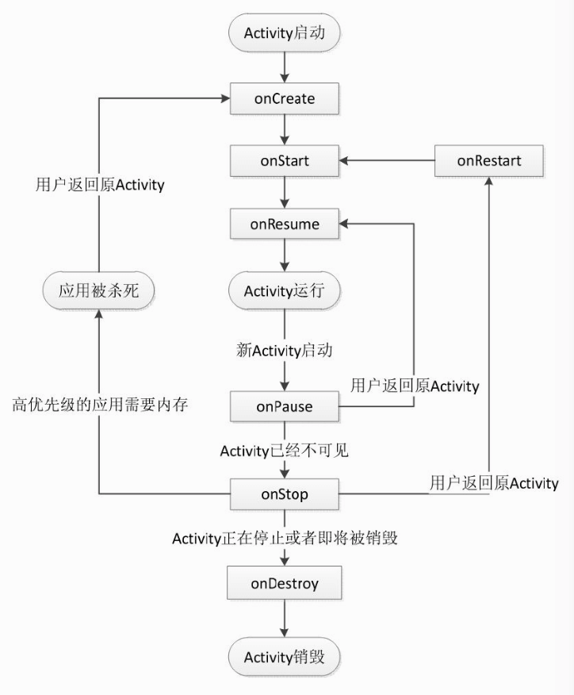

# Activity

---
## 1 Activity生命周期



- onPause 和 onResume 可以理解为是前台与后台 Activity 之间的切换，onPause 切记不可做耗时操作(哪怕稍微复杂的逻辑)
- onSavaInstanceState的调用时机：
    - 非主动退出
    - Activity中如果有Fragment，在重建的时候做好判断
- onPostCreate：在 onCrate 和 onRestoreInstanceState (如果调用的话)后调用
- onConfigChanges：当Activity配置发生变化(如键盘，屏幕方向，尺寸等)，更多参考安卓开发艺术探索p14


可以在 manifest 文件中配置 activity 不因某些变化而重建

```xml
       <activity
                android:name=".activitys.MainActivity"
                android:configChanges="orientation|screenSize|keyboardHidden">
                <intent-filter>
                    <action android:name="android.intent.action.MAIN"/>
                    <category android:name="android.intent.category.LAUNCHER"/>
                </intent-filter>
            </activity>
```

---
## 2 Activity启动模式

[推荐文章](http://droidyue.com/blog/2015/08/16/dive-into-android-activity-launchmode/)

#### standard 默认的启动模式

调用 Application 或者 Service 启动该模式的 Activity，必须加一个标志`Intent.FLAG_ACTIVITY_NEW_TASK`，否则会抛出异常，因为  Application或者 Service 没有任务栈信息，而
standard 模式的 Activity 会默认进入启动他的 Activity 的任务栈。

#### singleTop

处于栈顶不会被重建，调用onNewIntent

####  singleTask

任务栈中如果已有实例不会被重建，将会调用 onNewIntent 方法

两种情况，启动一个singleTask模式的Activity A

- 如果不存在A想要的任务栈，那么先创建，然后启动A放入该任务栈中
- 如果存在A想要的任务栈，直接启动放入

什么是Activity想要的任务栈，默认是包名，但可以用 Activity 的 taskAffinity 来指定，

```
    android:taskAffinity="com.ztiany.androidipc"
```

taskAffinity 主要和 singleTask 模式或者 allowTaskReparenting 属性使用，其他情况下没有意义，值为字符串，必须包含包名分隔符`.`，当 taskAffinity 和 singleTask 配合时，Activity 运行在 taskAffinity 指定的任务栈，allowTaskReparenting允 许Activity 在不同的任务栈中跳转。

注意：当使用 startActivityForResult() 启动 singleTask 或 singleInstance  模式的Activity 时候， 函数会出现立即执行 onActivityResult() 函数的情况。具体参考 [android-startactivityforresult-immediately-triggering-onactivityresult](https://stackoverflow.com/questions/7910840/android-startactivityforresult-immediately-triggering-onactivityresult)

####  singleInstance

只能单独的处于一个任务栈中

---
## 3 IntentFilter

### Activity 的 Flags

指定Activity的启动模式的两种方法：manifest文件指定、启动时添加flag(优先级高，无法指定singleInstance)

- `Intent.FLAG_ACTIVITY_NEW_TASK` ：防止非Activity的Context启动Activity没有任务栈信息导致崩溃
- `Intent.FLAG_ACTIVITY_SINGLE_TOP`：为启动的Activity指定singleTop模式
- `Intent.FLAG_ACTIVITY_CLEAR_TOP`：一般和`FLAG_ACTIVITY_NEW_TASK`一起使用，这时如果被启动的Activity已经存在，那么调用其onNewIntent方法，位于它上方的activity都要出栈

### IntentFilter匹配规则

Activity的启动方式有两种，显示启动和隐式启动，隐式启动需要能匹配目标组建的 IntentFilter，IntentFilter 的过滤信息有`action、category、data`，一个Activity可以有多个IntentFilter，只要有一个 IntentFilter 被 Intent 匹配，就可以启动该Activity：

```xml
                <intent-filter>
                    <action android:name="com.ztiany.ipc.a"/>
                    <action android:name="com.ztiany.ipc.b"/>
                    <category android:name="android.intent.category.DEFAULT"/>
                    <category android:name="com.ztiany.category.c"/>
                    <category android:name="com.ztiany.category.d"/>
                    <data android:mimeType="text/paint"/>
    
                </intent-filter>
```

如上面必须完全匹配过滤列表中的action，category，data才能启动对应的activity

#### action 的匹配规则

action是一个字符串，匹配是指完全字符串相同，如上面的过滤列表，只有一个action一样即可匹配成功，比如指定`com.ztiany.ipc.a`，action区分大小写。

Intent隐式启动启动Activity，不一定要指定action，如下面：

```xml
     <activity android:name=".activitys.DrawTestActivity"
                      android:launchMode="singleTop"
                >
                <intent-filter>
                    <action android:name="com.ztiany.ipc.a"/>
                    <action android:name="com.ztiany.ipc.b"/>
                    <category android:name="com.ztiany.category.c"/>
                    <category android:name="com.ztiany.category.d"/>
                    <action android:name="com.abs"/>
                    <category android:name="android.intent.category.DEFAULT"/>
                    <data
                       android:scheme="ztiany"
                        android:mimeType="text/paint"/>
                </intent-filter>
            </activity>
```

也可以被下面代码启动：

```java
            Intent intent = new Intent();
            intent.addCategory(Intent.CATEGORY_DEFAULT);
            intent.setDataAndType(Uri.parse("ztiany://abs"), "text/paint");
            startActivityForResult(intent,100);
```

#### category 的匹配规则

category也是一个字符串，他与action的匹配规则不同，Android要求Intent中必须含有action，否则无法隐式启动Activity，而没有category也可以成功匹配，但是如果指定了category，那么指定的category必须和过滤列表中的category有一个相同，否则无法启动，为什么没有category也可以 成功匹配呢？因为系统在startActivity时默认加速了android.intent.category.DEFAULT，所以这个category可以匹配什么的过滤列表，所以一般我们必须在intent-filter中加上android.intent.category.DEFAULT


#### data 的匹配规则

如果intent-filter中指定了data，那么Intent中必须包含可匹配的data才能匹配成功，下面是data的结构

```xml
                       <data
                        android:scheme="string"
                        android:host="com.ztiany"
                        android:port="8080"
                        android:pathPattern="z"
                        android:pathPrefix="/d"
                        android:mimeType="text/paint"/>
```

data有两部分组组成：mineType和Uri，mineType指定媒体类型，比如image/jpeg，Uri 结构比较复杂：`<scheme>://<host>:<port>/[<path>|<pathPrefix>|<pathPattern>]`。

比如：`content:com.example.project:80/folder/subfolder/etc`

- scheme uri的模式，比如http，file，content，如果没有scheme，那么uri无效
- host uri的主机名，比如www.google.com , 如果host没有指定，uri的其他参数无效
- post uri的端口号，比如80
- path，pathPattern，pathPrefix，表示路径信息
    - path表示完整的路径信息
    - pathPattern也表示完整的路径信息，但是可以包含通配符"*"，注意正则表达式规范
    - pathPrefix表示前缀信息

注意的是如 `<data android:mimeType="text/paint"/>` 没有指定scheme，但是系统会添加默认值content和file。为intent指定完整的data，要使用setDataAndType。另外可以通过隐式意图启动activity之前，可以先判断系统是否有activity能够匹配我们的intent，如果没有可以匹配的，下面方法返回null

```java
    PackageManager packageManager = getPackageManager();

    ResolveInfo resolveInfo = packageManager.resolveActivity(intent, PackageManager.MATCH_DEFAULT_ONLY);

    List<ResolveInfo> resolveInfos = packageManager.queryIntentActivities(intent, PackageManager.MATCH_DEFAULT_ONLY);
```

MATCH_DEFAULT_ONLY 含义是仅仅匹配那些在 `intent-filter` 中声明了这个 category 的 Activity。使用这个标记位的意义在于，只要上述两个方法不返回 null，那么 startActivity 一定可以成功，如果不用这个标记，就可以把 intent-filter 中 category 不含 DEFAULT 的那些 Activity 给匹配出来，从而导致 startActivity 可能失败。因为不含有 DEFAULT Category 的 Activity 是无法接收隐式 Intent 的。


