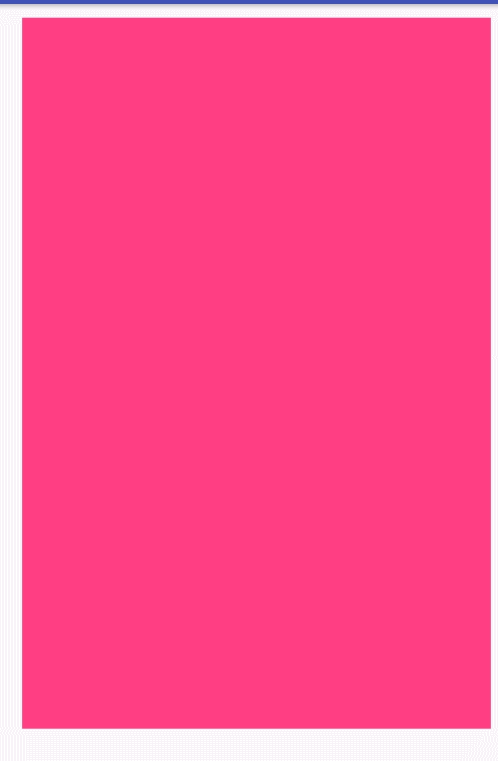

# 多指滑动处理

---
## 1 可拖动控件

为了理解这个知识点，首先写一个没有处理多指拖动的DragLayout。代码很简单，就是实现一个可垂直拖动子view的布局。

代码如下，非常的简单。

```java
    public class DragLayout extends FrameLayout {

        private static final String TAG = DragLayout.class.getSimpleName();
        private float mLastX;//手指在屏幕上最后的x位置
        private float mLastY;//手指在屏幕上最后的y位置
        private float mDownX;//手指第一次落下时的x位置（忽略）
        private float mDownY;//手指第一次落下时的y位置
    
        private int mScaledTouchSlop;//认为是滑动行为的最小参考值
        private boolean mIntercept;//是否拦截事件
    
        public DragLayout(Context context) {
            this(context, null);
        }
    
        public DragLayout(Context context, AttributeSet attrs) {
            this(context, attrs, 0);
        }
    
        public DragLayout(Context context, AttributeSet attrs, int defStyleAttr) {
            super(context, attrs, defStyleAttr);
            init();
        }
    
        private void init() {
            mScaledTouchSlop = ViewConfiguration.get(getContext()).getScaledTouchSlop();
        }
    
    
        @Override
        public boolean onInterceptTouchEvent(MotionEvent ev) {
    
            float x = ev.getX();
            float y = ev.getY();
            int action = ev.getAction();
    
    
            switch (action) {
                case MotionEvent.ACTION_DOWN: {
                    mIntercept = false;
                    mLastX = x;
                    mLastY = y;
    
                    mDownX = x;
                    mDownY = y;
                    break;
                }
    
                case MotionEvent.ACTION_MOVE: {
    
                    if (!mIntercept) {//没有没有拦截，才去判断是否需要拦截
                        float offset = Math.abs(mDownY - y);
                        Log.d(TAG, "offset:" + offset);
                        if (offset >= mScaledTouchSlop) {
                            float dx = mLastX - x;
                            float dy = mLastY - y;
                            if (Math.abs(dy) > Math.abs(dx)) {
                                mIntercept = true;
                            }
                        }
                    }
    
                    break;
                }
    
                case MotionEvent.ACTION_UP: {
                    mIntercept = false;
                    break;
                }
            }
    
            mLastX = x;
            mLastY = y;
    
            return mIntercept;
        }
    
    
        @Override
        public boolean onTouchEvent(MotionEvent ev) {
            float x = ev.getX();
            float y = ev.getY();
    
            int action = ev.getAction();
    
            switch (action) {
                case MotionEvent.ACTION_DOWN: {
    
                    mLastX = x;
                    mLastY = y;
    
                    break;
                }
    
                case MotionEvent.ACTION_MOVE: {
    
                    float dy = mLastY - y;
                    scrollBy(0, (int) dy);
    
                    break;
                }
    
                case MotionEvent.ACTION_UP: {
                    break;
                }
            }
    
            mLastX = x;
            mLastY = y;
    
            return true;
        }
    }
```

效果如下：


**但是有没有发现一些不好的地方呢？**当第一个手指往下拖动了一下控件，接着第二个手指也触摸了屏幕，然后第一个离开了屏幕，这时你会看到红色的子view往上跳动了一下，这个跳动实在是太突兀了，我们希望的应该是当第一个手指离开屏幕时，红色的子view不会有任何跳动，而是依然顺畅的被第二个手指继续拖动。

如下面图所示：



把拖动变得顺畅需要处理多指拖动的情况，而要处理好多指拖动的情况需要了解MotionEvent，关于MotionEvent可以参考[MotionEvent 详解](https://github.com/GcsSloop/AndroidNote/blob/master/CustomView/Advance/%5B16%5DMotionEvent.md)和[Android 多点触控详解](https://github.com/GcsSloop/AndroidNote/blob/master/CustomView/Advance/%5B18%5Dmulti-touch.md)

---
## 2 处理多指拖动

思考一下如何处理多指拖动。思路是这样的：

1. 一个触摸点的pointerId在离开屏幕之前是不会改变的
2. 我们在处理拖动的时候首先确认好一个pointerId,然后根据此pointerId获取对应的触摸点的位置信息，也就是我们同一时刻值处理一个触摸点
3. 当有一个新的手指按下（一个新的触摸点产生时），我们需要切换我们关心的pointerId，这是我们的处理对象就发生变化了，而此时为了防止子View的跳动，我们同时还需要更新触摸点的y值。
4. 当有一个主要的手指抬起时，我们判断这个抬起的手指是不是我们当前正在关心的那个pointerId对于的手指(触摸点)，如果是我们的处理还是更新pointerId和y值。

代码实现如下：

```java
    public class MultiDragLayout extends FrameLayout {
    
        private static final String TAG = MultiDragLayout.class.getSimpleName();
        private float mLastX;
        private float mLastY;
        private float mDownX;//test
        private float mDownY;
    
        public static final int INVALID_POINTER = MotionEvent.INVALID_POINTER_ID;
        private int mActivePointerId = MotionEvent.INVALID_POINTER_ID;
    
        private int mScaledTouchSlop;
        private boolean mIntercept;
    
        public MultiDragLayout(Context context) {
            this(context, null);
        }
    
        public MultiDragLayout(Context context, AttributeSet attrs) {
            this(context, attrs, 0);
        }
    
        public MultiDragLayout(Context context, AttributeSet attrs, int defStyleAttr) {
            super(context, attrs, defStyleAttr);
            Log.d(TAG, "MultiDragLayout() called with: " + "context = [" + context + "], attrs = [" + attrs + "], defStyleAttr = [" + defStyleAttr + "]");
            init();
        }
    
        private void init() {
            mScaledTouchSlop = ViewConfiguration.get(getContext()).getScaledTouchSlop();
            Log.d(TAG, "mScaledTouchSlop:" + mScaledTouchSlop);
        }
    
    
        @Override
        public boolean onInterceptTouchEvent(MotionEvent ev) {
            int action = MotionEventCompat.getActionMasked(ev);
    
            switch (action) {
                case MotionEvent.ACTION_DOWN: {
                    //重置拦截标识
                    mIntercept = false;
                    //获取初始的位置
                    mLastX = ev.getX();
                    mLastY = ev.getY();
                    mDownX = mLastX;
                    mDownY = mLastY;
                    //这里我们根据最初的触摸的确定一个pointerId
                    int index = ev.getActionIndex();
                    mActivePointerId = ev.getPointerId(index);
    
                    break;
                }
                case MotionEventCompat.ACTION_POINTER_DOWN: {
    
                    Log.d(TAG, "onInterceptTouchEvent() called with: " + "ev = [ACTION_POINTER_DOWN  ]");
    
                    break;
                }
                case MotionEvent.ACTION_MOVE: {
                    //如果我们关系的pointerId==-1，不再拦截
                    if (mActivePointerId == INVALID_POINTER) {
                        return false;
                    }
    
                    final int pointerIndex = MotionEventCompat.findPointerIndex(ev, mActivePointerId);
                    if (pointerIndex < 0) {
                        return false;
                    }
    
                    float currentY = MotionEventCompat.getY(ev, pointerIndex);
                    float currentX = MotionEventCompat.getX(ev, pointerIndex);
    
                    if (!mIntercept) {
                        float offset = Math.abs(mDownY - currentY);
                        Log.d(TAG, "offset:" + offset);
                        if (offset >= mScaledTouchSlop) {
                            float dx = mLastX - currentX;
                            float dy = mLastY - currentY;
                            if (Math.abs(dy) > Math.abs(dx)) {
                                mIntercept = true;
                            }
    
                        }
                    }
                    mLastX = currentX;
                    mLastY = currentY;
                    break;
                }
                case MotionEventCompat.ACTION_POINTER_UP: {
    
                    Log.d(TAG, "onInterceptTouchEvent() called with: " + "ev = [ACTION_POINTER_UP  ]");
                    //处理手指抬起
                    onSecondaryPointerUp(ev);
                    break;
                }
                case MotionEvent.ACTION_UP: {
                    mIntercept = false;
                    mActivePointerId = INVALID_POINTER;
                    break;
                }
            }
    
    
            return mIntercept;
        }
    
        private void onSecondaryPointerUp(MotionEvent ev) {
            int index = MotionEventCompat.getActionIndex(ev);
            int pointerId = MotionEventCompat.getPointerId(ev, index);
            if (mActivePointerId == pointerId) {//如果是主要的手指抬起
                final int newPointerIndex = index == 0 ? 1 : 0;//确认一个还在屏幕上手指的index
                mLastY = MotionEventCompat.getY(ev, newPointerIndex);//更新lastY的值
                mActivePointerId = MotionEventCompat.getPointerId(ev, newPointerIndex);//更新pointerId
            }
        }
    
    
        private void onSecondaryPointerDown(MotionEvent ev) {
            final int index = MotionEventCompat.getActionIndex(ev);
            mLastY = MotionEventCompat.getY(ev, index);
            mActivePointerId = MotionEventCompat.getPointerId(ev, index);
        }
    
    
        @Override
        public boolean onTouchEvent(MotionEvent ev) {
            int action = MotionEventCompat.getActionMasked(ev);
    
            switch (action) {
                case MotionEvent.ACTION_DOWN: {
    
                    mLastX = ev.getX();
                    mLastY = ev.getY();
                    mDownX = mLastX;
                    mDownY = mLastY;
                    int index = ev.getActionIndex();
                    mActivePointerId = ev.getPointerId(index);
    
                    break;
                }
                case MotionEvent.ACTION_POINTER_DOWN: {
                    Log.d(TAG, "onTouchEvent() called with: " + "ev = [ACTION_POINTER_DOWN  ]");
                    onSecondaryPointerDown(ev);
                    break;
                }
                case MotionEvent.ACTION_MOVE: {
                    printSamples(ev);
                    int pointerIndex = MotionEventCompat.findPointerIndex(ev, mActivePointerId);//主手指的索引
                    if (pointerIndex < 0) {
                        return false;
                    }
    
                    float currentX = MotionEventCompat.getX(ev, pointerIndex);
                    float currentY = MotionEventCompat.getY(ev, pointerIndex);
                    int dy = (int) (mLastY - currentY);
                    scrollBy(0, dy);
    
                    mLastX = currentX;
                    mLastY = currentY;
                    break;
                }
                case MotionEvent.ACTION_POINTER_UP: {
                    Log.d(TAG, "onTouchEvent() called with: " + "ev = [ACTION_POINTER_UP  ]");
                    onSecondaryPointerUp(ev);
                    break;
                }
                case MotionEvent.ACTION_UP: {
                    mIntercept = false;
                    mActivePointerId = INVALID_POINTER;
                    break;
                }
            }
            return true;
        }

        //for test
        void printSamples(MotionEvent ev) {
            final int historySize = ev.getHistorySize();
            final int pointerCount = ev.getPointerCount();
            Log.d(TAG + "his", "historySize:" + historySize);
            Log.d(TAG + "his", "pointerCount:" + pointerCount);
            for (int h = 0; h < historySize; h++) {
                Log.d(TAG + "his", "ev.getHistoricalEventTime(h):" + ev.getHistoricalEventTime(h));
                for (int p = 0; p < pointerCount; p++) {
                    Log.d(TAG + "his", "ev.getPointerId(p):" + ev.getPointerId(p));
                    Log.d(TAG + "his", "ev.getPointerId(p):" + ev.getHistoricalX(p, h));
                    Log.d(TAG + "his", "ev.getPointerId(p):" + ev.getHistoricalY(p, h));
    
                }
            }
            Log.d(TAG, "ev.getEventTime():" + ev.getEventTime());
            for (int p = 0; p < pointerCount; p++) {
                Log.d(TAG + "his", "ev.getPointerId(p):" + ev.getPointerId(p));
                Log.d(TAG + "his", "ev.getX(p):   and    ev.getY(p):" + ev.getX(p) + "   " + ev.getY(p));
            }
        }
    }
```
