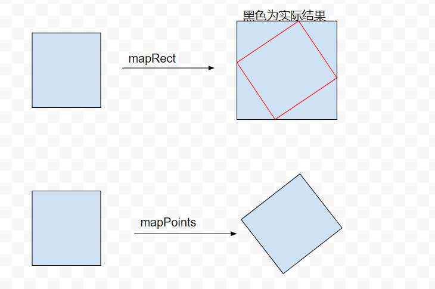
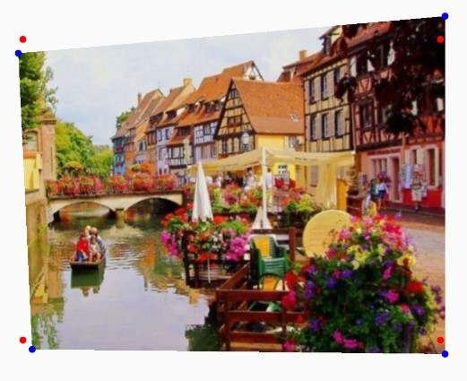

>理解矩阵：在线性空间中选定基之后，向量刻画对象，矩阵刻画对象的运动，用矩阵与向量的乘法施加运动。矩阵的本质是运动的描述。

## 6 Matrix的系列方法介绍

map系列主要是对目标对象描述的坐标进行矩阵变换

```java
    - public void mapPoints(float[] dst, int dstIndex, float[] src, int srcIndex, int  pointCount)
    - public void mapPoints(float[] pts)，注意Android中矩阵的坐标存储方式：(src[2*k],src[2*k+1])表示一个点的坐标，k取整数值，安卓中用数组存储点的坐标值的时候都是按如此法则存储的。
    - public void mapPoints(float[] dst, float[] src)
    - public float mapRadius(float radius)，测量半径，由于圆可能会因为画布变换变成椭圆，所以此处测量的是平均半径。
    - public boolean mapRect(RectF dst,RectF src)，对矩形做变换，返回值是判断矩形经过变换后是否仍为矩形。
    - public boolean mapRect(RectF rect)
    - public void mapVectors(float[] dst, float[] src)，与mapPoints类型，但是不会受到位移的影响，这符合向量的定律
    - public void mapVectors(float[] vecs)
    - public void mapVectors(float[] dst, int dstIndex, float[] src, int srcIndex, int vectorCount)
    - publiv boolean isIdentity()，判断当前矩阵是否为单位矩阵。
```


需要注意mapRect方法与mapPont方法的区别，如下图所示：



### 6.1 Matrix的postConcat，preConcat方法

平时使用postScale，preScale等方法用的比较多，postConcat，preConcat用于前面的方法所表示的意思类似，只是postConcat，preConcat方法接受的一个Matrix

### 6.2 Matrix的invert方法

这个方法的作用是得到当前矩阵的逆矩阵，什么是逆矩阵，逆矩阵就是matrix旋转了30度逆matrix就反向旋转30度，放大n倍，就缩小n倍。所以如果要得到当前（x,y）坐标对应matrix操作之前的(x',y')可以先将当前进行逆矩阵再进行map。

使用invert和mapPoints(float[] dst)方法可以实现图片的贴纸效果：


主要原理是：

1：mapPoints(float[] pts）方法对bitmap所表示的矩形区域进行变换,首先把添加的贴纸移到中间：

```java
            float transX = (getWidth() - imageGroupTemp.bitmap.getWidth()) / 2;
            float transY = (getHeight() - imageGroupTemp.bitmap.getHeight()) / 2;
            imageGroupTemp.matrix.postTranslate(transX, transY);
```

记录bitmap的四个定点坐标，然后利用matrix对其进行map变换：

```java
     protected float[] getBitmapPoints(Bitmap bitmap, Matrix matrix) {

            restDst();
            resetSrc(bitmap);
            matrix.mapPoints(mDst, mSrc);
            return mDst;
        }

        public void setMaxDecal(int maxDecal) {
            mMaxDecal = maxDecal;
        }

        private void resetSrc(Bitmap bitmap) {
            mSrc[0] = 0;
            mSrc[1] = 0;
            mSrc[2] = bitmap.getWidth();
            mSrc[3] = 0;
            mSrc[4] = 0;
            mSrc[5] = bitmap.getHeight();
            mSrc[6] = bitmap.getWidth();
            mSrc[7] = bitmap.getHeight();
        }

        private void restDst() {
            for (int i = 0; i < mDst.length; i++) {
                mDst[i] = 0;
            }
        }
```

2：最后在合成图片时，其实对原图的缩放操作是记录在原图的matrix中的，在合成的时候是没有对原图进行matrix变换的，所以这里需要使用逆向思维，你放大也可以理解为就是我变小，所以利用invert方法取得对原图变化矩阵的逆矩阵，应用到贴纸中，就可以达到一样的效果了：

```java
       public static Bitmap compositePicture(Bitmap source, Matrix sourceMatrix, List<DecalView.ImageGroup> imageGroups) {
            Bitmap bitmap = Bitmap.createBitmap(source.copy(Bitmap.Config.RGB_565, true));
            Canvas canvas = new Canvas(bitmap);
    
            sourceMatrix.invert(sourceMatrix);//计算逆矩阵，事实上source并没有应用矩阵变化，所以对贴纸进行source的逆矩阵变换，达到一个相对效果。
    
            for (DecalView.ImageGroup imageGroup : imageGroups) {
                imageGroup.matrix.postConcat(sourceMatrix);// 乘以底部图片变化矩阵
                canvas.drawBitmap(imageGroup.bitmap, imageGroup.matrix, null);
            }
            return bitmap;
        }
```

### 6.3 setPolyToPoly方法

```
boolean setPolyToPoly (
        float[] src,     // 原始数组 src [x,y]，存储内容为一组点
        int srcIndex,     // 原始数组开始位置
        float[] dst,     // 目标数组 dst [x,y]，存储内容为一组点
        int dstIndex,     // 目标数组开始位置
        int pointCount)    // 测控点的数量 取值范围是: 0到4
```

setPolyToPoly表示多对多的变换，最多支持四个点控制点变换，有点类似PhotoShop中按Ctrl+T后拖动图片的四个顶点到任意位置的变换效果，代码如下：

```java
    public class PolyToPolyDemoView extends View {

        private Bitmap mBitmap;
        private Matrix mMatrix = new Matrix();
        private float[] src = new float[8];//四个原始点
        private float[] dst = new float[8];//四个目标点
        private float left, right, top, bottom;
        private Paint mPaint = new Paint(Paint.ANTI_ALIAS_FLAG);

        public PolyToPolyDemoView(Context context) {
            super(context);
            mBitmap = BitmapFactory.decodeResource(getResources(), R.drawable.img_scenery_01);
            mPaint.setStrokeWidth(UnitConverter.dpToPx(5));
            mPaint.setStrokeCap(Paint.Cap.ROUND);
        }

        @Override
        protected void onSizeChanged(int w, int h, int oldw, int oldh) {
            super.onSizeChanged(w, h, oldw, oldh);
            float centerX = w / 2;
            float centerY = h / 2;
            left = centerX - mBitmap.getWidth() / 2;
            right = centerX + mBitmap.getWidth() / 2;
            top = centerY - mBitmap.getHeight() / 2;
            bottom = centerY + mBitmap.getHeight() / 2;
        }

        @Override
        protected void onDraw(Canvas canvas) {
            super.onDraw(canvas);
            mMatrix.reset();
            src[0] = left;
            src[1] = top;
            src[2] = right;
            src[3] = top;
            src[4] = left;
            src[5] = bottom;
            src[6] = right;
            src[7] = bottom;

            dst[0] = left - 10;//左上角
            dst[1] = top + 30;
            dst[2] = right + 10;//右上角
            dst[3] = top - 50;
            dst[4] = left + 20;//左下角
            dst[5] = bottom + 20;
            dst[6] = right + 10;//右下角
            dst[7] = bottom + 30;

            mMatrix.setPolyToPoly(src, 0, dst, 0, 4);
            canvas.save();
            canvas.concat(mMatrix);
            canvas.drawBitmap(mBitmap, left, top, null);
            canvas.restore();

            mPaint.setColor(Color.RED);
            canvas.drawPoints(src, mPaint);
            mPaint.setColor(Color.BLUE);
            canvas.drawPoints(dst, mPaint);
        }
    }
```

效果如下图，红色的是原始点，通过对点进行变换，四个订单就变成了蓝色点。图片也就变形了。




### 6.4 setRectToRect

```java
boolean setRectToRect (RectF src,             // 源区域
                RectF dst,                     // 目标区域
                Matrix.ScaleToFit stf)        // 缩放适配模式
```

将源矩形的内容填充到目标矩形中，然而在大多数的情况下，源矩形和目标矩形的长宽比是不一致的，stf用来指定填充的模式。

ScaleToFit 是一个枚举类型，共包含了四种模式:

模式|    摘要
---|---
CENTER    |居中，对src等比例缩放，将其居中放置在dst中。
START    |顶部，对src等比例缩放，将其放置在dst的左上角。
END    |底部，对src等比例缩放，将其放置在dst的右下角。
FILL    |充满，拉伸src的宽和高，使其完全填充满dst。


---
## 7 计算几何

- 如何判断点在一个矩形内
- 判断点是否在直线上
- 矩阵的数学运算,参考附件PPT

---
## 引用

### 理解矩阵

- [理解矩阵（一）](http://blog.csdn.net/myan/article/details/647511)
- [理解矩阵（二）](http://blog.csdn.net/myan/article/details/649018)
- [理解矩阵（三）](http://blog.csdn.net/myan/article/details/1865397)

### 计算几何

- [计算几何算法](http://dev.gameres.com/Program/Abstract/Geometry.htm)
- [算法系列之九：计算几何与图形学有关的几种常用算法（一）](http://blog.csdn.net/orbit/article/details/7082678)
- [算法系列之九：计算几何与图形学有关的几种常用算法（二）](http://blog.csdn.net/orbit/article/details/7101869)
- [计算几何⎯⎯算法与应用](chrome-extension://oemmndcbldboiebfnladdacbdfmadadm/https://dsa.cs.tsinghua.edu.cn/~deng/cg/cgaa/cgaa.3rd-edn.cn.pdf)

### Android API与应用

- [矩阵的相关API参考](http://blog.csdn.net/hahajluzxb/article/details/8165258)
- [自定义View之Matrix最全API解析](https://blog.csdn.net/IO_Field/article/details/78843630)
- [android matrix 最全方法详解与进阶（完整篇）](http://blog.csdn.net/cquwentao/article/details/51445269)
- [Android 贴纸](http://www.jianshu.com/p/6b6bc64a6823)
- [android画板---涂鸦,缩放，旋转，贴纸实现](http://www.jianshu.com/p/1e1ca1e700ab)


