# Canvas

---
## 1 Canvas介绍

前面已经对Canvas做了一些基本介绍，包括Canvas的坐标系和绘图坐标系，还有其他绘图相关API，接下来学习详细学习Canvas的知识。

Canvas的方法可以分为四大类和一些其他方法：

- drawXXX
- clipXXX
- canvas变换 rotate、translate、scale、skew
- 图层操作
- 其他方法

---
## 2 canvas的drawXXX系列方法

canvas有很多draw方法，可以画出不同图形，接下来就对这一系列方法进行学习

### drawARGB

用来对整个Canvas以某种统一的颜色整体绘制，四个参数分别是Alpha、Red、Green、Blue，取值f范围是[0-255]。

### drawText

用于绘制文本

```java
      drawText(String text, float x, float y, Paint paint);
      drawTextOnPath(String text, Path path, float hOffset, float vOffset, Paint paint)
      drawPosText( String text,float[] pos, Paint paint),pos用于给每一个文字自定绘图坐标(已废弃)
```

- float y参数表示的是text的BaseLine.
- drawTextOnPath用于在Path上绘制文本，hOffset和vOffset分别表示水平方向和垂直方向的偏移值。注意添加Path时的Direction对文本方向的影响。
- 使用Paint可以设置很多文字的属性，比如对其方式，缩进等。
- drawPosText可以控制绘制每个文字的绘制位置

### drawPoint

drawPoint用于画点

### drawLine

drawLine根据起点和终点绘制一条线

```java
drawLines(float[] pts, int offset, int count,  Paint paint);
drawLine(float startX, float startY, float stopX, float stopY,  Paint paint)
```

### drawRect

画矩形

```java
drawRect(float left, float top, float right, float bottom,  Paint paint)
drawRect(RectF rect, Paint paint)
drawRect(Rect rect, Paint paint)
```

Rect表示一个矩形，Rect的的上下左右是相对于canvas的绘图坐标的。

### drawRoundRect

```java
        drawRoundRect(@NonNull RectF rect, float rx, float ry, @NonNull Paint paint)
```

drawRoundRect用于绘制圆角矩形，使用rx和ry控制圆角的大小，如下图：

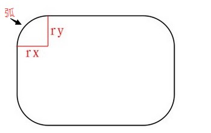

上图中的弧可以是一个椭圆弧，当rx=ry时，则弧是一个圆弧。当rx大于矩形宽度的一半，ry大于矩形高度的一半时，我们绘制的就是椭圆了。

### drawCircle

画圆圈

```java
drawCircle(float cx, float cy, float radius, Paint paint) 
```

如果使用的是用STROKE模式，轮廓线是以实际圆的边界为分界线分别向内向外扩充1/2的线宽的距离，比如圆的半径是200，线宽是20，那么在STROKE模式下绘制出的圆环效果相当于半径为210的大圆和半径为190的小圆形成的效果。

### drawOval

画椭圆，接收一个矩形，用于表示椭圆的上下左右四个定点

```java
drawOval(RectF oval, Paint paint)
```

RectF表示一个精度的矩形，rectF的区域用来控制椭圆的四个点。

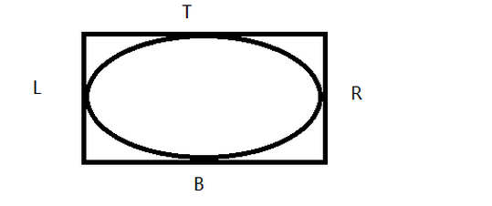

### drawArc

用于绘制弧，这里的弧指两种：**弧面和弧线**，弧面即用弧围成的填充面，弧线即为弧面的轮廓线。

```java
drawArc(RectF oval, float startAngle, float sweepAngle, boolean useCenter, Paint paint)
```

绘制弧面还是弧线取决于`useCenter`

- 用drawArc画的弧指的是椭圆弧，即椭圆的一部分。当然，如果椭圆的长轴和和短轴相等，这时候我们就可以用drawArc方法绘制圆弧。
- oval是RecF类型的对象，其定义了椭圆的形状。
- startAngle指的是绘制的起始角度，钟表的3点位置对应着0度，如果传入的startAngle小于0或者大于等于360，那么用startAngle对360进行取模后作为起始绘制角度。
- sweepAngle指的是从startAngle开始沿着钟表的顺时针方向旋转扫过的角度。如果sweepAngle大于等于360，那么会绘制完整的椭圆弧。如果sweepAngle小于0，那么会用sweepAngle对360进行取模后作为扫过的角度。
- useCenter是个boolean值，如果为true，表示在绘制完弧之后，用椭圆的中心点连接弧上的起点和终点以闭合弧；如果值为false，表示在绘制完弧之后，弧的起点和终点直接连接，不经过椭圆的中心点。

下面从左到右分别是:

- 画笔描边-useCenter为false
- 画笔描边-useCenter为true
- 画笔填充-useCenter为fals
- 画笔填充-useCenter为true。


### drawPath

用于绘制路径

### drawBitmap

用于绘制位图：

```java
    drawBitmap(Bitmap bitmap, float left, float top, Paint paint)
    drawBitmap(Bitmap bitmap, Rect src, Rect dst, Paint paint)
    drawBitmap( Bitmap bitmap,  Matrix matrix, Paint paint)
```

#### 方法1

top和left表示从canvas的哪个地方开始绘制位图。

#### 方法2

该方法有两个功能：

- 1.只绘制原有bitmap对象的一部分

 srcRect表示需要绘制bitmap的区域，**需要注意的是，drawBitmap方法中的srcRect中left、top、right、bottom的值都是以Bitmap本身的宽高的，原点在bitmap的左上角。**，如果不关心bitmap绘制到的区域的话dst可以为null。

- 2.将要绘制的bitmap缩放到指定的区域。

dst表示bitmap绘制到的区域，这里的dst的坐标是相对于canvas的坐标而已的，尽量保证了dstRecF的长宽比与srcRect中的长宽比相同，否则绘制的bitmap会变形。

#### 方法3

对绘制的bitmap应用矩阵变换。

### drawPaint

drawPaint一般用于清空画布

```java
     mXfermode = new PorterDuffXfermode(PorterDuff.Mode.CLEAR);
     mPaint.setXfermode(mXfermode);
     canvas.drawPaint(mPaint);
```

### drawVertices和drawBitmapMesh

通过对顶点操作可以使图像形变，drawVertices直接对画布作用、 drawBitmapMesh只对绘制的Bitmap作用

---
## 3 Canvas的变换操作

canvas的变换是基于矩阵的，canvas变换包括translate、rotate、scale、skew，分别表示对画布进行平移，旋转，缩放，错切操作，变换的canvas的绘图坐标，有时候利用canvas的变换可以简化很多绘图操作，比如角度计算等。

- translate(float dx ,float dy) 可以改变画布的绘图原点
- rotate(float degrees) 旋转画布，默认原点在左上角
- scale(float sx,float sy) 缩放画布，**注意当缩放值为负数时，可以反转坐标轴**
- skew(float sx,float sy) 对画布进行错切操作
  - float sx:将画布在x方向上倾斜相应的角度，sx为倾斜角度的tan值；
  - float sy:将画布在y轴方向上倾斜相应的角度，sy为倾斜角度的tan值；

使用scale可以画出这样的效果：

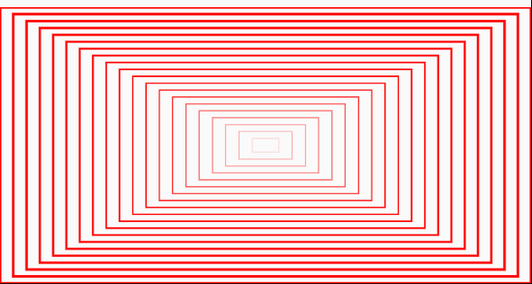

```java
    for (float scale = 1F; scale > 0; scale -= 0.05F) {
        canvas.save();
        canvas.translate(  ( (1 - scale) * mWidth)/2    ,   ((1 - scale) * mHeight)/2 );
        canvas.scale(scale, scale);
        canvas.drawRect(mRect, mPaint);
        canvas.restore();
    }
```

错切效果

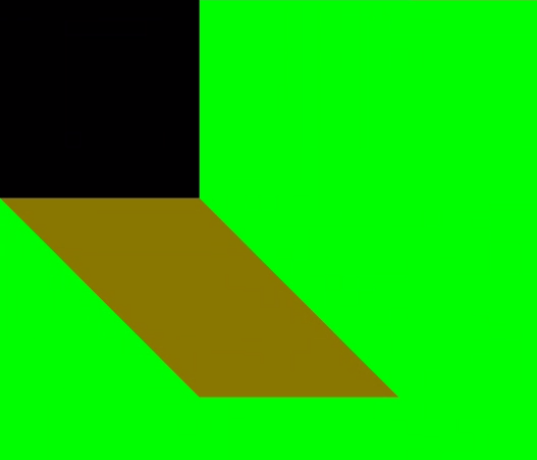

```java
        canvas.drawColor(Color.GREEN);
        canvas.drawRect(new Rect(0, 0, 400, 400), mPaint);
        //canvas.traslate(0, 400);
        // x 方向上倾斜45 度
        canvas.skew(1F, 0);
        mPaint.setColor(0x88FF0000);//透明色
        canvas.drawRect(new Rect(0, 0, 400, 400), mPaint);
```

利用画布的旋转画钟表刻度

```java
        canvas.translate(mWidth / 2, mHeight / 2);
        int angle = 360 / 60;
        int halfWidth = mWidth / 2;
        int temp;
        for (int i = 0; i < 60; i++) {
            temp = i % 5;
            if (temp == 0) {
                mPaint.setStrokeWidth(UnitConverter.dpToPx(2));
                canvas.drawLine(0, -halfWidth / 2 + mLongAixs, 0, -halfWidth / 2, mPaint);
            } else {
                mPaint.setStrokeWidth(UnitConverter.dpToPx(1));
                canvas.drawLine(0, -halfWidth / 2 + mShortAixs, 0, -halfWidth / 2, mPaint);
            }
            canvas.rotate(angle);
        }
        canvas.drawCircle(0, 0, halfWidth/2, mPaint);
```

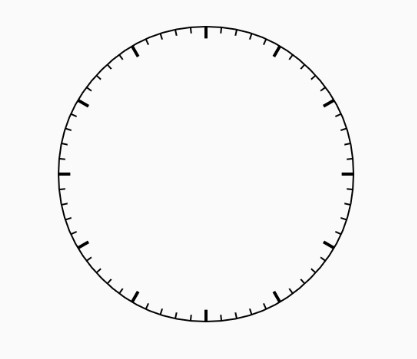

对于 Canvas 的变换操作需要注意的是：

- **对 Canvas 进行变换的参考永远是 View 的坐标系，这个是不变的**。
- 在 Canvas 上进行绘制参数的是绘图坐标系，默认是和 View 的坐标系重合的，但是经过可以通过上述方法进行变换。

如果绘制的时候涉及到 Canvas 的变换，脑海中要维护两个坐标系可能导致思考问题变得复杂，一种取巧的方式是采用倒序的思考方式（原理涉及到复杂的数学知识），比如下面代码可以理解为：

```java
canvas.rotate(-45, -imageWidth/2, -imageHeight/2);
canvas.translate(200,200);
canvas.drawBitmap(bitmap, 0, 0, paint);
```

1. 原点画一个图片。
2. 将图片移动到 200,200 的位置。
3. 将图片以图片为中心逆时针转 45°。

---
## 4 Canvas的剪切操作

canvas的clipXXX方法表示会画布进行裁剪操作，新的绘制操作只能才裁剪后的canvas区域进行。

canvas的clipXXX方法如下：

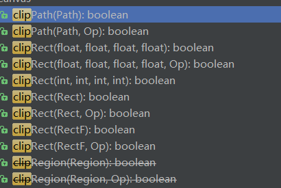

简单示例：

利用canva的clip也可以实现绘制圆形图片或者圆角图片

```java
@Override
protected void onDraw(Canvas canvas) {
    super.onDraw(canvas);

    int measuredWidth = getMeasuredWidth();
    int measuredHeight = getMeasuredHeight();
    int width = mBitmap.getWidth();
    int height = mBitmap.getHeight();
    canvas.translate(measuredWidth / 2, measuredHeight / 2);
    //这里添加roundRect即可实现绘制圆角图片
    mPath.addCircle(0, 0, measuredHeight / 4, Path.Direction.CW);
    canvas.clipPath(mPath);
    canvas.drawBitmap(mBitmap, -width / 2, -height / 2, null);

}
```

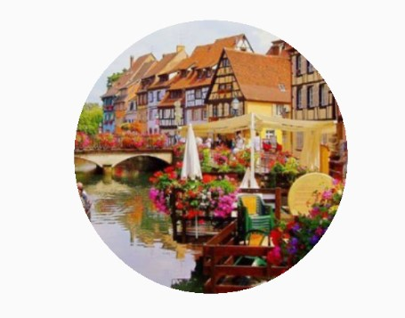

关于Region.Op前面已经说明，使用示例如下：

```java
    int measuredWidth = getMeasuredWidth();
    int measuredHeight = getMeasuredHeight();
    int width = mBitmap.getWidth();
    int height = mBitmap.getHeight();
    canvas.translate(measuredWidth / 2, measuredHeight / 2);
    mPath.addCircle(0, 0, measuredHeight / 4, Path.Direction.CW);
    canvas.clipPath(mPath);
    mRect.set(-width / 2, 0, width / 2, height / 2);
    canvas.clipRect(mRect, Region.Op.UNION);
    canvas.drawBitmap(mBitmap, -width / 2, -height / 2, null);
```

效果：

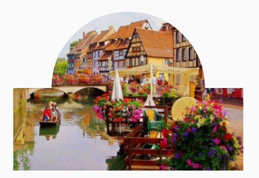

**需要注意的是，Canvas的剪切操作会失去抗锯齿效果，而且无法解决，这跟抗锯齿的原理有关系**。

---
## 5 Canvas的图层操作

使用过photoShop的人都指定，在PhotoShop中有图层的概念，多个图层可以合成一张图片，而图层是有上下顺序的。而在canvas中也有图层的概念，如果把Canvas理解成画板，那么canvas的“层”就像张张夹在画板上的**透明的纸**，而这些纸对应到Android来说则是封装在Canvas中的Bitmap。

canvas的图层概念类似下图：

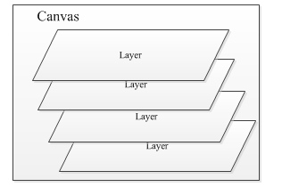

Canvas有一些列saveXXX和restoreXXX方法来操作图层。

### save和restore

save表示基于栈顶图层状态创建一个新的图层，方法对于这些图层是按照“**栈结构**“来管理的。

- save():`Saves the current matrix and clip onto a private stack.` 表示基于栈顶图层状态创建一个新的图层,会返回表示当前图层栈的Id。在save之后，restore之前，都是基于当前图层进行操作，而不影响之前的图层。save方法只能针对Bitmap的形变(matrix)和裁剪(clip)进行操作
- restore 表示合并当前图层，也可以理解为栈顶图层出栈
- getSaveCount 表示获取图层栈中的图层数量
- restoreToCount(int count) count表示在使用save方法时返回的图层栈id，指定id以及指定id之上的图层都将被还原。

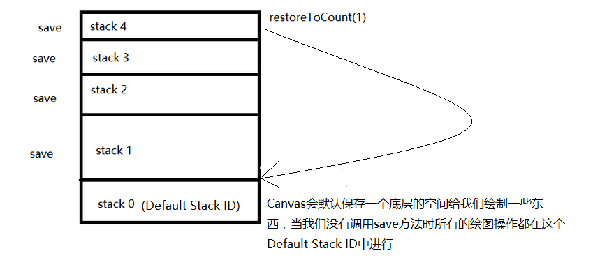

示例：

```java
    @Override
    protected void onDraw(Canvas canvas) {
        super.onDraw(canvas);
        canvas.save();
        Log.d(TAG, "canvas.getSaveCount():" + canvas.getSaveCount());
        canvas.restore();
        mRect.set(200, 200, 400, 400);
        canvas.clipRect(mRect);
        canvas.drawColor(Color.RED);
        canvas.drawArc(mRect,0,270,false,mPaint);
        canvas.save();
        mRect.set(200,200,300,300);
        canvas.clipRect(mRect);
        canvas.drawColor(Color.GREEN);
    }
```

打印结果为canvas.getSaveCount():2

效果为：

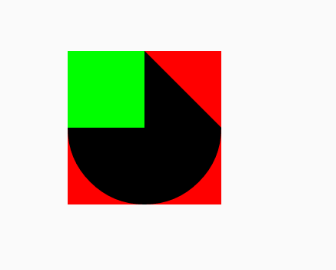

```java
            canvas.save();
            canvas.save();
            canvas.save();
            canvas.save();
            Log.d(TAG, "canvas.getSaveCount():" + canvas.getSaveCount());
            canvas.restoreToCount(4);
            Log.d(TAG, "canvas.getSaveCount():" + canvas.getSaveCount());
```

打印结果为：

```java
    canvas.getSaveCount():5
    canvas.getSaveCount():4
```

把上面restoreToCount(4)改为restoreToCount(3)；则结果为：

```java
    canvas.getSaveCount():5
    canvas.getSaveCount():3
```

### Layer

与save()方法不同的是，saveLayerXXX方法会将所有的操作存到一个新的Bitmap中而不影响当前Canvas的Bitmap，而save()方法则是在当前的Bitmap中进行操作，并且只能针对Bitmap的形变和裁剪进行操作，layer退栈时会把本层绘制的图像“绘制”到上层或是Canvas上。

savelayer方法有很多重载，排除掉相同的行为就剩下下面两个了：

```java
    saveLayer(RectF bounds, Paint paint, @Saveflags int saveFlags)
    saveLayerAlpha(RectF bounds, int alpha, @Saveflags int saveFlags)
```

#### saveLayer

saveLayer可以让我们自行设定需要保存的区域（似于clipRect的效果），相对于save方法来说saveLayer更加强大却更加重量级(aveLayerXXX方法会将操作保存到一个新的Bitmap中)，在使用saveLayer时我们会依据传入的参数获取一个相同大小的Bitmap，这个Bitmap会占用一定的内存空间。所以如果需要使用saveLayer方法，应该经历让保存的区域更小。

示例：

```java
        @Override
        protected void onDraw(Canvas canvas) {
            super.onDraw(canvas);
    
            int halfWidth = getMeasuredWidth()/2;
            int halfHeight = getMeasuredHeight()/2;
    
            mPaint.setColor(Color.BLUE);
            mRectF.set(halfWidth - 200, halfHeight - 200, halfWidth + 200, halfHeight + 200);
            canvas.drawRect(mRectF, mPaint);
            mRectF.set(halfWidth - 100, halfHeight - 100, halfWidth + 100, halfHeight +100);
    
            canvas.saveLayer(mRectF, null, Canvas.ALL_SAVE_FLAG);
            canvas.rotate(15);
            mPaint.setColor(Color.RED);
            canvas.drawRect(mRectF, mPaint);

        }
```

效果为：

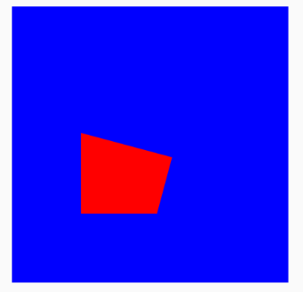

为什么红色区域是这样子呢？下图已经给出答案：

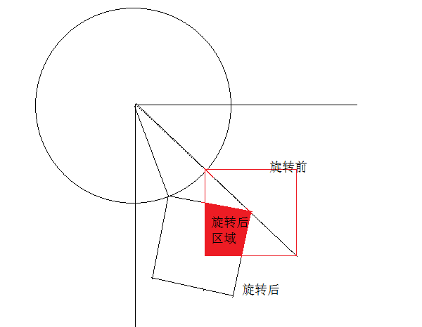

#### saveLayerAlpha

该方法可以在我们保存画布时设置画布的透明度，看下面示例：

```java
    protected void onDraw(Canvas canvas) {
            super.onDraw(canvas);
    
            int halfWidth = getMeasuredWidth()/2;
            int halfHeight = getMeasuredHeight()/2;
    
            mPaint.setColor(Color.BLUE);
            mRectF.set(halfWidth - 200, halfHeight - 200, halfWidth + 200, halfHeight + 200);
            canvas.drawRect(mRectF, mPaint);
            mRectF.set(halfWidth - 100, halfHeight - 100, halfWidth + 100, halfHeight +100);
    
            int layer1 = canvas.saveLayer(mRectF, null, Canvas.ALL_SAVE_FLAG);
            canvas.rotate(15);
            mPaint.setColor(Color.RED);
            canvas.drawRect(mRectF, mPaint);
            canvas.restoreToCount(layer1);
    
    
            mRectF.set(0,0,getMeasuredWidth(),getMeasuredHeight());
            canvas.saveLayerAlpha(mRectF, 0xAA, Canvas.ALL_SAVE_FLAG);//设置透明度为AA
            canvas.drawColor(Color.GREEN);
            canvas.restore();
    
        }
```

效果：

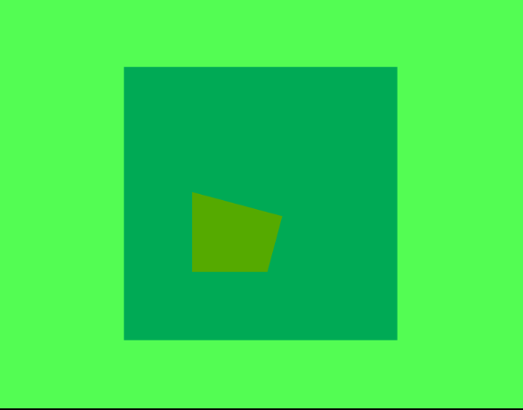

### canvas的saveFlag

在使用canvas的save方法时，可以设置不同的参数，默认情况下都是`Canvas.ALL_SAVE_FLAG`，但是我们可以自己指定，可选的参数为：

```java
    MATRIX_SAVE_FLAG 
       Restore the current matrix when restore() is called.
    CLIP_SAVE_FLAG 
       Restore the current clip when restore() is called.
    HAS_ALPHA_LAYER_SAVE_FLAG 
       The layer requires a per-pixel alpha channel.
    FULL_COLOR_LAYER_SAVE_FLAG 
       The layer requires full 8-bit precision for each color channel.
    CLIP_TO_LAYER_SAVE_FLAG  
       Clip drawing to the bounds of the offscreen layer, omit at your own peril.
    ALL_SAVE_FLAG 
       Restore everything when restore() is called (standard save flags).
```

- ALL_SAVE_FLAG 表示保存所有
- CLIP_SAVE_FLAG 裁剪的标识位，还原裁剪操作，但会保留画布的变化操作
- MATRIX_SAVE_FLAG 变换的标识位，还原变换操作，但会保留裁剪操作
- CLIP_TO_LAYER_SAVE_FLAG 表示对当前图层执行裁剪操作需要对齐图层边界
- FULL_COLOR_LAYER_SAVE_FLAG 表示当前图层的色彩模式至少需要是8位色
- HAS_ALPHA_LAYER_SAVE_FLAG 表示在当前图层中将需要使用逐像素Alpha混合模式

六个标识常量中，只有`CLIP_SAVE_FLAG`、`MATRIX_SAVE_FLAG`和`ALL_SAVE_FLAG`才能在save方法中使用。
