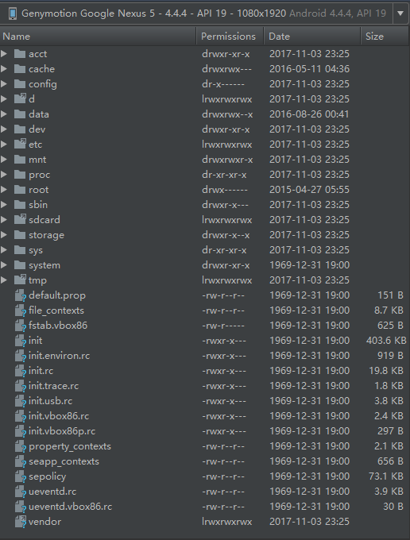

# Android 系统目录结构介绍

Android操作系统基于Linux内核，Linux是基于文件的操作系统，硬件驱动以及配置全部以文件形式描述。独有权限验证识别系统。

Android版本对应的Linux内核版本：

```log
Android Version    |API Level  |Linux Kernel in AOSP
----------------------------------------------------
1.5   Cupcake      |3          |2.6.27
1.6   Donut        |4          |2.6.29
2.0/1 Eclair       |5-7        |2.6.29
2.2.x Froyo        |8          |2.6.32
2.3.x Gingerbread  |9, 10      |2.6.35
3.x.x Honeycomb    |11-13      |2.6.36
4.0.x Ice Cream San|14, 15     |3.0.1
4.1.x Jelly Bean   |16         |3.0.31
4.2.x Jelly Bean   |17         |3.4.0
4.3   Jelly Bean   |18         |3.4.39
4.4   Kit Kat      |19, 20     |3.10
5.x   Lollipop     |21, 22     |3.16.1
6.0   Marshmallow  |23         |3.18.10
7.0   Nougat       |24         |4.4.1
7.1   Nougat       |25         |4.4.1 (To be updated)
```

---
## 1 目录结构介绍

虽然Android基于Linux内核，但是Android还是对Linux系统的目录结构做了一些调整，参考下图目录结构：



各目录作用如下：

- acct目录：在linux设备目录中没有这个文件夹，acct的英文缩写是：CPU Accounting Controller，acct用于使用cgroup对任务进行分组，并考虑这些任务组的CPU使用情况。
- data目录： 保存应用程序的数据
  - `/data/app`目录 用户安装的应用程序的apk
  - `/data/data`目录 应用程序产生的私有数据
  - `/data/anr`目录 开发人员使用定位anr异常
  - `/data/system`目录 系统配置信息，注册表
  - `/data/local/tmp`目录 用于存放临时文件
- dev目录：用于存放设备文件
- mnt目录、/sdcard目录、/storage目录：都指向外部存储
  - `/sdcard/Android/data/<package_name>` 应用的额外数据，应用卸载时自动删除。
- system目录： 系统目录文件夹（重要）， Android系统标准目录结构
  - `/system/app`目录 系统应用程序目录,默认无法卸载
  - `/system/bin`目录 可执行的二进制程序
  - `/system/exc` 扩展目录
  - `/system/fonts` 字体目录
  - `/system/framework` 框架平台中间件
  - `/system/lib` 类库 c/c++代码
  - `/system/media` 媒体资源
  - `/system/tts` 语音发声引擎
  - `/system/usr` 用户设备的配置信息，按键编码映射
  - `/system/xbin` 二进制文件，为开发人员提供的二进制文件
- sbin目录：adbd 通讯客户端
- proc目录：配置，状态信息
  - `/proc/cpuinfo` cpu信息
- etc目录：指向 `/system/etc` ，众所周知的配置文件存放目录
- cache目录：缓存临时文件夹。
- sys目录：用于挂载 sysfs文件系统。

---
## 引用

- [Android的文件系统结构](http://blog.csdn.net/conowen/article/details/7251057)
- [Android系统目录结构](http://www.cnblogs.com/pixy/p/4744501.html)
