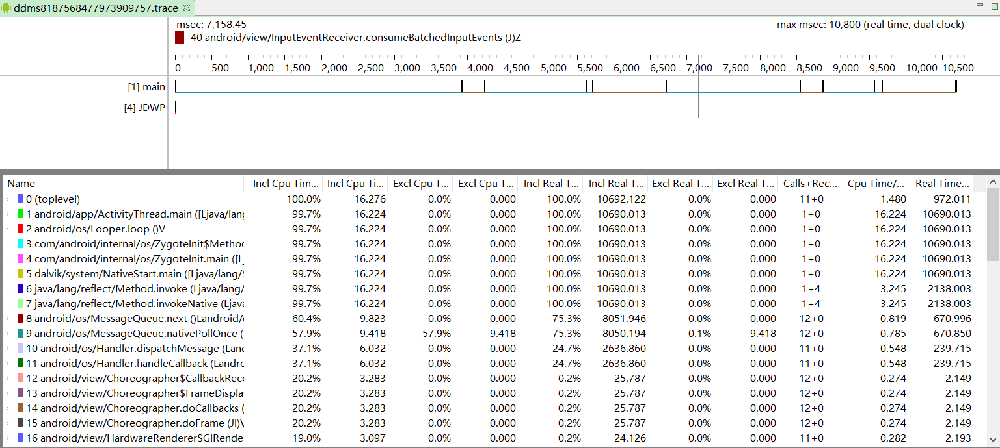

# 《Android开发——从小工到专家》Android性能优化

>无论你的应用多么酷多么有用，如果它运行缓慢，或者非常消耗内存，那么没有人会乐意使用它。

---
## 1 布局优化

Android SDK 提供的 HierarchyViewwer 可以很直观的查看 View 树的冗余层级，去掉这些多余的布局层级可以是我们的 UI 变得更加流畅。

### 1.1 使用include布局

incude可以在一个布局中引入另外一个布局文件，可以很方便的抽取公共的布局非常

### 1.2 使用merge标签

使用 merge 可以消除自布局的根视图与它的父视图是同一类性的情况

### 1.3 使用ViewStub延迟加载视图

ViewStub是一个不可见的能在运行期间加载目标视图的宽高都为0的View，当调用ViewStub.inflate方法或者设置visible之前，它不占用布局控件和系统资源

### 1.4 减少视图数的层级

每个视图在现实时都会经历测量、布局、绘制的过程，如果布局中嵌套的视图层架过多，那么就会造成额外的测量、布局等工作，使用UI变得卡顿。所以应该尽可能的减少视图树的层级。

简单来说，在AndroidUI布局中，需要遵守的原则包括以下几点：

- 尽量多用 RelativeLayout，不要使用绝对布局
- 在使用 ListView，RecyclerView 等列表组件中尽量避免使用 LinearLayout 的 layout_weight 属性
- 将可复用的组件抽取出来，通过 include 引入
- 使用 ViewStub 标签延迟加载不常用的组件
- 使用 merge 标签减少布局的嵌套层次
- 在布局层级相同的情况下，LinearLayot 的性能优于 RelativeLayout

---
## 2 内存优化

RandomAccessMemory(RAM) 在任何软件开发中都是很宝贵的资源，这一点在物理内存很有限的操作系统上，显得尤为突出，为了 GC 能够从 app 中及时的回收内存，我们需要注意避免内存泄漏并且在适当的时机来释放引用对象。

**如果管理内存**：应该在开发过程中的每一个阶段都考虑都 RAM 的有限性，甚至包括开发开发之前的设计阶段就应该开始考虑 RAM 的限制，一般我们应该遵循如下要点：

### 2.1 珍惜 Service 资源

如果你的 App 需要在后台使用 Service，除非它被触发执行一个任务，否则其他时候都应该是非运行状态。同样需要注意，当这个 Service 已经完成工作任务后因为 **停止失败** 造成的内存泄漏。限制 Service 的最好办法是使用 IntentService

### 2.2 当UI隐藏时释放内存

当用户切换到其他应用并且你的应用 UI 不可见时，应该释放 UI 上所在用的所有内存，在这个时候释放 UI 资源可以显著增加系统缓存进程的能力。

为了能够接收到用户离开你的 UI 时的通知，需要实现 Activity 类里面的 onTrimMemory 回调，应该使用这个方法来监听 TRIM_MEMROY_UI_HIDDEN 级别的回调，此时意味着你的 UI 已经隐藏，应该释放那些仅仅被你的UI使用的资源。

```java
        public void onTrimMemory(int level) {
            super.onTrimMemory(level);
            if (level == AppCompatActivity.TRIM_MEMORY_UI_HIDDEN) {
                //释放ui资源
            }
        }
```

### 2.3 当内存紧张时释放部分内存

在你的 app 生命周期的任何阶段，onTrimMemroy 回调方法同样可以告诉你整个内存资源已经开始紧张，你应该根据 onTrimMemeory 方法中的内存级别来进一步决定释放哪些资源。

- **TRIM_MEMROY_RUNNING_MONERATE**:App正在运行并且不会被列为可以杀死的进程，但是设备已经处于低内存状态，系统开始触发杀死LRU Cache中的Process机制。
- **TRIM_MEMROY_RUNNING_LOW**：App正在运行并且没有被列为可以杀死的进程，但是设备已经处于更低内存状态，此时应该释放那些备用的资源来提升系统的性能(也会直接影响你的App的性能)
- **TRIM_MOMORY_RUNNING_CRITICAL**： App正在运行，但是系统已经把LRU Cache中大多数进程都杀死了，此时应该立即释放非必需资源，如果系统会受到足够的RAM数量，系统将会清除所有的LRU缓存中的进程，并且开始杀死那些之前被认为不应该杀死的进程，例如一个包含了运行态的Service进程。

当你的App进程被cached时，可能会收到从onTrimMemory中返回的下面值之一

- **TRIM_MEMORY_BACKGROUND**： 系统正在处于低内存状态，并且你的进程正在处于LRU缓存名单中最不容易杀掉的位置。
- **TRIM_MOMORY_MODERATE**： 系统正在处于低内存状态，并且你的进程正在处于接近LRU缓存名单中部的位置。
- **TRIM_MEMROY_COMPLETE**： 系统正在处于低内存状态，并且你的进程正在处于LRU缓存名单最容易被杀掉的位置。

>onTrimMemeroy 是在 Android4.0 系统中被加入的，对于老的版本可以使用 onLowMemory 回调来实现兼容，onLowMemory 相当于 TRIM_MEMROY_COMPLETE。

当系统开始进程 LR 缓存中进程时，尽管它首先按照 LRU 的顺序来操作，但是，它同样会考虑进程的内存使用量，因此消耗较少的进程则容易被保留下来。

### 2.4 检查你应该使用多少内存

- 通过 `getMemoryClass()` 可以获取你的App的可用heap大小
- 除非是确认你的app需要教打大的内存来运行(图片编辑app)，否则一般不应该适用 `largeHeap=true` 属性

```java
    ActivityManager activityManager = (ActivityManager) getSystemService(ACTIVITY_SERVICE);
    int memoryClass = activityManager.getMemoryClass();//单位M
    Runtime.getRuntime().maxMemory();//但是byte
```

### 2.5 避免bitmap的浪费

- android2.3 bitmap 的内存放在 navive 内存中
- android3.0 bitmap 的内存调整至 Dalvik heap 中
- 深入了解 Bitmap 相关原理
- 使用并熟悉成熟的图片加载框架

### 2.6 使用优化过的容器

利用 SparseArray、SparseBooleanArray 等容器，通常它们比 HashMap 节省内存，在元素存量量较少时(1000级别)，不建议使用 HashMap

### 2.7 注意内存开销

对于你使用的语言和库的成本与开销有所了解，比如在 Android 使用 常量+注解 代替枚举进行内存优化

- 枚举的内存消耗通常是static constanst的两倍，尽量避免在Android使用enum
- 在 Java 中每个类（包括匿名内部类）都会使用大概 500bytes
- 每个类的实例开销是 12-16 bytes
- 在 HashMap 中添加一个 entry 需要一个占用 32bytes 内存

### 2.8 注意代码抽象

通常，开发者使用抽象作为“好的编程实践”，因为抽象能够提升代码的灵活性和可维护性，然而，抽象会导致一个显著的开销，通常它们需要同等量的代码用于可执行，那些代码会被 map 到内存中，因此，如果你的抽象没有显著提升效率，应该尽量避免它们。

### 2.9 使用nano protobufs

- 略

### 2.10 避免使用依赖注入框架

- 略

### 2.11 谨慎使用第三方库

- 略

### 2.12 使用ProGuard来剔除不需要的代码

- 略

### 2.13 对最终的Apk使用zipAlign

- 略

---
## 3 内存泄漏

### Memroy Monitor

Memroy Monitor是AndroidStudio中内置的内存分析工具，通过它可以很直观的查看正在运行的app的内存使用情况。

### AndroidDeviceMonitor

使用AndroidDeviceMonitor的heap分析内存分配

### 通过Leak Canary检查内存泄漏

---
## 4 性能优化

### 4.1 渲染优化

#### 什么是过度绘制

Overdraw(过度绘制)描述的是屏幕上的某个像素在同一帧的时间内被绘制了多次，对于不可见的UI也在做绘制的操作，是对CPU和GPU的浪费，应该尽量避免这种操作。比如一个Activity有自己的背景，然后Activity的Layout又有自己的背景，Layout内的View也有自己的背景，这就造成了多度绘制，很明显某些UI背景是不必须的。在开发者选项，打开Show GPU Overdraw的选项，可以观察UI上的Overdraw情况。蓝色，淡绿，淡红，深红代表了4种不同程度的Overdraw情况，应该尽量减少红色Overdraw。

#### 渲染机制

手机屏幕是由许多的像素点组成的，通过让每一个像素点显示不同的颜色，可以组合成各种各样的图像。在GPU控制的一块缓冲区中，这块缓冲区叫做Frame Buffer（也就是帧缓冲区）。可以把它简单理解成一个二维数组，数组中的每一个元素对应着手机屏幕上的一个像素点，元素的值代表着屏幕上对应的像素点要显示的颜色。Frame Buffer中的数据是不断变化的，为了应对这种变化，手机屏幕的逻辑电路会定期用Frame Buffer中的数据刷新屏幕上的像素点。目前，主流的刷新频率是60次/秒，折算出来就是16ms刷新一次。GPU除了Frame Buffer，用以交给手机屏幕进行绘制外，还有一个缓冲区，叫Back Buffer，这个Back Buffer 用以交给应用往里面填充数据。GPU会定期交换Back Buffer和Frame Buffer，也就是让Back Buffer 变成Frame Buffer交给屏幕进行绘制，让原先的Frame Buffer变成Back Buffer交给应用进行绘制。交换的频率也是60次/秒，这就与屏幕硬件电路的刷新频率保持了同步。

Android系统每隔16ms发出VSYNC信号，触发对UI进行渲染，如果每次渲染都成功，这样就能够达到流畅的画面所需要的60fps，为了能够实现60fps，这意味着程序的大多数操作都必须在16ms内完成。如果某个操作花费时间是24ms，系统在得到VSYNC信号的时候就无法进行正常渲染，这样就发生了丢帧现象。那么用户在32ms内看到的会是同一帧画面。

比如在ListView的Item中逻辑过于复杂、Layout层级太深造成层叠太多的绘制单元、动画执行的次数过多都有可能导致CPU或者GPU负载过重，造成UI卡顿掉帧现象。

使用下面工具可以对UI性能进行调试：

- HierarchyViewer来查找Activity中的布局是否过于复杂
- 开发者选项，打开Show GPU Overdraw
- 使用TraceView来观察CPU的执行情况，更加快捷的找到性能瓶颈

#### Clip

非可见的UI组件进行绘制更新会导致Overdraw，对于系统控件Android系统会通过避免绘制那些完全不可见的组件来尽量减少Overdraw。那些Nav Drawer里面不可见的View就不会被执行浪费资源。但是过于复杂的自定义的View(重写了onDraw方法)，Android系统无法检测具体在onDraw里面会执行什么操作，系统无法监控并自动优化。

- 使用`canva.clipRect()`裁剪canvas，这是只有被裁减的区域才会被绘制。
- 使用`canvas.quickreject()`来判断是否没和某个矩形相交，从而跳过那些非矩形区域内的绘制操作

### 4.2 数据采集和分析工具——TraceView

TraceView是Android平台特有的数据采集和分析工具，他主要用于分析Android中应用程序的hotspot，也就是通过每个函数的时间销毁来查找出性能瓶颈，TraceView只是一个数据分析工具，而数据的采集需要Android中DDMS工具或者使用Debug类

#### 使用Debug类

比如我们想要测试一段代码的执行时间，需要在代码前调用：`Debug.startMethodTracing()`
方法然后再代码的结束为止调用：`Debug.stopMethodTracing();`方法。

```java
    public class MainActivity extends AppCompatActivity {

        @Override
        protected void onCreate(Bundle savedInstanceState) {
            super.onCreate(savedInstanceState);
            setContentView(R.layout.activity_main);
    //android_database.trace用于指定存储的文件名，最终生成的文件路径将会是： mmt/sdcard/android_database.trace
            Debug.startMethodTracing("android_database.trace");
        }

        @Override
        protected void onResume() {
            super.onResume();
            Debug.stopMethodTracing();
        }
```

将trace文件复制到pc，最后用traceview或者eclipse直接打开文件即可

#### 使用 DDMS 提供的 TraceView

使用Android SDK的DDMS工具可以手机某一个正在运行的App的函数调用信息，对于开发者而言，此方法适用于没有目标应用源代码的情况


如是上图所示，选中一个正在运行的进程，点击红色箭头指想的按钮，开始运行代码，当你觉得收集了足够的信息后再次点击按钮，DDMS就会自动打开trace文件，如下图所示：



trace分析界面分为上下两个面板，分别为Timeline Panel(时间线面板)和 Profile Panel(函数分析面板)。

##### Timeline Panel

Timeline Panel又可以细分为左右两个面板，左边面板显示测试数据中所采集的线程信息，右边面板为时间线，时间线上是每个线程测试时间段内所涉及的函数调用信息，这些信息包括函数名和函数执行时间等。

##### Profile Panel

Profile Panel是TraceView的核心面板，其数据参数、参数非常多，主要展示某个线程中各个函数调用的情况，包括cpu执行时间，调用次数，函数真实执行时间等信息，这些信息正是查找性能瓶颈的关键依据，所以了解分析面板中各个参数的意义是使用TraceView的关键，图下面所示：

| 参数名  | 含义  |
| ------------ | ------------ |
|  Name |  函数名，一般关注我们自己应用的函数即可 |
|  Incl Cpu Time% | 某函数占用CPU执行时间(包含该函数调用其它函数的执行时间)占总执行时间的百分比  |
|  Incl Cpu Time |  某函数占用CPU执行时间(包含该函数调用其它函数的执行时间) |
|  Excl Cpu Time% | 某函数占用CPU执行时间(不包含该函数调用其它函数的执行时间)占总执行时间的百分比  |
|  Excl Cpu Time | 某函数占用CPU执行时间(不不包含该函数调用其它函数的执行时间)  |
|  Incl Real Time | 某函数的真实执行时间 ，包含该函数调用中调用其它函数的执行时间 ，单位为毫秒，包含了CPU的等待，切换时间，因此要比Incl Cpu Time要大|
| Excl Real Time  | 某函数的真实执行时间 ，不包含该函数调用中调用其它函数的执行时间 ，单位为毫秒  |
| Call+Recur<br/>Calls/Total  |某函数调用次数，递归调用次数，总调用次数   |
| Cpu Time/Call  | 某函数的CPU执行时间与调用次数的比，相当于该函数的平均执行时间  |
| Real Time/Call|某函数的CPU执行时间与调用次数的比，相当于该函数的平均执行时间，这个时间中包含了内部调用其它函数的执行时间|

TraceView的参数较多，其中Incl的全称为(Inclusive)代表包含某函数中调用子函数的执行时间，而Excl(全部称为Exclusive)，代表不包含子函数调用的执行时间。

下面通过一个列子来学习相关概念：假设我们手机加载数据总共执行时间为100毫秒(取决于你收集数据的时间)，request函数的执行时间是10毫秒，在request函数中还调用了getParams，execute， 两个函数，代码如下：

```java
      private void request() {
            //其他代码
            String params = getParams();//耗时4毫秒
            String resop = execute();//耗时5毫秒
        }
```

由于request的耗时为10毫秒，加速request值调用了一次，而我们收集数据的执行时间为100毫秒，那么request的Incl Real Time%就是10%，Incl Real Time就是10毫秒，Excl Real Time代表的是除了子函数的执行时间之外的耗时，因此requset的时间的1毫秒，这就是说request本身耗时是比较少的，真正耗时的是它内部调用的子函数，因此就需要继续追踪子函数的调用。而Cpu Time则为执行该函数实际上消耗的CPU时间，因此在Real Time中实际包含了CPU等待、进程切换等时间，真正执行代码的时间消耗实际上要比Real Time小。

下面通过已经具体的案例来学习如何利用TraceView分析性能瓶颈，一般而言，性能瓶颈包括两种类型的函数：

- 函数的调用次数不多，但是单次调用很耗时
- 函数自身占用使劲不长，但是调用却非常的频繁

加速我们的ListView需要显现一个列表，其Adapter如下：

```java
      private class FeedAdapter extends BaseAdapter {
            @Override
            public int getCount() {
                return 50;
            }

            @Override
            public Object getItem(int i) {
                return null;
            }

            @Override
            public long getItemId(int i) {
                return 0;
            }

            @Override
            public View getView(int i, View view, ViewGroup viewGroup) {
                if (view == null) {
                    view = new AppCompatTextView(MainActivity.this);
                }
                doSthHeavy();
                AppCompatTextView textView = (AppCompatTextView) view;
                textView.setText("Position:" + i);
                textView.setGravity(Gravity.CENTER);
                textView.setPadding(20, 20, 20, 20);
                return textView;
            }

            private void doSthHeavy() {
                try {
                    prepareSth1();
                    prepareSth2();
                    prepareSth3();
                } catch (InterruptedException e) {
                    e.printStackTrace();
                }
            }

            private void prepareSth2() throws InterruptedException {
                Thread.sleep(4);
            }

            private void prepareSth3() throws InterruptedException {
                Thread.sleep(10);
            }

            private void prepareSth1() throws InterruptedException {
                Thread.sleep(4);
            }
        }
```

使用这个Adapter时界面在滑动时非常的卡顿，因为调用了doSthHeavy函数，该函数的总耗时大概为18毫秒，内部分别调用了，prepareSth1、prepareSth2、prepareSth3三个函数，分别耗时为4、4、10毫秒，运行程序并收集数据如下：


由于是ListView，我们知道出现瓶颈的地方应该在getView函数，所以逐个分析getView函数的参数：

- `Incl Cpu Time%=41.8%` ,该函数所有调用次数的真实CPU耗时栈占总耗时的41.8%
- `Incl Cpu Time=84.523` ，表示getView耗时为84.523毫秒，这个时间不包括cpu等待，进程切换等时间
- `Excl Cpu Time=0` ，表示getView本身(不包含子函数，不包含CPU切换耗时)占用的CPU时间
- `Excl Real Time=0` ，表示包含函数调用，cpu等待，进程切换的总耗时
- `Incl Real Time%=29.9%` ，表示该函数的真实耗时占总耗时的29.9%
- `Cpu Time/Call= 16+0` ，表示调用次数，递归次数
- `Incl Real Time=1647.328` 表示所有调用次数的总耗时，这里为1647.328，隐藏平均每次耗时为5.238，被调用了16次，因5.238乘以16等于83.808毫秒，由于getView的耗时为5.238，而它的Excl Real Time几乎是0，也就是说除了子函数外掉用外，getVie几乎不耗时，因此可以确认耗时操作不在getView中，而在他调用的子函数中。

于是我们继续分析getView调用的子函数，我们看到doSthHeavy函数的Incl Real Time为1624.102，所以锁定deSthHeavy函数：


---
## 引用

- 《Android开发——从小工到专家》——性能优化
