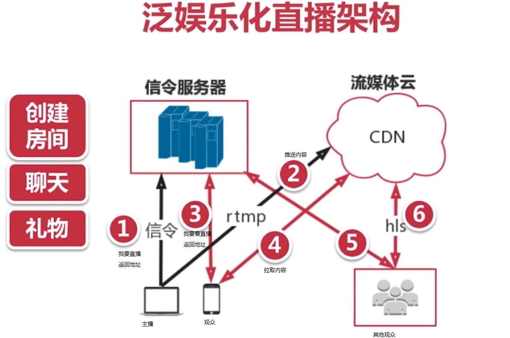
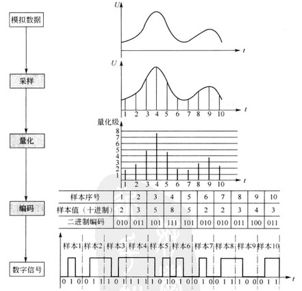
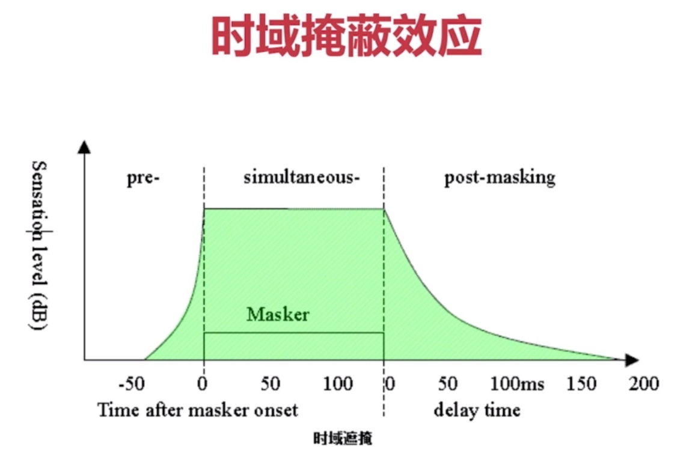
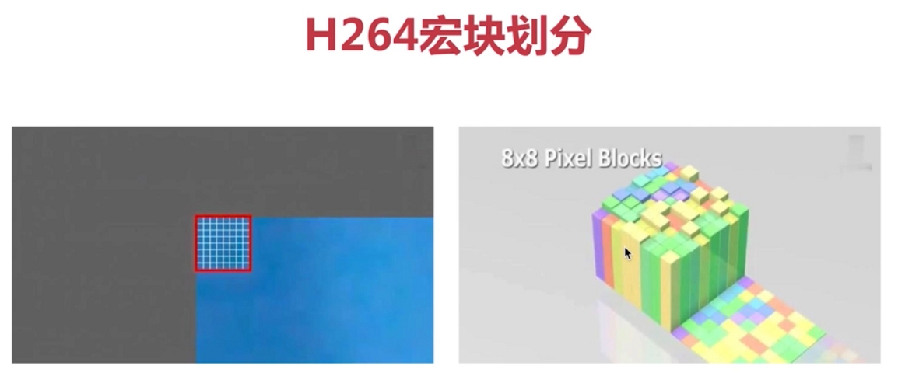

# 移动端音视频入门

## 1 直播架构与CDN网络

### 直播架构

泛娱乐化直播：花椒、映客、斗鱼、熊猫TV等娱乐直播，

实时互动直播：因视频会议、教育等，比如思科、全时、声网。

### CDN 网络

- 解决用户访问网络资源慢的问题。
- 为什么慢？
  - 链路太长，线路可能不稳定。

CDN 网络构成

- 边缘节点：用户从边缘节点上获取数据。
- 二级（主干）节点：用于缓存，减轻源节点压力。
- 原站：CP（内容提供商）将内容放到原站。

### 搭建简单直播流媒体系统

音视频行业最重要的两个库

- FFMPEG：视频编辑、格式转换等。
- WEBRTC

常用工具

- ffplay
- flashplayer：<http://bbs.chinaffmpeg.com/1.swf>

步骤：

- 直播流媒体服务器
- 编译并安装 Nginx 服务
- 配置 RTMP 服务并启动 Nginx 服务

## 2 音频入门

声音三要素

- 音调：音频，男->女->儿童
- 音量：震动的幅度
- 音色（音品）：它与材质有关，本质是谐波

心理声学

- 人类听觉范围：20Hz-20000Hz
- 人类发生范围：85Hz-1100Hz
- 狗听觉范围：15Hz-50000Hz
- 狗发声范围：452Hz-1800Hz

### 音频的量化与编码

模拟信号-->数字信号

基本概念：

- 采样大小：一个采样用多少 bit 存储，常用的是 16bit
- 采样率：采样频率 8K、16K、32K、44.1K，48K
- 声道数：单声道、双声道、多声道
- 码率计算：要算一个音频流的码率->`采样率 * 采样大小 * 声道数`

## 音频压缩技术

- 消除冗余数据（有损压缩技术）
- 哈夫曼无损编码

消除冗余数据

- 压缩的主要方法是去除采集到的音频冗余信息，所谓冗余信息包括人耳听觉范围外的音频信号以及被掩蔽掉的音频信号
- 信号的掩蔽可以分为频域掩蔽合时域掩蔽

频域掩蔽：

时域掩蔽：

音频编码过程：

### 音频编解码器选型

- 常见的音频编码包括：OPUS、AAC、Vorbis、Speex、iLBC、AMR、G.711 等
- RTMP 不支持 OPUS，娱乐直播一般使用 AAC。
- 固话使用 G.711。
- 评测结果：OPUS > AAC > Vorbis

### AAC介绍

AAC -> Advanced Audio COding

- 为什么选择AAC：
  - 应用范围广，直播系统 99% 使用 AAC
  - RTMP 不支持 OPUS
  - 效果好
- AAC产生的目的：用于取代 MP3
- MPEG-4 标准出现后，AAC 加入了 SBR 技术合 PS 技术。
- AAC 包括那些规格：`AAC LC`、`AAC HE V1`、`AAC HE V2`。

AAC 规格描述：

- AAC LC：Low Complexit 低复杂度，码流 128K。
- AAC HE：AAC LC + SBR（Spectral Band Replication）
- AAC HE V2：AAC LC + SBR + PS（Parametric Stereo）

AAC 格式：

- ADIF（Audio Data Interchange Format）只能从开头开始解码，常用在磁盘文件中。
- ADTS（Audio Data Transport Stream）每一帧都有一个同步字，可以在低频流的任何位置开始解码，类似于数据流格式。

AAC 编解码库：

- Libfdk_AAC(最好)
- ffmpeg AAC
- libfaac
- libvo_aacenc
