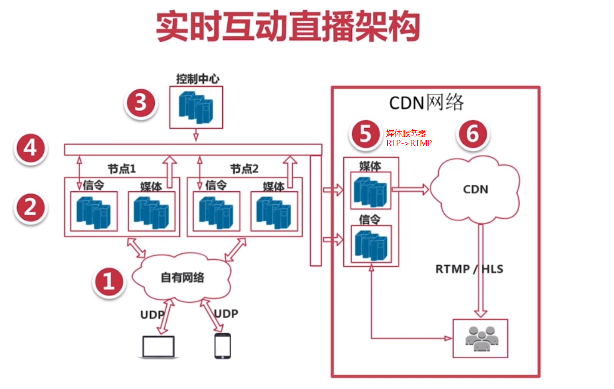
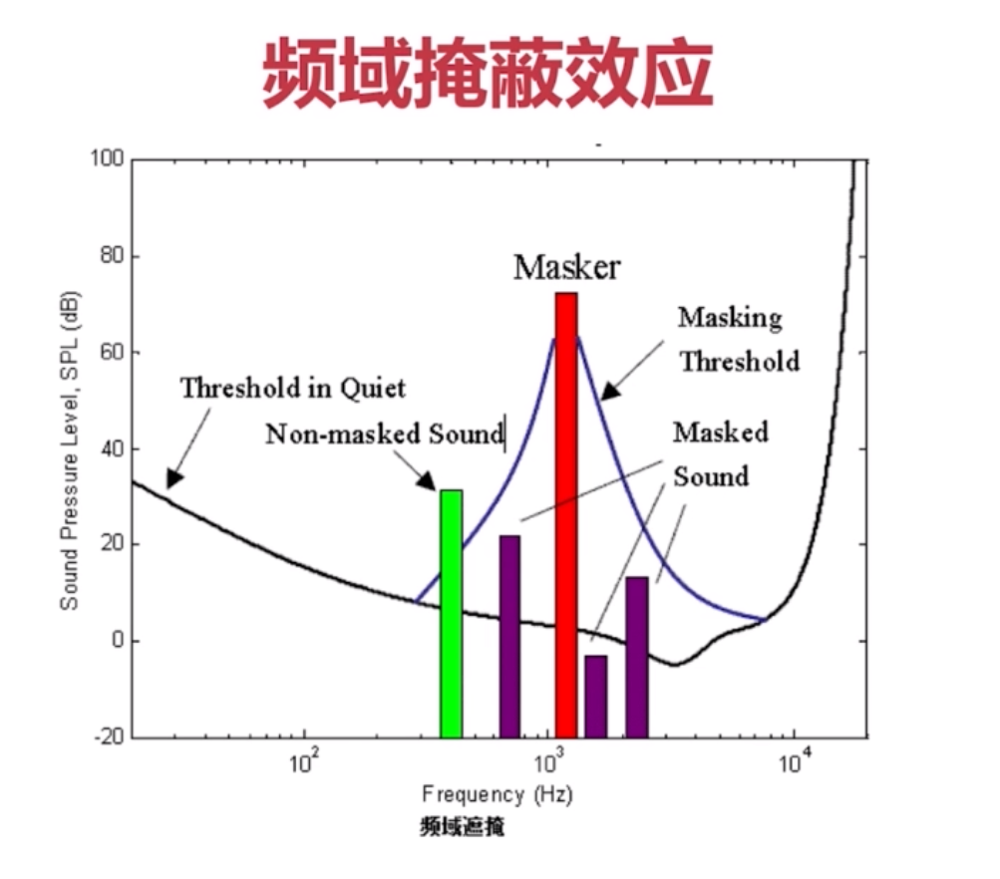
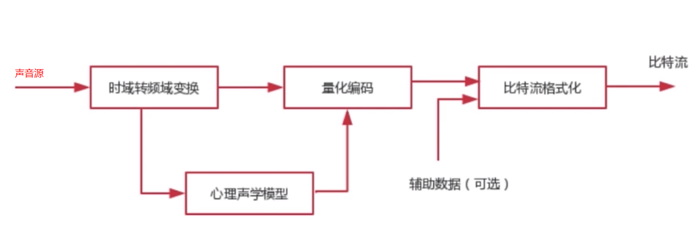
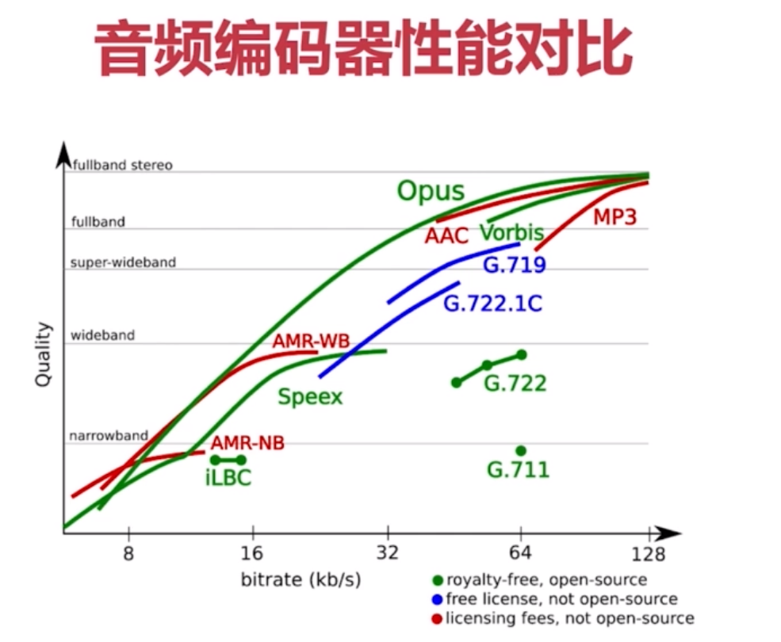

# 移动端音视频入门

## 1 直播架构与CDN网络

### 1.1 直播架构

泛娱乐化直播：花椒、映客、斗鱼、熊猫TV等娱乐直播，

实时互动直播：因视频会议、教育等，比如思科、全时、声网。

### 1.2 CDN 网络

- 解决用户访问网络资源慢的问题。
- 为什么慢？
  - 链路太长，线路可能不稳定。

CDN 网络构成

- 边缘节点：用户从边缘节点上获取数据。
- 二级（主干）节点：用于缓存，减轻源节点压力。
- 原站：CP（内容提供商）将内容放到原站。

### 1.3 搭建简单直播流媒体系统

音视频行业最重要的两个库

- FFMPEG：视频编辑、格式转换等。
- WEBRTC

常用工具

- ffplay
- flashplayer：<http://bbs.chinaffmpeg.com/1.swf>

步骤：

- 直播流媒体服务器
- 编译并安装 Nginx 服务
- 配置 RTMP 服务并启动 Nginx 服务

## 2 音频入门

声音三要素

- 音调：音频，男->女->儿童
- 音量：震动的幅度
- 音色（音品）：它与材质有关，本质是谐波

心理声学

- 人类听觉范围：20Hz-20000Hz
- 人类发生范围：85Hz-1100Hz
- 狗听觉范围：15Hz-50000Hz
- 狗发声范围：452Hz-1800Hz

### 2.1 音频的量化与编码

模拟信号-->数字信号

基本概念：

- 采样大小：一个采样用多少 bit 存储，常用的是 16bit
- 采样率：采样频率 8K、16K、32K、44.1K，48K
- 声道数：单声道、双声道、多声道
- 码率计算：要算一个音频流的码率->`采样率 * 采样大小 * 声道数`

### 2.2 音频压缩技术

- 消除冗余数据（有损压缩技术）
- 哈夫曼无损编码

消除冗余数据

- 压缩的主要方法是去除采集到的音频冗余信息，所谓冗余信息包括人耳听觉范围外的音频信号以及被掩蔽掉的音频信号
- 信号的掩蔽可以分为频域掩蔽合时域掩蔽

频域掩蔽：

时域掩蔽：

音频编码过程：

### 2.3 音频编解码器选型

- 常见的音频编码包括：OPUS、AAC、Vorbis、Speex、iLBC、AMR、G.711 等
- RTMP 不支持 OPUS，娱乐直播一般使用 AAC。
- 固话使用 G.711。
- 评测结果：OPUS > AAC > Vorbis

### 2.4 AAC介绍

AAC -> Advanced Audio COding

- 为什么选择AAC：
  - 应用范围广，直播系统 99% 使用 AAC
  - RTMP 不支持 OPUS
  - 效果好
- AAC产生的目的：用于取代 MP3
- MPEG-4 标准出现后，AAC 加入了 SBR 技术合 PS 技术。
- AAC 包括那些规格：`AAC LC`、`AAC HE V1`、`AAC HE V2`。

AAC 规格描述：

- AAC LC：Low Complexit 低复杂度，码流 128K。
- AAC HE：AAC LC + SBR（Spectral Band Replication）
- AAC HE V2：AAC LC + SBR + PS（Parametric Stereo）

AAC 格式：

- ADIF（Audio Data Interchange Format）只能从开头开始解码，常用在磁盘文件中。
- ADTS（Audio Data Transport Stream）每一帧都有一个同步字，可以在低频流的任何位置开始解码，类似于数据流格式。

AAC 编解码库：

- Libfdk_AAC(最好)
- ffmpeg AAC
- libfaac
- libvo_aacenc

## 3 视频基础知识

### 3.1 H264 基本概念

- I帧：关键帧，采用帧内压缩技术。
- P帧：向前参考帧，压缩时只参考前一帧，属于帧间压缩技术。
- B帧：双向参考帧，压缩时既参考前一帧也参考后一帧，采用帧间压缩技术，对网络效率要求高。

#### GOF：Group Of Frame

GOF：即一组帧。

#### SPS 与 PPS

- SPS：Sequence Parameter Set，序列参数帧，存放帧数，参考帧数目、解码图形尺寸、帧场编码模式选择标识等。
- PPS：Picture Parameter Set，图形参数集，存放熵编码模式选择标识、片组数目、初始量化参数和去方法块滤波系数调整标识等。

每个 GOF 之前，会有 SPS/PPS 信息，否则无法解码。SPS 与 PPS 归于 I 帧。

#### 视频花屏/卡顿原因

- 如果 GOF 分组中的 P 帧丢失会造成解码端的图形发生错误。
- 为了避免花屏问题的发生，一般如果发现 P 帧丢失或者 I 帧丢失，就不显示 GOF 内所有的帧，直到下一个 I 帧来后重新刷新图像。

#### 视频编码器

- x264/x265
- openH263 支持 SVC（视频分层传输），移动端很多硬件不支持
- vp8/vp9
  
### 3.2 H264 宏块的划分与帧分组

#### H264 压缩技术

- 帧内预测压缩：解决的是空域数据冗余问题
- 帧间预测压缩：解决的是时域数据冗余问题
- 整数离散余弦变换（DCT）
- CABAC 压缩

#### 分块与分组

- 宏块(Macro Block)的划分
- 子块划分
- 帧分组

### 3.3 H264 结构与码流

#### H264 编码分层

- NAL 层：Network Abstraction Layer，视频数据网络抽象层，用于网络传输。
- VCL 层：Video Coding Layer，视频数据编码层。

#### H264 码流概念

- SODB：String Of Data Bits，原始数据比特流，长度不一定是 8 的整数倍，有 VLC 产生。
- RBSP：Raw Byte Sequence Payload，SODB + trailing bits, 算法是在 SODB 最后一位补 1，不按字节对齐则补 0。
- EBSP：Encapsulate Byte Sequence Payload
- NALU：NAL Header(1B) + EBSP

### 3.4 YUV

图像的存储格式：RGB，YUV。

- RGB：PC/手机 采用的图形格式。
- YUV：电视系统采用的一种演示编码方法，为了兼容电视系统视频都采用 YUV 格式。
  - Y 明亮度。
  - UV 标识色度。

常见 YUV 格式：

- YUV 4:2:0
- YUV 4:2:2
- YUV 4:4:4

## 4 总结

音视频应该掌握什么技术

- 音视频采集与编码
- 音视频硬编码硬解码
- FFMPEG，用于视频处理
- 视频渲染与OpenGL
- x264 优化
- 交叉编译与优化
- WebRTC
- 音视频处理架构
- 网络传输
