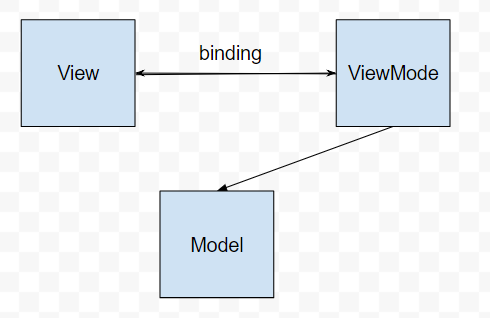
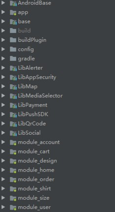

---
#  1 Presentation 层基础架构

---
## 1.1 UI 架构

### 单Activity+ 多Fragment

一个应用可以分为众多模块，模块间通过通过接口或者路径架构进行依赖。单独模块使用**Activity+ 多Fragment**架构，**Activity仅仅作为容器**，它管理多个Fragment之间的交互，Fragment作为具体的View实现，但是需要谨慎处理 Fragment 的生命周期。防止内存泄露、状态丢失等问题的发生。

#### 为什么使用 Fragment

Activity的使用局限：不能将多个Activity活动界面放在屏幕上一并显示。因此创建了Fragment来弥补Activity的局限。Fragment可以像Activity一样响应Back键等类似Activity的功能。

- Activity 是重量级的，IPC级别的调度
- Fragment 是轻量级的，并且 Fragment 支持回退栈
- Fragment 更加灵活，Fragment 之间的交互更加方便和高效
- 多个 Fragment 之间的交互都在同一个 Activity 中，从而避免 Activity 的内存回收引发的相关问题
- Fragment 的可移植性更强，Activity 直接拿来用就可以
- 全屏的 DialogFragment 可以用来实现浮动层级视图，而不需要注册 Activity，不需要定义容器 Id，仅仅 show 就可以
- 如果针对 Fragment 做了封装，那么很大程序上没有必要对 Activity 做封装了，因为 Activity 中直接可以用封装好的 Fragment
- Fragment 的特点是其生命周期跟随其宿主的生命周期，针对这一点可以使用没有 UI 的 Fragment 来分发宿主的声明周期事件到其他组件(比如MVP 中的 Presenter)
- 随着 support 库不断的升级迭代，现在 Fragment 非常成熟
- Android jetpack 架构组建推荐并完美支持多 Fragment 模块架构

---
### 存在的问题与解决方案

#### Activity与Fragment如何通讯？

常见的做法是 Activity 与 Fragment 使用接口通讯，在 Activity 中可以直接调度具体的 Fragment，而 Fragment 不应该依赖具体的 Activity，所以 Fragment 中应该定义交互接口由 Activity 来提供实现。

#### 模块内的各个 Fragment 如何跳转？

其实这也是 Fragment 与 Activity 的通讯问题，比如从一个列表Fragment调整到详情Fragment，常用的做法是通过Fragment调用Activity来显示详情的Fragment，这就需要定义接口了，但是当一个模块内的Fragment非常多交互比较复杂时会造成接口泛滥的情况，这时可是定义模块内全局的Navigator类，Fragment可以被注入Navigator，然后通过调用Navigator跳转到具体的Fragment界面:

```
public class NavigationController {
    private final int containerId;
    private final FragmentManager fragmentManager;

    @Inject
    public NavigationController(MainActivity mainActivity) {
    }

    public void navigateToSearch() {
    }

    public void navigateToRepo(String owner, String name) {
    }

    public void navigateToUser(String login) {
    }
}
```

另外，Android JectPack 架构库中提供了 [Navigation](https://developer.android.com/topic/libraries/architecture/navigation/) 类库，可以很方便的处理 Fragment 之间的跳转。


#### 单个模块内多个Fragment复杂的数据传递

1. 通过Activity传递对应数据的Id，然后通过M层获取具体数据，**弊端是需要定义各种借口**。
2. 如果模块内 Fragment 之间需要进行大量复杂数据的传递，可以在模块内定义全局 DataHolder，然后所有的 Fragment 都通过 DataHolder 来获取初始数据。
3. Android JectPack 架构库中提供了 ViewModel 类库，利用它可在通过单个 Activity 在多个 Fragment之间共享数据，这样就不需要传递数据了。

#### 避免错误操作导致Fragment的视图重叠

这其实是非常基础的问题，Fragment 是依附于 Activity 的，与此同时，在类似因为配置改变导致的 Activity 重启时，Activity 会自动帮助我们恢复 Fragment 实例。所以在 Fragment 的创建之前，有必要判断 Activity 是否已经帮助我们恢复了 Fragment。否则可以导致的问题是，创建了多余的 Fragment 对象，导致界面重叠，等等问题。Activity 自动恢复 Fragment 实例的场景

*   因为配置改变导致的 Activity 重启时
*   发生奔溃，导致当前界面重启
*   调用 Activity.recreate() 方法时
*   当因为内存不足被系统暂时回收的 Activity 重新回到栈顶时

---
### 灵活的DialogFragment使用

DialogFragment 的使用可以非常灵活，它即可以作为 Dialog show 处理，也可以作为普通的 Fragment 使用，很多情况下使用全屏的 DialogFragment 完全可以展示一些简单界面的展示，而不必大动干戈的创建 Activity。

---
### View 也可作为单独组件

开发过程中，发现某些 UI组件在各个模块中都是通用的，并且其还带有一定的业务性，可以考虑将其封装为完整的组件。其他模块直接拿来用即可。


---
## 1.2 MVX

MVC、MVP、MVVM 都是为了**解决图形界面应用程序复杂性管理问**题而产生的应用架构模式。它们都把对模块内不同的类根据职责进行了分层，为什么要划分层次呢？

*   因为 Activity/Fragment 太复杂了，什么逻辑都写在一个类中，久而久之自己都很难理清里面的逻辑，更不要说未来可能的接手人
*   类越复杂，也难从整体上考虑类的设计，顾此失彼，容易产生 bug
*   复杂的东西就应该分层(比如TCP/IP的五层模型)，层层调度，职责清晰，条理清晰，维护成本大大降低，减少 bug 隐患

### 1.2.1 MVC

其实 Android 应用层本身就有 MVC 架构的体现，可以认为早期的 app 架构中，xml 是作为 view 的、Activity 作为 Controller、然后由开发者自己实现 Model 层，但是 xml 布局所用提供的 UI交互能力实在有限，Activity 中难免要处理各种 UI 交互，同时又要负责调用 Model，久而久之就造成了 Activity 的臃肿不堪。

---
### 1.2.2 MVP


#### 规范

- Presenter 与 View 的方法命名一定要规范**统一**
- Presenter 负责数据的转换 `DTO->VO`，业务数据的组装
- V  和 M 不存在相互的感知，也就是不直接交互，P 作为 M 和 V 交互的桥梁
- Model 和 View 应该是被动的，而 Presener 是主动的，数据由 Presenter 主动获取
- View 的逻辑应该尽可能的简单，只应该有视图状态。当事件发生时，调用 Presenter 来处理，关于参数的传递，可以让Presenter 调用 View 的方法来获取(适用于固定的参数)。也可以由 View 直接传递给 Presenter (适用于动态参数)
- MVP 相互持有的都是对方的接口抽象，而不是具体实现

#### 实践

1. 一些情况下 UI 层并不适合直接使用 Moudle 层的数据模型，考虑使用 VO
2. View层与Presenter层的交互接口定义在合约(Contract)类中，除公用的 Presenter 外，View 与 Presenter没有必要分包放置，Presenter 本就只是抽离 App 的视图交互逻辑。
3. 应当遵守 一个Fragment对应一个视图，一个视图对应一个Presenter(当然这个P是抽象的，也就是可以有很多具体的实现)，一个复杂界面可以由多个 Fragment 和 Presenter 组成。

---
### 1.2.3 MVVM



使用 MVVM 最好有框架的支持，由于数据与 UI 是双向绑定的，所以显然相互之间是相互订阅的模式，使用`RxJava`或者 Google官方的 `Databinding` 库都是可以的，需要说明的是 **所谓的某某框架(比如databinding)** 只是用于实现 MVVM 的一个框架，其本身并不代表 MVVM。两者不能混为一谈。

#### 使用 Databinding

`Databinding`库已经趋于成熟，也比较完善，在简单的项目中使用Databinding是不错的选择。下面是一些总结：

- layout：现在 layout 不再是单纯的布局，而是添加了与 viewmodle 数据与行为绑定的逻辑。
- ViewModel 提供可以绑定的数据和相关操作数据的行为，并且还负责从 Repository 中获取数据。
- View 负责展示UI，View 需要持有 ViewModel 的引用，毕竟 layout 的能力有限，有些行为还是需要通过代码实现。
- BindingAdapter：通过 BindingAdapter，可以让View的各种属性或者行为直接在layout中与ViewModle进行绑定。
- 在实践中发现，当项目较为复杂（比如使用的APT插件较多、进行了组件化拆分），`databinding`在打包过程中总是有各种问题，**所以大型项目在使用之前要考虑清楚**。

#### MVVM 的优势

MVP 中的 Presenter 的弊端 ，P 要做的事太多，不仅要从下层获取数据，还要控制 UI 的展示，何不让 View 自己做哪些事呢？在 ViewModel 中，它只负责处理数据，向 View 提供可观察的数据，View 通过数据的变化来进行展示。

####  实践总结

- MVVM 的重点在于 V 如何与 M 达成绑定，而绑定关系有：
  - 单向绑定。
  - 双向绑定。
- V 中始终是持有 VM 的引用的，所以，V可以直接向VM发送命令，这也可以理解为V的行为绑定到了VM，或者VM可以提供一个命令或者数据接收者由V来调用，方式总结如下：
  - V直接发送命令或数据给VM
  - V通过VM提供的接收者间接的发送UI层的命令或数据
- 使用 Kotlin 的 `Delegates.observable()` 代理属性可以有效的监听属性的修改
- VM如果将数据绑定到V呢？首先VM并不持有V的应用，它只能修改数据，而数据被修改之后自动触发V层响应，方式有：
  - 使用RxJava由VM提供各种数据的Observable(获取其他数据源)
  - 由VM提供对应的接口，然后V负责实现，接口由框架或V负责注入。VM操作通过接口间接的绑定数据或状态到V层
  - 使用 LiveData
- 使用数据驱动设计总是一种不错的选择。
- **使用 Google 官方 JectPack 架构组件，可以大大简化架构设计，并且完美支持 MVVM架构设计**

---
## 1.3 Data 层

1. Data层是主要的业务逻辑实现，包括数据的存储和获取
2. M和PV对应关系，有时候某个模块的Model实现需要被不同模块的Presenter调用。这里有两种方式：
 1. M和PV绑定在一起，而需要调用其他模块数据时，由绑定的M进行封装
 2. P调用多个M实现业务调度，M不应该和PV绑定在一起
3. Data业务的颗粒度根据App功能模块进行划分，各个部分的业务是实现面向UI层，可以服务于任意的UI功能模块。

### 数据模型划分

`DTO = Data Transfer Object `数据传输类，接口数据模型，`VO = Value Object`服务于UI，用于视图数据显示，Model应该转换成VO在UI中展示，而UI层不应该直接使用Model层的数据模型，一个VO可以只是PO的部分，也可以是多个PO构成，同样也可以等同于一个PO，Vo的实现方式：

 - 使用转换器
 - 构造方法中转换
 - 实现接口成 VO

`PO = Persisent Object(持久对象))`PO则是向数据库中添加新数据时创建，删除数据库中数据时削除的。并且它只能存活在一个数据库连接中，断开连接即被销毁。一张表对映一个PO，但是在客户端中，数据都是来自网络，那么如果网络数据可以直接存储，那么PO就可是直接使用Model，否则应该再转换层合适存储的PO。

真实开发过程中存在的几种数据模型与命名推荐：

- Model：DTO，服务器传递过来的数据
- Request：向服务器请求的数据
- Entity：数据库实体
- VO：视图对象，服务于UI
- Info：组件(Activity)间界面间传递信息

>具体参考[领域驱动设计系列文章（2）——浅析VO、DTO、DO、PO的概念、区别和用处](http://www.blogjava.net/johnnylzb/archive/2010/05/27/321968.html)

###  Model 层如何设计统一的异常机制

RxJava可以很优雅的处理异步交互与数据流的变换，而Model中的大部分操作都是异步的，使用RxJava应该是不错的选择。

使用RxJava可以简化各种异步操作，而在RxJava的设计中，订阅者会收到成功或者失败的事件，这时候已经不再需要使用接口设置异步回调了，因为RxJava本身已经具备了这样的功能，如果在使用RxJava的同时再加上接口实现异步回调，无异于画蛇添足。

在RxJava的约定中，对于一个事件流，订阅者始终会收到完成或者错误的通知，且这两个通知是互斥的，onCompleted表示事件正常结束，onError表示事件在传递的过程中发生了错误。而Mode层可以把诸如：**网络错误、服务器错误、客户端错误**等分类划分为各种异常，以异常机制通知观察者事件的错误以及错误类型与信息。

在《EffectiveJava》中有关于对异常的使用指导：异常只用于异常的情况，他们永远不应该用于正常的流程控制，异常是为了在异常的情况下使用而设计的。

异常应该告诉我们：

*   什么出了错?
*   在哪出的错?
*   为什么出错?

而在诸如：**网络错误、服务器错误、客户端错误**等情况下定义异常是符合这种指导原则的，这些情况本来就是不正常的。那么应该如何定义异常呢？

- 网络异常：一般情况下业务操作都需要有网络访问，网络是不稳定的，网络异常情况可以归为一类
- 服务器异常：服务器可能存在一些未知的bug，当调用某个api是就可能造成服务器异常，导致返回空数据等
- 本地异常：如何网络权限，本地存储读写权限等异常
- 业务异常：调用某一个API返回结果，但是业务流程上是失败的，比如密码错误、支付失败等，可以根据各模块业务定义业务相关异常和全局业务异常。


---
# 2 基础类库抽取

### AndroidBase 基础库

每个项目应该都有一个最顶层的 Android 基类架构库，作为一个 Module 而独立存在，其不依赖于其他 Module。也不包含具体的业务，而是提供高可扩展低侵入性的功能：

- Activity基类：公共行为封装
- Fragment基类：公共行为封装
 - 显示通用的LoadingDialog和Message
 - 状态布局的切换(Content、Error、Loading、Empty)，同时支持个性化配置
 - List界面的行为封装：Refresh和LoadMore
- Adapter封装
- 通用的工具类集合
- 权限申请适配
- Log库(Timber，Hugo)
- 图片加载框架(Glide)
- 网络状态的监控
- App生命周期的监控
- 缓存方案：提供Key Value级别的基础缓存实现

如果 base 模块封装不完善，各个业务模块将没有直接可以拿来用的基础类库。

---
### 基础组件的抽取

对于通用的基础组建，应该进行抽取，提供统一的调用入口，方便其他各个业务模块(或是业务组件)的调用。

组件库功能|组件库名称|
---|---
常用的UI组件库(下拉刷新、加载更多、状态切换、**轮播图**、图片缩放功能(研究Photo源码))| LibWidget
**拍照功能**          | LibCamera
选择(图片、视屏文件)、裁剪图片、压缩图片、          | LibMediaSelector
**下载库**          | Downloader
第三方分享登录        |  LibSocial
**地图**         |  LibMap
二维码生成与扫描   |  LibQrCode
支付封装      | LibPayment
**视屏播放**     | LibPlayer
**App升级更新库**   | LibUpdate

**各个独立的模块中的资源文件命名时，必须加上自己的前缀，以防止资源冲突**



---
# 3 使用第三方库

任何大型项目肯定都集成了许多优秀的轮子，如何利用好这些强大的框架搭建一个兼具稳定性、可扩展性的架构？首选需要对我们使用的框架有一定程度的理解。比如：

- RxJava
- OkHttp
- Retrofit
- Dagger2
- AspectJ

---
## 使用 Dagger2

类似于 Spring 容器，Dagger2 提供项目级的依赖注入，解耦神器：


---
## RxJava

RxJava 与 Presenter

在Activity和Fragment中有RxLifecycle可以很好的管理RxJava的订阅与反订阅，那么如何在Presenter中也使用RxLifecycler呢？

- 利用registerActivityLifecycleCallbacks监听所有的Activity的生命周期回调、使用FragmentManager的registerFragmentLifecycleCallbacks监听所有Fragment生命周期回调(获取利用Fragment插桩)。这样连RxLifecycle都可以不用了。
- 考虑把Activity和Fragment的LifecycleProvider注入给Presenter层。但是这样就Presenter则持有了View层的引用
- 使用Delegate，使用一个代理把Activity和Fragment的生命周期事件传递给Presenter层。Presenter层利用这些实现一个LifecycleProvider


---
# 4 编程范式与规范

- 对象对象编程
- 数据驱动编程
- 函数式思维
- 响应式编程
- 使用编译时(APT)和运行时注解(Reflect)
- 面向切面编程(AOP)

---
#  5 总结

1. 对于Activity/Fragmeng等基类的封装不宜复杂，能组件化的就组件化，不要什么都往基类里面写，并不是所有的子类都用得到(抽象是对所有子类共同拥有的属性与行为的抽象)
2. 做好Adapter封装，很多代码都是重复的，对于复杂的列表，Adapter配合ViewHoder也是一个简单的分层，以Adapter作为逻辑控制层，而把ViewHoder作为UI控制层可以较好的解耦
3. 其次当一个Item过于复杂的时候，可以利用ListView或RecyclerView的MultiTypeItem的特性，对复杂的Item进行拆分，简单的Item组合成复杂的Item，定义好数据结构即可。
4. 出于内存和apk瘦身的考虑，应该禁用帧动画
5. 如果一个对象被经常用到，比如Android的Message，可以可以考虑实现它的回收与复用
6. model层不仅仅就是数据模型这么简单，它还负责业务逻辑的实现、数据的获取与存储等，model被上层依赖，不要把业务上的数据处理丢给上层处理，比如说展示层根本就不关心code和message，它只关心成功和失败，有没有数据。这样做的好处：防止业务延伸到上层，导致在业务更改的时候，也会影响到上层，比如一个model可能被多次用到，就没有必要再每个用到的地方处理一次code和message。
7. 数据模型定义，不要在展示层直接使用model层的数据模型，展示层应该有适合自己的数据模型，好处在于
 - 过滤不需要的数据
 - 组合多个接口的数据
 - 防止接口数据变更造成的大范围影响
 - 铺平数据
8. 关于工具类
 - 收集整理自己的工具类，不在重复的代码上花费过多的时间
 - 工具类应该分与业务无关的工具类和业务类型工具类，业务类型工具类只服务与特定的业务，所以不应该和基础工具类放在一起。
9. Sp存储不同模块的必须用不同的文件名称，所以SP工具类不应该写死文件名。在业务中尽量不要直接使用sp存储，最好每个模块抽取单独的sp业务赋值类去操作Sp工具类存储，便于代码阅读与清晰，不要什么东西都放在同一个sp文件中，一个是key-value多了读取效率不高，还有就是在删除缓存或者设置的时候更加方便。
10. 面多类似Setting界面的多类型多Item不建议使用xml显示，这样实现的布局难以维护，可以使用RecyclerView的多Item特性实现，以数据为驱动，这样灵活而且易于扩展。
11. Activity+多Fragment架构构件模块时，如果多个界面之间都需要频繁的传递大量的数据。且随着业务发展，这些数据的很可能变化，可以使用下面两种方式实现，以避免多个Fragment之间大量数据传递造成的接口泛滥：
 1. 单个模块内使用全局的数据容器(DataCenter)。适用于VO较多且复杂的情况
 2. 多个界面之间只需要传递Id。然后根据id想model层获取数据。
12. SupportLibrary种有很多的类库用于处理API版本的兼容处理
13. 选择合适的targetSDKVersion
14. 给DTO或者VO命名时，尽量保持根服务器返回的字段使用相同单词，比如服务器返回product，而你在本地使用Goods，虽然都有产品、商品的意思，久而久之就会变得混乱。
15. 简单的应用可能不需要使用数据库，不要为了数据库而使用数据库。
16. 最好定制一个中英文对照表，有时候一个中文可能有好几个单词可以解释，如果不同意的话，这个模块你用这个单词，那么又用了相近意思的单词，或者多人开发使用了相近意思的单词，久而久之，代码命名也会显得很不规范。
17. 在Splash中初始化App的状态，然后进入App，从而避免状态在主线程中加载
```java
    Observable obserInitSDK=Observable.create((context)->{initSDK(context)}).subscribeOn(Schedulers.newThread())

    Observable obserInitDB=Observable.create((context)->{initDatabase(context)}).subscribeOn(Schedulers.newThread())

    Observable obserLogin=Observable.create((context)->{login(getUserId(context))})
                                  .map((isLogin)->{returnContext()})
                                  .subscribeOn(Schedulers.newThread())

    Observable observable = Observable.merge(obserInitSDK,obserInitDB,obserLogin)

    observable.subscribe(()->{startActivity()})
```
18. 不要多度使用SharedPreference：
 - 不要存放大的key和value，会引起界面卡、频繁GC、占用内存等等。
 - 毫不相关的配置项不要存储在一起了！文件越大读取越慢。
 - 读取频繁的key和不易变动的key尽量不要放在一起，影响速度。
 - 尽量批量修改一次提交！
 - 不要使用SP来进行跨进程通信