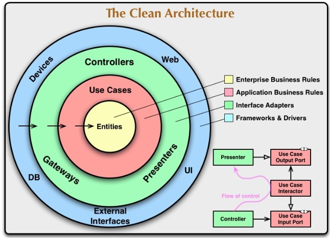

# CleanArchitecture

Clean架构由uncle-bob的[这篇文章](https://8thlight.com/blog/uncle-bob/2012/08/13/the-clean-architecture.html)提出，文章主要讲解如何架构一个高内聚，低耦合的应用。下面是基于[android10](https://github.com/android10/Android-CleanArchitecture)的实践进行分析。

架构图：



---
## 1 Presenter

Presenter**不应该包含任何Android层的代码**，只能通过接口与View进行交互，这样做的目的是解耦ui层的逻辑层，对于测试而言，就是可以**直接在本地JVM上进行Presenter层的测试**，而不需要在Android设备上进行测试。

---
## 2 Domain

Domain层是纯Java层module，Domain用于定义业务模型、抽象业务行为。

### UseCase

UseCase 表示业务用例，是对任何业务行为的抽象。任何Presenter都持有这个UseCase，UseCase提供`execute(Subscriber subscriber)`和`unsubscribe()`，分别表示业务的执行和取消。

 - UseCase的构造方法为`UseCase(ThreadExecutor threadExecutor, PostExecutionThread postExecutionThread)`
 - UseCase是一个抽象的类，具体的业务类需要实现其`Observable buildUseCaseObservable()`方法。表示根据具体的业务构建一个数据源。
 - UseCase存在的问题，泛型丢失，子类返回的Observable是没有带泛型信息的，所以在execute方法每次都有不安全的类型转换。
 - **一个UseCase仅仅代表一个业务调度**
- PostExecutionThread 表示一个抽象的主线程调度器，需要被注入。
- ThreadExecutor 表示耗时操作的线程调度器。需要被注入。

下面以一个User列表与User详情为例进行讲解：

对于User列表和用户详情分别有两个UseCase，分别是GetUserList和GetUserDetail，他们代表具体的业务用例，而资源从哪里获取呢？Domain采用的是资源模式Repository，所以GetUserList和GetUserDetail的创建还需要依赖UserRepository，GetUserList和GetUserDetail仅仅代表业务用例即一个业务的执行，而具体的数据操作是由资源模式实现的

### UserRepository

UserRepository是对具体User数据操作的抽象接口，其内部只定义了两个方法：

```java
    public interface UserRepository {
      Observable<List<User>> users();
      Observable<User> user(final int userId);
    }
```

分别表示对获取User列表和根据UserId获取User详情，GetUserList和GetUserDetail依赖的是这个接口，并且是通过dagger2继续依赖注入的。

### 异常处理

Domain层定义了一些异常，分别表示网络或者业务相关的异常信息。

### Domain层的测试

采用Junit和Mock进行测试

---
## 3 Data

Data层主要掌管所有业务数据的CRUD，首先数据源分别为网络，磁盘，和内存，

- 网络数据主要就是resetAPI
- 磁盘缓存包括数据库和文件缓存
- 内存数据源就是及时的内存缓存

这些数据源都由具体的Repository管理，上层的数据获者根本不需要知道数据的来源。比如`UserDataRepository`：UserDataRepository实现自Domain层的`UserRepository`，当然也就实现了UserRepository定义的两个方法。UserDataRepository只是一个数据仓库，它并没有直接操作数据，而是调度具体的`userDataStoreFactory`来创建UserDataStore，最终通过UserDataStore来操作数据

UserDataStore是对具体数据操作的抽象，其定义如下：

```java
    public interface UserDataStore {
      Observable<List<UserEntity>> userEntityList();
      Observable<UserEntity> userEntityDetails(final int userId);
    }
```

实现UserDataStore的有两个类，分别代表网络数据和本地磁盘数据：

- DiskUserDataStore
- CloudUserDataStore

userDataStoreFactory通过判断具体的情况（如缓存是否存在，是否过期等）来给UserDataRepository创建具体的UserDataStore实现，从而实现数据的获取与存储。


需要注意的是上述各个类之间关系都是通过接口实现依赖的，然后通过Dagger2注入具体的实现。

---
##  4 数据模型

每一层都有自己的数据模型


- Presentation层的VO：用户UI展示 ，与Domain的数据模型互相转换
- Data层的Entity：用于本地数据的持久化存储，与Domain的数据模型互相转换
- Domain的Model：用于解析网络协议数据。

---
##  5 总结

- Presenter没有保护任何Android的代码，可以直接在JVM上进行测试，提升了效率
- Data主要实现具体的数据存储和获取，所有的依赖都通过Dagger2进行注入，没有任何具体的硬编码，测试可以直接在JVM上进行，Data有自己的持久化数据模型，实现了Domain层的定义的仓库接口
- Domian主要就是定义各种业务中的UseCase实现和Repository，Presenter只持有UseCase接口，并不感知具体的UseCase，更不需要知道Repsitory存在，所有的业务都用过UseCase实现，所以UseCase的execute方法的Subscribe是带泛型的，方便在执行execut方法是定义各种不同的数据类型

**主要的调用逻辑**：

```
                 Presenter
                    |
                 UseCase(Subscribe<T>)
                    GetUserListUseCase实现UseCase
                    |
                UserRepository
                   UserDataRepository实现UserRepository
                    |
                userDataStoreFactory生成UserDataStore
                    |
                UserDataStore
                   DiskUserDataStore实现UserDataStore，返回具体的数据
                   CloudUserDataStore实现UserDataStore，返回具体的数据
```