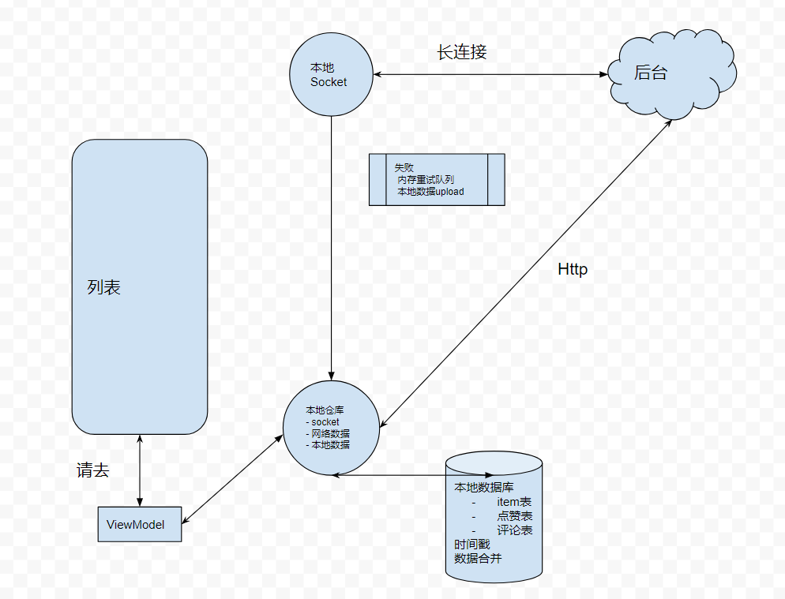

[TOC]

# 列表设计

分页加载列表设计的一些思考

---
## 1 列表加载的各种场景

- 只从数据库分页加载数据
- 从网络分页加载，不使用缓存
- 从网络分页加载，数据 Immutable，使用缓存
- 从网络分页加载，数据 Mutable，使用数据库缓存，(可能数据需要实时的更新)

---
### 1.1 只从数据库分页加载数据

对于这种情况，使用Room和Paging库可以很好的应对

---
### 1.2 从网络分页加载，不使用缓存

如果不使用缓存，**则不存在数据新鲜度问题**，使用 Paging 库或者按照传统的分页方式都可以，对于结果的处理可以使用 DiffUtil。对 DiffUtil 进行封装，在提交数据到 Adapter 时，对于提交者可以做到透明。但是需要注意的是 PagedList Inmutable 的，如果 Item 需要支持 删除、插入等操作，则不适合使用 Paging库了。

---
### 1.3 从网络分页加载，数据 Immutable，使用缓存

- 这种情况很少见，大部分数据都是 Mutable 的，如果数据是 Mutable 的，那么数据来源于网络或者来源于数据库都是一样的，**同样不存在数据新鲜度问题**，这种情况下，可以使用单一数据源模型，从网络加载的数据直接保存到数据库，由数据库统一触发上层进行更新。
- 采用单一数据源，对于上层来说数据源只有一个，不需要关心数据来源于何处，如果使用数据库缓存，那么肯定使用数据库作为上层的单一数据源，**这同时要求数据库API具有被更新时自动触发上层更新的功能**。

#### 如何实施

- 适合使用Paging库 + Room数据库框架。

#### 如何暴露网络状态

参照AAC sample，封装数据实体和网络状态到一个类中，由上层解封装处理：

```
data class Listing<T>(
        val pagedList: LiveData<PagedList<T>>,
        val networkState: LiveData<NetworkState>,
        val refreshState: LiveData<NetworkState>,
        val refresh: () -> Unit,
        val retry: () -> Unit)
```


---
### 1.4 从网络分页加载，数据 Mutable，使用数据库缓存

这种情况相对比较复杂，有以下问题需要考虑

#### 1.4.1 如何设置数据源，是否采用单一数据源？

不适合采用单一数据源，如果使用数据库作为单一数据源，在执行加载更多时比较难以处理。使用Repository模式，由Repository选择对本地数据和网络数据做决策。

#### 1.4.2 首次加载比较好处理？

首次加载要求数据更快的展示到页面上，更少的等待时间。

  - 方案1：先缓存，后判断，再判断是否要从网络加载
  - 方案2：同时从缓存和网络加载，缓存速度快于网络，先展示，然后网络数据回来，与已加载的本地缓存对比，看看是否有更新，有更新则刷新上层UI，同时更新缓存，否则舍弃掉本次数据

#### 1.4.3 加载更多页面时如何处理？

Repository根据当前网络状态和缓存做决策，优先从网络获取数据，网络不行才加载本地数据

#### 1.4.4 如何暴露网络状态

参考上面 Listing 类的设计，Listing封装了请求回来的数据和状态，然后由上层解封装，针对数据和状态进行处理。

#### 1.4.4 实时的更新

采用 Socket 长连接

---
### 1.5 具体的设计

  - 单一数据源
  - 长连接保持新鲜度
  - 先网络后数据库
  - 数据库网络同时加载，先展示数据库后用网络数据刷新
  - update time对比

---
## 2 实际场景分析

### 朋友圈点赞

- 点赞队列
- 网络状态
- 观察者模式

### 朋友圈评论

多表设计，时间戳排序与防止覆盖

### 聊天列表

Socket长连接监听

### 需要铺平的数据条目

采用item token 加载机制。

### 理想的设计


