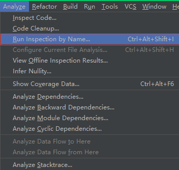
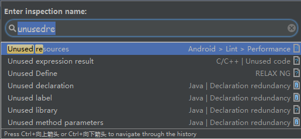

# Lint

---
## 1 AndroidLint

Lint是Android提供的静态代码检测工具，不仅仅包括Java代码，还包括xml等。

在Android的Gradle插件中已经集成了lint代码检测，但是检测结果有点不好阅读，所以推荐使用AndroidStudio的UI工具。

---
## 2 使用AndroidLint


如上图点击OK即可开始Lint检测，上面还可以对检测范围进行设置，这里选择的是Module app，表示只对主项目进行检测。

检测的结果如下图所示：


于是我们可以有针对性的对我们的代码进行优化。

---
## 3 使用lint检测无用的资源





如上图所以，可以选择Lint的任务类型，这里选择的是`Unused resource`

等待分析完成之后，就可以清理哪些无用的资源了。

---
## 4 忽悠Lint警告

有时候某警告可能是不能修复的，希望去掉警告，可以使用注解清理掉警告：

java代码使用`SuppressLint`
```
    @SuppressLint("NewApi")
    @SuppressLint("all")
```
xml代码使用`tools:ignore="all"` 或特定类型的值。
```
    <LinearLayout xmlns:android="http://schemas.android.com/apk/res/android"
                  xmlns:tools="http://schemas.android.com/tools"
                  tools:ignore="all"
                  android:layout_width="match_parent"
                  android:layout_height="match_parent"
                  android:orientation="vertical"
                  android:background="@color/white">
```
