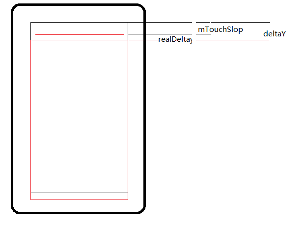

# NestedScrollView 源码分析

---
## 1 onTouchEvent

```java
        public boolean onTouchEvent(MotionEvent ev) {

            initVelocityTrackerIfNotExists();//初始化速度跟踪器
    
            MotionEvent vtev = MotionEvent.obtain(ev);//copy一个MotionEvent
    
            final int actionMasked = MotionEventCompat.getActionMasked(ev);//获取事件类型
    
            if (actionMasked == MotionEvent.ACTION_DOWN) {//重置记录垂直方法上偏移值的变量
                mNestedYOffset = 0;
            }
    
            vtev.offsetLocation(0, mNestedYOffset);//根据之前记录的偏移值，修正位置
    
            switch (actionMasked) {
                case MotionEvent.ACTION_DOWN: {
                    if (getChildCount() == 0) {
                        return false;
                    }
                    if ((mIsBeingDragged = !mScroller.isFinished())) {//如果在fling中，立即要求父view不要拦截事件
                        final ViewParent parent = getParent();
                        if (parent != null) {
                            parent.requestDisallowInterceptTouchEvent(true);
                        }
                    }
    
                    /*
                     * If being flinged and user touches, stop the fling. isFinished
                     * will be false if being flinged.
                     */
                    if (!mScroller.isFinished()) {//停止滑动
                        mScroller.abortAnimation();
                    }
    
                    // Remember where the motion event started
                    //记录事件位置和id
                    mLastMotionY = (int) ev.getY();
                    mActivePointerId = MotionEventCompat.getPointerId(ev, 0);
                    //这里调用了startNestedScroll。
                    startNestedScroll(ViewCompat.SCROLL_AXIS_VERTICAL);
                    break;
                }
                case MotionEvent.ACTION_MOVE://到了滑动事件了
                    //校验触摸的id
                    final int activePointerIndex = MotionEventCompat.findPointerIndex(ev,
                            mActivePointerId);
                    if (activePointerIndex == -1) {
                        Log.e(TAG, "Invalid pointerId=" + mActivePointerId + " in onTouchEvent");
                        break;
                    }
                    
                    final int y = (int) MotionEventCompat.getY(ev, activePointerIndex);
    
                    int deltaY = mLastMotionY - y;//计算增量值
                    //滑动前，先问父view是否需要滑动
                    if (dispatchNestedPreScroll(0, deltaY, mScrollConsumed, mScrollOffset)) {//如果父view有消耗
                        deltaY -= mScrollConsumed[1];//增量值需要减去父view的消耗
                        vtev.offsetLocation(0, mScrollOffset[1]);//调整事件的位置，因为自身可能因为父view的滑动在窗口中发生了偏移，这里这里用的是mScrollOffset
                        mNestedYOffset += mScrollOffset[1];//用mNestedYOffset记录所有的偏移值
                    }
                    if (!mIsBeingDragged && Math.abs(deltaY) > mTouchSlop) {//如果还没有开始处理事件，但是偏移值已经可以触发滑动行为了
                        final ViewParent parent = getParent();
                        if (parent != null) {
                            parent.requestDisallowInterceptTouchEvent(true);
                        }
                        mIsBeingDragged = true;
                        /*减去或加上mTouchSlop，是因为mTouchSlop始终是有一段距离，而在mIsBeingDragged为true时才会更新mLastMotionY和处理滑动，
                        但是这时已经滑动了mTouchSlop大小的距离，如果不减去mTouchSlop的话，可能会有一段跳动。*/
                        if (deltaY > 0) {
                            deltaY -= mTouchSlop;
                        } else {
                            deltaY += mTouchSlop;
                        }
                    }
                    if (mIsBeingDragged) {//开始处理滑动
                        // Scroll to follow the motion event
                        mLastMotionY = y - mScrollOffset[1];//更新mLastMotionY，需要减去此次窗口偏移值
    
                        final int oldY = getScrollY();//记录滑动前的位置
                        final int range = getScrollRange();//获取可以滑动的范围，其实就是获取唯一子view的高度减去自身的高度
                        //开始处理滑动
                        final int overscrollMode = ViewCompat.getOverScrollMode(this);
                        boolean canOverscroll = overscrollMode == ViewCompat.OVER_SCROLL_ALWAYS ||
                                (overscrollMode == ViewCompat.OVER_SCROLL_IF_CONTENT_SCROLLS &&
                                        range > 0);
                        // Calling overScrollByCompat will call onOverScrolled, which
                        // calls onScrollChanged if applicable.
                        if (overScrollByCompat(0, deltaY, 0, getScrollY(), 0, range, 0,
                                0, true) && !hasNestedScrollingParent()) {
                            // Break our velocity if we hit a scroll barrier.
                            mVelocityTracker.clear();
                        }
    
                        //滑动完毕，计算自身滑动消耗值
                        final int scrolledDeltaY = getScrollY() - oldY;
                        final int unconsumedY = deltaY - scrolledDeltaY;//根据之前的deltaY和现在的scrolledDeltaY计算未消耗的距离
                        //滑动完毕后，吧相关参数传给父view
                        if (dispatchNestedScroll(0, scrolledDeltaY, 0, unconsumedY, mScrollOffset)) {
                            mLastMotionY -= mScrollOffset[1];//重新修正事件位置
                            vtev.offsetLocation(0, mScrollOffset[1]);
                            mNestedYOffset += mScrollOffset[1];
    
                        } else if (canOverscroll) {
                            ensureGlows();
                            final int pulledToY = oldY + deltaY;
                            if (pulledToY < 0) {
                                mEdgeGlowTop.onPull((float) deltaY / getHeight(),
                                        MotionEventCompat.getX(ev, activePointerIndex) / getWidth());
                                if (!mEdgeGlowBottom.isFinished()) {
                                    mEdgeGlowBottom.onRelease();
                                }
                            } else if (pulledToY > range) {
                                mEdgeGlowBottom.onPull((float) deltaY / getHeight(),
                                        1.f - MotionEventCompat.getX(ev, activePointerIndex)
                                                / getWidth());
                                if (!mEdgeGlowTop.isFinished()) {
                                    mEdgeGlowTop.onRelease();
                                }
                            }
                            if (mEdgeGlowTop != null
                                    && (!mEdgeGlowTop.isFinished() || !mEdgeGlowBottom.isFinished())) {
                                ViewCompat.postInvalidateOnAnimation(this);
                            }
                        }
                    }
                    break;
                case MotionEvent.ACTION_UP:
                    if (mIsBeingDragged) {
                        final VelocityTracker velocityTracker = mVelocityTracker;
                        velocityTracker.computeCurrentVelocity(1000, mMaximumVelocity);
                        int initialVelocity = (int) VelocityTrackerCompat.getYVelocity(velocityTracker,
                                mActivePointerId);
                        //这里处理了嵌套滑动中的fling
                        if ((Math.abs(initialVelocity) > mMinimumVelocity)) {
                            flingWithNestedDispatch(-initialVelocity);
                        }
    
                        mActivePointerId = INVALID_POINTER;
                        endDrag();
                    }
                    break;
                case MotionEvent.ACTION_CANCEL:
                    if (mIsBeingDragged && getChildCount() > 0) {
                        mActivePointerId = INVALID_POINTER;
                        endDrag();
                    }
                    break;
                case MotionEventCompat.ACTION_POINTER_DOWN: {
                    final int index = MotionEventCompat.getActionIndex(ev);
                    mLastMotionY = (int) MotionEventCompat.getY(ev, index);
                    mActivePointerId = MotionEventCompat.getPointerId(ev, index);
                    break;
                }
                case MotionEventCompat.ACTION_POINTER_UP:
                    onSecondaryPointerUp(ev);
                    mLastMotionY = (int) MotionEventCompat.getY(ev,
                            MotionEventCompat.findPointerIndex(ev, mActivePointerId));
                    break;
            }
    
            if (mVelocityTracker != null) {
                mVelocityTracker.addMovement(vtev);
            }
            vtev.recycle();
            return true;
        }
```

对`deltaY -=或者+= mTouchSlop;`的理解：



