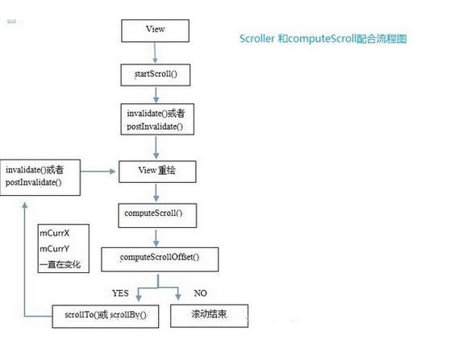

# View实现滑动的方式以及对View内部变量的影响

---
## 1 ScrollTo/ScrollBy

这两个方法移动的是View的content，如果在ViewGroup中移动的是ViewGroup的所有子view。如果在View中使用，那么移动的就是View的内容，类如TextView，content就是它的文本，ImageView，content就是他的drawable

scrollTo/scrollBy方法虽然导致view的内容区域移动，但是一般不会导致子视图的重绘，此时绘制的是View的缓存。

### View的视图移动理解

>手机屏幕是一个中空的盖板，盖板下面是一个巨大的画布，也就是我们需要显示的内容，把这个盖板盖在画布的某一处时，透过中间的矩形，我们看见了手机屏幕上显示的视图，而画布上的其他视图，被盖住了无法看见,在手机屏幕上，我们看不见的视图，不代表它不存在，可能就是被盖住了（在屏幕外面），当调用scrollTo方法时，可以理解为外面的盖板在移动，比如手指在手机屏幕上往下滑动的时候，使用scrollTo/scrollBy方法来处理滑动的话,你滑动的是那个遮罩，如果希望content往下移动，那么遮罩就应该是往上面移动，刚好与手指的滑动方向相反，体现在计算中就是对每次滑动的偏移值取反。

在计算中可以简单的理解为，View的scroll值就是view的边缘与其内容边缘的距离。

### 实现方法

```java
    //记录手指按下的位置
    private int lastX, lastY;
        @Override
        public boolean onTouchEvent(MotionEvent event) {
            int x = (int) event.getX();
            int y = (int) event.getY();
            int action = event.getAction();
            switch (action) {
                case MotionEvent.ACTION_DOWN:
                    lastX = x;
                    lastY = y;
                    break;
                case MotionEvent.ACTION_MOVE:
                    //计算出手指的距离
                    int dx = x - lastX;
                    int dy = y - lastY;
                    //调用scrollBy实现滑动
                    scrollBy(-dx , -dy);
                    break;
                case MotionEvent.ACTION_UP:
                    break;
            }
            lastY = y;
            lastX = x;
            return true;
        }
```

### 对View内部变量的影响

调用 scrollTo/scrollBy 滑动的是View的content，影响的是View的 **mScrollX** 与 **mScrollY**。这时将触发 **onScrollChanged**，在ViewGroup中调用scrollTo/scrollBy，不会对子view的各种参数如：`top,left,x,y` 等造成影响。mScrollX、mScrollY就是 **视图的内容的偏移量，而不是视图相对于其他容器或者视图的偏移量** 。mScrollX的值总是等于View的左边缘与View的内容左边缘的水平方向距离。mScrollY类似。

---
## 2offsetTopAndBottom和offsetLeftAndRight

offsetTopAndBottom 和o ffsetLeftAndRight 是实实在在的改变View在ViewGroup中的位置。

### 实现方式

```java
        private int lastX, lastY;

        @Override
        public boolean onTouchEvent(MotionEvent event) {
            int x = (int) event.getX();
            int y = (int) event.getY();
            int action = event.getAction();
            switch (action) {
                case MotionEvent.ACTION_DOWN:
                    lastX = x;
                    lastY = y;
                    break;
                case MotionEvent.ACTION_MOVE:
                    int dx = x - lastX;
                    int dy = y - lastY;
                    getChildAt(0).offsetTopAndBottom(dy);
                    getChildAt(0).offsetLeftAndRight(dx);
                    break;
                case MotionEvent.ACTION_UP:
                    break;
            }
            lastY = y;
            lastX = x;
            return true;
        }
```

### 对View内部变量的影响

view自身调用了offsetTopAndBottom和offsetLeftAndRight方法时，内部其实是改变View的**top，bottom，left，right**的值，所以包括其x，y都会发生改变


---
## 3，LayoutParams

每一个View都有其LayoutParams对应的LayoutParams，具体的LayoutParams跟它的父布局有关，LayoutParams描述了View一系列信息，保存View的大小，位置等。所以可以通过动态的改变这些数据来达到View的滑动，当然LayoutParams不止可以做这些。

#### 实现方式

```java
        private int lastX, lastY;
    
        @Override
        public boolean onTouchEvent(MotionEvent event) {
            int x = (int) event.getX();
            int y = (int) event.getY();
            int action = event.getAction();
            switch (action) {
                case MotionEvent.ACTION_DOWN:
                    lastX = x;
                    lastY = y;
                    break;
                case MotionEvent.ACTION_MOVE:
                    int dx = x - lastX;
                    int dy = y - lastY;
                    MarginLayoutParams marginLayoutParams = (MarginLayoutParams) getChildAt(0).getLayoutParams();
    
                    marginLayoutParams.leftMargin += dx;
                    marginLayoutParams.topMargin += dy;
    
                    getChildAt(0).setLayoutParams(marginLayoutParams);
    
                    break;
                case MotionEvent.ACTION_UP:
                    break;
            }
            lastY = y;
            lastX = x;
            return true;
        }
```

### 对View内部变量的影响

改变了View的布局参数，肯定其内部的参数也是改变了，同第二种方法

---
## 4 onLayout

在ViewGroup中，通过onLayout来确定来确定子view的位置，所以我们也可以通过反复的调用这个方法来实现子View的滑动

### 实现方式

```java
        private int lastX, lastY;
    
        @Override
        public boolean onTouchEvent(MotionEvent event) {
            int x = (int) event.getX();
            int y = (int) event.getY();
            int action = event.getAction();
            switch (action) {
                case MotionEvent.ACTION_DOWN:
                    lastX = x;
                    lastY = y;
                    break;
                case MotionEvent.ACTION_MOVE:
                    int dx = x - lastX;
                    int dy = y - lastY;
    
                    int l = getChildAt(0).getLeft() + dx;
                    int t = getChildAt(0).getTop() + dy;
                    getChildAt(0).layout(l, t, l + getChildAt(0).getWidth(), t + getChildAt(0).getHeight());
    
                    break;
                case MotionEvent.ACTION_UP:
                    break;
            }
            lastY = y;
            lastX = x;
            return true;
        }
```

### 对View内部变量的影响

改变了View的布局位置，肯定其内部的参数也是改变了

---
## 5 Scroller与OverScroller

OverScroller是对Scroller的功能增强，其是它们只是一个辅助计算的工具，告诉我们在某一时刻View应该在哪一个位置，我们还是要调用**scrollTo**方法来实现滑动

调用过程：

`invalidate()-->onDraw()-->computeScroll()`


具体实现的方式就不贴了

---
## 6 ViewDragHelper
ViewDragHelper位于support v4包中，DrawerLayoou和SlidingPaneLayout就是用ViewDrawHelper实现的，ViewDragHelper的功能非常强大，会在另外的笔记中详细学习，其内部也是使用的offsetTopAndBottom和offsetLeftAndRight方法。

---
## 7 使用动画

使用动画来实现View的滑动，主要是改变View的translationX和translationY,既可以使用传统的动画也可以使用3.0的属性动画，如果需要兼容到3.0一下，考虑使用nineOldAndroid开源项目

- 传统动画只是改变View的影响，View的位置参数并没有改变，包括View的位置参数都没有改变，而使用3.0的属性动画则不会。

- nineOldAndroid本质上还是View的动画

一句简单的代码即可实现View的滑动：

```java
    view.animate().translationX(300).translationY(-300).setDuration(4000).start();
```

### 对View内部变量的影响

对top，bottom，right，left没有影响，会改变x，y，translationX和translationY.

也就是这个公式了：

```java
x = left + translationX
y = top + translationY
```

动画适合做没有交互的View的滑动效果。
