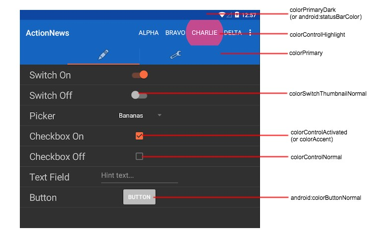
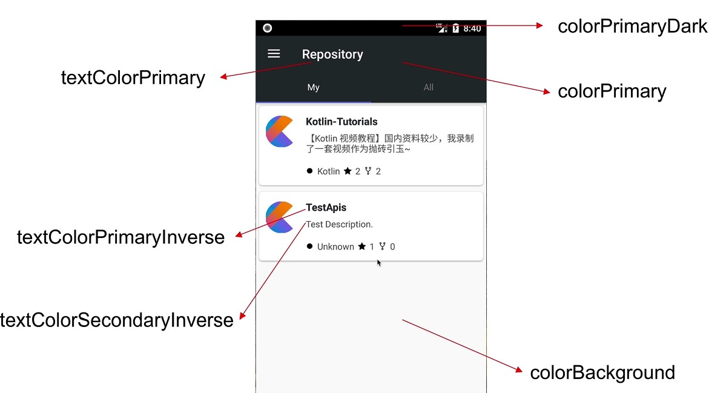

# AppCompat 颜色总结

---
## 1 MaterialDesign 颜色划分






---
## 2 Theme.AppCompat

Theme.AppCompat 在 v7 包中被提供，在 Android5.0 发布之后，用于兼容 MaterialDesign 风格与 5.0 之前的风格，如果我们的 Activity 继承了 AppCompatActivity，那么我们的主题也必须使用 Theme.AppCompat 主体或者它的子主题。

Theme.AppCompat主要包括以下颜色：

- `colorPrimary`：App的主色调，ActionBar默认为此颜色
- `colorPrimaryDark`：主色调偏暗，Lollipop以上默认状态栏背景色。
- `colorAccent`：控件在选中状态或获取焦点状态下使用这个颜色,例如
  - `CheckBox`：checked 状态
  - `RadioButton`：checked 状态
  - `SwitchCompat`：checked 状态
  - `EditText`：获取焦点时的 underline 和 cursor 颜色
  - `TextInputLayout`：悬浮 label 字体颜色
- `android:navigationBarColor`：navigation bar 背景色。Lollipop以上。
- `colorControlNormal`：某些 Views “normal” 状态下的颜色，如：unselected CheckBox 和 RadioButton，失去焦点时的 EditText，Toolbar 溢出按钮颜色，等等。
- `colorControlActivated`：某种程度上，是 colorAccent 的替代者
- `colorControlHighlight`：所有可点击 Views 触摸状态下的 Ripple（涟漪）效果，Lollipop以上
- `colorButtonNormal`：Button normal 状态下的背景色。注意，这种设置与 Button 的 `android:background` 属性改变背景色不同的是，前者在 Lollipop 及更高版本上会让 Button 依旧保持阴影和 Ripple 触摸效果。
- `android:windowBackground`：窗口的背景色
- `android:textColorPrimary`：EditText 的 text color，等等文本颜色。


```xml
    <!-- 状态栏颜色，会被statusBarColor效果覆盖-->
    <item name="android:colorPrimaryDark">@color/status_red</item>
    <!-- 状态栏颜色，继承自colorPrimaryDark -->
    <item name="android:statusBarColor">@color/status_red</item>
    <!-- actionBar颜色 -->
    <item name="android:colorPrimary">@color/action_red</item>
    <!-- 背景颜色 -->
    <item name="android:windowBackground">@color/window_bg_red</item>
    <!-- 底部栏颜色 -->
    <item name="android:navigationBarColor">@color/navigation_red</item>
    <!-- ListView的分割线颜色，switch滑动区域色-->
    <item name="android:colorForeground">@color/fg_red</item>
    <!-- popMenu的背景色 -->
    <item name="android:colorBackground">@color/bg_red</item>

    <!-- 控件默认颜色 ，效果会被colorControlActivated取代  -->
    <item name="android:colorAccent">@color/control_activated_red</item>
    <!-- 控件默认时颜色  -->
    <item name="android:colorControlNormal">@color/control_normal_red</item>
    <!-- 控件按压时颜色，会影响水波纹效果，继承自colorAccent  -->
    <item name="android:colorControlHighlight">@color/control_highlight_red</item>
    <!-- 控件选中时颜色 -->
    <item name="android:colorControlActivated">@color/control_activated_red</item>
    <!-- Button的默认背景 -->
    <item name="android:colorButtonNormal">@color/button_normal_red</item>
    <!-- Button，textView的文字颜色  -->
    <item name="android:textColor">@color/white_text</item>
    <!-- RadioButton checkbox等控件的文字 -->
    <item name="android:textColorPrimaryDisableOnly">@color/white_text</item>
    <!-- actionBar的标题文字颜色 -->
    <item name="android:textColorPrimary">@color/white_text</item>

    <!-- 最突出的文字颜色 -->
    <item name="android:textColorPrimary">@color/textColorPrimary</item>
    <item name="android:textColorSecondary">@color/textColorSecondary</item>
    <item name="android:textColorTertiary">@color/textColorTertiary</item>
    <!-- 主反转文本颜色, 用于反转背景 -->
    <item name="android:textColorPrimaryInverse">@color/textColorPrimary</item>
    <item name="android:textColorSecondaryInverse">@color/textColorSecondary</item>
    <item name="android:textColorTertiaryInverse">@color/textColorTertiary</item>
```

更多颜色可以查看

- [themes_base源码](https://android.googlesource.com/platform/frameworks/support/+/400d2df7dfb0f72117b84854035829b6eaaf3150/v7/appcompat/res/values-v21/themes_base.xml)
- [Android Lollipop Widget Tinting Guide](https://gist.github.com/seanKenkeremath/c945c39cdf92af138395)


注意在在 xml 中引用theme颜色的时候，不要加上 android 的命名空间，因为这些颜色都应以在 v7 包中，而 5.0 之后的系统中才会定义这些颜色。

```xml
    <android.support.v7.widget.Toolbar xmlns:android="http://schemas.android.com/apk/res/android"
        android:layout_width="match_parent"
        android:layout_height="?android:attr/actionBarSize"      
        android:theme="@style/ThemeOverlay.AppCompat.Dark.ActionBar"
        android:background="?attr/colorPrimary"/>
```

---
## 3 ThemeOverlay.AppCompat

看源码

```xml
      <style name="Theme.AppCompat" parent="Base.Theme.AppCompat"/>
      
      <style name="ThemeOverlay.AppCompat" parent="Base.ThemeOverlay.AppCompat"/>
      <style name="Base.ThemeOverlay.AppCompat" parent="Platform.ThemeOverlay.AppCompat"/>

```
5.0之前
```xml
        <style name="Platform.ThemeOverlay.AppCompat.Dark">
            <!-- Action Bar styles -->
            <item name="actionBarItemBackground">@drawable/abc_item_background_holo_dark</item>
            <item name="actionDropDownStyle">@style/Widget.AppCompat.Spinner.DropDown.ActionBar</item>
            <item name="selectableItemBackground">@drawable/abc_item_background_holo_dark</item>
            <!-- SearchView styles -->
            <item name="android:autoCompleteTextViewStyle">@style/Widget.AppCompat.AutoCompleteTextView</item>
            <item name="android:dropDownItemStyle">@style/Widget.AppCompat.DropDownItem.Spinner</item>
        </style>
```

5.0之后

```xml
        <style name="Platform.ThemeOverlay.AppCompat" parent="">
            <!-- Copy our color theme attributes to the framework -->
            <item name="android:colorPrimary">?attr/colorPrimary</item>
            <item name="android:colorPrimaryDark">?attr/colorPrimaryDark</item>
            <item name="android:colorAccent">?attr/colorAccent</item>
            <item name="android:colorControlNormal">?attr/colorControlNormal</item>
            <item name="android:colorControlActivated">?attr/colorControlActivated</item>
            <item name="android:colorControlHighlight">?attr/colorControlHighlight</item>
            <item name="android:colorButtonNormal">?attr/colorButtonNormal</item>
        </style>
```
从源码中可以看出，ThemeOverlay.AppCompat主要是复制了Theme.AppCompat中的一些颜色属性。

>Theme.AppCompat 提供了诸多属性设置 App 全局 Views 样式。但是有时候，我们还是需要单独给某个或者某些 View 设置与全局样式不一样的样式。这种情况下，ThemeOverlay.AppCompat 就派上用场，正如命名所表达的含义一般，ThemeOverlay.AppCompat 系列主题用于覆盖基本的 AppCompat.Theme 样式，按照需求仅仅改变部分属性的样式。

关于 ThemeOverlay.AppCompat 可以查看[When should one use Theme.AppCompat vs ThemeOverlay.AppCompat?](https://stackoverflow.com/questions/27238433/when-should-one-use-theme-appcompat-vs-themeoverlay-appcompat)

---
## 4 属性总结

- Light 样式下的白色背景里，显示黑色（Dark）文本
- Dark 样式下的黑色背景里，显示白色（Light）文本
- 父布局的theme可以影响内部子View的theme

>系统主题提供的属性样式非常之多，同时也会相互影响，多对多关系，错综复杂，并且有些还会存在版本兼容问题，使用时一定要多多测试。


---
## 引用

- [Android Theme.AppCompat 中，你应该熟悉的颜色属性](https://juejin.im/post/58f8b651b123db006238dd8d)