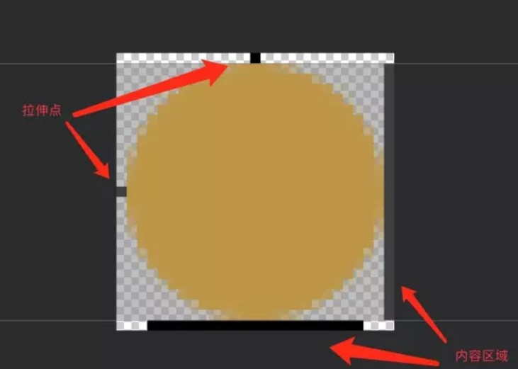

# 屏幕适配

## 1 概念

- 1：屏幕尺寸：屏幕的对角线长度

- 2：屏幕的分辨率，单位px，横纵方向的像素点

- 3：屏幕密度：dot per inch/每英寸的像素点
```
    计算方法：
        屏幕对角线尺寸：4.95inch  分辨率：1920*1080
        (1920^2)+(1080^2)开平方根号，计算出对角线上的像素点，然后除以4.95就是屏幕密度
```

- 4：px 图像最小点位

- 5：dp/dip 与密度无关像素
```
        在160dpi的屏幕上，1dp = 1px
        其他分辨率上 dp = px/密度比例，比如在 240dpi上  
        dp = px/(240/160) 即在240dpi上  1dp = 1.5px
```

- 6：sp：用于字体，谷歌推荐最小使用`12`，且使用偶数的sp

- 7：不同像素密度区分


密度|ldpi|mdpi|hdpi|xdpi|xxdpi|xxxdpi
---|---|---|---|---|---|---|---|---|---
dpi范围|0-120|120-160|160-240|240-320|320-480|480-640
比例|0.75|1|1.5|2|3|4
整数比|3|4|6|8|12|16

```
    密度划分         dpi区间           常见分辨率
    ldpi              0-120dpi        240*320
    mdpi            120-160dpi        320*480
    hdpi            160-240dpi        480*800
    xhdpi           240-320dpi        720*1280
    xxhdpi          320-480dpi        1080*1920
    xxxhdpi         480-640dpi        3840*2160
```
可见比例为 `1.5：2：3：4：6：8`，比如在mdpi上一个标准是启动图标应该是`48*48`，所以在hdpi上应该是 `72*72dpi`，上面列出的分辨率是常见的分辨率

常见屏幕宽高比为：

```
    4:3
    VGA     640*480 (Video Graphics Array)
    QVGA    320*240 (Quarter VGA)
    HVGA    480*320 (Half-size VGA)
    SVGA    800*600 (Super VGA)

    5:3
    WVGA    800*480 (Wide VGA)

    16:9
    FWVGA   854*480 (Full Wide VGA)
    HD      1920*1080 High Definition
    QHD     960*540
    720p    1280*720  标清
    1080p   1920*1080 高清
```

>虽然android也支持ldpi密度的屏幕，但是无需为此费神，系统会自动将hdpi尺寸的图标压缩到 1/2 进行匹配，**VGA**(Video Graphics Array)即视频图形阵列


---
## 2 解决方案

### 支持各种屏幕尺寸

-  使用 `wrap_content，martch_paren，weight`
-  使用相对布局，禁止用绝对布局，相对布局性能优于线性布局
-  使用限定符
-  使用自动拉伸位图

### weight

计算出的宽度= 原来的宽度+剩余空间所占百分比的宽度

```
    比如在宽度为L横向的线性布局中，两个Button的宽度都是martch_parent,且设计权重都为1，可得如下数据
    原来的宽度   L
    剩余宽度    L-(L + L)(L+L的意思是两个button的宽度都martch_parent)
    剩余宽度    L(button的) + 1/2*-L
```

### 限定符

使用限定符优化用户体验，在不同的屏幕密度上显示不同的布局

```
    (3.2前)
        layout-large:屏幕尺寸大于7英寸,3.2后废弃
    (3.2后)
        sw600dp     sw-small width最小宽度限定符，不区分平板与手机，只要尺寸教短是那条边小于600dp则会使用此文件夹中的布局
```

### 使用局部别名

```
    res/layout/main.xml                         单面板
    res/layout-large/main.xml                   多面板(3.2)
    res/layout-sw600dp/main.xml                 多面板
```

上面分别定义了各种尺寸下加载的布局，但是如果有一个改变了，那么三个都要改变显然不科学，可以用布局别名把相同的布局抽取出来，抽取之后：

```xml
    res/layout/main.xml                             单面板
    res/layout/mian_twopanes.xml                    双面板

    默认布局
            res/values/layout.xml
            <resource>
                <item name="main" type="layout">@layout/main</item>
            </resource>
    
    3.2
            res/values-large/layout.xml
            <resource>
                <item name="main" type="layout">@layout/main_twopanes</item>
            </resource>
            
    3.2后
             res/values-sw600dp/layout.xml
            <resource>
                <item name="main" type="layout">@layout/main_twopanes</item>
            </resource>
        
    这里的main就是布局别名，然后统一使用setContentView(R.layout.,mian)
```

### 方向限定符

```
    res/values-sw600dp-land/layout.xml 横向
    res/values-sw600dp-part/layout.xml 纵向

使用方向限定完成下面适配：

        小屏幕，纵向：         单面板
        小屏幕，横向：         单面板
        7英寸平板电脑，        纵向：单面板，带操作栏
        7英寸平板电脑，        横向：双面板，宽，带操作栏
        10英寸平板电脑，       纵向：双面板，窄，带操作栏
        10英寸平板电脑，       纵向：双面板，宽，带操作栏
        电视：                双面板，宽，带操作栏
```

### 使用9path图

画线的区域则是拉伸的区域，注意：

1. 图形的上边与下边(或左边与右边)的点的比例，系统会按照比例进行拉伸(如果希望居中，可以各画一个点)
2. 使用了.9图片的控件如果内容不见了，注意看.9图片的画线
3. 使用.9时，设置padding属性 , 9path上下或左右描边比例的不对称对转换成padding，比如垂直一条线 距离上面20px，距离下面10px，控件的 `paddingTop->20 paddingBotton->10px`

```xml
         <Button
                android:background="@drawable/icon_stars"
                android:layout_width="300dp"
                android:text="ssss"
                android:layout_height="200dp"/>
        
        
            <Button
                android:background="@drawable/icon_stars"
                android:layout_width="300dp"
                android:padding="0dp"
                android:text="ssss"
                android:layout_height="200dp"/>
```



### 支持各种屏幕密度

- 使用非密度制约像素：使用 `dp/sp` 动态计算
- 提供备用位图：提供不同的图片,虽然系统会根据文件夹对图片进行压缩，但是如果有条件还是尽量有多套图片

### 实施自适应用户界面流程

-  确定当前布局
-  根据当前布局做出响应
-  重复使用其他活动中的碎片
-  处理屏幕配置

### 最佳实践

-  高清设计图
-  动态设置

---
## 3 总结

### 熟悉常见概念

- 屏幕尺寸
- 分辨率
- 屏幕密度dpi
- sp，dp，dip
- 不同像素密度的区分

### 适配方案

#### 适配各种屏幕尺寸

- 使用 `wrap_content、match_parent、weight`
- 使用布局限定符(large、sw600dp等)，布局别名
- 使用.9图

#### 适配各种屏幕密度

- 代码动态计算
- 使用sp，dp
- 适配多套图片

#### 实施自适应屏幕布局

-  确定当前布局
-  根据当前布局做出响应
-  重复使用其他活动中的碎片
-  处理屏幕配置


---
## 4 今日头条等屏幕适配方案

- [一种极低成本的Android屏幕适配方式](https://mp.weixin.qq.com/s/d9QCoBP6kV9VSWvVldVVwA)
- [骚年你的屏幕适配方式该升级了!-今日头条适配方案](https://juejin.im/post/5b7a29736fb9a019d53e7ee2)
- [Android适配: 拉伸适配的缺点](https://juejin.im/post/5b7fb6d5e51d4538c5454306)
- [给你一个全自动的屏幕适配方案（基于SW方案）！—— 解放你和UI的双手](http://tangpj.com/2018/09/29/calces-screen/)

---
## 5 引用

- [官方示例](http://developer.android.com/intl/zh-cn/training/multiscreen/adaptui.html)
- [开发指南]( http://developer.android.com/intl/zh-cn/guide/practices/screens_support.html#qualifiers )
- [UI设计师不可不知的安卓屏幕知识 ](http://www.zcool.com.cn/article/ZNjI3NDQ=.html)
- [Android屏幕适配全攻略(最权威的官方适配指导)](https://blog.csdn.net/zhaokaiqiang1992/article/details/45419023)