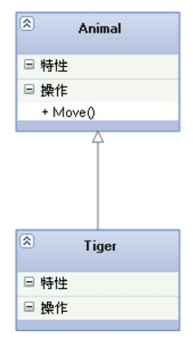
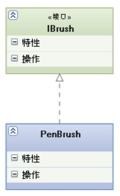
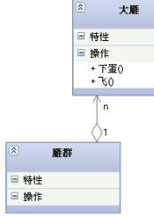
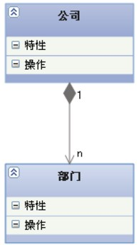
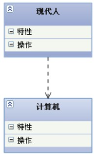
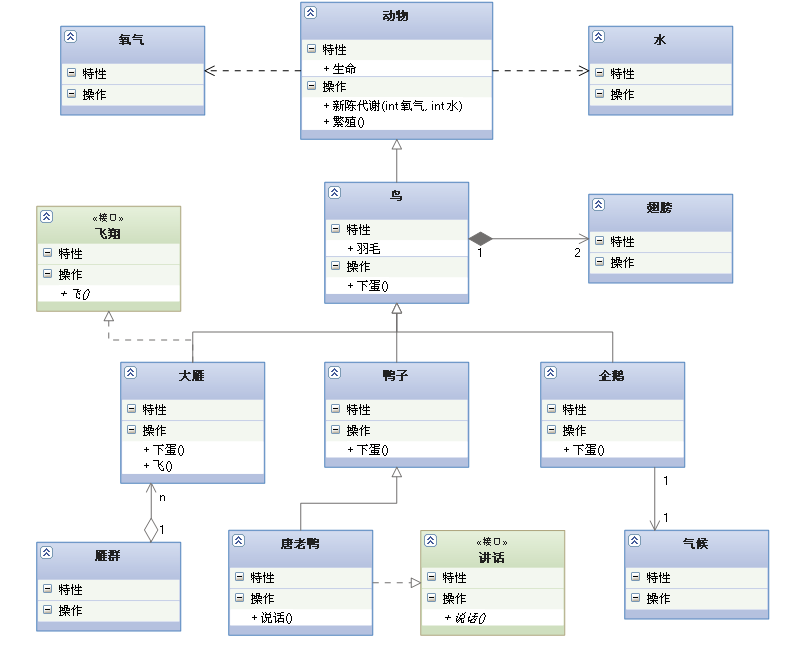

# UML

## 1 UML中类之间的几种关系

在UML类图中，常见的有以下几种关系:

- 泛化（Generalization）
- 实现（Realization）
- 关联（Association）
- 聚合（Aggregation）
- 组合(Composition)
- 依赖(Dependency)

这几种关系的强弱为：**泛化= 实现> 组合> 聚合> 关联> 依赖**

### 泛化(Generalization)

【泛化关系】：是一种继承关系，表示一般与特殊的关系，它指定了子类如何特化父类的所有特征和行为，例如：老虎是动物的一种.

### 实现（Realization)

【实现关系】：是一种类与接口的关系，表示类是接口所有特征和行为的实现

### 关联（Association）

【关联关系】：是一种拥有的关系,它使一个类知道另一个类的属性和方法；如：老师与学生，丈夫与妻子
关联可以是双向的，也可以是单向的。双向的关联可以有两个箭头或者没有箭头，单向的关联有一个箭头。**代码体现为成员变量**

### 聚合（Aggregation）

【聚合关系】：是群体与个体的关系.如雁群和大雁体和个体的关系.

聚合关系是关联关系的一种，是强的关联关系；关联和聚合在语法上无法区分，必须考察具体的逻辑关系。**代码体现为成员变量**

### 组合(Composition)

【组合关系】：是整体与部分的关系.,没有公司就不存在部门，组合关系是关联关系的一种，是比聚合关系还要强的关系，它要求普通的聚合关系中代表整体的对象负责代表部分的对象的生命周期**代码体现为成员变量**

### 依赖(Dependency)

依赖是一种使用的关系,所以要尽量不使用双向的互相依赖。**代码体现为局部变量、方法的参数或者对静态方法的调用**

### 概览

## 2 UML时序图

时序图（Sequence Diagram）是显示对象之间交互的图，这些对象是按时间顺序排列的。顺序图中显示的是参与交互的对象及其对象之间消息交互的顺序。时序图中包括的建模元素主要有：**角色（Actor）、对象（Object）、生命线（Lifeline）、控制焦点（Focus of control）、消息（Message）**等等。

## 3 UML用例图

用例图主要用来描述“用户、需求、系统功能单元”之间的关系。它展示一个外部用户能够观察到的系统功能模型图。用例图多用于静态建模阶段（主要是业务建模和需求建模），帮助开发团队以一种可视化的方式理解系统的功能需求。

## 4 工具

- Astah
- StarUML
