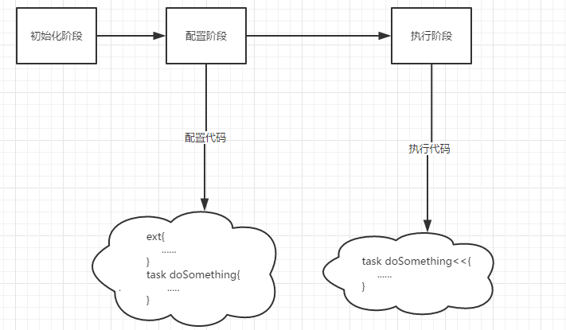
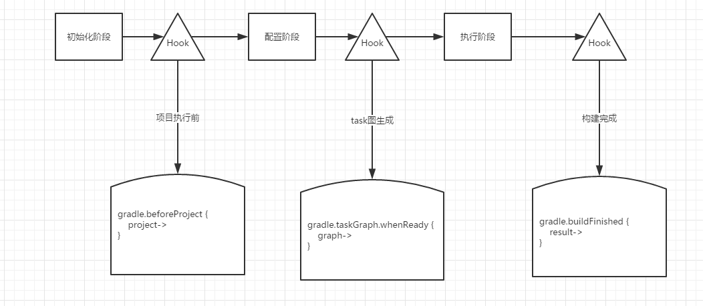

# 3 Task

一个Project可以包含一个或者多个task，task可以添加任务动作，任务动作定义了一个当任务执行时最小的工作单元。task之间可以定义依赖关系。

task的主要api：

```
        //task依赖
        Task dependsOn(Object... paths);

        //动作的定义
        Task doFirst(Action<? super Task> action);
        Task doFirst(Closure action);
        Task doLast(Action<? super Task> action);
        Task doLast(Closure action);
        List<Action<? super Task>> getActions();

        //输入和输出数据声明
        TaskInputs getInputs();
        TaskOutputs getOutputs();

        //getter/setter属性
        AntBuilder getAnt();
        Logger getLogger();
        boolean getEnabled();
        String getGroup();
        void setGroup(String group);
        void setDescription(String description);
        void setEnabled(boolean enabled);
```


---
## 3.1 定义属性

每个Project和Task实例都提供了可以通过setter/getter方法访问的属性，通过Gradle还支持扩展属性

添加扩展属性的方法：

1：使用project的ext

```
    ext{
        myValue1 = '001'
    }
    project.ext.myValue2='002'//只有在初始声明属性时才需要使用ext命名空间
    ext.myValue3 = '003'

    println myValue1//之后访问属性不需要使用ext命名空间
    println myValue2
    println myValue3
```

2：使用Gradle属性或项目属性

可以通过gradle.properties文件中声明属性。

- 在`$USER_HOME/.gradle/gradle.properties`中设置的属性，每一个构建的project实例都可以访问
- 在项目根目录下的`gradle.properties`中设置的属性，可以通过projcet来访问

示例：`gradle.properties`下定义acc变量：

    acc=1232

在构建脚本(`build.gradle`)中可以直接使用acc属性

    println project.acc
    println acc

3：通过命令行的方式来添加扩展属性

- 项目属性通过-P命令选项
- 系统属性通过-D命令选项
- 环境属性按照下面的模式提供:`ORG_GRADLE_PROJECT_propertyName=someValue`

示例：

    运行命令：gradle -Pabc=222     //-P为命令选项，abc=222为提供参数
    println abc   //在脚本中就可以访问abc属性了


---
## 3.2 使用Task


默认情况下每个新创建的Task都是`org.gradle.api.DefaultTask`类型的，标准的`org.gradle.api.Task`实现


### 项目版本管理

许多项目都有自己的版本管理策略，gradle中可以对version进行自定义配置

```
    //在脚本中设置version
    def projectVersion = new ProjectVersion()
    projectVersion.major =0//实际情况下，这些值可以放在配置文件中
    projectVersion.minor =1
    projectVersion.release = false
    version = projectVersion

    //定义一个来描述项目版本
    class ProjectVersion{

        int major
        int minor
        boolean release

        String toString() {
            "$major.$minor${release?'':'-SNAPSHOT'}"
        }

    }
```

### 声明task的动作和访问DefaultTask的属性


在脚本中使用`doFirst和doLast`为task添加动作，`doFirst和doLast的`本质其实就是类似容器的addFirst和addLast，每一个Task示例都维护者一个actin列表来保存这些动作

```groovy
    task Tas <<{
        println "第一任务"
    }

    Tas<<{
        println "第二任务"
    }
    Tas.doFirst{
        println "第三任务"
    }
    Tas.doFirst{
        println "第四任务"
    }
```

运行结果是：

    第四任务
    第三任务
    第一任务
    第二任务

访问属性：

```groovy
    task LogTest{
    //logger是Gradle提供的基于SLF4J的日志库
        logger.info 'info log'
        logger.log(LogLevel.ERROR, "ErrorMessage")//logger 是Proect的可访问属性
    }
    //配置task的group和description属性
    task taskPropSet(group: "test",description:"我就是测试一下设置属性"){
        println group
        println description
    }
    或者
     task taskPropSet(){
         group = "test"
         description = "我就是测试一下设置属性"
    }
```

### 定义task依赖与执行顺序

dependsOn方法允许声明依赖一个或多个task。


```groovy
task first<<{
    println 'first'
}
task second<<{
    println 'second'
}
task printVersion(dependsOn: [first,second] )<<{
    logger.quiet("version = $version")
}
task third <<{
    println 'third'
}
third.dependsOn('printVersion')
```

//运行task -q third的结果为：

```
     first
     second
     version = 1.0-SNAPSHOT
     third
```

从上面看到四个task的执行顺序，而first和second之间并没有依赖关系，为什么second没有在first之前运行呢？

**理解Gradle并不能保证task依赖的执行顺序是非常重要的**，dependsOn只是定义了所依赖的task要先执行，**Gradle的思想是声明一个给定task执行之前什么应该被执行，而没有定义它应该如何被执行**，执行顺序是由task的输入和输出规范自动确定的，这样设计的好处是：

- 不需要指定整个task依赖链上的关系是否发送改变
- 构建没有严格的执行顺序，即说明task支持并行执行


### 终结器task

Gradle提供的终结器task，即使终结器task失败了，Gradle的task也会按照预期执行。比如所以来的task执行后需要清理某种资源(不保证是否成功)。

```
    task aa{
        doLast{
            println 'A'
        }
    }

    task bb {
        doLast{
            println "B"
        }
    }

    aa.finalizedBy bb//声明一个task被另一个task终结
```

### mustRunAfter

mustRunAfter可以规定某个Task必须在另一Task运行后执行。


### 理解task的配置和Gradle构建生命周期

没有定义动作或者使用<<操作符添加的闭包，Gradle称之为**task配置**

    task taskConfig{
        println "task create"
    }

task的配置块永远在task执行动作之前被调用，为什么呢？我们需要理解Gradle构建声明周期：


#### Gradle构建生命周期

无论什么时候执行gradle构建，都会执行三个不同的生命周期阶段：**初始化、配置阶段、执行**。



- 初始化阶段：Gradle确定哪些项目将参与构建，并为每个项目创建一个Project实例。
- 配置阶段：在这个阶段，项目对象被配置。构建的所有项目的构建脚本都会执行。Gradle构建一个模型来表示任务，并参与到构建中
- 执行阶段：Gradle确定任务的子集，在配置阶段创建并配置，以便执行。该子集由传递给gradle命令和当前目录的任务名称参数确定。然后Gradle执行每个选定的任务。，所有的task都会以正确的顺序被执行

```
Initializetion 初始化阶段
        |
        |-->初始化正工程所有的Project，构建所有的Project对象
        |
Configuration 配置阶段
        |
        |-->解释所有的Project对象中的task，构建好所有task的拓扑图
        |
Execution 执行阶段
        |
        |-->执行具体的task及其依赖task
        |
```

项目每一个构建的任何配置代码都可以被执行，即使你只执行`gradle tasks`


#### settings.gradle

除了构建脚本文件外，Gradle还定义了一个设置文件。设置文件由Gradle通过命名约定确定。该文件的默认名称是settings.gradle。settings先于build.gradle在初始化阶段执行。多项目构建必须在多项目层次结构的根项目中具有settings.gradle文件。关于详细生命周期介绍可以参考[官方文档](https://docs.gradle.org/current/userguide/build_lifecycle.html)

### 声明task的inputs和outputs

Gradle通过比较两次build之间输入和输出有没有变化来确定这个任务是否是最新的，如果从上一个执行之后这个任务的输入和输出没有发生改变这个任务就标记为up-to-date，跳过这个任务。输入可以是一个目录、一个或者多个文件或者随机的属性，任务的输出可以是路径或者文件，输入和输出在DefaultTask类中用域来表示。

```groovy
    ext.versionFile = file('version.properties')

    task loadVersion {
        project.version = readVersion()
    }

    task printVersion << {
        println "ProjectVersion = $version"
    }

    //用于描述项目Version
    class ProjectVersion {

        int major
        int minor
        boolean release

        String toString() {
            "$major.$minor${release ? '' : '-SNAPSHOT'}"
        }

    }


    task makeReleaseVersion(group: "versioning", description: "makes project a release version") {
        version.release = true

        inputs.property('release', version.release)
        outputs.file versionFile

        doLast {
             //ant的propertyfile任务提供很方便的方法来修改属性文件
            ant.propertyfile(file: versionFile) {
                entry(
                        key: 'release', type: 'string', operation: '=', value: 'true'
                )
            }
        }
    }

    ProjectVersion readVersion() {

        File file = versionFile
        if (!file.exists()) {
            throw new GradleException("file not exists :${file.canonicalPath}")
        }
        Properties versionProp = new Properties()
        file.withInputStream {
            versionProp.load(it)
        }
        new ProjectVersion(
                major: versionProp.major.toInteger(),
                minor: versionProp.minor.toInteger(),
                release: versionProp.release.toBoolean()
        )

    }
```


当第二次执行makeReleaseVersion时，由于指定的inputs和outputs没有发生改变，所以task被跳过执行。这一特性在优化构建速度上很有用


### 编写和使用自定义task

自定义Task包含两个组件：

- 自定义的Task类，封装了逻辑行为，也被称作逻辑类型
- 真实的task，提供了用于配置行为的task所暴露的属性值

Gradle把这些称之为**增强的task**。

增强的task的优势是方便与单元测试，通过还增强了代码的可重用性


**编写自定义task类**


```groovy
    class MakeReleaseVersionTask extends DefaultTask{

        //通过注解声明task的输入/输出
        //@Input注解会在配置期间验证属性值，如果值为null，Gradle会抛出TaskValidationException，为了允许@Input为null，需要添加@Optional注解
        @Input
        boolean  release
        @OutputFile
        File destFile

        MakeReleaseVersionTask() {
            group = 'versioning'
            description="makes project a release version"
        }

        @TaskAction//使用注解声明将被执行的方法
        void start() {
            project.version.release = true
            ant.propertyfile(file: destFile){
                entry(
                        key: 'release', type: 'string', operation: '=', value: 'true'
                )
            }
        }
    }

  //定义了MakeReleaseVersionTask后就可以在build.gradle中使用了，使用方式为：
  task makeReleaseVersion(type:MakeReleaseVersionTask){
    release = version.release
    destFile = versionFile
  }
```


### Gradle的内置task类型

Gradle内置了很多的Task类型，比如zip、delete、copy等，更多的task信息可以参考[task文档](https://docs.gradle.org/current/dsl/org.gradle.api.Task.html),Gradle内置的Task都是Default类型


```groovy
    task createDisribution(type: Zip, dependsOn: makeReleaseVersion) {//创建一个Zip类型的Task，

        from war.outputs.files//隐式的引用war的输出

        from(sourceSets*.allSource) {
            //*展开操作符 ，sourceSets的类型是DefaultSourceSetContainer_Decorated，是一个集合，元素为SourceSet
            //SourceSet 的allSource返回SourceDirectorySet
            into 'src'//把所有的源代码文件压缩到src
        }

        from(rootDir) {//包含版本信息
            include versionFile.name
        }
    }


    task backupReleaseDisribution(type: Copy) {//创建一个复制功能的task
        from createDisribution.outputs.files        //隐式的引用createDisribution的输出
        into "$buildDir/backup"
    }

    task release(dependsOn: backupReleaseDisribution) << {
        logger.quiet 'releasing the project'
    }
```

### task的依赖推断

一般情况下task之间的依赖使用过dependsOn方法来指定的，但是一些task并不直接依赖其他task，比如上面createDisribution对war的依赖，Gradle根据一个Task的输出作为另一个task的输入可以推断出这两个task之间的依赖。


### task的规则


**task规模命名模式**：Gradle也引入了task规则的概念，根据task名称模式执行特定的逻辑，该模式由两部分组成：**task名称的静态部分和一个占位符**，它们联合起来就组成了一个动态的task名称，类似下面添加版本号的`increment<Classifier>Version`


声明task规则需要调用TaskContainer的addRule方法，

```groovy
    tasks.addRule("Pattern: increment<Classifier>Version - Increments the project version classifier.") {

        String taskName ->
            if (taskName.startsWith('increment') && taskName.endsWith('Version')) {

                task(taskName) << {

                    String classifier = (taskName - 'increment' - 'Version').toLowerCase()

                    String currentVersion = version

                    switch (classifier) {
                        case 'major':   version.major ++
                            break
                        case 'minor':   version.minor++
                            break
                        default:
                            throw new GradleException("not supprot ")
                    }
                    String newVersion = version.toString()

                    logger.info "incrementing $classifier project version: $currentVersion -> $newVersion"

                    ant.propertyfile(file: versionFile) {
                        entry(
                                key: classifier, type: 'int', operation: '+', value: 1
                        )
                    }
                }

            }
    }
```

执行`gradle tasks`执行gradleincrementMajorVersion

task规则实践：Gradle的一些核心插件充分的利用了Task规则，java插件定义的规则之一是`clean<TaskName>`，用来删除指定的task输出。比如运行 `gradle cleanCompileJava`。


### 在buildSrc目录下构建代码

上面构建代码`ProjectVersion，ReleaseVersionTask`最适合移动到项目的buildSrc目录下，将构建代码放在buildSrc下面是一个良好的软件开发实践。


---
## 3.3 挂载构建生命周期


作为一个脚本构建开发人员，不能仅仅心限于编写在不同阶段执行task动作或者配置逻辑，有时候当一个特定的生命周期事件发生时可能想要执行代码，一个生命周期事件可能发生在构建阶段之前、之后、期间。

有两种方式可以编写回调生命周期事件：

- 在闭包中
- 通过Gradle提供的API监听



许多的生命周期回调方法被定义在project和Gradle接口中，可以查看Gradle的文档
，在配置时，Gradle决定了在执行阶段要执行的task顺序，task依赖关系被建模为一个有向无环图，一个先执行的task永远不会再再次执行。

### 使用闭包

```
allprojects {
    afterEvaluate { project ->
        if (project.hasTests) {
            println "Adding test task to $project"
            project.task('test') {
                doLast {
                    println "Running tests for $project"
                }
            }
        }
    }
}
```
执行结果：
```
gradle -q test
Adding test task to project ':projectA'
Running tests for project ':projectA'
```

### 挂载到task执行图


示例：当执行tast release部署项目时,修改versin中的release为true

```groovy
    /*
    Represents an invocation of Gradle.
    You can obtain a Gradle instance by calling Project.getGradle().
    */
    gradle.taskGraph.whenReady { TaskExecutionGraph taskGraph ->
        println '-----------------------------------'
        println taskGraph
        println '-----------------------------------'

        if (taskGraph.hasTask(release)) {
            if (!version.release) {
                version.release = true
                ant.propertyfile(file: versionFile) {
                    entry(key: 'release', type: 'string', operation: '=', value: 'true')
                }
            }
        }
    }
```

本示例使用方法Project.afterEvaluate（）添加在评估项目后执行的闭包。

### 实现task执行图监听器

如果将监听器添加到构建脚本中，那么你就不能直接访问project实例了，但是可以使用task的getProject方法获取project，每一个task都确切的知道它们所属的Project。


示例：当执行 `tast release` 部署项目时，修改 version 中的release为true

```groovy
    class ReleaseVersionListener implements TaskExecutionGraphListener {
        static final String releaseTaskPath = ':release'

        @Override
        void graphPopulated(TaskExecutionGraph graph) {
            println "allTasks:$graph.allTasks"

            if (graph.hasTask(releaseTaskPath)) {
                List<Task> allTasks = graph.allTasks
                Task release = allTasks.find {
                    it.path == releaseTaskPath
                }
                Project project = release.getProject()

                if (!project.version.release) {
                    project.version.release = true
                    ant.propertyfile(file: versionFile) {
                        entry(key: 'release', type: 'string', operation: '=', value: 'true')
                    }
                }
            }
        }
    }

    def releaseVersionListener = new ReleaseVersionListener()
    gradle.taskGraph.addTaskExecutionGraphListener(releaseVersionListener)
```


### gradle对象提供的生命周期监听

```groovy
gradle.beforeProject {

}

gradle.afterProject {

}

gradle.taskGraph.whenReady {

}

gradle.buildStarted {

}

gradle.buildFinished {

}
```


