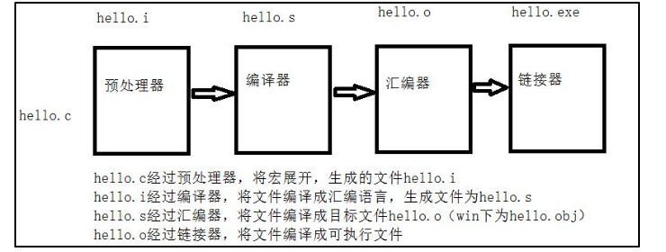

# 模板

模板是泛型编程的基础，泛型编程即以一种独立于任何特定类型的方式编写代码。模板是创建泛型类或函数的蓝图或公式。库容器，比如迭代器和算法，都是泛型编程的例子，它们都使用了模板的概念。

c++提供了函数模板(function template)所谓函数模板，实际上是建立一个通用函数，其函数类型和形参类型不具体制定，用一个虚拟的类型来代表。这个通用函数就成为函数模板。凡是函数体相同的函数都可以用这个模板代替，不必定义多个函数，只需在模板中定义一次即可。在调用函数时系统会根据实参的类型来取代模板中的虚拟类型，从而实现不同函数的功能。

c++提供两种模板机制:**函数模板和类模板**，使得程序(算法)可以从逻辑上抽象，把被处理的对象(数据)类型作为参数传递。

- 模板把函数或类要处理的数据类型参数化，表现为参数的多态性，成为类属
- 模板用于表达逻辑结构相同，但具体数据元素类型不同的数据对象的通用行为

---
## 1 函数模板

用模板是为了实现泛型，可以减轻编程的工作量，增强函数的重用性

函数模板和普通函数的区别：

- 函数模板不允许自动类型转化
- 普通函数能够自动进行类型转化

函数模板和普通函数在一起调用规则：

- 函数模板可以像普通函数那样可以被重载
- c++编译器优先考虑普通函数
- 如果函数模板可以产生一个更好的匹配，那么选择模板
- 可以通过空模板实参列表的语法限定编译器只能通过模板匹配

### c++编译器模板机制剖析

为什么函数模板可以和普通函数放在一起？，c++编译器是如何实现函数模板机制的？要回答这些问题需要掌握编译器编译原理：

#### gcc

gcc(GunCompilerCollection缩写)编译器套装，最初是是作为c语言的编译器(GunCCompiler)，现在已经支持很多语言了，如c、c++、java等语言

gcc编译过程:

- 预处理(Pre-processing)
- 编译(Compiling)
- 汇编(Assembling)
- 链接(Linking)

```
gcc *.c -o *.exe    #总的编译步骤

gcc -E 1.c -o1.i    #预处理
gcc -S 1.i -o 1.s   #编译
gcc -c 1.s -o1.o    #汇编
gcc 1.o -o 1.exe   #链接
```



gcc编译编译工具是一个工具链，hello.c程序是高级c语言程序，这种程序易于被人读懂。为了在系统上运行hello.c程序，每一条c语句都必须转化为低级的机器指令。
然后将这些机器指令打包成可执行目标文件格式，并以二进制形式存储于磁盘中。

#### 分析

通过代码分析原理机制：

```cpp
template<class T>
int MyAdd(T a,T b){
    return a + b;
}

int main(void){
    int a = 10;
    int b = 20;
    char c1 = 'a';
    char c2 = 'b';

    MyAdd<>(a,b);
    MyAdd<>(c1,c2);
    return 0;
}
```

在编译过程中，注释不同类型MyAdd方法的调用，然后通过查看汇编后的文件，发现编译器会根据不同类型的调用生成对应的**模板函数**。

函数模板机制结论：

- 编译器并不是把函数模板处理成能够处理任何类型的函数
- 函数模板通过具体类型产生不同的函数
- 编译器会对函数模板进行两次编译，在声明的地方对模板代码本身进行编译，在调用的地方对参数替换后的代码进行编译。

由**函数模板**生成**模板函数**的过程称为实例化

---
## 2 类模板

类模板和函数模板的定义和使用类似，有时，有两个或多个类，其功能是相同的，仅仅是数据类型不同。

- 类模板用于实现类所需数据的类型参数化
- 类模板在表示如数组、表、图等数据结构显得特别重要，这些数据结构的表示和算法不受所包含的数据类型的影响。

类模板注意项：

- 类模板派生普通类
- 类模板派生类模板
- 类模板：类内和类外实现和类模板友元写法
- 普通类`.h`和`.cpp`一般分开写；类模板`.h`和`.cpp`不要分开实现

### 类模板中的static关键字

- 从类模板实例化的每一个模板类有自己的类模板数据成员，该模板的所有对象共享一个static数据成员
- 和非模板类的static数据成员一样，模板类的static数据成员也应该在文件范围定义和初始化
- 每个模板类有自己类模板的static数据成员的副本


