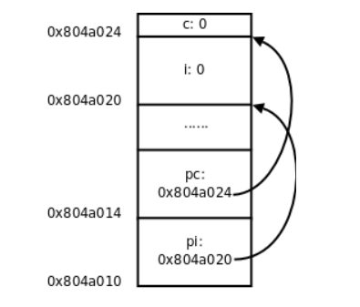
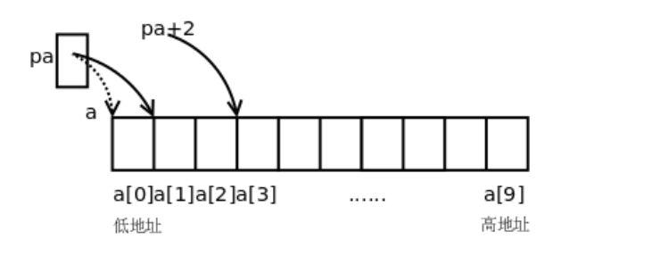

# 指针细节

>内容来自[《Linux C编程一站式学习》](https://akaedu.github.io/book/) 第二部分 C语言本质 第23章。这里只是对原内容进行再划分，提炼标题，加强理解和记忆。

---
## 1 指针的基本概念

堆栈有栈顶指针，队列有头指针和尾指针，这些概念中的“指针”本质上是一个整数，是数组的索引，通过指针访问数组中的某个元素。这里指针有另外一个含义：**把一个变量所在的内存单元的地址保存在另外一个内存单元中，保存地址的这个内存单元称为指针，通过指针和间接寻址访问变量，这种指针在C语言中可以用一个指针类型的变量表示**。

```c
int i;
int *pi = &i;
char c;
char *pc = &c;
```



### 指针基本操作：`&` 与 `*`

`&` 是取地址运算符（Address Operator），`&i`表示取变量`i`的地址，`int *pi = &i;`表示定义一个指向`int`型的指针变量`pi`，并用`i`的地址来初始化`pi`。

全局变量只能用常量表达式初始化，如果定义`int p = i;`就错了，因为`i`不是常量表达式，然而用`i`的地址来初始化一个指针却没有错，因为`i`的地址是在编译链接时能确定的，而不需要到运行时才知道，`&i`是常量表达式。

如果要让 pi 指向另一个整型变量 j，可以重新对 pi 赋值，如果要改变 pi 所指向的整型变量的值，比如把变量 j 的值增加 10，可以写：

```c
pi = &j;
*pi = *pi + 10;
```

这里的`*`号是指针间接寻址运算符（Indirection Operator），`*pi`表示取指针`pi`所指向的变量的值，也称为`Dereference`操作，指针有时称为变量的引用（Reference），所以根据指针找到变量称为Dereference。

- `&`运算符的操作数必须是左值，因为只有左值才表示一个内存单元，才会有地址，运算结果是指针类型。
- `*`运算符的操作数必须是指针类型，运算结果可以做左值。所以，如果表达式E可以做左值，`*&E`和`E`等价，如果表达式`E`是指针类型，`&*E`和`E`等价。

### 指针之间的赋值

指针之间可以相互赋值，也可以用一个指针初始化另一个指针：

```c
//表示pi指向哪就让ptri也指向哪，本质上就是把变量pi所保存的地址值赋给变量ptri。

//直接赋值
int *ptri = pi;
//或者先定义，再赋值
int *ptri;
ptri = pi;
```

**指针强转**：用一个指针给另一个指针赋值时要注意，两个指针必须是同一类型的。如果`pi`是`int*`型的，`pc`是`char *`型的，`pi = pc;`这样赋值就是错误的。但是可以先强制类型转换然后赋值

```c
pi = (int *)pc;
```

现在pi指向的地址和pc一样，但是通过`*pc`只能访问到一个字节，而通过`*pi`可以访问到 4 个字节，后 3 个字节已经不属于变量 c 了，除非你很确定变量 c 的一个字节和后面 3 个字节组合而成的 int值 是有意义的，否则就不应该给 pi 这么赋值。

因此使用指针要特别小心，很容易将指针指向错误的地址，访问这样的地址可能导致段错误，可能读到无意义的值，也可能意外改写了某些数据，使得程序在随后的运行中出错。

### 野指针与 NULL 指针

有一种情况需要特别注意，定义一个指针类型的局部变量而没有初始化：

```c
int main(void){
    int *p;
    ...
    *p = 0;
    ...
}
```

在堆栈上分配的变量初始值是不确定的，也就是说指针p所指向的内存地址是不确定的，后面用`*p`访问不确定的地址就会导致不确定的后果，如果导致段错误还比较容易改正，如果意外改写了数据而导致随后的运行中出错，就很难找到错误原因了。像这种指向不确定地址的指针称为 **“野指针”（Unbound Pointer）**，为避免出现野指针，在定义指针变量时就应该给它明确的初值，或者把它初始化为 NULL：

```c
int main(void){
    int *p = NULL;
    ...
    *p = 0;
    ...
}
```

NULL在C标准库的头文件stddef.h中定义：

```c
#define NULL ((void *)0)
```

NULL 其实是把地址`0`转换成指针类型，称为空指针，它的特殊之处在于，操作系统不会把任何数据保存在地址 0 及其附近，也不会把地址`0~0xfff`的页面映射到物理内存，所以任何对地址 0 的访问都会立刻导致段错误。`*p = 0;`会导致段错误，就像放在眼前的炸弹一样很容易找到，相比之下，**野指针的错误就像埋下地雷一样，更难发现和排除，这次走过去没事，下次走过去就有事**。

### `void *`类型

在编程时经常需要一种通用指针，可以转换为任意其它类型的指针，任意其它类型的指针也可以转换为通用指针，

- 最初C语言没有`void *`类型，就把`char *`当通用指针，需要转换时就用类型转换运算符`()`。
- ANSI在将C语言标准化时引入了`void *`类型，`void*`指针与其它类型的指针之间可以隐式转换，而不必用类型转换运算符。

注意，只能定义`void *`指针，而不能定义`void`型的变量，因为`void *`指针和别的指针一样都占4个字节，而如果定义`void`型变量（也就是类型暂时不确定的变量），编译器不知道该分配几个字节给变量。同样道理，`void*`指针不能直接 Dereference，而必须先转换成别的类型的指针再做 Dereference。`void *`指针常用于函数接口，比如：

```c
void func(void *pv){
    /* *pv = 'A' is illegal */
    char *pchar = pv;
    *pchar = 'A';
}

int main(void){
    char c;
    func(&c);
    printf("%c\n", c);...
}
```

---
## 2 指针类型的参数和返回值

指针参数和返回值：

```c
#include <stdio.h>

int *swap(int *px, int *py){
    int temp;
    temp = *px;
    *px = *py;
    *py = temp;
    return px;
}

int main(void){
    int i = 10, j = 20;
    int *p = swap(&i, &j);
    printf("now i=%d j=%d *p=%d\n", i, j, *p);
    return 0;
}
```

### 指针类型的参数

调用函数的传参过程相当于用实参定义并初始化形参，`swap(&i, &j)`这个调用相当于：

```c
int *px = &i;
int *py = &j;
```

所以 px 和 py 分别指向 main 函数的局部变量 i 和 j，在 swap 函数中读写`*px`和`*py`其实是读写 main 函数的 i 和 j。尽管在 swap 函数的作用域中访问不到 i 和 j 这两个变量名，却可以通过地址访问它们，最终 swap 函数将 i 和 j 的值做了交换。

### 返回指针

`return px;`语句相当于定义了一个临时变量并用px初始化：

```c
int *tmp = px;
```

然后临时变量tmp的值成为表达式swap(&i, &j)的值，然后在main函数中又把这个值赋给了p，相当于：

```c
int *p = tmp;
```

最后的结果是swap函数的px指向哪就让main函数的p指向哪。我们知道px指向i，所以p也指向i。

---
## 3 指针与数组

### 指针的 `++`运算

```c
int a[10];
//注意后缀运算符的优先级高于单目运算符，所以是取a[0]的地址，而不是取a的地址。
int *pa = &a[0];
pa++;
```

- 指针 pa 指向`a[0]`的地址。
- `pa++` 让 pa 指向下一个元素（也就是`a[1]`），由于 pa 是`int *`指针，一个int 型元素占 4 个字节，所以 `pa++` 使 pa 所指向的地址加4，而不是加 1。



- 地址之间的关系：（`a[1]`位于`a[0]`之后4个字节处）
- 指针与变量之间的关系：指针保存的是变量的地址

### 指针的 `+、-` 运算

既然指针可以用++运算符，当然也可以用+、-运算符：

- `pa+2`，pa 指向 `a[1]`，那么`pa+2`指向`a[3]`。
- `E1[E2]`这种写法和`(*((E1)+(E2)))`是等价的，`*(pa+2)`也可以写成`pa[2]`，pa 就像数组名一样。
- `a[2]`之所以能取数组的第 2 个元素，是因为它等价于`*(a+2)`。
- 数组名做右值时自动转换成指向首元素的指针，所以`a[2]`和`pa[2]`本质上是一样的，都是通过指针间接寻址访问元素。
- 由于`(*((E1)+(E2)))`显然可以写成`(*((E2)+(E1)))`，所以`E1[E2]`也可以写成`E2[E1]`，这意味着`2[a]`、`2[pa]`这种写法也是对的，但一般不这么写。(这里可理解为乘法)
- 由于 a 做右值使用时和`&a[0]`是一个意思，所以`int *pa = &a[0];`通常不这么写，而是写成更简洁的形式`int *pa = a;`。

### C 语言允许数组下标是负数

在上面的例子中，表达式`pa[-1]`是合法的，它和`a[0]`表示同一个元素。

### 两个指针变量做比较运算（`>、>=、<、<=、==、!=`）表示什么意义？

在上面的例子中，下面表达式成立：

```c
pa + 2 > pa;
pa - 1 == a;
```

指针之间的比较运算比的是地址，C 语言正是这样规定的，只有指向同一个数组中元素的指针之间相互比较才有意义，否则没有意义。

- **那么两个指针相减表示什么**？`pa -a`等于几？因为`pa - 1 == a`，所以`pa - a`显然应该等于1，指针相减表示两个指针之间相差的元素个数，同样只有指向同一个数组中元素的指针之间相减才有意义。
- **两个指针相加表示什么**？想不出来它能有什么意义，因此C语言也规定两个指针不能相加。

### 数组名与指针的区别

在取数组元素时用数组名和用指针的语法一样，**但如果把数组名做左值使用，和指针就有区别了**。

- `pa++` 是合法的，但 `a++` 就不合法
- `pa = a + 1` 是合法的，但 `a = pa + 1` 就不合法。

数组名做右值时转换成指向首元素的指针，但**做左值仍然表示整个数组的存储空间**，而不是首元素的存储空间，数组名做左值还有一点特殊之处，不支持`++`、赋值这些运算符，但支持取地址运算符 &，所以 `&a`是合法的。

### 在函数原型中，如果参数是数组，则等价于参数是指针的形式

```c
void func(int *a){
    ...
}

void func(int a[]){
    ...
}
```

上面两个方法定义是等价的，参数写成指针形式还是数组形式对编译器来说没区别，都表示这个参数是指针，之所以规定两种形式是为了给读代码的人提供有用的信息：

- 如果这个参数指向一个元素，通常写成指针的形式。
- 如果这个参数指向一串元素中的首元素，则经常写成数组的形式。

---
## 4 指针与 const 限定符

### 指针常量、常量指针

```c
//这两种写法是一样的，a是一个指向const int型的指针，a所指向的内存单元不可改写，所以(*a)++是不允许的，但a可以改写，所以a++是允许的。
const int *a;
int const *a;

//a是一个指向int型的const指针，*a是可以改写的，但a不允许改写。
int * const a;

//a是一个指向const int型的const指针，因此*a和a都不允许改写
int const * const a;

//指向非const变量的指针或者非const变量的地址可以传给指向const变量的指针，编译器可以做隐式类型转换，例如：
char c = 'a';
const char *pc = &c;

//指向const变量的指针或者const变量的地址不可以传给指向非const变量的指针，以免透过后者意外改写了前者所指向的内存单元，例如对下面的代码编译器会报警告：
const char c = 'a';
char *pc = &c;
```

即使不用 const 限定符也能写出功能正确的程序，但良好的编程习惯应该尽可能多地使用 const，因为：

- const 给读代码的人传达非常有用的信息。比如一个函数的参数是`const char *`，你在调用这个函数时就可以放心地传给它`char *`或`const char *`指针，而不必担心指针所指的内存单元被改写。
- 尽可能多地使用 const 限定符，把不该变的都声明成只读，这样可以依靠编译器检查程序中的 Bug，防止意外改写数据。
- const 对编译器优化是一个有用的提示，编译器也许会把 const 变量优化成常量。

### 字符串字面值

字符串字面值类似于数组名，做右值使用时自动转换成指向首元素的指针，这种指针应该是`const char *`型。我们知道 printf 函数原型的第一个参数是`const char *`型，可以把`char*`或`const char *`指针传给它，所以下面这些调用都是合法的：

```c
const char *p = "abcd";
const char str1[5] = "abcd";
char str2[5] = "abcd";
printf(p);
printf(str1);
printf(str2);
printf("abcd");
```

### `char *p = "abcd"` 的隐患

如果要定义一个指针指向字符串字面值，这个指针应该是const char *型，如果写成char *p = "abcd";就不好了，有隐患，例如：

```c
int main(void){
    char *p = "abcd";
    ...
    *p = 'A';
    ...
}
```

p 指向`.rodata`（ELF文件中）段，不允许改写，但编译器不会报错，在运行时会出现段错误。

---
## 5 指针与结构体

```c
struct unit {
    char c;
    int num;
};

struct unit u;
struct unit *p = &u;
```

要通过指针p访问结构体成员可以写成`(*p).c`和`(*p).num`，为了书写方便，C语言提供了`->`运算符，也可以写成`p->c`和`p->num`。

---
## 6 指向指针的指针与指针数组

### 多重指针

指针可以指向基本类型，也可以指向复合类型，因此也可以指向另外一个指针变量，称为指向指针的指针。

```c
int i;
int *pi = &i;
int **ppi = &pi;
```

### 指针数组：元素是指针的数组

数组中的每个元素可以是基本类型，也可以复合类型，因此也可以是指针类型。例如定义一个数组a由10个元素组成，每个元素都是int *指针：

```c
int *a[10];
```

这称为指针数组。`int *a[10];` 和 `int **pa;` 之间的关系类似于 `int a[10];` 和 `int *pa;` 之间的关系：a 是由一种元素组成的数组，pa 则是指向这种元素的指针。所以，如果 pa 指向 a 的首元素：

```c
int *a[10];
int **pa = &a[0];
```

### main 函数标准原型

main函数的标准原型应该是，`int main(int argc, char *argv[]);`，argc 是命令行参数的个数。而 argv 是一个指向指针的指针，为什么不是指针数组呢？因为函数原型中的 `[]` 表示指针而不表示数组，等价于`char **argv`。那为什么要写成`char *argv[]`而不写成`char**argv`呢？这样写给读代码的人提供了有用信息，`argv`不是指向单个指针，而是指向一个指针数组的首元素。数组中每个元素都是`char *`指针，指向一个命令行参数字符串。

```c
//遍历参数
#include <stdio.h>

int main(int argc, char *argv[]){
    int i;

    // 方式1
    for(i = 0; i < argc; i++){
        printf("argv[%d]=%s\n", i, argv[i]);
    }

    // 方式2：由于argv[4]是NULL，我们也可以这样循环遍历argv：
    for(i=0; argv[i] != NULL; i++){
        printf("argv[%d]=%s\n", i, argv[i]);
    }

    return 0;
}
```

执行命令：

```shell
$ gcc main.c
$ ./a.out a b c

#打印：
# argv[0]=./a.outa
# rgv[1]=a
# argv[2]=b
# argv[3]=c
```

---
## 7 指向数组的指针与多维数组

### 数组指针：数组的指针

指针可以指向复合类型，以下定义一个指向数组的指针，该数组有 10 个 int 元素：

```c
int (*a)[10];
```

指针数组的定义`int *a[10];`相比，仅仅多了一个`()`括号。如何记住和区分这两种定义呢？我们可以认为`[]`比`*`有更高的优先级，如果`a`先和`*`结合则表示 a 是一个指针，如果`a`先和`[]`结合则表示`a`是一个数组。`int *a[10];`这个定义可以拆成两句：

```c
typedef int *t;
t a[10];
```

t 代表 `int *` 类型，a 则是由这种类型的元素组成的数组。`int (*a)[10];` 这个定义也可以拆成两句：

```c
typedef int t[10];
t *a;
```

t 代表由 10 个 int 组成的数组类型，a则是指向这种类型的指针。现在看指向数组的指针如何使用：

```c
int a[10];
int (*pa)[10] = &a;
```

a是一个数组，在`&a`这个表达式中，数组名做左值，取整个数组的首地址赋给指针`pa`。注意：

- `&a[0]`表示数组 a 的首元素的首地址，而`&a`表示数组`a`的首地址，显然这两个地址的数值相同，但这两个表达式的类型是两种不同的指针类型，前者的类型是`int *`，而后者的类型是`int(*)[10]`。
- `*pa`就表示 pa 所指向的数组 a，所以取数组的 `a[0]` 元素可以用表达式`(*pa)[0]`。
- `*pa`可以写成`pa[0]`，所以`(*pa)[0]`这个表达式也可以改写成`pa[0][0]`。

### 二维数组的名字

pa 就像一个二维数组的名字：`int a[5][10];`和`int (*pa)[10];`之间的关系同样类似于`int a[10];`和`int *pa;`之间的关系：a 是由一种元素组成的数组，pa 则是指向这种元素的指针。

如果 pa 指向 a 的首元素，则：

```c
int a[5][10];
//int (*pa)[10]  指向 a 的第0个元素。
int (*pa)[10] = &a[0];
```

则`pa[0]`和`a[0]`取的是同一个元素，唯一比原来复杂的地方在于这个元素是由10个int组成的数组，而不是基本类型。这样，我们可以把 pa 当成二维数组名来使用，`pa[1][2]`和`a[1][2]`取的也是同一个元素，而且 pa 比 a 用起来更灵活，数组名不支持赋值、自增等运算，而指针可以支持，`pa++`使 pa 跳过二维数组的一行（40个字节），指向`a[1]`的首地址。

---
## 8 函数类型和函数指针类型

### 函数也是一种类型

函数也是一种类型，可以定义指向函数的指针。我们知道，指针变量的内存单元存放一个地址值，而函数指针存放的就是函数的入口地址。

```c
#include <stdio.h>

void say_hello(const char *str)
{
    printf("Hello %s\n", str);
}

int main(void)
{
    void (*f)(const char *) = say_hello;
    f("Guys");
    return 0;
}
```

对于变量 f 的类型声明`void (*f)(const char *)`：

- f 首先跟 `*` 号结合在一起，因此是一个指针。
- `(*f)`外面是一个函数原型的格式，参数是`const char *`，返回值是 void，所以f是指向这种函数的指针。
- say_hello 的参数是 `const char *`，返回值是 void，正好是这种函数，因此 f 可以指向 say_hello。
- say_hello 是一种函数类型，而函数类型和数组类型类似，做右值使用时自动转换成函数指针类型，所以可以直接赋给 f
- 也可以写成`void (*f)(const char *) = &say_hello;`，把函数 say_hello 先取地址再赋给 f，就不需要自动类型转换了。

**函数指针的调用**：可以直接通过函数指针调用函数，如上面的`f("Guys")`，也可以先用`*f`取出它所指的函数类型，再调用函数，即`(*f)("Guys")`。可以这么理解：函数调用运算符()要求操作数是函数指针，所以`f("Guys")`是最直接的写法，而`say_hello("Guys")`或`(*f)("Guys")`则是把函数类型自动转换成函数指针然后做函数调用。

### 区分函数类型和函数指针类型

```c
typedef int F(void);

//这种类型的函数不带参数，返回值是int。那么可以这样声明f和g：
F f, g;

//相当于声明：
int f(void);
int g(void);

// 下面这个函数声明是错误的：因为函数可以返回 void 类型、标量类型、结构体、联合体，但不能返回函数类型，也不能返回数组类型。
F h(void);//这个函数声明，返回一个函数，不符合 C 语言规定。

//下面这个函数声明是正确的，返回一个函数指针
F *e(void);
F *((e))(void);

// 这样声明了一个函数指针，而不是声明一个函数。
int (*fp)(void);
```

---
## 9  不完全类型和复杂声明

C语言的类型分为函数类型、对象类型和不完全类型三大类：

- 对象类型又分为标量类型和非标量类型。
- 指针类型属于标量类型，因此也可以做逻辑与、或、非运算的操作数和if、for、while的控制表达式，NULL指针表示假，非NULL指针表示真。
- 不完全类型是暂时没有完全定义好的类型，编译器不知道这种类型该占几个字节的存储空间。

### 不完全类型

不完全类型是暂时没有完全定义好的类型，编译器不知道这种类型该占几个字节的存储空间

```c
struct s;
union u;
char str[];
```

### 具有不完全类型的变量可以通过多次声明组合成一个完全类型

比如数组str声明两次：

```c
char str[];
char str[10];
```

当编译器碰到第一个声明时，认为 str 是一个不完全类型，碰到第二个声明时 str 就组合成完全类型了，如果编译器处理到程序文件的末尾仍然无法把 str 组合成一个完全类型，就会报错。读者可能会想，这个语法有什么用呢？为何不在第一次声明时就把 str 声明成完全类型？有些情况下这么做有一定的理由，比如第一个声明是写在头文件里的，第二个声明写在 `.c` 文件里，这样如果要改数组长度，只改`.c`文件就行了，头文件可以不用改。

### 不完全的结构体类型有重要作用

```c
struct s {
    struct t *pt;
};

struct t {
    struct s *ps;
};
```

struct s 和 struct t 各有一个指针成员指向另一种类型。编译器从前到后依次处理，当看到`struct s { struct t* pt; };`时，认为 struct t 是一个不完全类型，pt是一个指向不完全类型的指针，尽管如此，这个指针却是完全类型，因为不管什么指针都占 4 个字节存储空间，这一点很明确。然后编译器又看到`struct t { struct s *ps; };`，这时 struct t 有了完整的定义，就组合成一个完全类型了，pt的类型就组合成一个指向完全类型的指针。由于 struct s 在前面有完整的定义，所以`struct s *ps;`也定义了一个指向完全类型的指针。

### 递归定义

这样的类型定义是错误的：

```c
struct s {
    struct t ot;
};

struct t {
    struct s os;
};
```

编译器看到`struct s { struct t ot; };`时，认为 struct t 是一个不完全类型，无法定义成员 ot，因为不知道它该占几个字节。所以结构体中可以递归地定义指针成员，但不能递归地定义变量成员，你可以设想一下，假如允许递归地定义变量成员，struct s 中有一个 struct t，struct t 中又有一个 struct s，struct s 又中有一个 struct t，这就成了一个无穷递归的定义。

以上是两个结构体构成的递归定义，一个结构体也可以递归定义：

```c
struct s {
    char data[6];
    struct s* next;
};
```

当编译器处理到第一行 `struct s {`时，认为 struct s 是一个不完全类型，当处理到第三行`struct s *next;`时，认为 next 是一个指向不完全类型的指针，当处理到第四行`};`时，struct s 成了一个完全类型，next也成了一个指向完全类型的指针。类似这样的结构体是很多种数据结构的基本组成单元，如链表、二叉树等。

### 指针和数组、函数、结构体层层组合起来可以构成非常复杂的类型

```c
typedef void (*sighandler_t)(int);
sighandler_t signal(int signum, sighandler_t handler);
```

sighandler_t是一个函数指针，它所指向的函数带一个参数，返回值为 void，signal 是一个函数，它带两个参数，一个 int 参数，一个 sighandler_t 参数，返回值也是 sighandler_t 参数。如果把这两行合成一行写，就是：

```c
void (*signal(int signum, void (*handler)(int)))(int);

//分析后得：

void (*)(int) signal( int signum, void(*handler)(int));
//signal 是一个函数，该函数的参数为一个 int 变量和一个 函数指针 handler
//phandler 接受一个 int 变量，没有返回值。
//signal 返回一个 函数指针，该指针指向一个函数，假设为 p2
//p2 接受一个 int 变量，没有返回值。
```

在分析复杂声明时，要借助typedef把复杂声明分解成几种基本形式：

- `T *p;`，p是指向 T 类型的指针。
- `T a[];`，a 是由 T 类型的元素组成的数组，但有一个例外，如果 a 是函数的形参，则相当于`T *a;`
- `T1 f(T2, T3...);`，f是一个函数，参数类型是`T2、T3`等等，返回值类型是 T1。

```c
int (*(*fp)(void *))[10];

//fp和*号括在一起，说明fp是一个指针，指向T1类型：
typedef int (*T1(void *))[10];
T1 *fp;

//T1应该是一个函数类型，参数是void *，返回值是T2类型：
typedef int (*T2)[10];
typedef T2 T1(void *);
T1 *fp;

//T2和*号括在一起，应该也是个指针，指向T3类型：
typedef int T3[10];
typedef T3 *T2;
typedef T2 T1(void *);
T1 *fp;

//显然，T3是一个 int 数组，由 10 个元素组成。分解完毕。
```

实际原形为：`int (*)[10] (*fp)(void *)`，fp 是一个指针，指向一个函数，该函数的参数为  void*，返回为一个数组的指针，该指针指向的数组类型为 `int [10]`。