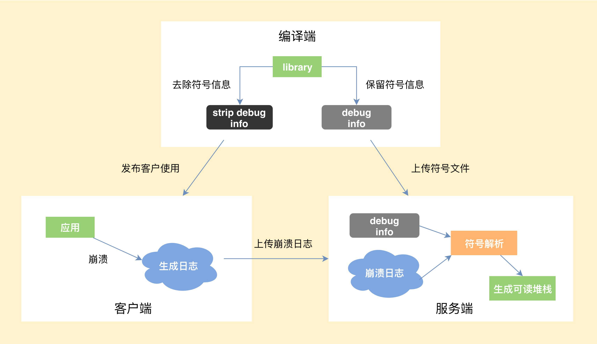

# 崩溃优化：关于“崩溃”那些事儿

## 1 Android 的两种崩溃

Android 崩溃分为 Java 崩溃和 Native 崩溃。

- Java 崩溃就是在 Java 代码中，出现了未捕获异常，导致程序异常退出。
- Native 崩溃一般都是因为在 Native 代码中访问非法地址，也可能是地址对齐出现了问题，或者发生了程序主动 abort，这些都会产生相应的 signal 信号，导致程序异常退出。

“崩溃”就是程序出现异常，而一个产品的崩溃率，跟我们如何捕获、处理这些异常有比较大的关系。Java 异常容易捕获，难点在于 Native 异常捕获。

### Native 崩溃的捕获流程

**掌握 Native 崩溃机制的基本知识**：

- 参考[Android 平台 Native 代码的崩溃捕获机制及实现](https://mp.weixin.qq.com/s/g-WzYF3wWAljok1XjPoo7w?)

**一个完整的 Native 崩溃从捕获到解析要经历哪些流程**：

- 编译端。编译 C/C++ 代码时，需要将带符号信息的文件保留下来。
- 客户端。捕获到崩溃时候，将收集到尽可能多的有用信息写入日志文件，然后选择合适的时机上传到服务器。
- 服务端。读取客户端上报的日志文件，寻找适合的符号文件，生成可读的 C/C++ 调用栈。



### Native 崩溃捕获的难点

1. Chromium 的 [Breakpad](https://chromium.googlesource.com/breakpad/breakpad/+/master) 是目前 Native 崩溃捕获中最成熟的方案。
2. 如果只想在 90% 的情况可靠，那大部分的代码的确可以砍掉；但如果想达到 99%，在各种恶劣条件下依然可靠，后面付出的努力会远远高于前期。

三个流程中，最核心的是**怎么样保证客户端在各种极端情况下依然可以生成崩溃日志**。因为在崩溃时，程序会处于一个不安全的状态，如果处理不当，非常容易发生二次崩溃。

**生成崩溃日志时会有哪些比较棘手的情况呢**？

1. 情况一：文件句柄泄漏，导致创建日志文件失败，怎么办？
   1. 应对方式：我们需要提前申请文件句柄 fd 预留，防止出现这种情况。
2. 情况二：因为栈溢出了，导致日志生成失败，怎么办？
   1. 应对方式：为了防止栈溢出导致进程没有空间创建调用栈执行处理函数，我们通常会使用常见的 signalstack。在一些特殊情况，我们可能还需要直接替换当前栈，所以这里也需要在堆中预留部分空间。
3. 情况三：整个堆的内存都耗尽了，导致日志生成失败，怎么办？
   1. 应对方式：这个时候我们无法安全地分配内存，也不敢使用 stl 或者 libc 的函数，因为它们内部实现会分配堆内存。这个时候如果继续分配内存，会导致出现堆破坏或者二次崩溃的情况。Breakpad 做的比较彻底，重新封装了[Linux Syscall Support](https://chromium.googlesource.com/linux-syscall-support/)，来避免直接调用 libc。
4. 情况四：堆破坏或二次崩溃导致日志生成失败，怎么办？
   1. 应对方式：Breakpad 会从原进程 fork 出子进程去收集崩溃现场，此外涉及与 Java 相关的，一般也会用子进程去操作。这样即使出现二次崩溃，只是这部分的信息丢失，我们的父进程后面还可以继续获取其他的信息。在一些特殊的情况，我们还可能需要从子进程 fork 出孙进程。

**Breakpad 也存在着一些问题**：

- 例如生成的 minidump 文件是二进制格式的，包含了太多不重要的信息，导致文件很容易达到几 MB。
- minidump 也不是毫无用处，它有一些比较高级的特性，比如[使用 gdb 调试](https://www.chromium.org/chromium-os/packages/crash-reporting/debugging-a-minidump)、可以看到传入参数等。
- Chromium 未来计划使用 Crashpad 全面替代 Breakpad，但目前来说还是 “too early to mobile”。

### 选择合适的崩溃服务

对于很多中小型公司来说，可能无法自己实现一套复杂的崩溃上报系统，可以选择第三方服务：

- 腾讯的Bugly
- 阿里的啄木鸟平台
- 网易云捕
- Google 的 Firebase
- 等待...

## 2 如何客观地衡量崩溃

**统计各种崩溃率**：

- PV 崩溃率
- 启动崩溃率
- 重复崩溃率

**UV 崩溃率**：要衡量一个指标，首先要统一计算口径。如果想评估崩溃造成的用户影响范围，我们会先去看 UV 崩溃率。只要用户出现过一次崩溃就会被计算到，所以 UV 崩溃率的高低会跟应用的使用时长有比较大的关系。

```math
UV 崩溃率 = 发生崩溃的 UV / 登录 UV
```

**为什么要单独统计启动崩溃率呢**？

- 因为启动崩溃对用户带来的伤害最大，应用无法启动往往通过热修复也无法拯救。
- 闪屏广告、运营活动，很多应用启动过程异常复杂，又涉及各种资源、配置下发，极其容易出现问题。
- 微信读书、蘑菇街、淘宝、天猫这些“重运营”的应用都有使用一种叫作“[安全模式](https://mp.weixin.qq.com/s?__biz=MzUxMzcxMzE5Ng==&mid=2247488429&idx=1&sn=448b414a0424d06855359b3eb2ba8569&source=41#wechat_redirect)”的技术来保障客户端的启动流程，在监控到客户端启动失败后，给用户自救的机会。

### 避免技术指标过于 KPI 化

反例：

- 程序员 B 对所有线程、任务都封装了一层 try catch，“消化”掉了所有 Java 崩溃。至于程序是否会出现其他异常表现，这是上帝要管的事情，反正我是实现了“千分之一”的目标。
- 程序员 C 认为 Native 崩溃太难解决，所以他想了一个“好方法”，就是不采集所有的 Native 崩溃，美滋滋地跟老板汇报“万分之一”的工作成果。

技术指标过于 KPI 化，是国内比较明显的一个现象。**崩溃率只是一个数字，我们的出发点应该是让用户有更好的体验**。

## 3 如何客观地衡量稳定性
