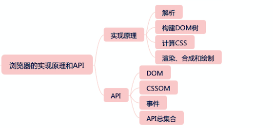

> [重学前端](https://time.geekbang.org/column/intro/154)，每天10分钟，重构你的前端知识体系。

# 列一份前端知识架构图

## 课程目标与内容

目标：

- 是把无法通过查阅解决的原理和背景讲清楚。
- 把不方便查阅和记忆的内容整理好。

>在这个课程里，我希望能和你一起打造一个前端知识的框架，再把知识点做个遍历，这其中，有原理和背景的部分，我去讲解知识的原理和背景。如果没有的话，我们就去讲整理和记忆这部分知识的方法，这样，即使你遇见无法一下子记住的知识，也可以很容易地查阅参考手册和标准来解决。

模块划分：

- 基础部分：
    - JavaScript 语言（模块一）
    - CSS 和 HTML（模块二）
    - 浏览器的实现原理和 API（模块三）
- 实践部分：介绍作者在工作过程中遇到的问题和解决方案，希望这块内容能够帮助你和你的前端团队找到可能的发展方向和着力点。

## 模块划分介绍

### JavaScript

知识图谱：

说明：

- 把语言按照`文法、语义和运行`时来拆分，这符合编程语言的一般规律：**用一定的词法和语法，表达一定语义，从而操作运行时。**
- 按照程序的一般规律，运行时分为数据结构和算法部分：
  - 数据结构包含类型和实例。
  - 算法，就是 JavaScript 的执行过程。

JavaScript 的类型系统就是它的 7 种基本类型和 7 种语言类型，实例就是它的内置对象部分。

 - 7 种基本类型对应：`undefined,null, object,boolean, string, number, symbol`
 - 7 种语言类型对应：`List 和 Record、Set、Completion Record、Reference、Property Descriptor、Lexical 、Environment 和 Environment Record、Data Block`

### HTML 和 CSS

知识图谱：

#### HTML

对于 HTML，按照`功能和语言`来划分它的知识。

- HTML 的功能主要由标签来承担。所以我们首先会把标签做一些分类，并对它们分别进行讲解。
- 除了标签之外，还应该把 HTML 当作一门语言来了解，了解` HTML 的语法`和几个重要的语言机制：`实体、命名空间`。
- HTML 的补充标准：ARIA，它是 HTML 的扩展，在可访问性领域，它有至关重要的作用。

HTML 标签分类

1. 文档元信息：通常是出现在 head 标签中的元素，包含了描述文档自身的一些信息；比如 `title、meta、style、link、base `。
2. 语义相关：扩展了纯文本，表达文章结构、不同语言要素的标签；比如 `section、nav `。
3. 链接：提供到文档内和文档外的链接；
4. 替换型标签：引入声音、图片、视频等外部元素替换自身的一类标签；比如 ` img、video、audio `。
5. 表单：用于填写和提交信息的一类标签；比如 ` input、button`。
6. 表格：表头、表尾、单元格等表格的结构。

#### CSS

从语言和功能两个角度去介绍 CSS。

- 语言部分：从大到小介绍 CSS 的各种语法结构，比如 `@rule、选择器、单位`等等。
- 功能部分，大致可以分为`布局、绘制和交互类`。

### 浏览器的实现原理和 API

知识图谱：

- 浏览器的实现原理：这是我们深入理解 API 的基础，从一般的浏览器设计出发，按照`解析、构建 DOM 树、计算 CSS、渲染、合成和绘制的流程`来讲解浏览器的工作原理。
- API 部分：事件、DOM、CSSOM 
- 其他的 API ：查阅文档

### 前端工程实践

知识图谱：

包括：性能、工具链、持续集成、搭建系统、架构与基础库。

- 性能：对任何一个前端团队而言，性能是它价值的核心指标。
- 工具链：探讨企业中工具链的建设思路。对一个高效又合作良好的前端团队来说，一致性的工具链是不可或缺的保障，作为开发阶段的入口，工具链又可以和性能、发布、持续集成等系统链接到一起，成为团队技术管理的基础。
- 持续集成：探讨针对前端的持续集成提出一些建设的思路。
- 搭建系统：前端工作往往多而繁杂，针对高重复性、可模块化的业务需求，传统的人工开发不再适用，搭建系统是大部分大型前端团队的选择。
- 架构与基础：软件架构师主要解决功能复杂性的问题，服务端架构师主要解决高流量问题，而前端是页面间天然解耦，分散在用户端运行的系统，但是前端架构也有自己要解决的问题。前端架构的主要职责是兼容性、复用和能力扩展。

## 汇总

