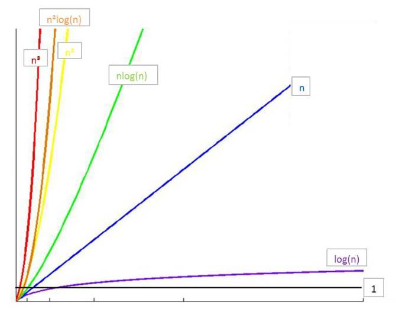

# 数据结构与算法-C语言描述

[C++基础教程完整版](http://yun.itheima.com/course/275.html) 数据结构部分学习记录。

---
## 1 数据结构概念

数据结构主要研究非数值计算问题的程序中的操作对象以及他们之间的关系，不是研究复杂的算法。数据结构是计算机存储、组织数据的方式。

数据结构中的基本概念：

- 数据：程序的操作对象，用于描述客观事物，数据是一个抽象的概念，将其进行分类后得到程序设计语言中的类型。如int、float、char等等。
- 数据元素：组成数据的基本单位。
- 数据项：一个数据元素由若干数据项组成。
- 数据对象：性质相同的数据元素的集合（比如数组、链表）。

```c
//声明一个结构体类型
struct Teacher//一种数据类型
{   charname[32];
    chartile[32];
    intage;charaddr[128];
};

int main(){
    struct Teacher1;//数据元素
    struct TeacherArray[30];//数据对象
    memset(&t1,0,sizeof(t1));
    strcpy(t1.name,"name");//数据项
    strcpy(t1.addr,"addr");//数据项
    strcpy(t1.tile,"addr");//数据项
    t1.age=1;
}
```

### 数据结构分类

数据结构可分为四类：集合、线性结构、树形结构、图形结构

- 线性结构举例：数组、链表、队列、栈
- 树形结构举例：二叉树、平衡树、排序树等
- 图形结构举例：有向图、无向图等

按照逻辑分类，数据结构又可以分为线性结构和非线性结构

按照存储方式分类，又可以分为顺序存储、链式存储、索引存储、散列存储

### 程序设计

用编程语言实现各种数据结构，针对每一种数据结构提供常用的操作方法，如插入、查找等。

---
## 2 算法概念

为什么我们学习数据结构还要了解算法？

    比如说有10个学生，我们将是10个学生保存在一个链表中，但是我不能把学生保存进去就完事了吧？我放进去是为了使用这些个数据完成一定的业务需求，比如按成绩大小排序并显示，比如计算这些学生的平均分等等，这些才是我们最终要解决的问题，既然要解决问题，那么就需要一些算法，比如排序算法，比如计算平均分的算法，所以数据结构和算法是互相配合完成工作。

算法是特定问题求解步骤的描述，在计算机中表现为指令的有限序列，算法是独立存在的一种解决问题的方法和思想。对于算法而言，语言并不重要，重要的是思想。

- 数据结构只是静态的描述了数据元素之间的关系，高效的程序需要在数据结构的基础上设计和选择算法
- 算法是为了解决实际问题而设计的。
- 数据结构是算法需要处理的问题载体。
- 数据结构与算法相辅相成
- 算法特性：输入、输出、有穷性、确定性、可行性
    - 有穷性：算法在有限的步骤之后会自动结束而不会无限循环，并且每一个步骤可以在接受的实际内完成
    - 确定性：算法中的每一步都有确定的含义，不会出现二义性
    - 可行性：算法的每一步都是可行的，也就是说每一步都能够执行有限的次数完成

---
### 算法效率的度量

#### 事后统计法

主要通过设计好的测试程序和数据，利用计算机的计时器对不同算法的编制的程序的运行时间进行比较，从而确定算法效率的高低。

- 统计方法：比较不同算法对同一组输入数据的运行处理时间。
- 缺陷：为了获得不同算法的运行时间必须编写相应程序；运行时间严重依赖硬件以及运行时的环境因素；算法的测试数据的选取相当困难
- 总结：事后统计法虽然直观，但是实施困难且缺陷多

#### 事前分析估算

在计算机程序编制前，依据统计方法对算法进行估算

- 统计方法：依据统计的方法对算法效率进行估算
- 影响算法效率的主要因素：算法采用的策略和方法、问题的输入规模、编译器所产生的代码、计算机执行速度

算法推倒的理论基础：

1. 算法最终编译成具体的计算机指令
1. 每一个指令，在具体的计算机上运行速度固定
1. 通过具体的步骤，就可以推导出算法的复杂度

怎么判断一个算法的效率：

- 判断一个算法的效率时，往往只需要关注操作数量的最高次项，其它次要项和常数项可以忽略。
- 在没有特殊说明时，我们所分析的算法的时间复杂度都是指最坏时间复杂度。
- 只有常数项记做1
- 操作数量的估算可以作为时间复杂度的估算

---
### 算法的时间复杂度：大O表示法

常见的时间复杂度

执行次数函数 | 阶 | 非正式术语
---|---|--- |
`12` | O(1) | 常数阶
`2n+3` | O(n) | 线性阶
`3n^2+2n+1` | O(n2) | 平方阶
`5(log2)n+20` | O(logn) | 对数阶
`2n+3n*(log2)n+19` | O(n logn) | n logn阶
`6n^3+2n2+3n+4` | O(n3) | 立方阶
`2^n` |O(2^n) | 指数阶


常用的时间复杂度所耗费的时间从小到大依次是：

```
O(1)< O(logn)< O(n) < O(nlogn) < O(n^2) < O(n^3) < O(2^n) < O(n!) < O(n^n)
```



总结：

- 只关注最高次项
- 时间复杂度是指最坏时间复杂度
- 只有常数项时记做 1

算法的空间复杂度：算法的空间复杂度并不是计算所有算法所占的空间，而是使用的辅助空间的大小。


