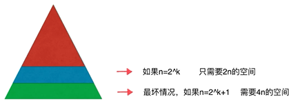
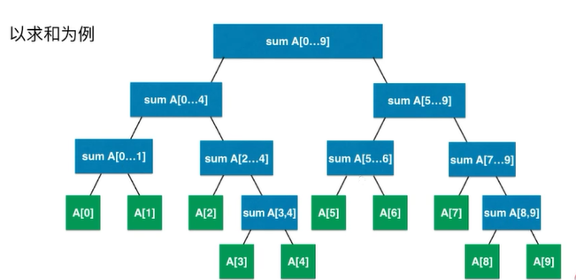
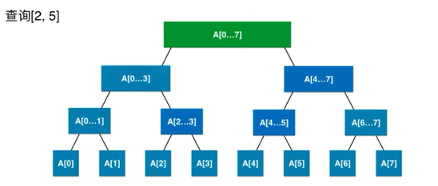
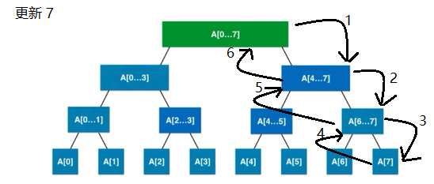
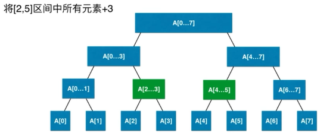
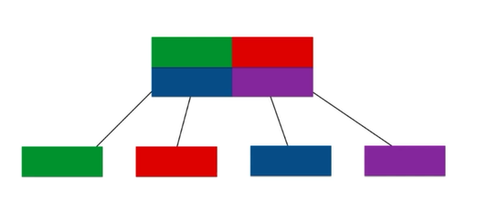
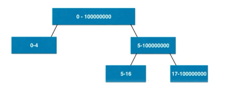

# SegmentTree（线段树、区间树）

线段树是一种二叉树，可视为树状数组的变种，最早出现在2001年，由程序竞赛选手发明。此数据结构实际应用用途不大，但由于其程序易于实现而被广泛应用于程序竞赛当中。其用途是在 `O(log N)` 查询一个指定区间内的信息，并可在同样的时间复杂度支持更新等操作。

线段树是一个平衡的二元树，所有叶子到根的距离最多只差1。令整个区间的长度为N，则其有N个叶节点，每个叶节点代表一个单位区间，每个内部结点代表的区间为其两个儿子代表区间的联集。——维基百科

---
## 1 为什么需要线段树

### 区间染色问题

有一面墙，长度为 n，每次选择一段进行染色（后面的选择区间可以覆盖前面已经染过色的区间）。求 m 次操作后，我们可以看到多少种颜色，或者在 [i,j] 的区间内可以看到多少种颜色。


两个操作：

- 染色操作（更新区间）
- 查询操作（查询区间）

如果使用数组实现，那么两个操作的时间复杂度都是 `O(n)` 的。

### 区间查询问题


把数据存储在一个区间中，我们关注的是对一个区间的操作，比如 [i,j]的最大值、最小值，或者区间数字之和。


而线段树正好适用于  **基于区间** 的统计查询问题。使用线段树可以把时间复杂度从 `O(n)` 优化到 `O(logn)`。

---
## 2 什么是线段树

- 对给定的数组构建成一个区间树。
- 不考虑向区间中添加或删除元素，大多数情况下，线段树所解决的问题中，区间本身是基于固定的，或者说是静态的。

以求和为例：根节点存储所有区间元素的和，往下的子节点把整个区间拆分成多个子空间，直到最后的叶子节点，只存储一个元素。


### 线段树是一颗平衡二叉树

平衡二叉树：树中最大的深度和最小的深度的差最多为 1，堆就是平衡二叉树，而二分搜索树不一定是平衡二叉树。


线段树是平衡二叉树，我们依然可以用数组表示，并且可以按照满二叉树进行处理，只需将缺失的叶子节点看作是带 null 数据节点即可。

### 如果有 n 个元素，用数组表示线段树需要多少个节点

对于满二叉树来说：

层级 | h 层有多少个节点
---|---
0 层 | 1
1 层 | 2
2 层 | 4
3 层 | 8
4 层 | 16
h 层 | 2<sup>(h-1)</sup>

- 第 h 层有 2<sup>(h -1)</sup> 个节点
- h 层的树有 （2<sup>1</sup> +2<sup>2</sup> + ... + 2<sup>(h-1)</sup>） = （2<sup>h</sup> -1）（大约是2<sup>h</sup>）
- 最后一层的节点上大致等于前面所有层节点之和。

由此推出：

- 如果 n = 2<sup>k</sup>（最好的情况），则需要 2n 个空间。

- 如果  n = 2<sup>k</sup> + 1（最差的情况），则需要 4n 的空间


所以最终得出，为了满足所有的情况，如果区间有 n 个元素，需要 4n 的空间来表示线段树。这是个估计值。比如当 n = 5 时，需要有很多的空节点占位，只有这样 A3 和 A4 才能出现在正确的位置上。


### 从数组构建线段树

参考下面图示



父节点是其两个子节点的 `综合`，`综合`这个操作是抽象的（可以是接口的形式暴露出去），应该根据业务逻辑而定，以求和为例，从根节点开始，根节点是数组中所有数据之和，同时也是其两个子节点之和。而两个子节点又分别是它们自己的子节点之和，依此类推，直到最后节点无法再分为止（即该线段只有一个元素），这显然是一个递归的过程，递归结束的条件是所有的子节点都不能在拆分了。

### 线段树的查询操作

参考下图：



比如，在线段树 `A[0,7]` 中查询 `[2,5]`，具体的过程是：

- 从根节点 `A[0,7]` 开始查询
- 如果查询区间 `[2,5]` 的右边界小于或等于 `A[0,7]` 的右孩子的左边界，则缩小范围，从 `A[0,7]` 的左孩子的区间 `A[0,3]` 中去查询。
- 如果查询区间 `[2,5]` 的左边界大于或等于 `A[0,7]` 的左孩子的右边界还大，则缩小范围，从 `A[0,7]` 的右孩子的区间 `A[4,7]` 中去查询。
- 如果查询区间 `[2,5]` 的范围既在 `A[0,7]` 的左孩子的区间 `A[0,3]` 中，也在 `A[0,7]` 的右孩子的区间 `A[4,7]` 中。则把查询区间拆分成两部分，左边部分的右边界是 `A[0,3]` 的右边界，即 `[2,3]`，右边部分的左边界是  `A[4,7]` 的左边界，即 `[4,5]`。然后将查询得到的两部分综合就是查询的结果了。
- 反复以上操作，不断缩小范围，直到查询区间 `[2,5]` 的左右边界完全匹配线段树中的左右边界为止，这明显也是一个递归的过程

### 线段树单个索引的更新操作

线段树对对应的数组区间一般是固定的，但是区间内部的数据是可以更新的，那么如何实现线段树中对某个索引的值进行更新呢？

- 更新只针对单个索引的。最终对应的线段树中的一个尾节点，一个节点值的更新，只会影响它的父节点。
- 首先从线段树的根节点开始，根据需要更新的索引值与根节点两个子区间的边界进行判断，如果需要更新的索引值在左孩子边界范围内，就进入左孩子区间中去继续查找，直到到达最后一个节点（此时左边界等于右边界）。这个线段树中的节点就对应数组中需要更新的索引，对其进行更新即可。
- 上面显然是一个递归的过程，不但深入到子节点中去，也就是不断地缩小区间范围。
- 递归右两个方向（前序遍历、后续遍历），一个是方法调用链不断入栈的过程，然后到达递归的结束条件后，就不断地出栈，在方法调用连出栈时，子节点已经被更新了，这时父节点只需要重新组合它的左右两个孩子的值来更新自身即可。




### 具体代码实现

```java
public class SegmentTree<E> {

    private E[] data;//用于存储数组中的数据
    private E[] tree;//用于存储线段树的各个节点
    private Merger<E> merger;

    @SuppressWarnings("unchecked")
    public SegmentTree(E[] data, Merger<E> merger) {
        this.merger = Objects.requireNonNull(merger);
        this.data = (E[]) new Object[data.length];
        //需要原数组长度的4倍才能满足构建所有情况下的线段树的空间
        this.tree = (E[]) new Object[data.length * 4];
        System.arraycopy(data, 0, this.data, 0, data.length);
        //l 和 r 总是在 0-data.length-1 的范围内，开始构建线段树
        buildSegment(0, 0, this.data.length - 1);
    }

    /**
     * 线段树中，组合两个子节点的操作。
     *
     * @author Ztiany
     * Email ztiany3@gmail.com
     * Date 2018/10/16 20:34
     */
    public interface Merger<E> {
        E merge(E left, E right);
    }

    public int getSize() {
        return data.length;
    }

    public E get(int index) {
        if (index < 0 || index >= data.length) {
            throw new IllegalArgumentException("Index is illegal.");
        }
        return data[index];
    }

    /*在treeIndex的位置创建表示区间 [l...r] 的线段树*/
    @SuppressWarnings("all")
    private void buildSegment(int treeIndex, int l, int r) {
        if (l == r) {
            //如果区间左边界等于右边界了，说明到了线段树的尾节点了（该线段只有一个元素了，无法再分了）
            //该线段树节点的值等于数组中对应为以自己边界索引对应的值
            tree[treeIndex] = data[l];
            return;
        }

        //现在l 和 r 肯定不相等，它们还可以继续拆分
        int leftIndex = leftChild(treeIndex);//左孩子索引
        int rightIndex = rightChild(treeIndex);//右孩子索引

        /*把父节点表示的空间拆分成两部分*/
        int middle = l + (r - l) / 2;//求 r 和 l 的中间值
        buildSegment(leftIndex, l, middle);
        buildSegment(rightIndex, middle + 1, r);

        //递归回来，子节点已经都被赋值了。
        //父节点是左右孩子的综合
        tree[treeIndex] = merger.merge(tree[leftIndex], tree[rightIndex]);
    }

    // 返回完全二叉树的数组表示中，一个索引所表示的元素的左孩子节点的索引
    private int leftChild(int index) {
        return 2 * index + 1;
    }

    // 返回完全二叉树的数组表示中，一个索引所表示的元素的右孩子节点的索引
    private int rightChild(int index) {
        return 2 * index + 2;
    }

    public E query(int queryL, int queryR) {
        if (queryL < 0 || queryL >= data.length || queryR < 0 || queryR >= data.length) {
            throw new IndexOutOfBoundsException("range ouf of bound");
        }
        return query(0, 0, data.length - 1, queryL, queryR);
    }

    /*在以treeIndex为根的线段树中[l...r]的范围里，搜索区间[queryL...queryR]的值*/
    private E query(int treeIndex, int treeL, int treeR, int queryL, int queryR) {
        //递归计算条条件
        if (treeL == queryL && treeR == queryR) {
            return tree[treeIndex];
        }

        int leftIndex = leftChild(treeIndex);//左孩子索引
        int rightIndex = rightChild(treeIndex);//右孩子索引
        int middle = treeL + (treeR - treeL) / 2;//求 r 和 l 的中间值

        // 1 如果查询区间的右边界小于或等于当前根节点的右孩子的左边界，则缩小范围，从左孩子的区间中去查询。
        if (queryR <= middle) {
            return query(leftIndex, treeL, middle, queryL, queryR);
        }
        //2 如果查询区间的左边界大于或等于根节点的左孩子的右边界，则缩小范围，从根节点 的右孩子的区间中去查询。
        else if (queryL >= middle + 1) {
            return query(rightIndex, middle + 1, treeR, queryL, queryR);
        }
        //3 如果查询区间的范围既在的左孩子的区间中，也在的右孩子的区间中。则把查询区间拆分成两部分，左边部分的右边界是的左孩子的右边界，
        //右边部分的左边界是右孩子的左边界，然后将查询得到的两部分综合就是查询的结果了。
        else {
            E leftPart = query(leftIndex, treeL, middle, queryL, middle);
            E rightPart = query(rightIndex, middle + 1, treeR, middle + 1, queryR);
            return merger.merge(leftPart, rightPart);
        }
    }

    /*更新线段树中的某索引对于的值*/
    public void set(int index, E newValue) {
        if (index < 0 || index >= getSize()) {
            throw new IndexOutOfBoundsException();
        }
        data[index] = newValue;
        set(0, 0, data.length - 1, index, newValue);
    }

    /*在以 treeIndex 为根节点的线段树中[l...r]的范围里，更新索引为 index 的值为 newValue*/
    @SuppressWarnings("all")
    private void set(int treeIndex, int l, int r, int index, E newValue) {
        //找到了对应的节点，就是递归结束条件
        if (l == r) {
            tree[treeIndex] = newValue;
            return;
        }

        int leftIndex = leftChild(treeIndex);//左孩子索引
        int rightIndex = rightChild(treeIndex);//右孩子索引
        int middle = l + (r - l) / 2;//求 r 和 l 的中间值

        if (index <= middle) {
            //如果需要更新的值在左孩子区间，就去左边区间去找
            set(leftIndex, l, middle, index, newValue);
        } else if (index >= middle + 1) {
            //如果需要更新的值在右孩子区间，就去右边区间去找
            set(rightIndex, middle + 1, r, index, newValue);
        }

        //递归回来，更新父节点
        tree[treeIndex] = merger.merge(tree[leftIndex], tree[rightIndex]);
    }


    @Override
    public String toString() {
        StringBuilder res = new StringBuilder();
        res.append('[');
        for (int i = 0; i < tree.length; i++) {
            if (tree[i] != null) {
                res.append(tree[i]);
            } else {
                res.append("null");
            }
            if (i != tree.length - 1) {
                res.append(", ");
            }
        }
        res.append(']');
        return res.toString();
    }

}
```

线段树树内部维护者两个数组 data 和 tree ，data 用于存储原始的区间数据，线段树就是以 data 所表示的区间来创建的，tree 用来存储树结构的节点，它的长度是 `4*data.length`，tree 中的每个元素都是一个节点，节点表示的是 data 中的一个范围（比如`0-10`），线段树的每个尾节点所表示的范围都是 1 个长度的，把所有的尾节点整合起来就是一份原始的区间数据 data，这一点是需要理解的，以更新操作为例，假设需要更新的是 index，那么怎么从线段树中去找到表示这个 index 的节点呢？首先这个节点肯定是一个尾节点，只有尾节点才表示单个值的范围，比如节点 `[1,1]` 就表示索引为 1 的值，所以其实是要找到线段树的所有尾节点中表示 `[index, index]` 区间的那个尾节点。


---
## 3 [LeetCode 303](https://leetcode-cn.com/problems/range-sum-query-immutable/description/)

### 方案 1，使用线段树（慢）

为基本类型创建线段树：

```java
public class IntSegmentTree {

    private int[] data;
    private int[] tree;
    private Merger merger;

    public IntSegmentTree(int[] data, Merger merger) {
        this.merger = Objects.requireNonNull(merger);
        this.data = new int[data.length];
        this.tree = new int[data.length * 4];
        System.arraycopy(data, 0, this.data, 0, data.length);
        buildSegment(0, 0, this.data.length - 1);
    }

    public interface Merger {
        int merge(int left, int right);
    }

    @SuppressWarnings("all")
    private void buildSegment(int treeIndex, int l, int r) {
        if (l == r) {
            tree[treeIndex] = data[l];
            return;
        }
        int leftIndex = leftChild(treeIndex);
        int rightIndex = rightChild(treeIndex);
        int middle = l + (r - l) / 2;
        buildSegment(leftIndex, l, middle);
        buildSegment(rightIndex, middle + 1, r);
        tree[treeIndex] = merger.merge(tree[leftIndex], tree[rightIndex]);
    }


    public int getSize() {
        return data.length;
    }

    public int get(int index) {
        if (index < 0 || index >= data.length) {
            throw new IllegalArgumentException("Index is illegal.");
        }
        return data[index];
    }

    private int leftChild(int index) {
        return 2 * index + 1;
    }

    private int rightChild(int index) {
        return 2 * index + 2;
    }

    public int query(int queryL, int queryR) {
        if (queryL < 0 || queryL >= data.length || queryR < 0 || queryR >= data.length) {
            throw new IllegalArgumentException("range ouf of bound");
        }
        return query(0, 0, data.length - 1, queryL, queryR);
    }

    private int query(int treeIndex, int treeL, int treeR, int queryL, int queryR) {
        if (treeL == queryL && treeR == queryR) {
            return tree[treeIndex];
        }

        int leftIndex = leftChild(treeIndex);
        int rightIndex = rightChild(treeIndex);
        int middle = treeL + (treeR - treeL) / 2;

        if (queryR <= middle) {
            return query(leftIndex, treeL, middle, queryL, queryR);
        } else if (queryL >= middle + 1) {
            return query(rightIndex, middle + 1, treeR, queryL, queryR);
        } else {
            int leftPart = query(leftIndex, treeL, middle, queryL, middle);
            int rightPart = query(rightIndex, middle + 1, treeR, middle + 1, queryR);
            return merger.merge(leftPart, rightPart);
        }

    }

    public void set(int index, int newValue) {
        if (index < 0 || index >= getSize()) {
            throw new IndexOutOfBoundsException();
        }
        data[index] = newValue;
        set(0, 0, data.length - 1, index, newValue);
    }

    @SuppressWarnings("all")
    private void set(int treeIndex, int l, int r, int index, int newValue) {
        if (l == r) {
            tree[treeIndex] = newValue;
            return;
        }
        int leftIndex = leftChild(treeIndex);
        int rightIndex = rightChild(treeIndex);
        int middle = l + (r - l) / 2;
        if (index <= middle) {
            set(leftIndex, l, middle, index, newValue);
        } else if (index >= middle + 1) {
            set(rightIndex, middle + 1, r, index, newValue);
        }
        tree[treeIndex] = merger.merge(tree[leftIndex], tree[rightIndex]);
    }
}
```

实现相对简单：

```java
public class LeetCode_303_1 {

    private IntSegmentTree mSegmentTree;

    public LeetCode_303_1(int[] nums) {
        if (nums.length <= 0) {
            return;
        }
        mSegmentTree = new IntSegmentTree(nums, (left, right) -> left + right);
    }

    public int sumRange(int i, int j) {
        if (mSegmentTree == null) {
            return 0;
        }
        return mSegmentTree.query(i, j);
    }

}
```

### 方案 2，使用预处理（快）

对于这个问题，可以使用预处理的方式，首先遍历一遍数组，计算每个区间之和，相对来说更快一些，只有一次 `O(n)`

```java
public class LeetCode_303_2 {

    private int[] sum;

    public LeetCode_303_2(int[] nums) {
        //预处理，sum中已经存储了各区间元素之和
        //sum[i]存储前 i 个元素之和，sum[0] = 0
        //sum[i]存储 nums [0,i-1]的和
        //sum[0] 表示的是 0 个元素之和
        //sum[1] 表示的是 1 个元素之和
        sum = new int[nums.length + 1];
        sum[0] = 0;
        for (int i = 1; i < sum.length; i++) {
            sum[i] = sum[i - 1] + nums[i - 1];
        }
    }

    public int sumRange(int i, int j) {
        //i  <= j
        return sum[j + 1]/*0-j 之和*/ - sum[i]/*0- (i-1)之和*/;
    }

}
```

---
## 4 [LeetCode 307](https://leetcode-cn.com/problems/range-sum-query-mutable/description/)

在 303 的基础上，307 的区间是可以动态更新的，这是就体现出了线段树的优势：

### 方案 1，使用预处理（慢）

多次 `O(n)` 操作

```java
public class LeetCode_307_1 {

    private int[] sum;
    private int[] data;

    public LeetCode_307_1(int[] nums) {
        //预处理，sum中已经存储了各区间元素之和
        //sum[i]存储前 i 个元素之和，sum[0] = 0
        //sum[i]存储 nums [0,i-1]的和
        //sum[0] 表示的是 0 个元素之和
        //sum[1] 表示的是 1 个元素之和
        data = new int[nums.length];
        System.arraycopy(nums, 0, data, 0, data.length);
        sum = new int[nums.length + 1];
        sum[0] = 0;
        for (int i = 1; i < sum.length; i++) {
            sum[i] = sum[i - 1] + nums[i - 1];
        }
    }

    public int sumRange(int i, int j) {
        //i  <= j
        return sum[j + 1]/*0-j 之和*/ - sum[i]/*0- (i-1)之和*/;
    }

    public void update(int i, int val) {
        data[i] = val;
        for (int k = i+1; k< sum.length;k++) {
            sum[k] = sum[k - 1] + data[k - 1];
        }
    }

}
```

### 方案 2，使用线段树（快）

这是就体现出了线段树的优势，查询和更新都是 `O(logn)` 的复杂度。

```java
public class LeetCode_307_2 {

    private IntSegmentTree mIntSegmentTree;

    public LeetCode_307_2(int[] nums) {
        if (nums.length > 0) {
            mIntSegmentTree = new IntSegmentTree(nums, (left, right) -> left + right);
        }
    }

    public int sumRange(int i, int j) {
        return mIntSegmentTree.query(i, j);
    }

    public void update(int i, int val) {
        mIntSegmentTree.set(i, val);
    }

}
```

---
## 5 扩展

### 实现对线段树的一个区间进行更新



实现方式：惰性更新、懒惰传播。

### 二维线段树



### 使用链式实现线段树

不需要浪费任何空间。

### 动态线段树

根据所关注的区间，动态扩展节点的线段树。




### 树状数组（Binary Index Tree）

略

### 区间相关的问题

- RMQ（Range Minimum Query）