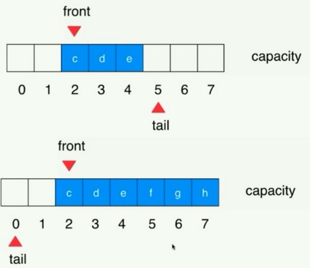

---
## 3 队列

### 简介

- 队列也是⼀种线性结构
- 相⽐数组，队列对应的操作是数组的⼦集
- 只能从⼀端（队尾）添加元素，只能从另⼀端（队⾸）取出元素
- 队列是⼀种先进先出的数据结构（先到先得），First In First Out (FIFO)


### 队列的实现

抽象队列的操作

```java
public interface Queue<E> {
    int getSize();
    boolean isEmpty();
    void enqueue(E e);
    E dequeue();
    E getFront();
}
```

队列可使用数组或者链表实现。

### 数组队列的性能问题

数组队列的 `dequeue` 操作的复杂度是 `O(n)` 的，因为每一次操作都需要移动数组中的元素

### 环形队列

使用环形队列，可以将 `dequeue` 操作的复杂度优化为 `O(1)` 级别的。环形队列实现：

- 环形队列的底层也是一个数组
- 有 front 和 tail 两个指针，front 指向第一个元素，tail 最后一个元素的下一个位置
- 队列为空时：`front == tail`
- 队列满时：`(tail + 1) % array.length == front`
- 环形队列的优点在于出队列时不需要移动元素，只需要将 front 向前移动
- 环形队列的底层数组会多两个一个空间，用于帮助判断队列是否已满

初始情况：


添加元素


出队列后



队列已满


