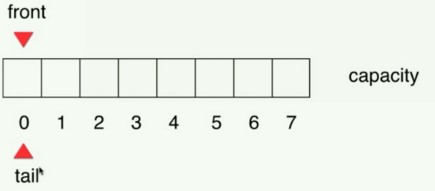
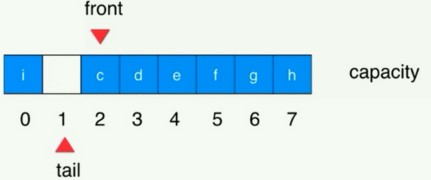

# 3 队列

---
## 1 简介

- 队列也是⼀种线性结构
- 相⽐数组，队列对应的操作是数组的⼦集
- 只能从⼀端（队尾）添加元素，只能从另⼀端（队⾸）取出元素
- 队列是⼀种先进先出的数据结构（先到先得），First In First Out (FIFO)

---
## 2 队列的实现

抽象队列的操作

```java
public interface Queue<E> {
    int getSize();
    boolean isEmpty();
    E getFront();
    /**入队*/
    void enqueue(E e);
    /**出队*/
    E dequeue();
}
```

队列可使用数组或者链表实现。

### 使用数组实现

```java
public class ArrayQueue<E> implements Queue<E> {

    private Array<E> mArray;

    public ArrayQueue() {
        mArray = new Array<>();
    }

    ArrayQueue(int capacity) {
        mArray = new Array<>(capacity);
    }

    @Override
    public int getSize() {
        return mArray.getSize();
    }

    @Override
    public boolean isEmpty() {
        return mArray.isEmpty();
    }

    @Override
    public void enqueue(E e) {
        mArray.addLast(e);
    }

    /*时间复杂度O(n)*/
    @Override
    public E dequeue() {
        return mArray.removeFirst();
    }

    @Override
    public E getFront() {
        return mArray.getFirst();
    }

    @Override
    public String toString() {
        StringBuilder res = new StringBuilder();
        res.append("Stack: ");
        res.append('[');
        for (int i = 0; i < mArray.getSize(); i++) {
            res.append(mArray.get(i));
            if (i != mArray.getSize() - 1)
                res.append(", ");
        }
        res.append("] top");
        return res.toString();
    }

}
```

---
## 3 数组队列的性能问题

数组队列的 `dequeue` 操作的复杂度是 `O(n)` 的，因为出队是移除头部元素，这样每一次操作都需要移动数组中的其他元素。可以使用环形队列优化性能。

---
## 4 环形队列

使用环形队列，可以将 `dequeue` 操作的复杂度优化为 `O(1)` 级别的。环形队列实现：

- 环形队列的底层也是一个数组。把数组的头和尾连接起来形成一个环。
- 有 front 和 tail 两个指针，front 指向第一个元素，tail 最后一个元素的下一个位置。front 和 tail 两个指针都是可以移动的。
- 队列为空时：`front == tail`。
- 队列满时：`(tail + 1) % array.length == front`。
- 环形队列的优点在于出队列时不需要移动元素，只需要将 front 向前移动。
- 环形队列的底层数组会浪费一个空间，用于帮助判断队列是否已满。但是一个空间的浪费是非常值得的。同时这种思路也可以应用于其他数据结构。

初始情况（队列为空）：



添加元素（移动tail）：


出队列后（移动front）：


队列已满（`(tail + 1) % array.length == front`）




### 环形队列实现

```java
public class LoopQueue<E> implements Queue<E> {

    private E[] data;
    private int front, tail;
    private int size;

    public LoopQueue() {
        this(10/*default*/);
    }

    @SuppressWarnings("unchecked")
    public LoopQueue(int capacity) {
        /*需要多一个空位，判断队列是否已满*/
        data = (E[]) new Object[capacity + 1];
        front = tail = size = 0;
    }

    public int getCapacity() {
        return data.length - 1;
    }

    @Override
    public int getSize() {
        return size;
    }

    @Override
    public boolean isEmpty() {
        return size == 0;
    }

    @Override
    public void enqueue(E e) {
        if ((tail + 1) % data.length == front/*队列已满*/) {
            resize(getCapacity() * 2);
        }
        data[tail] = e;
        tail = (tail + 1) % data.length;
        size++;
    }

    @Override
    public E dequeue() {
        if (isEmpty()) {
            throw new IllegalStateException("queue is empty");
        }

        E result = data[front];
        data[front] = null;
        size--;
        front = (front + 1) % data.length;

        /*缩容*/
        if (size <= getCapacity() / 4 && getCapacity() / 2 != 0) {
            resize(getCapacity() / 2);
        }

        return result;
    }

    @Override
    public E getFront() {
        return data[front];
    }

    private void resize(int newCapacity) {
        @SuppressWarnings("unchecked")
        E[] newData = (E[]) new Object[newCapacity + 1];
        /*调整队列*/
        for (int i = 0; i < size; i++) {
            newData[i] = data[(i + front) % data.length];
        }
        data = newData;
        front = 0;
        tail = size;
    }

    @Override
    public String toString(){
        StringBuilder res = new StringBuilder();
        res.append(String.format("Queue: size = %d , capacity = %d\n", size, getCapacity()));
        res.append("front [");
        for(int i = front; i != tail; i = (i + 1) % data.length){
            res.append(data[i]);
            if((i + 1) % data.length != tail)
                res.append(", ");
        }
        res.append("] tail");
        return res.toString();
    }

}
```

---
## 5 性能对比

```java
    /*
    ArrayQueue, time: 5.845564673 s
    LoopQueue, time: 0.022820496 s
    */
    private static void testPerformance() {
        int opCount = 100000;

        ArrayQueue<Integer> arrayQueue = new ArrayQueue<>();
        double time1 = testQueue(arrayQueue, opCount);
        System.out.println("ArrayQueue, time: " + time1 + " s");

        LoopQueue<Integer> loopQueue = new LoopQueue<>();
        double time2 = testQueue(loopQueue, opCount);
        System.out.println("LoopQueue, time: " + time2 + " s");
    }

    // 测试使用q运行opCount个enqueueu和dequeue操作所需要的时间，单位：秒
    @SuppressWarnings("all")
    private static double testQueue(Queue<Integer> q, int opCount) {
        long startTime = System.nanoTime();
        Random random = new Random();

        for (int i = 0; i < opCount; i++) {
            q.enqueue(random.nextInt(Integer.MAX_VALUE));
        }
        for (int i = 0; i < opCount; i++) {
            q.dequeue();
        }

        long endTime = System.nanoTime();
        return (endTime - startTime) / 1000000000.0;
    }
```