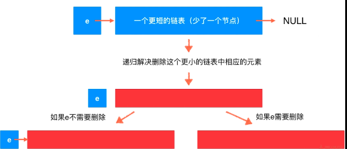
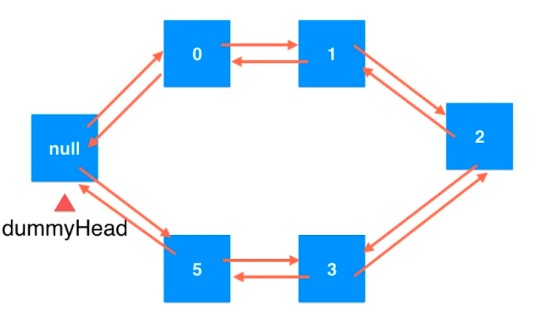
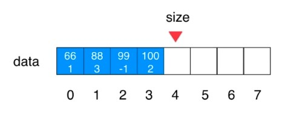

---
## 4 单向链表：最简单的动态数据结构

### 简介

数组是静态的数据结构，动态数组也只是对静态数组的封装，内部隐含了 resize 操作，而链表是真正的动态数据结构，

单向链表的特点：

- 有点：真正的动态，不需要处理固定容量的问题
- 缺点：丧失了随机访问的能⼒

### 单向链表实现

数据存储在“节点”（Node）中

```
class Node {
    E e;
    Node next;
} 
```

为链表设⽴虚拟头结点（dummyHead），虚拟头结点本身不存储任何数据，只作为头节点存在，添加了虚拟头结点后可以统一对节点操作逻辑，否则在添加元素时需要针对头节点进行额外的判断，因为头节点自身没有头节点。


### 链表的时间复杂度分析

添加操作：整体`O(n)`
- addLast(e) `O(n)` 
- addFirst(e) `O(1)` 
- add(index, e) `O(n)` 

删除操作：整体`O(n)`
- removeLast(e) `O(n)` 
- removeFirst(e) `O(1)` 
- remove(index, e) `O(n/2) = O(n)` 推导过程与数据数组相同

### 链表的应用

- 使⽤链表实现**栈**
- 使⽤链表实现**队列**：定义两个节点分别是 head 和 tail，head 用于删除元素，当作队列头，tail 用于添加元素，当作队尾部，性能与数组实现的环形链表差距不大。


---
## 5 链表与递归

### LeetCode 第203题

[删除链表中的节点](https://leetcode-cn.com/problems/remove-linked-list-elements/description/)

在链表中删除值为val的所有节点：

```
如 1->2->6->3->4->5->6->NULL，要求删除值为6的节点
返回 1->2->3->4->5->NULL
```

解决方案：

- 不使⽤虚拟头结点
    1. 针对头节点进行特殊判断，把所有头节点为 6 的节点移除，第一次循环
    2. 第二次循环，移除剩余链表中所有的值为 6 的节点
- 使用虚拟头节点
    1. 构建一个虚拟的头节点
    2. 一次循环移除链表中所有的值为 6 的节点

那么还有没有其他方法呢？答案是使用递归。

### 递归：递归的宏观语意

递归本质上，将原来的问题，转化为更⼩的同⼀问题。用同样的算法，解决返回更小的数据。

举例，用递归的方式来进行数组求和：

```
public static int sum(int[] arr, int l){ 
    if(l == arr.length) 
        return 0; 
    return arr[l] + sum(arr, l + 1); 
}
```

递归流程分析：

```
Sum( arr[0…n-1] ) = arr[0] + Sum( arr[1…n-1] ) <--更小的同一问题
Sum( arr[1…n-1] ) = arr[1] + Sum( arr[2…n-1] ) <--更小的同一问题
        .....
Sum( arr[n-1…n-1] ) = arr[n-1] + Sum( [] )     <--更小的同一问题
```

递归的宏观语意分为两部分

- 求解最基本的问题，也就是递归的结束条件
- 把原问题转化成 更⼩的问题

```
public static int sum(int[] arr, int l){ 
    if(l == arr.length) //求解最基本的问题
        return 0; 
    return arr[l] + sum(arr, l + 1); //把原问题转化成 更小的问题
}
```

### 链表天然的递归性

链表可以理解为一个头节点后面挂接这一个更短的链表，而后面那个更短的链表也可以通用这样看待。直到最后的 null 也可以看着一个节点，就是那个最基础的链表。


### 理解递归：递归的微观语义

针对 LeetCode 第203题 采用递归算法，将会变得非常简单：



每一次递归都将链表的头节点和之后的链表分开，在返回的时候，如果头节点的值等于需要删除的值，则返回头节点的下一个节点，否则直接返回头节点。

假设针对链表 `6->7->8->null`，需要删除值为 7 的节点，具体的过程（递归的微观语义）如下：


### 递归的调用栈

递归的调用与函数调用另外一个子函数并没有本质区别，只是它调用的子函数是自己而已，对于每一个函数，都会为该函数创建独立的栈帧，对不同的数据应用不同的算法。


### 递归的调试

为递归方法添加一个新的参数，`int deep`，打印出不同深度是的参数和返回值可以帮助自己更好的理解递归。


---
### 链表拓展

#### 斯坦福大学 18 个链表相关问题

[Linked List Problems](http://cslibrary.stanford.edu/105/LinkedListProblems.pdf)

#### 双向链表

```
class Node{
    E e;
    Node next, prev;
}
```


#### 循环列表



#### 数组链表

```
class Node{
    E e;
    int next;
}
```




