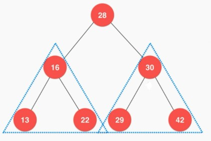
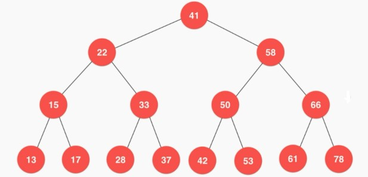
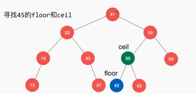
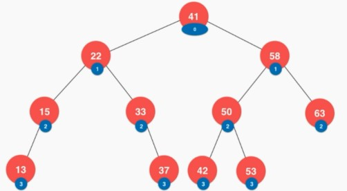

# 二分搜索树

维基百科：

    在计算机科学中，树（英语：tree）是一种抽象数据类型（ADT）或是实作这种抽象数据类型的数据结构，用来模拟具有树状结构性质的数据集合。
    它是由n（n>0）个有限节点组成一个具有层次关系的集合。把它叫做“树”是因为它看起来像一棵倒挂的树，也就是说它是根朝上，而叶朝下的。
    它具有以下的特点：

    - 每个节点有零个或多个子节点；
    - 没有父节点的节点称为根节点；
    - 每一个非根节点有且只有一个父节点；
    - 除了根节点外，每个子节点可以分为多个不相交的子树；


树的优点：

- 树结构本身是⼀种天然的组织结构
- 将数据使⽤树结构存储后，可能变得非常⾼效
- 和链表⼀样，属于动态数据结构

---
## 1 二叉树

- 二叉树具有唯一的根节点
- ⼆叉树每个节点最多有两个孩⼦，因此叫二叉树
- ⼆叉树每个节点最多有⼀个⽗亲
- ⼆叉树具有天然递归结构
    - 每个节点的左⼦树也是⼆叉树
    - 每个节点的右⼦树也是⼆叉树
- ⼆叉树不⼀定是“满”的，满的二叉树叫做完全二叉树

二叉树内部节点结构：

```java
class Node {
    E e;
    Node left;
    Node right;
}
```

图示：


二叉树的天然递归结构：




---
## 2 二分搜索树

- ⼆分搜索树是特殊的⼆叉树，即二分搜索树中存储的元素是有顺序的
- 二分搜索树要求存储的元素必须有可⽐较性
- 对于⼆分搜索树的每个节点的值：
    - ⼤于其左⼦树的所有节点的值
    - ⼩于其右⼦树的所有节点的值
- 树的每⼀棵⼦树也是⼆分搜索树



### 二分搜索树的遍历

- 遍历操作就是把所有节点都访问⼀遍

#### 深度优先遍历

在遍历树时，每个节点就将被访问三次，如果第一次访问该节点时就操作该节点，则为前序遍历，若在第二次访问该节点时才操作该节点，则为中序遍历，否则就是后序遍历。

- ⼆分搜索树的前序遍历
- ⼆分搜索树的中序遍历
- ⼆分搜索树的后序遍历

深度优先遍历的实现：

- 采用递归遍历树是非常简单的
- 如果要实现非递归的方式遍历树，则需要借助其他数据结构，比如栈

#### 广度优先遍历

广度优先遍历需要借助队列

---
### 二分搜索树的删除

- 删除二分搜索树的最⼩值
- 删除二分搜索树的最大值
- 删除二分搜索树的指定值

在删除二分搜索树的一个节点时，如果该树既有左子节点，也有右子节点，则可以采用 1962年 Hibbard 提出`Hibbard Deletion` 算法：

```
删除左右都有孩⼦的节点 d    
找到 s = min(d->right)    
s 是  的后继 
s->right = delMin(d->right)    
s->left = d->left    
删除d，s是新的⼦树的根a 
```


---
### 其他

#### 二分搜索树的顺序性

- 获取：minimum、maximum
- 获取指定节点的：successor、predecessor
- floor 和 ceil
- rank 和 select



#### 维护 size 的二分搜索树


#### 维护 depth 的二分搜索树



#### 支持重复元素的二分搜索树

- 多个节点法
- 单个结点计数法

