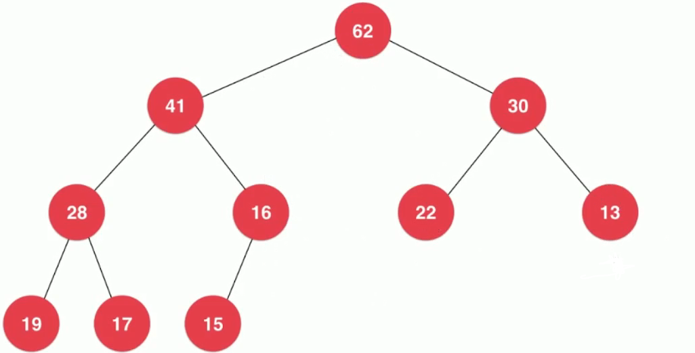
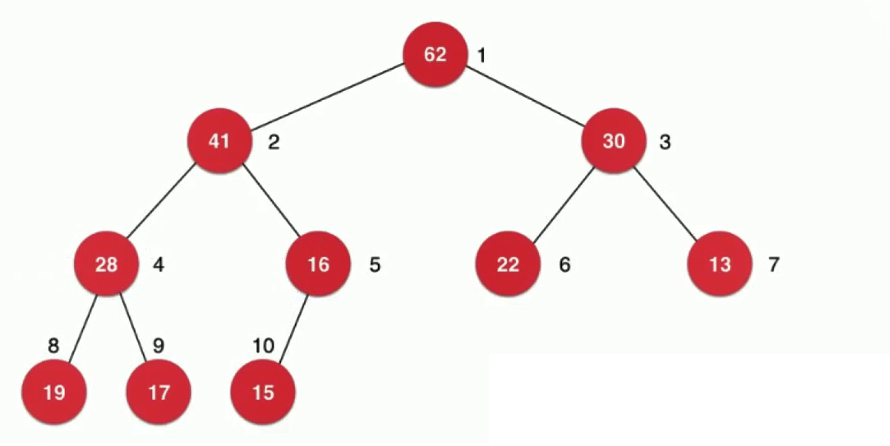
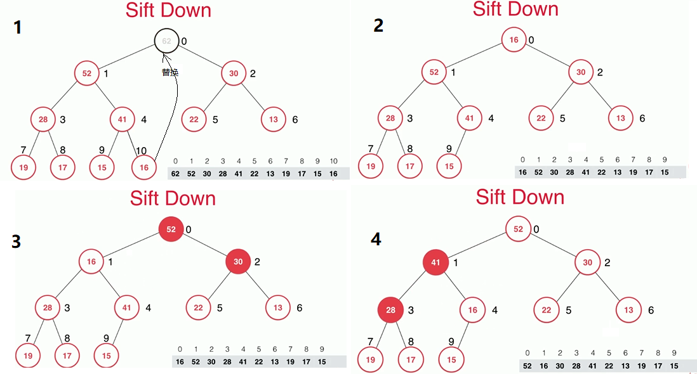
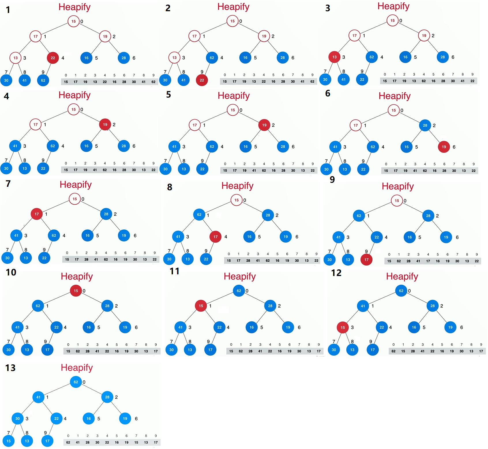
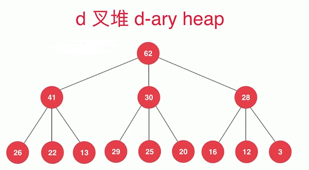

不局限于结构的本身，重要的是基于对其性质进行限制，可以创建其他高效的结构，这就是数据结构的灵活性。

---
## 1 优先队列

优先队列是计算机科学中的一类抽象数据类型。优先队列中的每个元素都有各自的优先级，优先级最高的元素最先得到服务；优先级相同的元素按照其在优先队列中的顺序得到服务。优先队列往往用堆来实现。——维基百科。

- 普通队列：先进先出、先进后出。
- 优先队列：出队顺序和入队顺序无关，和优先级有关。

应用场景（关键字：动态）

- 动态选择优先级最好的任务执行。

优先队列的实现：

- 优先队列一般使用堆实现。
- 优先队列提供的 API 与普通队列是一致的。即入队和出队。

使用其他方式实现的局限性：

操作|入队|出队
---|---|---
普通线性结构|O(1)|O(n)
顺序线性结构|O(n)|O(1)

---
## 2 堆

堆（英语：Heap）是计算机科学中的一种特别的树状数据结构。若是满足以下特性，即可称为堆：“给定堆中任意节点 P 和 C，若 P 是 C 的母节点，那么 P 的值会小于等于（或大于等于） C 的值”。若母节点的值恒小于等于子节点的值，此堆称为最小堆（英语：min heap）；反之，若母节点的值恒大于等于子节点的值，此堆称为最大堆（英语：max heap）。在堆中最顶端的那一个节点，称作根节点（英语：root node），根节点本身没有母节点（英语：parent node）。

### 二叉堆

- 二叉堆首先是完全二叉树（完全二叉树不一定是满二叉树，但缺失的节点一定是右边的子节点）：把元素顺序排列成树的形状。
- 如果堆中某个节点的值总是不大于其父亲节点的值。那它就是最大堆。
- 如果堆中某个节点的值总是不小于其父亲节点的值。那它就是最小堆。



### 使用数组实现二叉堆（最大堆）

堆中的各个节点存储在数组中，其索引位置对应了节点在堆中的位置(由上往下、由左到右)，参考下图。




观察可得如下结论：

- 索引 0 空出，根节点的索引为 1 。
- 根据子节点索引求父节点索引：`parent(i) = i/2`
- 根据父节点索引求左子节点索引：`leftChild(i) = 2 * i`
- 根据父节点索引求右节点索引：`rightChild(i) = 2 * i + 1`

当然索引 0 可以不空出，则根节点的索引为 0 ，此时的公式为：

- 根据子节点索引求父节点索引：`parent(i) = (i-1)/2`
- 根据父节点索引求左子节点索引：`leftChild(i) = 2 * i + 1`
- 根据父节点索引求右节点索引：`rightChild(i) = 2 * i + 2`

这三个操作在二叉堆的实现中很关键，代码实现如下：

```java
    // 返回完全二叉树的数组表示中，一个索引所表示的元素的父亲节点的索引
    public int parent(int index) {
        if (index == 0) {
            throw new IllegalArgumentException("index-0 doesn't have parent.");
        }
        return (index - 1) / 2;
    }

    // 返回完全二叉树的数组表示中，一个索引所表示的元素的左孩子节点的索引
    public int leftChild(int index) {
        return (index * 2) + 1;
    }

    // 返回完全二叉树的数组表示中，一个索引所表示的元素的左孩子节点的索引
    public int rightChild(int index) {
        return (index * 2) + 2;
    }
```

### 添加元素和 SiftUP（上浮）

添加元素的过程：

- 把元素添加到最后，复杂度 `O(1)`
- 为了满足二叉堆的需求，最后的元素需要不断和它的父节点比较，如果它比父节点还大，就需要与父节点对换位置，这样反复操作，直到满足二叉堆的条件。这个过程称之为上浮，复杂度 `O(logn)`


### Extract Max 和 SiftDown（下沉）

Extract Max（最大元素出队列）的过程：

- 获取最大值，复杂度 `O(1)`。
- 把堆中的最小值放到头节点的位置，复杂度 `O(1)`。
- 头节点不断和两个孩子节点中最大的那个做比较，如果比它下，就往下对换位置，这样反复操作，直到满足二叉堆的条件。这个过程称之为下沉，复杂度 `O(logn)`。




### heapify（将任意数组整理成堆的形状）

将任意数组整理成堆的形状的实现方式可以是遍历数组，依次将其添加到堆中，这个操作的复杂度是 `O(nlogn)`的，还有更快的方法，那就是 heapfiy，具体步骤如下：

- 将数组看成一棵完全二叉树（当然，此使它不满足堆）。
- 找到完全二叉树最后一个非叶子节点。以这个节点开始堆每一个非叶子节点不断地做 siftdown 操作。
- 如果找到最后一个非叶子节点呢，很简单，找到根据最后一个节点求其父节点的索引即可。



### 全部代码实现

```java
/**使用数组实现二叉堆，根节点从 0 开始存储。*/
public class ArrayMaxHeap<E extends Comparable<E>> {

    private Array<E> data;

    public ArrayMaxHeap(int capacity) {
        data = new Array<>(capacity);
    }

    public ArrayMaxHeap() {
        data = new Array<>();
    }

    public ArrayMaxHeap(E[] array) {
        data = new Array<>(array);
        //执行heapify，找到最后一个非叶子节点，以此进行siftDown操作
        for (int i = parent(size() - 1); i >= 0; i--) {
            siftDown(i);
        }
    }

    // 看堆中的最大元素
    public E findMax() {
        if (data.getSize() == 0) {
            throw new IllegalArgumentException("Can not findMax when heap is empty.");
        }
        return data.get(0);
    }

    public E extractMax() {
        E max = findMax();
        data.swap(0, size() - 1);//把最小值移动到根节点，把最大值移动到最后
        data.removeLast();//移除最大值
        siftDown(0);
        return max;
    }

    private void siftDown(int index) {
        while (leftChild(index) < size()/*循环条件，没有到最下层*/) {
            int target = leftChild(index);//先获取左节点
            if (target + 1 < size() && data.get(target).compareTo(data.get(target + 1)) < 0) {//找两个子节点中的最大值
                target++;//选择右节点
            }
            if (data.get(index).compareTo(data.get(target)) < 0/*父亲比孩子小则交换*/) {
                data.swap(index, target);
                index = target;
            } else {
                break;
            }
        }
    }

    public void add(E e) {
        //添加到末尾
        data.addLast(e);
        //调整树结构
        siftUp(size() - 1/*last index*/);
    }

    private void siftUp(int index) {
        while (index > 0 && (data.get(parent(index)).compareTo(data.get(index)) < 0)/*//父节点比自己还小*/) {
            int parent = parent(index);
            data.swap(parent, index);
            index = parent;
        }
    }

    public boolean isEmpty() {
        return data.isEmpty();
    }

    public int size() {
        return data.getSize();
    }

    // 返回完全二叉树的数组表示中，一个索引所表示的元素的父亲节点的索引
    public int parent(int index) {
        if (index == 0) {
            throw new IllegalArgumentException("index-0 doesn't have parent.");
        }
        return (index - 1) / 2;
    }

    // 返回完全二叉树的数组表示中，一个索引所表示的元素的左孩子节点的索引
    public int leftChild(int index) {
        return (index * 2) + 1;
    }

    // 返回完全二叉树的数组表示中，一个索引所表示的元素的左孩子节点的索引
    public int rightChild(int index) {
        return (index * 2) + 2;
    }

    //获取最大的元素，然后插入新的元素
    public E replace(E newE) {
        E max = findMax();
        data.set(0, newE);
        siftDown(0);
        return max;
    }

}
```


在数组实现二叉堆中，可以看出，树是一种精妙的结构，它把元素按照树状排列，使我们对元素的操作多了一个维度（即树的高度），保留了数组原本的高效索引元素的特性，又纵向地把元素按照树父子节点的关系拆分成多条链表，从而大大提升了数据存取的效率。

---
## 3 heapify 性能对比

```java
private static void testHeapify() {
        int n = 5000000;
        Random random = new Random();
        Integer[] arr = new Integer[n];

        for (int i = 0; i < n; i++) {
            arr[i] = random.nextInt(Integer.MAX_VALUE);
        }

        testHeapify(arr, false);
        testHeapify(arr, true);
    }

    private static void testHeapify(Integer[] arr, boolean useHeapify) {
        long startTime = System.nanoTime();
        ArrayMaxHeap<Integer> heap;

        if (useHeapify) {
            heap = new ArrayMaxHeap<>(arr);
        } else {
            heap = new ArrayMaxHeap<>(arr.length);
            for (Integer integer : arr) {
                heap.add(integer);
            }
        }

        int size = heap.size();
        int[] testArr = new int[size];
        for (int i = 0; i < size; i++) {
            testArr[i] = heap.extractMax();
        }
        for (int i = 1; i < testArr.length; i++) {
            if (testArr[i - 1] < testArr[i]) {
                throw new IllegalArgumentException("Error");
            }
        }

        long endTime = System.nanoTime();

        System.out.println("Test MaxHeap completed.");

        System.out.println("useHeapify = " + useHeapify + " use time =" + ((endTime - startTime) / 1000000000.0) +"s");
    }
```

打印结果：

    Test MaxHeap completed.
    useHeapify = false use time =3.967725419s
    Test MaxHeap completed.
    useHeapify = true use time =3.708361005s

可以看出，使用 heapify 还是要快一些的。

---
## 4 实现 PriorityQueue

```java
public class PriorityQueue<E extends Comparable<E>> implements Queue<E> {

    private ArrayMaxHeap<E> mMaxHeap = new ArrayMaxHeap<>();

    @Override
    public int getSize() {
        return mMaxHeap.size();
    }

    @Override
    public boolean isEmpty() {
        return mMaxHeap.isEmpty();
    }

    @Override
    public void enqueue(E e) {
        mMaxHeap.add(e);
    }

    @Override
    public E dequeue() {
        return mMaxHeap.extractMax();
    }

    @Override
    public E getFront() {
        return mMaxHeap.findMax();
    }
}
```

---
## 5 在 N 个元素中如何选出前 M 个最大的元素？

面试形式：在 1000000 个元素中如何选出前 100 名？

解决方案：

- 1 先排序，再获取前 M 个，复杂度为 `O(nlogn)`
- 2 使用优先队列，复杂度为 `O(nlogm)`，如果 m = 100，那么比上面快大概 3 倍。

使用优先队列的实现方式是

1. 肯定需要对 N 个元素进行遍历。
2. 使用优先队列来维护当前看到的前 M 个元素。先把这 N 个的前 M 个放入队列中
3. 然后对剩下的元素进行遍历，每遍历一个元素，如果发现该元素比优先队列中最小的那个元素还要大，则使用这个元素来替换优先队列中那个最小的元素。
4. 使用最大堆和最小堆都可以。如果使用最大堆我们需要自定义排序规则，值越小优先级越高。
5. 扫描完后，优先队列中就是 N 个元素中最大的前 M 个。

LeetCode 347 有类似问题。  

---
## 6 [LeetCode 347](https://leetcode-cn.com/problems/top-k-frequent-elements/)

使用自己实现的 PriorityQueue（最大堆）。

```java
    /**
     * 前K个高频元素
     */
    public List<Integer> topKFrequent(int[] nums, int k) {
        Map<Integer, Integer> map = new TreeMap<>();

        for (int num : nums) {
            if (map.containsKey(num)) {
                map.put(num, map.get(num) + 1);
            } else {
                map.put(num, 1);
            }
        }

        PriorityQueue<Freq> queue = new PriorityQueue<>();

        for (Map.Entry<Integer, Integer> entry : map.entrySet()) {
            if (queue.getSize() < k) {
                //先入队k个
                queue.enqueue(new Freq(entry.getKey(), entry.getValue()));
            } else if (queue.getFront().freq < entry.getValue()/*新的元素的频次比如队列中频次最小的要大则替换*/) {
                queue.dequeue();
                queue.enqueue(new Freq(entry.getKey(), entry.getValue()));
            }
        }

        LinkedList<Integer> integers = new LinkedList<>();
        while (!queue.isEmpty()) {
            integers.addFirst(queue.dequeue().value);
        }

        return integers;
    }

    /**
     * 频次
     */
    private class Freq implements Comparable<Freq> {

        int value, freq;

        Freq(int value, int freq) {
            this.value = value;
            this.freq = freq;
        }

        /*使用的是最大堆，此次实现与使用的堆有关*/
        @Override
        public int compareTo(Freq other) {
            //凭此越小，优先级越高
            if (this.freq < other.freq) {
                return 1;
            } else if (this.freq > other.freq) {
                return -1;
            }
            return 0;
        }
    }

}
```

使用 Java 中的 PriorityQueue（最小堆）。

```java

public class LeetCode_347 {

    /**
     * 前K个高频元素
     */
    public List<Integer> topKFrequent(int[] nums, int k) {
        Map<Integer, Integer> map = new TreeMap<>();

        for (int num : nums) {
            if (map.containsKey(num)) {
                map.put(num, map.get(num) + 1);
            } else {
                map.put(num, 1);
            }
        }

        java.util.Queue<Freq> queue = new java.util.PriorityQueue<>();

        for (Map.Entry<Integer, Integer> entry : map.entrySet()) {
            if (queue.size() < k) {
                //先入队k个
                queue.add(new Freq(entry.getKey(), entry.getValue()));
            } else if (queue.peek().freq < entry.getValue()/*新的元素的频次比如队列中频次最小的要大则替换*/) {
                queue.remove();
                queue.add(new Freq(entry.getKey(), entry.getValue()));
            }
        }

        LinkedList<Integer> integers = new LinkedList<>();
        while (!queue.isEmpty()) {
            integers.addFirst(queue.remove().value);
        }

        return integers;
    }

    /**
     * 频次
     */
    private class Freq implements Comparable<Freq> {

        int value, freq;

        Freq(int value, int freq) {
            this.value = value;
            this.freq = freq;
        }

        /*使用的是Java的最小堆，此次实现与使用的堆有关*/
        @Override
        public int compareTo(Freq other) {
            //频次越小，优先级越低
            if (this.freq < other.freq) {
                return -1;
            } else if (this.freq > other.freq) {
                return 1;
            }
            return 0;
        }
    }

}
```

---
## 7 扩展

### d 叉堆



相对于二叉堆而言， d 叉堆的每个节点有  d 个孩子。d 取 2 还是其他数来达到最高的效率，是一个需要权衡的问题。

### 其他堆

- 索引堆：可以索引堆中的节点。
- 斐波那契堆。

---
### 8 广义的队列

- 只要支持 Queue 的都可以认为是队列。
- 栈可以认为是一个队列。