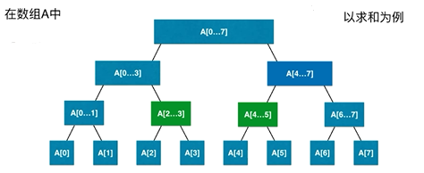
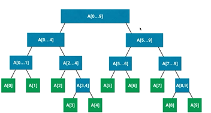
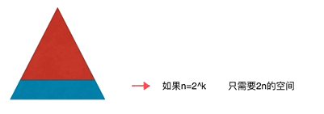
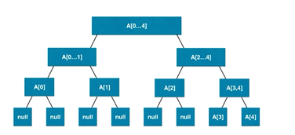

# SegmentTree（线段树、区间树）

线段树是一种二叉树，可视为树状数组的变种，最早出现在2001年，由程序竞赛选手发明。此数据结构实际应用用途不大，但由于其程序易于实现而被广泛应用于程序竞赛当中。其用途是在 `O(log N)` 查询一个指定区间内的信息，并可在同样的时间复杂度支持更新等操作。

线段树是一个平衡的二元树，所有叶子到根的距离最多只差1。令整个区间的长度为N，则其有N个叶节点，每个叶节点代表一个单位区间，每个内部结点代表的区间为其两个儿子代表区间的联集。——维基百科

## 1 为什么需要线段树

### 区间染色

有一面墙，长度为 n，每次选择一段进行染色（后面的选择区间可以覆盖前面已经染过色的区间）。求 m 次操作后，我们可以看到多少种颜色，或者在 [i,j] 的区间内可以看到多少种颜色。

两个操作：

- 染色操作（更新区间）
- 查询操作（查询区间）

如果使用数组实现，那么两个操作的时间复杂度都是 `O(n)` 的。

### 区间查询

把数据存储在一个区间中，我们关注的是对一个区间的操作，比如 [i,j]的最大值、最小值，或者区间数字之和。

线段树适用于 **动态** 地 **基于区间** 的统计查询。使用线段树可以把`O(n)` 优化到 `O(logn)`。

---
## 2 什么是线段树

- 对给定的数组构建成一个区间树。
- 不考虑向区间中添加或删除元素，大多数情况下，线段树所解决的问题，区间本身是基于固定的。

以求和为例：根节点存储所有区间元素的和，往下子节点拆分成多个子空间，直到最后的叶子节点，只存储一个元素。

### 线段树是一颗平衡二叉树

平衡二叉树：树中最大的深度和最小的深度的差最多为 1，堆就是平衡二叉树，而二分搜索树不一定是平衡二叉树。

线段树是平衡二叉树，我们依然可以用数组表示，并且可以按照满二叉树进行处理，只需将缺失的叶子节点看做是带 null 数据节点即可。

### 如果有n个元素，数组表示需要多少个节点

对于满二叉树来说：

层级 | h 层有多少个节点
---|---
0 层 | 1
1 层 | 2
2 层 | 4
3 层 | 8
4 层 | 16
h 层 | 2(h-1)

- 第 (h-1) 层有 2(h -1) 个节点，
- h 层的树有 （21 +22 + ... + 2(h-1)） = （2h -1）（大约是2h）
- 最后一层的节点上大致等于前面所有层节点之和。

由此推出：

- 如果 n = 2k（最好的情况），则需要 2n 个空间。

- 如果  n = 2k + 1（最差的情况），则需要 4n 的空间

所以最终得出，为了满足所有的情况，如果区间有 n 个元素，需要 4n 的空间来表示线段树。这是个估计值。比如当 n = 5 时，需要有很多的空节点占位，只有这样 A3 和 A4 才能出现在正确的位置上。

