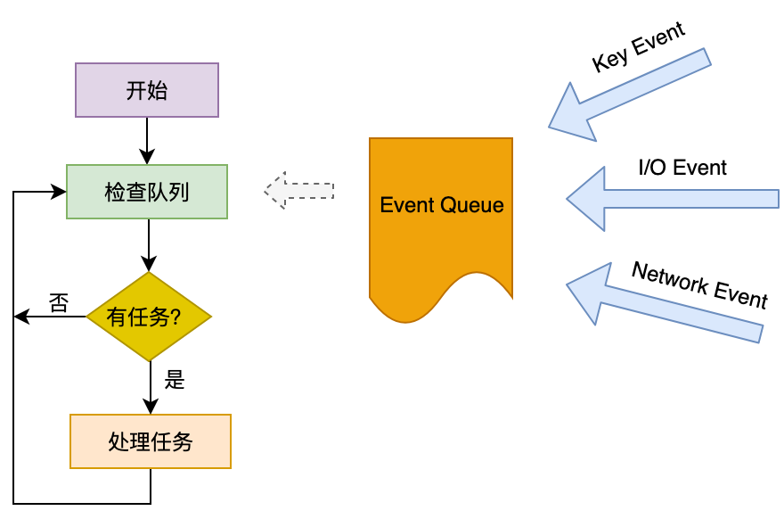
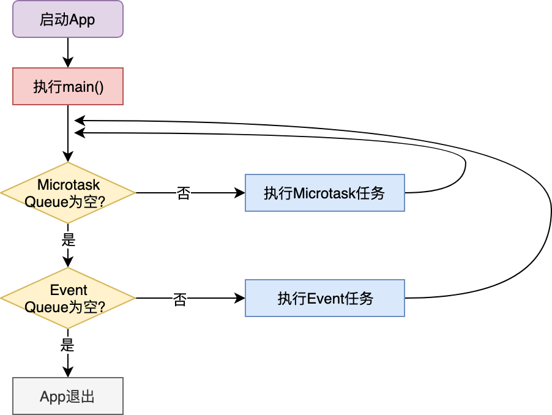
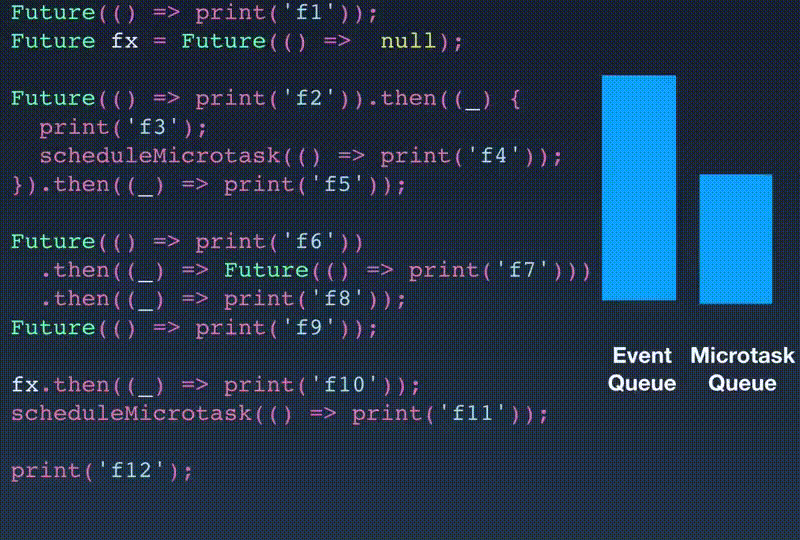

# Dart 单线程模型

支撑起这些复杂的能力背后，实际上是基于单线程模型的 Dart。

本篇内容包括：

- Dart 语言的 Event Loop 处理机制、异步处理和并发编程的原理和使用方法。
- 异步任务与异步函数。
- Isolate。

## 1 Event Loop 机制

**Dart 是单线程的**：这意味着 Dart 代码是有序的，按照在 main 函数出现的次序一个接一个地执行，不会被其他代码中断。

**单线程和异步并不冲突**：作为支持 Flutter 这个 UI 框架的关键技术，Dart 当然也支持异步。为什么单线程也可以异步？

1. 事件循环机制。
2. 等待不等于阻塞。

>这里的异步，本质上跟 Android 中使用 Handler.post(Runnable) 是一致的。

理解说明：

1. 我们的 App 绝大多数时间都在等待。比如，等用户点击、等网络请求返回、等文件 IO 结果，等等。而这些等待行为并不是阻塞的。比如说，网络请求，Socket 本身提供了 select 模型可以异步查询；而文件 IO，操作系统也提供了基于事件的回调机制。
2. 基于这些特点，单线程模型可以在等待的过程中做别的事情，等真正需要响应结果了，再去做对应的处理。因为等待过程并不是阻塞的，所以给我们的感觉就像是同时在做多件事情一样。但其实始终只有一个线程在处理你的事情。

等待这个行为是通过 Event Loop 驱动的。像其他语言一样，Dart 也有一个巨大的事件循环，在不断的轮询事件队列，取出事件（比如，键盘事件、I\O 事件、网络事件等），在主线程同步执行其回调函数，如下图所示：



## 2 异步任务

事实上，图 1 的 Event Loop 示意图只是一个简化版。在 Dart 中，实际上有两个队列：

1. 一个事件队列（Event Queue）；
2. 一个是微任务队列（Microtask Queue）。

在每一次事件循环中，Dart 总是先去第一个微任务队列中查询是否有可执行的任务，如果没有，才会处理后续的事件队列的流程。



### 微任务队列：Microtask Queue

微任务顾名思义，**表示一个短时间内就会完成的异步任务**。从上面的流程图可以看到，微任务队列在事件循环中的优先级是最高的，只要队列中还有任务，就可以一直霸占着事件循环。

微任务是由 scheduleMicroTask 建立的：

```dart
scheduleMicrotask(() => print('This is a microtask'));
```

**微任务队列的使用场景毕竟少**：一般的异步任务通常很少必须要在事件队列前完成，所以也不需要太高的优先级，因此我们通常很少会直接用到微任务队列，就连 Flutter 内部，也只有 7 处用到了而已（比如，手势识别、文本输入、滚动视图、保存页面效果等需要高优执行任务的场景）。

## 任务队列：Event Queue

异步任务队列 EventQueue 更为常用，比如，I/O、绘制、定时器这些异步事件，都是通过事件队列驱动主线程执行的。

### Future

**Dart 为 Event Queue 的任务建立提供了一层封装，叫作 Future**。其表示一个在未来才会完成的任务。

1. 把一个函数体放入 Future，就完成了从同步任务到异步任务的包装。
2. Future 还提供了链式调用的能力，可以使用 `then` 在异步任务执行完毕后依次执行链路上的其他函数体。

```dart
// 下一个事件循环输出字符串
Future(() => print('Running in Future 1'));

// 上一个事件循环结束后，连续输出三段字符串
Future(() => print(‘Running in Future 2'))
  .then((_) => print('and then 1'))
  .then((_) => print('and then 2’));
```

### Future 的执行规则

- **then 与 Future 函数体共用一个事件循环**：声明一个 Future 时，Dart 会将异步任务的函数执行体放入事件队列，然后立即返回，后续的代码继续同步执行。而当同步执行的代码执行完毕后，事件队列会按照加入事件队列的顺序（即声明顺序），依次取出事件，最后同步执行 Future 的函数体及后续的 then。如果 Future 有多个 then，它们也会按照链式调用的先后顺序同步执行，同样也会共用一个事件循环。
- 如果 Future 执行体已经执行完毕了，但又拿着这个 Future 的引用，往里面加了一个 then 方法体，这时 Dart 会将后续加入的 then 方法体放入微任务队列，尽快执行。

参考下面示例:

- 在第一个例子中，由于 f1 比 f2 先声明，因此会被先加入事件队列，所以 f1 比 f2 先执行；
- 在第二个例子中，由于 Future 函数体与 then 共用一个事件循环，因此 f3 执行后会立刻同步执行 then 3；
- Future 函数体是 null，这意味着它不需要也没有事件循环，因此后续的 then 也无法与它共享。在这种场景下，Dart 会把后续的 then 放入微任务队列，在下一次事件循环中执行。

```dart
//f1 比 f2 先执行
Future(() => print('f1'));
Future(() => print('f2'));

//f3 执行后会立刻同步执行 then 3
Future(() => print('f3')).then((_) => print('then 3'));

//then 4 会加入微任务队列，尽快执行
Future(() => null).then((_) => print('then 4'));
```

### 综合案例

```dart
Future(() => print('f1'));// 声明一个匿名 Future
Future fx = Future(() =>  null);// 声明 Future fx，其执行体为 null

// 声明一个匿名 Future，并注册了两个 then。在第一个 then 回调里启动了一个微任务
Future(() => print('f2')).then((_) {
  print('f3');
  scheduleMicrotask(() => print('f4'));
}).then((_) => print('f5'));

// 声明了一个匿名 Future，并注册了两个 then。第一个 then 是一个 Future
Future(() => print('f6'))
  .then((_) => Future(() => print('f7')))
  .then((_) => print('f8'));

// 声明了一个匿名 Future
Future(() => print('f9'));

// 往执行体为 null 的 fx 注册了了一个 then
fx.then((_) => print('f10'));

// 启动一个微任务
scheduleMicrotask(() => print('f11'));
print('f12');
```

执行结果：

```dart
f12
f11
f1
f10
f2
f3
f5
f4
f6
f9
f7
f8
```

说明：

- 因为其他语句都是异步任务，所以先打印 f12。
- 剩下的异步任务中，微任务队列优先级最高，因此随后打印 f11；然后按照 Future 声明的先后顺序，打印 f1。
- 随后到了 fx，由于 fx 的执行体是 null，相当于执行完毕了，Dart 将 fx 的 then 放入微任务队列，由于微任务队列的优先级最高，因此 fx 的 then 还是会最先执行，打印 f10。
- 然后到了 fx 下面的 f2，打印 f2，然后执行 then，打印 f3。f4 是一个微任务，要到下一个事件循环才执行，因此后续的 then 继续同步执行，打印 f5。本次事件循环结束，下一个事件循环取出 f4 这个微任务，打印 f4。
- 然后到了 f2 下面的 f6，打印 f6，然后执行 then。这里需要注意的是，这个 then 是一个 Future 异步任务，因此这个 then，以及后续的 then 都被放入到事件队列中了。
- f6 下面还有 f9，打印 f9。
- 最后一个事件循环，打印 f7，以及后续的 f8。



注意：**then 会在 Future 函数体执行完毕后立刻执行，无论是共用同一个事件循环还是进入下一个微任务**。

其次，下面代码的执行顺序是：`f6 f8 f7`：

```dart
  Future(() => print('f6'))
      .then((_) => scheduleMicrotask(()=>print('f7')))
      .then((_) => print('f8'));
```

## 3 异步函数

对于一个异步函数来说，其返回时内部执行动作并未结束，因此需要返回一个 Future 对象，供调用者使用。调用者根据 Future 对象，来决定：

- 是在这个 Future 对象上注册一个 then，等 Future 的执行体结束了以后再进行异步处理；
- 还是一直同步等待 Future 执行体结束。

对于异步函数返回的 Future 对象，如果调用者决定**同步等待**，则需要在调用处使用 await 关键字，并且在调用处的函数体使用 async 关键字。

示例：异步方法延迟 3 秒返回了一个 Hello 2019，在调用处我们使用 await 进行持续等待，等它返回了再打印：

```dart
// 声明了一个延迟 3 秒返回 Hello 的 Future，并注册了一个 then 返回拼接后的 Hello 2019
Future<String> fetchContent() =>
  Future<String>.delayed(Duration(seconds:3), () => "Hello")
    .then((x) => "$x 2019");

main() async{
    print(await fetchContent());// 等待 Hello 2019 的返回
}
```

在使用 await 进行等待的时候，在等待语句的调用上下文函数 main 加上了 async 关键字。为什么要加这个关键字呢？

**async 的作用**：Dart 中的 await 并不是阻塞等待，而是异步等待。Dart 会将调用体的函数也视作异步函数，将等待语句的上下文放入 Event Queue 中，一旦有了结果，Event Loop 就会把它从 Event Queue 中取出，等待代码继续执行。

### 示例 1

第二行的 then 执行体 f2 是一个 Future，为了等它完成再进行下一步操作，我们使用了 await：

- 期望打印结果为 `f1、f2、f3、f4`
- 实际上打印出来的结果其实是 `f1、f4、f2、f3`

```dart
Future(() => print('f1'))
  .then((_) async => await Future(() => print('f2')))
  .then((_) => print('f3'));

Future(() => print('f4'));
```

说明:

1. 按照任务的声明顺序，f1 和 f4 被先后加入事件队列。
2. f1 被取出并打印；然后到了 then。then 的执行体是个 future f2，于是放入 Event Queue。然后把 await 也放到 Event Queue 里。
3. 这个时候 Event Queue 里面还有一个 f4，我们的 await 并不能阻塞 f4 的执行。因此，Event Loop 先取出 f4，打印 f4；然后才能取出并打印 f2，最后把等待的 await 取出，开始执行后面的 f3。

由于 await 是采用事件队列的机制实现等待行为的，所以比它先在事件队列中的 f4 并不会被它阻塞。

### 示例 2

在主函数调用一个异步函数去打印一段话，而在这个异步函数中，我们使用 await 与 async 同步等待了另一个异步函数返回字符串：

```dart
// 声明了一个延迟 2 秒返回 Hello 的 Future，并注册了一个 then 返回拼接后的 Hello 2019
Future<String> fetchContent() =>
  Future<String>.delayed(Duration(seconds:2), () => "Hello")
    .then((x) => "$x 2019");

// 异步函数会同步等待 Hello 2019 的返回，并打印
func() async => print(await fetchContent());

main() {
  print("func before");
  func();
  print("func after");
}
```

运行这段代码，我们发现最终输出的顺序其实是“func before”“func after”“Hello 2019”。说明：

1. 首先，第一句代码是同步的，因此先打印“func before”。
2. 然后，进入 func 函数，func 函数调用了异步函数 fetchContent，并使用 await 进行等待，因此我们把 fetchContent、await 语句的上下文函数 func 先后放入事件队列。
3. await 的上下文函数并不包含调用栈，因此 func 后续代码继续执行，打印“func after”。
4. 2 秒后，fetchContent 异步任务返回“Hello 2019”，于是 func 的 await 也被取出，打印“Hello 2019”。

对此，我们只需要注意 **await 与 async 只对调用上下文的函数有效，并不向上传递**。因此对于这个案例而言，func 是在异步等待。如果我们想在 main 函数中也同步等待，需要在调用异步函数时也加上 await，在 main 函数也加上 async。

## 4 Isolate

**Isolate 的引入**： Dart 是基于单线程模型的，但为了进一步利用多核 CPU，将 CPU 密集型运算进行隔离，Dart 也提供了多线程机制，即 Isolate。

**Isolate 的特点**：每个 Isolate 都有自己的 Event Loop 与 Queue，Isolate 之间不共享任何资源，只能依靠消息机制通信，因此也就没有资源抢占问题。

### Isolate 的使用

Isolate 的创建非常简单，我们只要给定一个函数入口，创建时再传入一个参数，就可以启动 Isolate 了。

```dart
doSth(msg) => print(msg);

main() {
  Isolate.spawn(doSth, "Hi");
  ...
}
```

### Isolate 通信：管道（SendPort）

Isolate 通过发送管道（SendPort）实现消息通信机制。我们可以在启动并发 Isolate 时将主 Isolate 的发送管道作为参数传给它，这样并发 Isolate 就可以在任务执行完毕后利用这个发送管道给我们发消息了。

示例：

```dart
Isolate isolate;

start() async {
  ReceivePort receivePort= ReceivePort();// 创建管道

  // 创建并发 Isolate，并传入发送管道
  isolate = await Isolate.spawn(getMsg, receivePort.sendPort);

  // 监听管道消息
  receivePort.listen((data) {
    print('Data：$data');
    receivePort.close();// 关闭管道
    isolate?.kill(priority: Isolate.immediate);// 杀死并发 Isolate
    isolate = null;
  });
}

// 并发 Isolate 往管道发送一个字符串
getMsg(sendPort) => sendPort.send("Hello");
```

**管道是单向通信的**：在 Isolate 中，发送管道是单向的：我们启动了一个 Isolate 执行某项任务，Isolate 执行完毕后，发送消息告知我们。

**如果实现双向通信**：让并发 Isolate 也回传一个发送管道。

并发计算阶乘示例：

```dart
// 并发计算阶乘
Future<dynamic> asyncFactoriali(n) async{
  final response = ReceivePort();// 创建管道
  // 创建并发 Isolate，并传入管道
  await Isolate.spawn(_isolate,response.sendPort);
  // 等待 Isolate 回传管道
  final sendPort = await response.first as SendPort;

  // 创建了另一个管道 answer
  final answer = ReceivePort();
  // 往 Isolate 回传的管道中发送参数，同时传入 answer 管道
  sendPort.send([n,answer.sendPort]);
  return answer.first;// 等待 Isolate 通过 answer 管道回传执行结果
}

//Isolate 函数体，参数是主 Isolate 传入的管道
_isolate(initialReplyTo) async {
  final port = ReceivePort();// 创建管道
  initialReplyTo.send(port.sendPort);// 往主 Isolate 回传管道
  final message = await port.first as List;// 等待主 Isolate 发送消息 (参数和回传结果的管道)
  final data = message[0] as int;// 参数
  final send = message[1] as SendPort;// 回传结果的管道
  send.send(syncFactorial(data));// 调用同步计算阶乘的函数回传结果
}

// 同步计算阶乘
int syncFactorial(n) => n < 2 ? n : n * syncFactorial(n-1);

main() async => print(await asyncFactoriali(4));// 等待并发计算阶乘结果
```

### compute 函数

上面实现并发计算阶乘示例太过于繁琐，因此 Flutter 提供了支持并发计算的 compute 函数，其内部对 Isolate 的创建和双向通信进行了封装抽象，屏蔽了很多底层细节，我们在调用时只需要传入函数入口和函数参数，就能够实现并发计算和消息通知。

使用示例：

```dart
// 同步计算阶乘
int syncFactorial(n) => n < 2 ? n : n * syncFactorial(n-1);
// 使用 compute 函数封装 Isolate 的创建和结果的返回
main() async => print(await compute(syncFactorial, 4));
```

## 5 总结

在 UI 编程过程中，异步和多线程是两个相伴相生的名词，也是很容易混淆的概念。对于异步方法调用而言，代码不需要等待结果的返回，而是通过其他手段（比如通知、回调、事件循环或多线程）在后续的某个时刻主动（或被动）地接收执行结果。

因此，从辩证关系上来看，异步与多线程并不是一个同等关系：异步是目的，多线程只是我们实现异步的一个手段之一。而在 Flutter 中，借助于 UI 框架提供的事件循环，我们可以不用阻塞的同时等待多个异步任务，因此并不需要开多线程。我们一定要记住这一点。

## 6 相关示例

- [23_dart_async](https://github.com/cyndibaby905/23_dart_async)

## 7 思考题

1.在通过并发 Isolate 计算阶乘的例子中，在 asyncFactoriali 方法里先后发给了并发 Isolate 两个 SendPort。你能否解释下这么做的原因？可以只发一个 SendPort 吗？

2.请改造以下代码，在不改变整体异步结构的情况下，实现输出结果为 f1、f2、f3、f4。

```dart
Future(() => print('f1'))
  .then((_) async => await Future(() => print('f2')))
  .then((_) => print('f3'));

Future(() => print('f4'));
```
