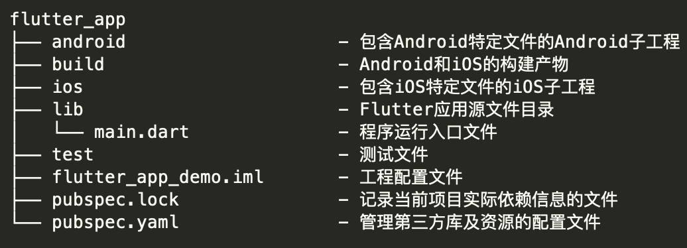

# Flutter UI

## Flutter工程结构



可以看出：Flutter 工程实际上就是一个同时内嵌了 Android 和 iOS 原生子工程的父工程。

## Widget 如何管理自己的状态

- 自己管理。
- parent 管理。
- 混合方式管理。
- 全局状态管理。

具体参考

- [interactive](https://flutter.dev/docs/development/ui/interactive)
- [Widget简介](https://book.flutterchina.club/chapter3/flutter_widget_intro.html)

## Flutter VS Android

- [Flutter for Android 开发者](https://flutterchina.club/flutter-for-android/#%E5%9C%A8android%E4%B8%AD%E5%8F%AF%E4%BB%A5%E9%80%9A%E8%BF%87viewanimate%E5%AF%B9%E8%A7%86%E5%9B%BE%E8%BF%9B%E8%A1%8C%E5%8A%A8%E7%94%BB%E5%A4%84%E7%90%86%E9%82%A3%E5%9C%A8flutter%E4%B8%AD%E6%80%8E%E6%A0%B7%E6%89%8D%E8%83%BD%E5%AF%B9widget%E8%BF%9B%E8%A1%8C%E5%A4%84%E7%90%86)
- [https://flutter.dev/docs/get-started/flutter-for/android-devs](https://flutter.dev/docs/get-started/flutter-for/android-devs)
- ViewPager 对应 PageView

## 理解 Widget

[Widget简介](https://book.flutterchina.club/chapter3/flutter_widget_intro.html)

- Widget其实并不是表示最终绘制在设备屏幕上的显示元素，而只是显示元素的一个配置数据。真正的UI渲染树是由Element构成；不过，由于Element是通过Widget生成，所以它们之间有对应关系。
- 一个Widget对象可以对应多个Element对象。根据同一份配置（Widget），可以创建多个实例（Element）。

Widget 的相关属性：

```dart
@immutable
abstract class Widget extends DiagnosticableTree {

  const Widget({ this.key });

  final Key key;

  @protected
  Element createElement();

  @override
  String toStringShort() {
    return key == null ? '$runtimeType' : '$runtimeType-$key';
  }

  @override
  void debugFillProperties(DiagnosticPropertiesBuilder properties) {
    super.debugFillProperties(properties);
    properties.defaultDiagnosticsTreeStyle = DiagnosticsTreeStyle.dense;
  }

  static bool canUpdate(Widget oldWidget, Widget newWidget) {
    return oldWidget.runtimeType == newWidget.runtimeType
        && oldWidget.key == newWidget.key;
  }
}
```

- Widget 类继承自 DiagnosticableTree，DiagnosticableTree 即“诊断树”，主要作用是提供调试信息。
- key：主要的作用是决定是否在下一次 build 时复用旧的 widget，决定的条件在 canUpdate() 方法中
- Flutter Framework 在构建 UI 树时，会先调用此方法生成对应节点的 Element 对象。
- `canUpdate()`：用于判断是否用新的Widget对象去更新旧UI树上所对应的 Element 对象的配置，只要 newWidget 与 oldWidget 的 runtimeType 和 key 同时相等时就会用 newWidget 去更新 Element 对象的配置，否则就会创建新的 Element。

继承 Stateless Widget 和 Stateful Widget：

- 按照惯例，widget 的构造函数应使用命名参数，命名参数中的必要参数要添加 `@required` 标注，这样有利于静态代码分析器进行检查。
- 在继承 widget 时，第一个参数通常应该是Key。
- 如果接受子 widget 的 child 参数，那么通常应该将它放在参数列表的最后。
- 同样是按照惯例，widget 的属性应被声明为 final，防止被意外改变。

StatelessWidget：

- 与 StatelessElement 对应。

Stateful Widget:

- 与 StatefulElement 对于。
- 一个 StatefulElement 对应一个 State 实例，State 表示与其对应的 StatefulWidget 要维护的状态。

State 的属性：

- `state.widget`：表示与该 State 实例关联的 widget 实例，由 Flutter framework 动态设置。**注意：**当在重新构建时，如果widget被修改了，Flutter framework会动态设置State.widget为新的widget实例。
- `state.context`：表示 BuildContext 类的一个实例，表示构建 widget 的上下文，它是操作widget在树中位置的一个句柄，它包含了一些查找、遍历当前 Widget 树的一些方法。每一个widget都有一个自己的 context 对象。

State 的生命周期：

- `initState`：当 Widget 第一次插入到 Widget 树时会被调用。
- `didChangeDependencies`：`当 State 对象的依赖发生变化时会被调用。
- `build`：用于构建组件
- `reassemble`：此回调是专门为了开发调试而提供的，在热重载(hot reload)时会被调用，此回调在 Release 模式下永远不会被调用。
- `didUpdateWidget`：在 widget 重新构建时，Flutter framework 会调用 Widget.canUpdate 来检测 Widget 树中同一位置的新旧节点，然后决定是否需要更新，如果 Widget.canUpdate 返回 true 则会调用此回调。
- `deactivate`：当 State 对象从树中被移除时，会调用此回调。
- `dispose`：当 State 对象从树中被永久移除时调用；通常在此回调中释放资源。

build 方法的调用时机：

- 在调用 initState() 之后。
- 在调用 didUpdateWidget() 之后。
- 在调用 setState() 之后。
- 在调用 didChangeDependencies() 之后。
- 在State对象从树中一个位置移除后（会调用 deactivate）又重新插入到树的其它位置之后。

StatefulWidget 与 StatelessWidget 的接口设计区别

- StatelessWidget 因为是不变的，所以直接提供 build 方法构建 widget 即可。
- StatefulWidget 需要依据数据才能完成构建，而对于 StatefulWidget 来说，其依赖的数据在 Widget 生命周期中可能会频繁地发生变化。由 State 创建 Widget，以数据驱动视图更新，而不是直接操作 UI 更新视觉属性，代码表达可以更精炼，逻辑也可以更清晰。

## 关于文本

- 掌握文本属性：textAlign、maxLines、overflow、textScaleFactor 等。
- 文档样式 TextStyle。
- 同一个 Text 下实现不同样式的段落：TextSpan。
- DefaultTextStyle Widget 的使用。
- 自定义字体。

## 关于图片

- ImageProvider：是一个抽象类，主要定义了图片数据获取的接口 `load()` 方法 ，有 AssetImage 和 NetworkImage。
- Image widget 有一个必选的 image 参数，它对应一个 ImageProvider。
- 掌握 Image 的 fit 属性：该属性用于在图片的显示空间和图片本身大小不同时指定图片的适应模式。
- 掌握 icon 的使用，在 Fluter 中使用字体图标。

## 关于表单

具体参考[输入框及表单](https://book.flutterchina.club/chapter3/input_and_form.html)

- TextField用于文本输入，它提供了很多关于输入框的属性。
- 获取输入内容：通过 onChange 获取，通过 TextEditingController  获取。
- 控制焦点：焦点可以通过 FocusNode 和 FocusScopeNode 来控制
- 自定义输入框样式。
- 表单校验：Form

### Widget、StatelessWidget、StatefulWidget 继承结构

根据 Widget 是否需要包含子节点将 Widget 分为了三类，分别对应三种 Element：LeafRenderObjectWidget(叶子节点)、SingleChildRenderObjectWidget(一个子Widget)、MultiChildRenderObjectWidget(包含多个子Widget)。

继承关系：

```dart
DiagnosticableTree
    Widget
        > StatelessWidget
        > StatefulWidget
        > RenderObjectWidget
            > LeafRenderObjectWidget
            > SingleChildRenderObjectWidget
            > MultiChildRenderObjectWidget
```

- StatelessWidget 和 StatefulWidget 的本质：两个用于组合 Widget 的基类，它们本身并不关联最终的渲染对象（RenderObjectWidget）。
- 布局类 Widget 就是指直接或间接继承(包含) MultiChildRenderObjectWidget 的 Widget，它们一般都会有一个 children 属性用于接收子 Widget。
- RenderObjectWidget 类中定义了创建、更新 RenderObject 的方法，子类必须实现他们，RenderObject 是最终布局、渲染UI界面的对象，也就是说，对于布局类 Widget 来说，其布局算法都是通过对应的 RenderObject 对象来实现的，所以如果对某个布局类 Widget 原理感兴趣，可以查看其 RenderObject 的实现。

## 关于布局（multi child）

- 线性布局 Row 和 Column
- Expanded：可以按比例“扩伸”Row、Column和Flex子widget所占用的空间。
- Flex 弹性布局：弹性布局允许子 widget 按照一定比例来分配父容器空间，弹性布局的概念在其UI系统中也都存在，如H5中的弹性盒子布局，Android 中的FlexboxLayout。Flutter 中的弹性布局主要通过 Flex 和 Expanded 来配合实现。
- 超出屏幕显示范围会自动折行的布局称为流式布局。Flutter 中通过 Wrap 和 Flow 来支持流式布局。Flow 主要用于一些需要自定义布局策略或性能要求较高的场景（自定义布局）。
- Stack 允许子 widget 堆叠，而Positioned可以给子 widget 定位

## 关于容器（single child）

布局类 Widget 一般都需要接收一个widget数组（children），他们直接或间接继承自（或包含）MultiChildRenderObjectWidget；而容器类 Widget 一般只需要接受一个子 Widget（child），它们直接或间接继承自（或包含）SingleChildRenderObjectWidget。

- Padding 可以给其子节点添加补白（填充），对于 padding，我们一般使用 EdgeInsets，它是 EdgeInsetsGeometry 的一个子类，定义了一些设置补白的便捷方法。
- ConstrainedBox 和 SizedBox
  - ConstrainedBox 和 SizedBox都是通过 RenderConstrainedBox 来渲染的。SizedBox只是 ConstrainedBox 一个定制。
  - ConstrainedBox 用于对其子 widget 添加额外的约束。
  - SizedBox 用于给子 widget 指定固定的宽高。
- 多重限制：如果某一个 widget 有多个父 ConstrainedBox 限制，最终会是哪个生效？
  - 对于 minWidth 和 minHeight 来说，是取父子中相应数值较大的。实际上，只有这样才能保证父限制与子限制不冲突。
  - 对于 minWidth 和 minHeight 来说，是取父子中相应数值较小的。实际上，只有这样才能保证父限制与子限制不冲突。
  - UnconstrainedBox 不会对子 Widget 产生任何限制，它允许其子Widget按照其本身大小绘制。一般情况下，我们会很少直接使用此widget，但在"去除"多重限制的时候也许会有帮助。
- DecoratedBox 可以在其子 widget 绘制前(或后)绘制一个装饰 Decoration（如背景、边框、渐变等）。DecoratedBox 的 decoration 属性代表将要绘制的装饰，它类型为 Decoration，我们通常会直接使用BoxDecoration，它是一个Decoration的子类，实现了常用的装饰元素的绘制。
- Transform 可以在其子 Widget 绘制时对其应用一个矩阵变换（transformation），Matrix4 是一个 4D 矩阵，通过它我们可以实现各种矩阵操作，不如平移、旋转、缩放、错切等。
- RotatedBox：RotatedBox 和 Transform.rotate 功能相似，它们都可以对子 widget 进行旋转变换，但是有一点不同：RotatedBox 的变换是在 layout 阶段，会影响在子 widget 的位置和大小。
- Container：其本身不对应具体的RenderObject，它是DecoratedBox、ConstrainedBox、Transform、Padding、Align 等 widget 的一个组合 widget。

## 可滚动布局

当内容超过显示视口(ViewPort)时，如果没有特殊处理，Flutter则会提示Overflow错误。为此，Flutter提供了多种可滚动widget（Scrollable Widget）用于显示列表和长布局。

- Scrollable widget：是可滚动布局的基础封装，包括 axisDirection、controller、physics 等通用属性。
- Scrollbar 是一个 Material 风格的滚动指示器（滚动条）。
- ViewPort 视口：在 Flutter 中，术语 ViewPort（视口），如无特别说明，则是指一个Widget的实际显示区域。
- SingleChildScrollView 类似于 Android中的 ScrollView，它只能接收一个子 Widget。
- ListView 是最常用的可滚动 widget，它可以沿一个方向线性排布所有子 widget。
  - 其对应的 ListView.builder 适合列表项比较多（或者无限）的情况，因为只有当子 Widget 真正显示的时候才会被创建。
  - ListView.separated 可以生成列表项之间的分割器，它比 ListView.builder 多了一个 separatorBuilder 参数。
- GridView 可以构建一个二维网格列表。
- CustomScrollView 是可以使用 sliver 来自定义滚动模型（效果）的 widget。它可以包含多种滚动模型。
- ScrollController 用于控制可滚动 widget 的滚动位置，以及监听滚动事件。

## 功能型 Widget

功能型Widget指的是不会影响UI布局及外观的Widget，它们通常具有一定的功能，如事件监听、数据存储等。

- 导航返回拦截 WillPopScope
- InheritedWidget 是 Flutter 中非常重要的一个功能型 Widget，它可以高效的将数据在 Widget 树中向下传递、共享。
- Theme Widget 可以为 Material APP 定义主题数据（ThemeData），Material 组件库里很多 Widget 都使用了主题数据。
