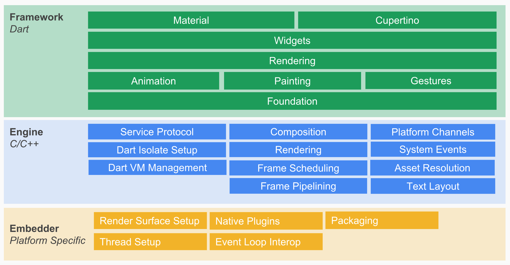
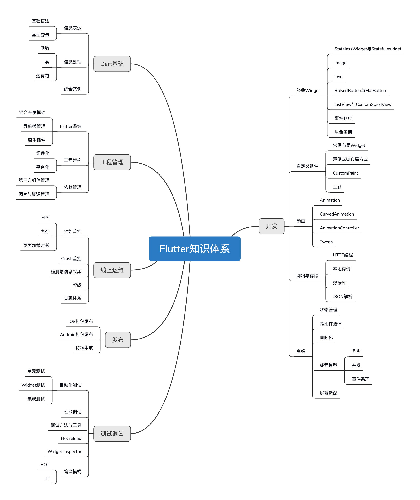
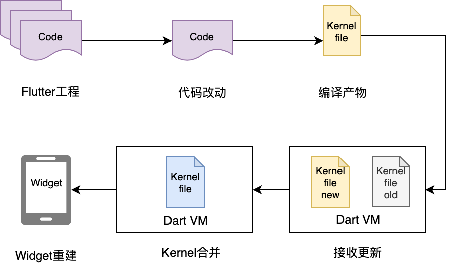

# 极客时间 [《Flutter核心技术与实战》](https://time.geekbang.org/column/article/104040) 整理

课程源码 [flutter_core_demo](https://github.com/cyndibaby905/flutter_core_demo)。

## 一、 Flutter开发起步

### 03-深入理解跨平台方案的历史发展逻辑

1. **Web 容器时代**：基于 Web 相关技术通过浏览器组件来实现界面及功能，典型的框架包括Cordova(PhoneGap)、Ionic 和微信小程序。
2. **泛 Web 容器时代**：采用类 Web 标准进行开发，但在运行时把绘制和渲染交由原生系统接管的技术，代表框架有React Native、Weex 和快应用，广义的还包括天猫的Virtual View 等。
3. **自绘引擎时代**：自带渲染引擎，客户端仅提供一块画布即可获得从业务逻辑到功能呈现的多端高度一致的渲染体验。Flutter，是为数不多的代表。

如何选择跨平台技术：

- 如果是中短期项目的话，建议使用 ReactNative。
- 如果是长期项目，Flutter的设计理念比较先进，解决方案也相对彻底，在渲染能力的一致性以及性能上，和 React Native 相比优势非常明显。

### 04-Flutter区别于其他方案的关键技术是什么

1. Flutter 和其他跨平台方案的本质区别：Flutter 重写了一整套包括底层渲染逻辑和上层开发语言的完整解决方案。这样不仅可以保证视图渲染在 Android 和 iOS 上的高度一致性（即高保真），在代码执行效率和渲染性能上也可以媲美原生 App 的体验（即高性能），完成了组件渲染的闭环。
2. 图形渲染过程：在计算机系统中，图像的显示需要 CPU、GPU 和显示器一起配合完成，CPU 负责图像数据计算、GPU 负责图像数据渲染、显示器负责最终图像显示。
   1. CPU 把计算好的、需要显示的内容交给 GPU，由 GPU 完成渲染后放入帧缓冲区。
   2. 随后视频控制器根据垂直同步信号（VSync）以每秒 60 次的速度，从帧缓冲区读取帧数据。
   3. 随后将数据交由显示器完成图像显示。
3. 为什么是 Dart 语言
   1. **Dart 语言开发组就在隔壁，对于 Flutter 需要的一些语言新特性，能够快速在语法层面落地实现；而如果选择了 JavaScript，就必须经过各种委员会和浏览器提供商漫长的决议**。
   2. Dart 同时支持即时编译 JIT 和事前编译 AOT。在开发期使用 JIT，开发周期异常短，调试方式颠覆常规（支持有状态的热重载）；而发布期使用 AOT，本地代码的执行更高效，代码性能和用户体验也更卓越。
   3. Dart 作为一门现代化语言学习成本并不高，很容易上手。
   4. Dart 避免了抢占式调度和共享内存，可以在没有锁的情况下进行对象分配和垃圾回收，在性能方面表现相当不错。
4. Flutter 架构图：从下到上分为三层，依次为：Embedder、Engine、Framework。掌握各层所负责的功能。
5. 渲染对象树在 Flutter 的展示过程分为四个阶段：**布局、绘制、合成和渲染**。
6. 知识图谱：

## 2 Dart语言基础

- 略

## 三、Flutter 框架视图渲染的基础知识和原理

视图数据流转机制、底层渲染方案、视图更新策略等知识，都是构成一个 UI 框架的根本，看似枯燥，却往往具有最长久的生命力。新框架每年层出不穷，可是扒下那层炫酷的“外衣”，里面其实还是那些最基础的知识和原理。因此，**只有把这些最基础的知识弄明白了，修炼好了内功，才能触类旁通，由点及面形成自己的知识体系，也能够在框架之上思考应用层构建视图实现的合理性**。

## 09-Widget是构建Flutter界面的基石

本篇是关于 Widget 的设计思路和基本原理的介绍：

1. Widget 渲染过程：在 Flutter 中视图数据的组织和渲染抽象的三个核心概念，即 Widget、 Element 和 RenderObject。
   1. Widget 是 Flutter 世界里对视图的一种结构化描述，里面存储的是有关视图渲染的配置信息；
   2. Element 则是 Widget 的一个实例化对象，将 Widget 树的变化做了抽象，能够做到只将真正需要修改的部分同步到真实的 Render Object 树中，，最大程度地优化了从结构化的配置信息到完成最终渲染的过程；
   3. RenderObject 负责实现视图的最终呈现，通过布局、绘制完成界面的展示。
2. 阅读 RenderObjectWidget 的代码，理解 Widget、Element 与 RenderObject 这三个对象之间是如何互相配合，实现图形渲染工作的。

>在日常开发学习中，绝大多数情况下，我们只需要了解各种 Widget 特性及使用方法，而无需关心 Element 及 RenderObject。因为 Flutter 已经帮我们做了大量优化工作，因此我们只需要在上层代码完成各类 Widget 的组装配置，其他的事情完全交给 Flutter 就可以了。

如何理解 Widget、Element 和 RenderObject 这三个概念的？它们之间是一一对应的吗？你能否在 Android/iOS/Web 中找到对应的概念呢？

>Element是可复用的，只要 Widget 前后类型一样。比如 Widget 是蓝色的，重建后变红色了，Element 是会复用的。所以是多个 Widget（销毁前后）会对应一个 Element，而一个Element对应一个RenderObject。

### 10-Widget中的State到底是什么

1. **命令式**：需要精确地告诉操作系统或浏览器用何种方式去做事情。比如，如果我们想要变更界面的某个文案，则需要找到具体的文本控件并调用它的控件方法命令，才能完成文字变更。如 （Android、iOS）或原生 JavaScript 开发。
2. **声明式**：其核心设计思想就是将视图和数据分离，这与 React 的设计思路完全一致。Flutter 采用的就是声明式 UI 编程。
3. **命令式编程强调精确控制过程细节；而声明式编程强调通过意图输出结果整体**。对应到 Flutter 中，意图是绑定了组件状态的 State，结果则是重新渲染后的组件。在 Widget 的生命周期内，应用到 State 中的任何更改都将强制 Widget 重新构建。
4. **StatelessWidget 和 StatefulWidget 区别点：**
   1. 对于组件完成创建后就无需变更的场景，状态的绑定是可选项。这里“可选”就区分出了 Widget 的两种类型，即：StatelessWidget 不带绑定状态，而 StatefulWidget 带绑定状态。
   2. 当你所要构建的用户界面不随任何状态信息的变化而变化时，需要选择使用 StatelessWidget，反之则选用 StatefulWidget。
   3. StatelessWidget 一般用于静态内容的展示，而 StatefulWidget 则用于存在交互反馈的内容呈现中。
5. **StatefulWidget 的滥用会直接影响 Flutter 应用的渲染性能**。
   1. **Widget 是不可变的，更新则意味着销毁 + 重建（build）。StatelessWidget 是静态的，一旦创建则无需更新；而对于 StatefulWidget 来说，在 State 类中调用 setState 方法更新数据，会触发视图的销毁和重建，也将间接地触发其每个子 Widget 的销毁和重建**。如果我们的根布局是一个 StatefulWidget，在其 State 中每调用一次更新 UI，都将是一整个页面所有 Widget 的销毁和重建。
   2. 虽然 Flutter 内部通过 Element 层可以最大程度地降低对真实渲染视图的修改，提高渲染效率，而不是销毁整个 RenderObject 树重建。但，大量 Widget 对象的销毁重建是无法避免的。如果某个子 Widget 的重建涉及到一些耗时操作，那页面的渲染性能将会急剧下降。因此**正确评估你的视图展示需求，避免无谓的 StatefulWidget 使用，是提高 Flutter 应用渲染性能最简单也是最直接的手段**。

### 11-Flutter中的生命周期

[Flutter中的生命周期](Flutter中的生命周期.md)

## 四、UI布局与动画

### 12-文本、图片和按钮

1. 文本：Text、TextStyle、TxxtSpan
2. 图片：Image、FadeInImage、CachedNetworkImage：
3. 按钮：
   1. FloatingActionButton：一个圆形的按钮，一般出现在屏幕内容的前面，用来处理界面中最常用、最基础的用户动作。
   2. RaisedButton：凸起的按钮，默认带有灰色背景，被点击后灰色背景会加深。
   3. FlatButton：扁平化的按钮，默认透明背景，被点击后会呈现灰色背景。

### 13-列表与滑动组件

- ListView 的使用
- CustomScrollView 的使用与视差效果
- ScrollController 与 ScrollNotification 监听滑动

### 14-布局排版

1. 单子 Widget 布局：Container、Padding 与 Center
2. 多子 Widget 布局：Row、Column 与 Expanded
3. 层叠 Widget 布局：Stack 与 Positioned
4. 注意：Row 与 Column 是根据 mainAxisSize 以及父 Widget 共同决定，如果父 Widget 没法确定大小，那么 Row 与 Column 就会出错。

### 15-自定义Widget：组合与自绘

自定义 Widget 与其他平台类似：

1. 可以使用基本 Widget 组装成一个高级别的 Widget。
2. 也可以自己在画板上根据特殊需求来画界面，在 Flutter 中也有类似的方案，那就是 CustomPaint。CustomPaint 是用以承接自绘控件的容器，并不负责真正的绘制。既然是绘制，那就需要用到画布与画笔。在 Flutter 中：
   - **画布是 Canvas**：提供了各种常见的绘制方法，比如画线 drawLine、画矩形 drawRect、画点 DrawPoint、画路径 drawPath、画圆 drawCircle、画圆弧 drawArc 等
   - **画笔则是 Paint**：我们可以配置它的各种属性，比如颜色、样式、粗细等
   - **CustomPainter 定义了绘制逻辑**：将 CustomPainter 设置给容器 CustomPaint 的 painter 属性，我们就完成了一个自绘控件的封装。

### 16-主题样式管理

1. **主题**：又叫皮肤、配色，一般由颜色、图片、字号、字体等组成，我们可以把它看做是视觉效果在不同场景下的可视资源，以及相应的配置集合。比如，App 的按钮，无论在什么场景下都需要背景图片资源、字体颜色、字号大小等，而所谓的**主题切换**只是在不同主题之间更新这些资源及配置集合而已。
2. 主题样式管理：**视觉效果是易变的，我们将这些变化的部分抽离出来，把提供不同视觉效果的资源和配置按照主题进行归类，整合到一个统一的中间层去管理，这样我们就能实现主题的管理和切换了**。
3. Flutter 提供了主题管理的能力，**由 ThemeData 来统一管理主题的配置信息**。
   1. 全局统一的视觉风格定制：在 Flutter 中，应用程序类 MaterialApp 的初始化方法，为我们提供了设置主题的能力。我们可以通过参数 theme，选择改变 App 的主题色、字体等，设置界面在 MaterialApp 下的展示样式。
   2. 局部独立的视觉风格定制：在 Flutter 中，我们可以**使用 Theme Widget 来对 App 的主题进行局部覆盖**。Theme 是一个单子 Widget 容器，与 MaterialApp 类似的，我们可以通过设置其 data 属性，对其子 Widget 进行样式定制：
4. 样式复用：**除了定义 Material Design 规范中那些可自定义部分样式外，主题的另一个重要用途是样式复用**。比如，如果我们想为一段文字复用 Materia Design 规范中的 title 样式，或是为某个子 Widget 的背景色复用 App 的主题色，我们就可以通过 `Theme.of(context)` 方法，取出对应的属性，应用到这段文字的样式中。
5. 分平台主题定制：除了主题之外，也可以用 defaultTargetPlatform 这个变量去实现一些其他需要判断平台的逻辑，比如在界面上使用更符合 Android 或 iOS 设计风格的组件。

### 22-动画

1. **动画的本质与原理**：动画就是动起来的画面，是静态的画面根据事先定义好的规律，在一定时间内不断微调，产生变化效果。而动画实现由静止到动态，主要是靠人眼的视觉残留效应。
2. **实现动画的三个步骤**：
   1. 确定画面变化的规律；
   2. 根据这个规律，设定动画周期，启动动画；
   3. 定期获取当前动画的值，不断地微调、重绘画面。
3. 对应到 Flutter 中，就是 Animation、AnimationController 与 Listener：
   - **Animation** 是 Flutter 动画库中的核心类，会根据预定规则，在单位时间内持续输出动画的当前状态。Animation 知道当前动画的状态（比如，动画是否开始、停止、前进或者后退，以及动画的当前值），但却不知道这些状态究竟应用在哪个组件对象上。即 Animation 仅仅是用来提供动画数据，而不负责动画的渲染。
   - **AnimationController** 用于管理 Animation，可以用来设置动画的时长、启动动画、暂停动画、反转动画等。
   - **Listener** 是 Animation 的回调函数，用来监听动画的进度变化，我们需要在这个回调函数中，根据动画的当前值重新渲染组件，实现动画的渲染。
4. **简化动画使用的 AnimatedWidget 与 AnimatedBuilder**：Animation 仅提供动画的数据，因此我们还需要监听动画执行进度，并在回调中使用 setState 强制刷新界面才能看到动画效果。考虑到这些步骤都是固定的，Flutter 提供了两个类来帮我们简化这一步骤，即 AnimatedWidget 与 AnimatedBuilder。
5. Hero：实现在两个页面之间切换的过渡动画

## 五、资源、库管理

### 17-依赖管理1-资源

[Flutter依赖管理1](Flutter依赖管理1-资源)

### 18-依赖管理2-库

[Flutter依赖管理2](Flutter依赖管理2-库)

### 六、事件分发机制

### 19-事件处理机制

[Flutter事件处理机制](Flutter事件处理机制.md)

## 七、数据传递

### 20-跨组件传递数据

1. InheritedWidget：从上往下传递数据，**InheritedWidget 仅提供了数据读的能力，如果我们想要修改它的数据，则需要把它和 StatefulWidget 中的 State 配套使用**。
2. Notification：从下往上传递数据，Notification 数据流动方式是从子 Widget 向上传递至父 Widget。**这样的数据传递机制适用于子 Widget 状态变更，发送通知上报的场景**。
3. EventBus 进行跨组件通信：**如果实现在不存在父子关系的组件间传递数据，就需要第三方事件总线 EventBus 了**。——事件总线是在 Flutter 中实现跨组件通信的机制。它遵循发布 / 订阅模式，允许订阅者订阅事件，当发布者触发事件时，订阅者和发布者之间可以通过事件进行交互。发布者和订阅者之间无需有父子关系，甚至非 Widget 对象也可以发布 / 订阅。这些特点与其他平台的事件总线机制是类似的。

## 八、路由导航

### 21-路由与导航

1. Flutter 中的路由管理：在 Flutter 中，页面之间的跳转是通过 Route 和 Navigator 来管理的：
   1. **Route** 是页面的抽象，主要负责创建对应的界面，接收参数，响应 Navigator 打开和关闭；
   2. **Navigator** 会维护一个路由栈管理 Route，Route 打开即入栈，Route 关闭即出栈，还可以直接替换栈内的某一个 Route。
2. 根据是否需要提前注册页面标识符，Flutter 中的路由管理可以分为两种方式：
   - **基本路由**。无需提前注册，在页面切换时需要自己构造页面实例。
   - **命名路由**。需要提前注册页面标识符，在页面切换时通过标识符直接打开新的路由。
3. NotFoundScreen 页面：由于路由的注册和使用都采用字符串来标识，这就会带来一个隐患：**如果我们打开了一个不存在的路由会怎么办**？在注册路由表时，Flutter 提供了 UnknownRoute 属性，我们可以对未知的路由标识符进行统一的页面跳转处理。
4. 页面参数传递：为了解决不同场景下目标页面的初始化需求，Flutter 提供了路由参数的机制，可以在打开路由时传递相关参数，在目标页面通过 RouteSettings 来获取页面参数。
5. **Flutter 的参数返回机制**：与 Android 提供的 startActivityForResult 方法可以监听目标页面的处理结果类似，Flutter 也提供了返回参数的机制。在 push 目标页面时，可以设置目标页面关闭时监听函数，以获取返回参数；而目标页面可以在关闭路由时传递相关参数。
6. **在中大型应用中，我们通常会使用命名路由来管理页面间的切换。命名路由的最重要作用，就是建立了字符串标识符与各个页面之间的映射关系，使得各个页面之间完全解耦，应用内页面的切换只需要通过一个字符串标识符就可以搞定，为后期模块化打好基础**。

## 九、异步模型

### 23-单线程模型

[Dart的单线程模型](Dart的单线程模型.md)

## 十、网络与存储相关

### 24 HTTP网络编程与JSON解析

1. 在 Flutter 中，Http 网络编程的实现方式主要分为三种：
   - dart:io 里的 HttpClient 实现
   - Dart 原生 http 请求库实现
   - 第三方库 dio 实现
2. **由于网络请求是异步行为，因此在 Flutter 中，所有网络编程框架都是以 Future 作为异步请求的包装，所以我们需要使用 await 与 async 进行非阻塞的等待。当然，也可以注册 then，以回调的方式进行相应的事件处理**。
3. dio 库：
   1. 基本使用
   2. 使用 dio 上传和下载文件
   3. 使用 dio 同时等待多个请求
   4. dio 拦截器
4. 需要注意的是：**由于网络通信期间有可能会出现异常（比如，域名无法解析、超时等），因此我们需要使用 try-catch 来捕获这些未知错误，防止程序出现异常**。
5. **Json 解析**：**Flutter 不支持自动解析**：由于 Flutter 不支持运行时反射，因此并没有提供像 Gson、Mantle 这样自动解析 JSON 的库来降低解析成本。在 Flutter 中，JSON 解析完全是手动的，开发者要做的事情多了一些，但使用起来倒也相对灵活。手动解析，是指使用 dart:convert 库中内置的 JSON 解码器，将 JSON 字符串解析成自定义对象的过程。使用这种方式，我们需要先将 JSON 字符串传递给 JSON.decode 方法解析成一个 Map，然后把这个 Map 传给自定义的类，进行相关属性的赋值。
6. 扩展：代码生成器，虽然 dart 不支持反射，没有类似 gson 这里的反序列化器，但是可以使用代码生成器，具体参考：
   - <https://pub.dartlang.org/packages/json_serializable>
   - <https://pub.dev/packages/built_value>
7. 扩展，**为什么 dart 不支持反射**：
   1. 运行时反射破坏了类的封装性和安全性，会带来安全风险。就在前段时间，Fastjson 框架就爆出了一个巨大的安全漏洞。这个漏洞使得精心构造的字符串文本，可以在反序列化时让服务器执行任意代码，直接导致业务机器被远程控制、内网渗透、窃取敏感信息等操作。
   2. 运行时反射会增加二进制文件大小。因为搞不清楚哪些代码可能会在运行时用到，因此使用反射后，会默认使用所有代码构建应用程序，这就导致编译器无法优化编译期间未使用的代码，应用安装包体积无法进一步压缩，这对于自带 Dart 虚拟机的 Flutter 应用程序是难以接受的。

### 25-本地存储与数据库的使用和优化

本地存储用于做**数据的持久化**，Flutter 仅接管了渲染层，真正涉及到存储等操作系统底层行为时，还需要依托于原生 Android、iOS，因此与原生开发类似的，根据需要持久化数据的大小和方式不同，Flutter 提供了三种数据持久化方法：

- 文件
- SharedPreferences
- 数据库

## 十一、 原生交互

### 26-在Dart层兼容Android与iOS平台特定实现1-方法通道

[Flutter与原生平台交互1-方法通道](Flutter与原生平台交互1-方法通道.md)

### 27-在Dart层兼容Android与iOS平台特定实现2-平台视图

[Flutter与原生平台交互2-平台视图](Flutter与原生平台交互2-平台视图.md)

## 十二、混合开发

### 28-混合开发-原生应用中混编Flutter工程

[混合开发1-原生应用中混编Flutter工程](混合开发1-原生应用中混编Flutter工程.md)

### 29-混合开发-导航栈管理方案

[混合开发2-导航栈管理方案](混合开发2-导航栈管理方案.md)

### 31-Flutter插件开发

- [developing-packages](https://flutter.dev/docs/development/packages-and-plugins/developing-packages)
- [开发Packages和插件](https://flutterchina.club/developing-packages/)

## 十三、状态管理

### 30-使用Provider进行状态管理

**状态管理的必要性**：

1. 前面已经学习了 InheritedWidget、Notification 和 EventBus 这 3 种数据传递机制，通过它们可以实现组件间的单向数据传递。如果我们的应用足够简单，数据流动的方向和顺序是清晰的，我们只需要将数据映射成视图就可以了。作为声明式的框架，Flutter 可以自动处理数据到渲染的全过程，通常并不需要状态管理。
2. 随着产品需求迭代节奏加快，项目逐渐变得庞大时，我们往往就需要管理不同组件、不同页面之间共享的数据关系。当需要共享的数据关系达到几十上百个的时候，我们就很难保持清晰的数据流动方向和顺序了，导致应用内各种数据传递嵌套和回调满天飞。在这个时候，我们迫切需要一个解决方案，来帮助我们理清楚这些共享数据的关系，于是状态管理框架便应运而生。

**框架选择**：

- 社区框架：Flutter 在设计声明式 UI 上借鉴了不少 React 的设计思想，因此涌现了诸如 flutter_redux、flutter_mobx 、fish_redux 等基于前端设计理念的状态管理框架。但这些框架大都比较复杂，且需要对框架设计概念有一定理解，学习门槛相对较高。
- 官方框架：源自 Flutter 官方的状态管理框架 Provider 则相对简单得多，不仅容易理解，而且框架的侵入性小，还可以方便地组合和控制 UI 刷新粒度。因此，在 Google I/O 2019 大会一经面世，Provider 就成为了官方推荐的状态管理方式之一。

使用 Provider 的步骤

1. 资源（即数据状态）如何封装？
2. 资源放在哪儿，才都能访问得到？
3. 具体使用时，如何取出资源？

注意：

1. **滥用 Provider.of 方法也有副作用，那就是当数据更新时，页面中其他的子 Widget 也会跟着一起刷新**。
2. 使用 Consumer 优化：**Provider 可以精确地控制 UI 刷新粒度，这一切是基于 Consumer 实现的**。Consumer 本身也是一个 Widget，其使用了 Builder 模式创建 UI，收到更新通知就会通过 builder 重新构建 Widget。
3. 多状态的资源封装，从 Consumer 到 Consumer6。
4. 使用 Provider 可以实现 2 个同样类型的对象共享，你知道应该如何实现吗？

### 十四、适配

### 32-国际化

[Flutter国际化](Flutter国际化.md)

### 33-屏幕适配

[Flutter屏幕适配](Flutter屏幕适配.md)

### 十五、编译、调试、测试、优化、线上监控

## 34-理解Flutter的编译模式

Flutter 支持 3 种运行模式，包括 Debug、Release 和 Profile。在编译时，这三种模式是完全独立的。

- **Debug 模式**：对应 Dart 的 JIT 模式，flutter run --debug 命令，就是以这种模式运行的。
  - 优点：可以在真机和模拟器上同时运行。该模式会打开所有的断言（assert），以及所有的调试信息、服务扩展和调试辅助（比如 Observatory）。此外，该模式为快速开发和运行做了优化，支持亚秒级有状态的 Hot reload（热重载）。
  - 缺点：没有优化代码执行速度、二进制包大小和部署。
- **Release 模式**：对应 Dart 的 AOT 模式，其编译目标为最终的线上发布，给最终的用户使用。flutter run --release 命令，就是以这种模式运行的。
  - 优点：该模式会关闭所有的断言，以及尽可能多的调试信息、服务扩展和调试辅助。此外，该模式优化了应用快速启动、代码快速执行，以及二级制包大小。
  - 缺点：只能在真机上运行，不能在模拟器上运行，由于编译阶段有诸多优化，因此编译时间较长。
- **Profile 模式**，基本与 Release 模式一致，只是多了对 Profile 模式的服务扩展的支持，包括支持跟踪，以及一些为了最低限度支持所需要的依赖（比如，可以连接 Observatory 到进程）。该模式用于分析真实设备实际运行性能。flutter run --profile 命令，就是以这种模式运行的。

在运行时识别应用的编译模式

1. 通过断言识别应用的编译模式：Release 与 Debug 模式的一个重要区别就是，Release 模式关闭了所有的断言。因此，我们可以借助于断言，写出只在 Debug 模式下生效的代码。我们在断言里传入了一个始终返回 true 的匿名函数执行结果，这个匿名函数的函数体只会在 Debug 模式下生效。
2. 通过编译常数识别应用的编译模式：
如果说通过断言只能写出在 Debug 模式下运行的代码，而通过 Dart 提供的编译常数，我们还可以写出只在 Release 模式下生效的代码。Dart 提供了一个布尔型的常量 kReleaseMode，用于反向指示当前 App 的编译模式。

分离配置环境，想在整个应用层面，为不同的运行环境提供更为统一的配置（比如，对于同一个接口调用行为，开发环境会使用 dev.example.com 域名，而生产环境会使用 api.example.com 域名），则需要在应用启动入口提供可配置的初始化方式，根据特定需求为应用注入配置环境。在 Flutter 构建 App 时，为应用程序提供不同的配置环境，总体可以分为抽象配置、配置多入口、读配置和编译打包 4 个步骤：

1. 抽象出应用程序的可配置部分，并使用 InheritedWidget 对其进行封装；
2. 将不同的配置环境拆解为多个应用程序入口（比如，开发环境为 main-dev.dart、生产环境为 main.dart），把应用程序的可配置部分固化在各个入口处；
3. 在运行期，通过 InheritedWidget 提供的数据共享机制，将配置部分应用到其子 Widget 对应的功能中；
4. 使用 Flutter 提供的编译打包选项，构建出不同配置环境的安装包。

相关命令：

```shell
// 运行开发环境应用程序
flutter run -t lib/main_dev.dart

// 运行生产环境应用程序
flutter run -t lib/main.dart

// 打包开发环境应用程序
flutter build apk -t lib/main_dev.dart
flutter build ios -t lib/main_dev.dart

// 打包生产环境应用程序
flutter build apk -t lib/main.dart
flutter build ios -t lib/main.dart
```

## 35-HotReload原理

**热重载**：相较于原生开发，由于 Flutter 在 Debug 模式支持 JIT，并且为开发期的运行和调试提供了大量优化，因此代码修改后，我们可以通过亚秒级的热重载（Hot Reload）进行增量代码的快速刷新，而无需经过全量的代码编译，从而大大缩短了从代码修改到看到修改产生的变化之间所需要的时间。

Flutter 编译模式背后的技术：

1. **JIT（Just In Time）**，指的是即时编译或运行时编译，在 Debug 模式中使用，可以动态下发和执行代码，启动速度快，但执行性能受运行时编译影响；
2. **AOT（Ahead Of Time）**，指的是提前编译或运行前编译，在 Release 模式中使用，可以为特定的平台生成稳定的二进制代码，执行性能好、运行速度快，但每次执行均需提前编译，开发调试效率低。

**热重载原理**：热重载之所以只能在 Debug 模式下使用，是因为 Debug 模式下，Flutter 采用的是 JIT 动态编译（而 Release 模式下采用的是 AOT 静态编译）。JIT 编译器将 Dart 代码编译成可以运行在 Dart VM 上的 Dart Kernel，而 Dart Kernel 是可以动态更新的，这就实现了代码的实时更新功能。



热重载的流程可以分为扫描工程改动、增量编译、推送更新、代码合并、Widget 重建 5 个步骤：

1. 工程改动。热重载模块会逐一扫描工程中的文件，检查是否有新增、删除或者改动，直到找到在上次编译之后，发生变化的 Dart 代码。
2. 增量编译。热重载模块会将发生变化的 Dart 代码，通过编译转化为增量的 Dart Kernel 文件。
3. 推送更新。热重载模块将增量的 Dart Kernel 文件通过 HTTP 端口，发送给正在移动设备上运行的 Dart VM。
4. 代码合并。Dart VM 会将收到的增量 Dart Kernel 文件，与原有的 Dart Kernel 文件进行合并，然后重新加载新的 Dart Kernel 文件。
5. Widget 重建。在确认 Dart VM 资源加载成功后，Flutter 会将其 UI 线程重置，通知 Flutter Framework 重建 Widget。

Flutter 的热重载也有一定的局限性。因为涉及到状态保存与恢复，所以并不是所有的代码改动都可以通过热重载来更新。Flutter 主要有以下几个不支持热重载的典型场景：

- 代码出现编译错误；
- Widget 状态无法兼容；
- 全局变量和静态属性的更改；
- main 方法里的更改；
- initState 方法里的更改；
- 枚举和泛类型更改。

## 36-调试Flutter应用

在 Flutter 中，调试代码主要分为：

1. 输出日志
   1. **使用 print 的弊端**：由于涉及 I/O 操作，使用 print 来打印信息会消耗较多的系统资源。同时，这些输出数据很可能会暴露 App 的执行细节。
   2. **使用 debugPrint 函数**：debugPrint 函数同样会将消息打印至控制台，但与 print 不同的是，它提供了定制打印的能力。也就是说，我们可以向 debugPrint 函数，赋值一个函数声明来自定义打印行为。
2. 断点调试，主要包含以下断点操作：
3. 布局调试
   1. Debug Painting 能够以辅助线的方式，清晰展示每个控件元素的布局边界，因此我们可以根据辅助线快速找出布局出问题的地方。而 Debug Painting 的开启也比较简单，只需要将 debugPaintSizeEnabled 变量置为 true 即可。
   2. 如果我们想要获取到 Widget 的可视化信息（比如布局信息、渲染信息等）去解决渲染问题，就需要使用更强大的 Flutter Inspector 了。为了使用 Flutter Inspector，我们需要回到 Android Studio，通过工具栏上的“Open DevTools”按钮启动 Flutter Inspector：

## 37-性能检测与优化

[Flutter性能检测与优化](Flutter性能检测与优化.md)

## 38-单元测试与UI测试

在自动化测试用例的编写上，Flutter 提供了包括单元测试和 UI 测试的能力。

- 单元测试可以方便地验证单个函数、方法或类的行为
- UI 测试则提供了与 Widget 进行交互的能力，确认其功能是否符合预期

掌握以下内容：

1. 掌握使用 test 进行单元测试
2. 掌握使用 mockito 模拟特点场景
3. 掌握使用 flutter_test 进行UI测试

### 39-线上问题如何做好异常捕获与信息采集

### 40-衡量FlutterApp线上质量-三个指标

### 十六、工程化

- 41-组织合理稳定的Flutter工程结构-组件化和平台化
- 42-构建高效的FlutterApp打包发布环境
- 43-构建自己的Flutter混合开发框架1
- 44-构建自己的Flutter混合开发框架2
