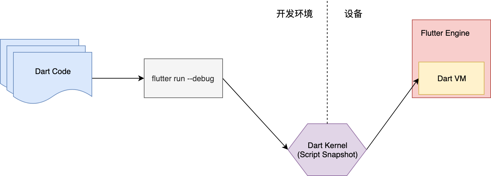

# 35-HotReload原理

**热重载**：相较于原生开发，由于 Flutter 在 Debug 模式支持 JIT，并且为开发期的运行和调试提供了大量优化，因此代码修改后，我们可以通过亚秒级的热重载（Hot Reload）进行增量代码的快速刷新，而无需经过全量的代码编译，从而大大缩短了从代码修改到看到修改产生的变化之间所需要的时间。

在开发页面的过程中，当我们点击按钮出现一个弹窗的时候，发现弹窗标题没有对齐，这时候只要修改标题的对齐样式，然后保存，在代码并没有重新编译的情况下，标题样式就发生了改变，感觉就像是在 UI 编辑面板中直接修改元素样式一样，非常方便。

## 1 热重载

热重载是指，在不中断 App 正常运行的情况下，动态注入修改后的代码片段。而这一切的背后，离不开 Flutter 所提供的运行时编译能力。

Flutter 编译模式背后的技术：

1. **JIT（Just In Time）**，指的是即时编译或运行时编译，在 Debug 模式中使用，可以动态下发和执行代码，启动速度快，但执行性能受运行时编译影响；
2. **AOT（Ahead Of Time）**，指的是提前编译或运行前编译，在 Release 模式中使用，可以为特定的平台生成稳定的二进制代码，执行性能好、运行速度快，但每次执行均需提前编译，开发调试效率低。

可以看到，Flutter 提供的两种编译模式中：

- AOT 是静态编译，即编译成设备可直接执行的二进制码。
- JIT 是动态编译，即将 Dart 代码编译成中间代码（Script Snapshot），在运行时设备需要 Dart VM 解释执行。

**热重载原理**：热重载之所以只能在 Debug 模式下使用，是因为 Debug 模式下，Flutter 采用的是 JIT 动态编译（而 Release 模式下采用的是 AOT 静态编译）。JIT 编译器将 Dart 代码编译成可以运行在 Dart VM 上的 Dart Kernel，而 Dart Kernel 是可以动态更新的，这就实现了代码的实时更新功能。


热重载的流程可以分为扫描工程改动、增量编译、推送更新、代码合并、Widget 重建 5 个步骤：

1. 工程改动。热重载模块会逐一扫描工程中的文件，检查是否有新增、删除或者改动，直到找到在上次编译之后，发生变化的 Dart 代码。
2. 增量编译。热重载模块会将发生变化的 Dart 代码，通过编译转化为增量的 Dart Kernel 文件。
3. 推送更新。热重载模块将增量的 Dart Kernel 文件通过 HTTP 端口，发送给正在移动设备上运行的 Dart VM。
4. 代码合并。Dart VM 会将收到的增量 Dart Kernel 文件，与原有的 Dart Kernel 文件进行合并，然后重新加载新的 Dart Kernel 文件。
5. Widget 重建。在确认 Dart VM 资源加载成功后，Flutter 会将其 UI 线程重置，通知 Flutter Framework 重建 Widget。

Flutter 提供的热重载在收到代码变更后，并不会让 App 重新启动执行，而只会触发 Widget 树的重新绘制，因此可以保持改动前的状态，这就大大节省了调试复杂交互界面的时间。

## 2 不支持热重载的场景

Flutter 的热重载也有一定的局限性。因为涉及到状态保存与恢复，所以并不是所有的代码改动都可以通过热重载来更新。Flutter 主要有以下几个不支持热重载的典型场景：

- 代码出现编译错误；
- Widget 状态无法兼容；
- 全局变量和静态属性的更改；
- main 方法里的更改；
- initState 方法里的更改；
- 枚举和泛类型更改。

### 代码出现编译错误

当代码更改导致编译错误时，热重载会提示编译错误信息。在这种情况下，只需更正上述代码中的错误，就可以继续使用热重载。

### Widget 状态无法兼容

当代码更改会影响 Widget 的状态时，会使得热重载前后 Widget 所使用的数据不一致，即应用程序保留的状态与新的更改不兼容。这时，热重载也是无法使用的。比如将定义的 Widget 从 StatelessWidget 改为 StatefulWidget 时，热重载就会直接报错。此时需要重启应用。

### 全局变量和静态属性的更改

在 Flutter 中，全局变量和静态属性都被视为状态，在第一次运行应用程序时，会将它们的值设为初始化语句的执行结果，因此在热重载期间不会重新初始化。

下面修改了一个静态 Text 数组的初始化元素。虽然热重载并不会报错，但由于静态变量并不会在热重载之后初始化，因此这个改变并不会产生效果：

```dart
// 改动前
final sampleText = [
  Text("T1"),
  Text("T2"),
  Text("T3"),
  Text("T4"),
];
 
// 改动后
final sampleText = [
  Text("T1"),
  Text("T2"),
  Text("T3"),
  Text("T10"),    // 改动点
];
```

### main 方法里的更改

在 Flutter 中，由于**热重载之后只会根据原来的根节点重新创建控件树**，因此 main 函数的任何改动并不会在热重载后重新执行。所以，如果我们改动了 main 函数体内的代码，是无法通过热重载看到更新效果的。

### initState 方法里的更改

在热重载时，Flutter 会保存 Widget 的状态，然后重建 Widget。而 initState 方法是 Widget 状态的初始化方法，这个方法里的更改会与状态保存发生冲突，因此热重载后不会产生效果。

```dart
// 更改前
class _MyHomePageState extends State<MyHomePage> {
  int _counter;
  @override
  void initState() {
    _counter = 10;
    super.initState();
  }
  ...
}
 
// 更改后
class _MyHomePageState extends State<MyHomePage> {
  int _counter;
  @override
  void initState() {
    _counter = 100;
    super.initState();
  }
  ...
}
```

上面将计数器的初始值由 10 改为 100，无法通过热重载查看更新，我们需要重启应用，才能看到更改效果。

### 枚举和泛型类型更改

在 Flutter 中，枚举和泛型也被视为状态，因此对它们的修改也不支持热重载。比如在下面的代码中，我们将一个枚举类型改为普通类，并为其增加了一个泛型参数：

```dart
// 更改前
enum Color {
  red,
  green,
  blue
}
 
class C<U> {
  U u;
}
 
// 更改后
class Color {
  Color(this.r, this.g, this.b);
  final int r;
  final int g;
  final int b;
}
 
class C<U, V> {
  U u;
  V v;
}
```

这两类更改都会导致热重载失败，并生成对应的提示消息。同样的，我们需要重启应用，才能查看到更改效果。

## 3 思考题

你是否了解其他框架（比如 React Native、Webpack）的热重载机制？它们的热重载机制与 Flutter 有何区别？
