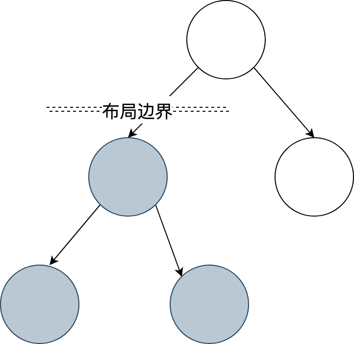
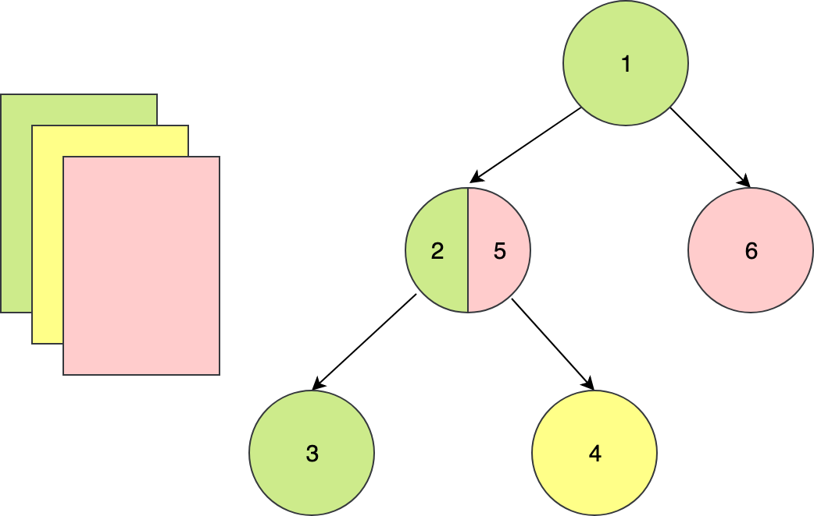

# Flutter区别于其他方案的关键技术是什么？

## 1 Flutter 出现的历史背景

应用程序开发方案：

1. 使用原生开发语言（即 Java 和 Objective-C），针对不同平台分别进行开发。
2. 使用跨平台解决方案，对不同平台进行统一开发。

存在的弊端：

- 原生开发：原生开发方式的体验最好，但研发效率和研发成本相对较高。
- 跨平台开发：跨平台开发方式研发虽然效率高，但为了抹平多端平台差异，各类解决方案暴露的组件和 API 较原生开发相比少很多，因此研发体验和产品功能并不完美。比如对于用户体验更接近于原生的 React Native，对业务的支持能力却还不到浏览器的 5%，仅适用于中低复杂度的低交互类页面。

Flutter 的特点：

- Flutter 是构建 Google 物联网操作系统 Fuchsia 的 SDK，主打跨平台、高保真、高性能。
- 通过 Dart 语言开发 App，一套代码可以同时运行在 iOS 和 Android 平台。
- Flutter 使用 Native 引擎渲染视图，并提供了丰富的组件和接口。

## 2 Flutter 怎么运转

### Flutter 和其他跨平台方案的本质区别

- React Native 之类框架：通过 JavaScript 虚拟机扩展调用系统组件，由 Android 和 iOS 系统进行组件的渲染。
- Flutter：重写了一整套包括底层渲染逻辑和上层开发语言的完整解决方案。这样不仅可以保证视图渲染在 Android 和 iOS 上的高度一致性（即高保真），在代码执行效率和渲染性能上也可以媲美原生 App 的体验（即高性能），完成了组件渲染的闭环。

### 图形渲染过程

在计算机系统中，图像的显示需要 CPU、GPU 和显示器一起配合完成：

- CPU 负责图像数据计算
- GPU 负责图像数据渲染
- 显示器负责最终图像显示

流程：

1. CPU 把计算好的、需要显示的内容交给 GPU，由 GPU 完成渲染后放入帧缓冲区。
2. 随后视频控制器根据垂直同步信号（VSync）以每秒 60 次的速度，从帧缓冲区读取帧数据。
3. 随后将数据交由显示器完成图像显示。

Flutter 作为跨平台开发框架也采用了这种底层方案，下图是 Flutter 的渲染原理图

可以看到 Flutter 关注如何尽可能快地在两个硬件时钟的 VSync 信号之间计算并合成视图数据，然后通过 Skia 交给 GPU 渲染：UI 线程使用 Dart 来构建视图结构数据，这些数据会在 GPU 线程进行图层合成，随后交给 Skia 引擎加工成 GPU 数据，而这些数据会通过 OpenGL 最终提供给 GPU 渲染。

### Skia 简介

Flutter 只关心如何向 GPU 提供视图数据，而 Skia 就是它向 GPU 提供视图数据的好帮手。

1. Skia 是一款用 C++ 开发的、性能彪悍的 2D 图像绘制引擎，其前身是一个向量绘图软件。2005 年被 Google 公司收购后，因为其出色的绘制表现被广泛应用在 Chrome 和 Android 等核心产品上。Skia 在图形转换、文字渲染、位图渲染方面都表现卓越，并提供了开发者友好的 API。
2. 架构于 Skia 之上的 Flutter，也因此拥有了彻底的跨平台渲染能力。通过与 Skia 的深度定制及优化，Flutter 可以最大限度地抹平平台差异，提高渲染效率与性能。
3. 因为统一了底层渲染，同一套代码在 Android 与 IOS 平台能实现 UI 一致性，即 Skia 保证了同一套代码调用在 Android 和 iOS 平台上的渲染效果是完全一致的。

### 为什么是 Dart 语言

Flutter 为什么选择了 Dart，而不是前端应用的准官方语言 JavaScript 呢？Google 公司给出的原因很简单也很直接：**Dart 语言开发组就在隔壁，对于 Flutter 需要的一些语言新特性，能够快速在语法层面落地实现；而如果选择了 JavaScript，就必须经过各种委员会和浏览器提供商漫长的决议**。

当然除此之外，也还有其他隐含的原因：

1. Dart 同时支持即时编译 JIT 和事前编译 AOT。在开发期使用 JIT，开发周期异常短，调试方式颠覆常规（支持有状态的热重载）；而发布期使用 AOT，本地代码的执行更高效，代码性能和用户体验也更卓越。
2. Dart 作为一门现代化语言学习成本并不高，很容易上手。
3. Dart 避免了抢占式调度和共享内存，可以在没有锁的情况下进行对象分配和垃圾回收，在性能方面表现相当不错。

## 3 Flutter 的原理

### Flutter 的架构图

如何学习 Flutter？首先建立起对 Flutter 的整体印象，能够从框架设计和实现原理的高度去理解 Flutter 区别其他跨平台解决方案的关键所在，为后面的学习打好基础，而不是直接进入语言细节。

Flutter 架构图：

Flutter 架构采用分层设计，从下到上分为三层，依次为：Embedder、Engine、Framework。

- **Embedder**：Embedder 是操作系统适配层，实现了渲染 Surface 设置，线程设置，以及平台插件等平台相关特性的适配。
  - 可以看出Flutter 平台相关特性并不多，这就使得从框架层面保持跨端一致性的成本相对较低。
- **Engine**：Engine 层主要包含 Skia、Dart 和 Text，实现了 Flutter 的渲染引擎、文字排版、事件处理和 Dart 运行时等功能。
  - Skia 和 Text 为上层接口提供了调用底层渲染和排版的能力，Dart 则为 Flutter 提供了运行时调用 Dart 和渲染引擎的能力。而 Engine 层的作用，则是将它们组合起来，从它们生成的数据中实现视图渲染。
- **Framework**：Framework 层是一个用 Dart 实现的 UI SDK，包含了动画、图形绘制和手势识别等功能。

下面以界面渲染过程为例，介绍 Flutter 是如何工作的：

- **控件树**：页面中的各界面元素（Widget）以树的形式组织，即控件树。
- **染对象树**：Flutter 通过控件树中的每个控件创建不同类型的渲染对象，组成渲染对象树。

渲染对象树在 Flutter 的展示过程分为四个阶段：**布局、绘制、合成和渲染**。

### 布局

**布局过程**：Flutter 采用深度优先机制遍历渲染对象树，决定渲染对象树中各渲染对象在屏幕上的位置和尺寸。在布局过程中，渲染对象树中的每个渲染对象都会接收父对象的布局约束参数，决定自己的大小，然后父对象按照控件逻辑决定各个子对象的位置，完成布局过程。

>这里的布局类似 Android View 的绘制过程。

**布局边界（Relayout Boundary）**：为了防止因子节点发生变化而导致整个控件树重新布局，Flutter 加入的一个机制，可以在某些节点自动或手动地设置布局边界，当边界内的任何对象发生重新布局时，不会影响边界外的对象，反之亦然。

### 绘制

**绘制过程**：布局完成后，渲染对象树中的每个节点都有了明确的尺寸和位置。Flutter 会把所有的渲染对象绘制到不同的图层上。与布局过程一样，绘制过程也是深度优先遍历，而且总是先绘制自身，再绘制子节点

>这里的绘制也类似 Android View 的绘制过程。

>上图在节点 1 在绘制完自身后，会再绘制节点 2，然后绘制它的子节点 3、4 和 5，最后绘制节点 6

**绘制边界**：由于一些其他原因（比如，视图手动合并）导致 2 的子节点 5 与它的兄弟节点 6 处于了同一层，这样会导致当节点 2 需要重绘的时候，与其无关的节点 6 也会被重绘，带来性能损耗。为了解决这一问题，Flutter 提出的与布局边界对应的机制——在重绘边界内，Flutter 会强制切换新的图层，这样就可以避免边界内外的互相影响，避免无关内容置于同一图层引起不必要的重绘。

重绘边界的一个典型场景是 Scrollview。ScrollView 滚动的时候需要刷新视图内容，从而触发内容重绘。而当滚动内容重绘时，一般情况下其他内容是不需要重绘的，这时候重绘边界就派上用场了。

### 合成和渲染

终端设备的页面越来越复杂，因此 Flutter 的渲染树层级通常很多，直接交付给渲染引擎进行多图层渲染，可能会出现大量渲染内容的重复绘制，所以还需要先进行一次图层合成，即**将所有的图层根据大小、层级、透明度等规则计算出最终的显示效果，将相同的图层归类合并，简化渲染树，提高渲染效率**。合并完成后，Flutter 会将几何图层数据交由 Skia 引擎加工成二维图像数据，最终交由 GPU 进行渲染，完成界面的展示。

## 4 Flutter 知识图谱

学习 Flutter 都需要掌握什么知识点呢？下图按照 App 的开发流程（开发、调试测试、发布与线上运维）将 Flutter 的技术栈进行了划分，里面几乎包含了 Flutter 开发需要的所有知识点。

可以按照上图罗列的知识点对 Flutter 展开学习。
