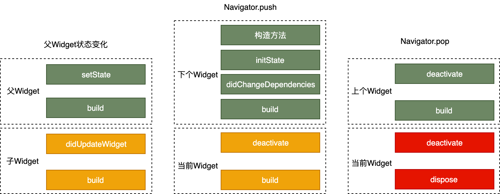

# 11-Flutter 中组件的生命周期

通过父 Widget 初始化时传入的静态配置，StatelessWidget 就能完全控制其静态展示。而 StatefulWidget，还需要借助于 State 对象，在特定的阶段来处理用户的交互或其内部数据的变化，并体现在 UI 上。这些特定的阶段，就涵盖了**一个组件从加载到卸载的全过程，即生命周期**。

我们需要关注的组件生命周期有：

- **Widget 生命周期**：Flutter 中的 Widget 生命周期通过 State 来体现。
- **App 的生命周期**： App 是一个特殊的 Widget。除了需要处理视图显示的各个阶段（即视图的生命周期）之外，还需要应对应用从启动到退出所经历的各个状态（App 的生命周期）。

无论是普通 Widget（的 State）还是 App，框架都给我们提供了生命周期的回调，可以让我们选择恰当的时机，做正确的事儿。所以，在对生命周期有了深入理解之后，我们可以写出更加连贯流畅、体验优良的程序。

## 1 State 生命周期

**State 的生命周期**，指的是在用户参与的情况下，其关联的 Widget 所经历的，从创建到显示再到更新最后到停止，直至销毁等各个过程阶段。

不同的阶段涉及到特定的任务处理，因此为了写出一个体验和性能良好的控件，正确理解 State 的生命周期至关重要。生命周期图如下：


具体 State 的生命周期可以分为 3 个阶段：

- 创建（插入视图树）
- 更新（在视图树中存在）
- 销毁（从视图树中移除）

### Widget 创建

State 初始化时会依次执行 ：`构造方法 -> initState -> didChangeDependencies -> build`，随后完成页面渲染。

1. 构造方法是 State 生命周期的起点，Flutter 会通过调用 `StatefulWidget.createState()` 来创建一个 State。我们可以通过构造方法，来接收父 Widget 传递的初始化 UI 配置数据。这些配置数据，决定了 Widget 最初的呈现效果。
2. initState，会在 State 对象被**插入视图树的时候调用**。这个函数在 State 的生命周期中只会被调用一次，所以我们可以在这里做一些初始化工作，比如为状态变量设定默认值。
3. didChangeDependencies 用来专门**处理 State 对象依赖关系变化**，会在 initState() 调用结束后，被 Flutter 调用。
4. build，作用是构建视图。经过以上步骤，Framework 认为 State 已经准备好了，于是调用 build。我们需要在这个函数中，根据父 Widget 传递过来的初始化配置数据，以及 State 的当前状态，创建一个 Widget 然后返回。

### Widget 更新

Widget 的状态更新，主要由 3 个方法触发：`setState、didchangeDependencies 与 didUpdateWidget`。

1. setState：我们最熟悉的方法之一。当状态数据发生变化时，我们总是通过调用这个方法来触发更新。
2. didChangeDependencies：State 对象的依赖关系发生变化后，Flutter 会回调这个方法，随后触发组件构建。典型的场景是，系统语言 Locale 或应用主题改变时，系统会通知 State 执行 didChangeDependencies 回调方法。
3. didUpdateWidget：当 Widget 的配置发生变化时，比如，父 Widget 触发重建（即父 Widget 的状态发生变化时），热重载时，系统会调用这个函数。

一旦这三个方法的一个被调用，Flutter 随后就会销毁老 Widget，并调用 build 方法重建 Widget。

>State 调用 setState 会直接触发自身对应 Widget 的 build 方法，会触发子 Widget 对应 State 的 didUpdateWidget 和 build 方法。

### Widget 销毁

组件销毁相对比较简单。比如组件被移除，或是页面销毁的时候，系统会调用 deactivate 和 dispose 这两个方法，来移除或销毁组件。

1. 当组件的可见状态发生变化时，deactivate 函数会被调用，这时 State 会被暂时从视图树中移除。值得注意的是，页面切换时，由于 State 对象在视图树中的位置发生了变化，需要先暂时移除后再重新添加，重新触发组件构建，因此这个函数也会被调用。
2. 当 State 被永久地从视图树中移除时，Flutter 会调用 dispose 函数。而一旦到这个阶段，组件就要被销毁了，所以我们可以在这里进行最终的资源释放、移除监听、清理环境，等等。

如下图所示:

1. 左边部分展示了当父 Widget 状态发生变化时，父子双方共同的生命周期；
2. 中间部分展示跳转到新的 Widget 时，两个关联的 Widget 的生命周期函数是如何响应的。
3. 右侧部分展示从新的 Widget 返回原来的 Widget 时，两个关联的 Widget 的生命周期函数是如何响应的。



### 总结

下面表格，从功能，调用时机和调用次数的维度总结了这些方法，帮助你去理解、记忆。、


## 2 App 生命周期

- 视图的生命周期，定义了视图的加载到构建的全过程，其回调机制能够确保我们可以根据视图的状态选择合适的时机做恰当的事情。
- App 的生命周期，定义了 App 从启动到退出的全过程

如果监听 App 生命周期:

- 在原生开发中，我们可以通过重写 Activity、ViewController 生命周期回调方法，或是注册应用程序的相关通知，来监听 App 的生命周期并做相应的处理。
- 在 Flutter 中，我们可以利用 WidgetsBindingObserver 类，来实现同样的需求。

WidgetsBindingObserver 中的回调函数：

```dart
abstract class WidgetsBindingObserver {
  // 页面 pop
  Future<bool> didPopRoute() => Future<bool>.value(false);
  // 页面 push
  Future<bool> didPushRoute(String route) => Future<bool>.value(false);
  // 系统窗口相关改变回调，如旋转
  void didChangeMetrics() { }
  // 文本缩放系数变化
  void didChangeTextScaleFactor() { }
  // 系统亮度变化
  void didChangePlatformBrightness() { }
  // 本地化语言变化
  void didChangeLocales(List<Locale> locale) { }
  //App 生命周期变化
  void didChangeAppLifecycleState(AppLifecycleState state) { }
  // 内存警告回调
  void didHaveMemoryPressure() { }
  //Accessibility 相关特性回调
  void didChangeAccessibilityFeatures() {}
}
```

WidgetsBindingObserver 这个类提供的回调函数非常丰富，常见的屏幕旋转、屏幕亮度、语言变化、内存警告都可以通过这个实现进行回调。**通过给 WidgetsBinding 的单例对象设置监听器，就可以监听对应的回调方法**。具体参考官方文档 [WidgetsBindingObserver-class.html](https://api.flutter.dev/flutter/widgets/WidgetsBindingObserver-class.html)

### 生命周期回调

didChangeAppLifecycleState 回调函数中，有一个参数类型为 AppLifecycleState 的枚举类，这个枚举类是 Flutter 对 App 生命周期状态的封装。它的常用状态包括 resumed、inactive、paused 这三个。

- resumed：可见的，并能响应用户的输入。
- inactive：处在不活动状态，无法处理用户响应。
- paused：不可见并不能响应用户的输入，但是在后台继续活动中。

下面示例，在 initState 时注册了监听器，在 didChangeAppLifecycleState 回调方法中打印了当前的 App 状态，最后在 dispose 时把监听器移除：

```dart
class _MyHomePageState extends State<MyHomePage>  with WidgetsBindingObserver{
...

  @override
  @mustCallSuper
  void initState() {
    super.initState();
    WidgetsBinding.instance.addObserver(this);// 注册监听器
  }

  @override
  @mustCallSuper
  void dispose(){
    super.dispose();
    WidgetsBinding.instance.removeObserver(this);// 移除监听器
  }

  @override
  void didChangeAppLifecycleState(AppLifecycleState state) async {
    print("$state");
    if (state == AppLifecycleState.resumed) {
      //do sth
    }
  }

}
```

切换一下前、后台，观察控制台输出的 App 状态，可以发现：

- 从后台切入前台，控制台打印的 App 生命周期变化如下: `AppLifecycleState.paused->AppLifecycleState.inactive->AppLifecycleState.resumed；`
- 从前台退回后台，控制台打印的 App 生命周期变化则变成了：`AppLifecycleState.resumed->AppLifecycleState.inactive->AppLifecycleState.paused。`

如果下图所示：


### 帧绘制回调

除了需要监听 App 的生命周期回调做相应的处理之外，有时候我们还需要在组件渲染之后做一些与显示安全相关的操作。

- 在 iOS 开发中，我们可以通过 `dispatch_async(dispatch_get_main_queue(),^{…})` 方法，让操作在下一个 RunLoop 执行；而在 Android 开发中，我们可以通过 `View.post()` 插入消息队列，来保证在组件渲染后进行相关操作。
- 在 Flutter 中实现同样的需求会更简单：依然使用万能的 WidgetsBinding 来实现。

WidgetsBinding 提供了单次 Frame 绘制回调，以及实时 Frame 绘制回调两种机制，来分别满足不同的需求：

- 单次 Frame 绘制回调，通过 addPostFrameCallback 实现。它会在当前 Frame 绘制完成后进行进行回调，并且只会回调一次，如果要再次监听则需要再设置一次。

```dart
WidgetsBinding.instance.addPostFrameCallback((_){
    print(" 单次 Frame 绘制回调 ");// 只回调一次
});
```

- 实时 Frame 绘制回调，则通过 addPersistentFrameCallback 实现。这个函数会在每次绘制 Frame 结束后进行回调，可以用做 FPS 监测。

```dart
WidgetsBinding.instance.addPersistentFrameCallback((_){
  print(" 实时 Frame 绘制回调 ");// 每帧都回调
});
```

## 3 总结

1. 认识 Widget 生命周期的实际承载者 State，将 State 的生命周期划分为了创建（插入视图树）、更新（在视图树中存在）、销毁（从视图树种移除），还有不同阶段对应的回调方法。
2. 认识 Flutter 常用的生命周期状态切换机制。以此来掌握 Flutter 的 App 生命周期监听方法，并理解 Flutter 常用的生命周期状态切换机制。
3. 掌握 Flutter 帧绘制回调机制，理解单次 Frame 绘制回调与实时 Frame 绘制回调的异同与使用场景。

总之只要记住创建、更新与销毁这三条主线的调用规则，就一定能把这些方法的调用顺序串起来，并能在实际开发中运用正确的方法去感知状态变更，写出合理的组件。

## 4 思考题

1.构造方法与 initState 函数在 State 的生命周期中都只会被调用一次，也大都用于完成一些初始化的工作。根据今天的学习，你能否举出例子，比如哪些操作适合放在构造方法，哪些操作适合放在 initState，而哪些操作必须放在 initState。

- 在构造函数中 Widget 还未生成（state 的 widget 属性此时还为 null），所以只能做一些参数传入的处理，initState 中可以做初始化 State 的变量的操作。

2.通过 didChangeDependencies 触发 Widget 重建时，父子 Widget 之间的生命周期函数调用时序是怎样的？

## 5 相关项目

[11_Flutter_lifecycle](https://github.com/cyndibaby905/11_Flutter_lifecycle)

## 6 疑问

为啥 `navigator.push()` 之后当前的 widget deactivate 了还要 build 一次？

- 因为 State 的相对位置变了。不过 UI 是不会刷新的。
