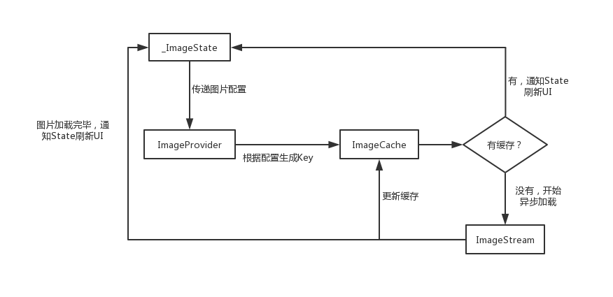

# 文本、图片和按钮

## 1 文本控件

在 Flutter 中，文本展示是通过 Text 控件实现的。Text 支持两种类型的文本展示：

- 一个是默认的展示单一样式的文本 Text；
- 另一个是支持多种混合样式的富文本 Text.rich。

### 使用单一样式的文本 Text

单一样式文本 Text 的初始化，需要传入展示的字符串，以及控制样式的其他参数，控制样式的参数可以分为两类：

1. **控制整体文本布局的参数**，如文本对齐方式 textAlign、文本排版方向 textDirection，文本显示最大行数 maxLines、文本截断规则 overflow 等等，这些都是构造函数中的参数；
2. **控制文本展示样式的参数**，如字体名称 fontFamily、字体大小 fontSize、文本颜色 color、文本阴影 shadows 等等，这些参数被统一封装到了构造函数中的参数 style 中。

示例：

```dart
Text(
  '文本是视图系统中的常见控件，用来显示一段特定样式的字符串，就比如 Android 里的 TextView，或是 iOS 中的 UILabel。',
  textAlign: TextAlign.center,// 居中显示
  style: TextStyle(fontWeight: FontWeight.bold, fontSize: 20, color: Colors.red),//20 号红色粗体展示
);
```

### 混合展示样式

混合展示样式与单一样式的关键区别在于分片，在 Android 中，我们使用 SpannableString 来实现；在 iOS 中，我们使用 NSAttributedString 来实现；而在 Flutter 中也有类似的概念，即 TextSpan。

TextSpan 定义了一个字符串片段该如何控制其展示样式，而将这些有着独立展示样式的字符串组装在一起，则可以支持混合样式的富文本展示。如下面示例代码：

```dart
TextStyle blackStyle = TextStyle(fontWeight: FontWeight.normal, fontSize: 20, color: Colors.black); // 黑色样式

TextStyle redStyle = TextStyle(fontWeight: FontWeight.bold, fontSize: 20, color: Colors.red); // 红色样式

Text.rich(
    TextSpan(
        children: <TextSpan>[
          TextSpan(text:'文本是视图系统中常见的控件，它用来显示一段特定样式的字符串，类似', style: redStyle), // 第 1 个片段，红色样式 
          TextSpan(text:'Android', style: blackStyle), // 第 1 个片段，黑色样式 
          TextSpan(text:'中的', style:redStyle), // 第 1 个片段，红色样式 
          TextSpan(text:'TextView', style: blackStyle) // 第 1 个片段，黑色样式 
        ]),
  textAlign: TextAlign.center,
);
```

## 2 图片

使用 Image，可以让我们向用户展示一张图片。Flutter 中也有多种方式，用来加载不同形式、支持不同格式的图片：

- 加载本地资源图片，如 `Image.asset(‘images/logo.png’)`；
- 加载本地（File 文件）图片，如 `Image.file(new File(’/storage/xxx/xxx/test.jpg’))`；
- 加载网络图片，如 `Image.network('http://xxx/xxx/test.gif')` 。

### FadeInImage

在加载网络图片的时候，为了提升用户的等待体验，我们往往会加入占位图、加载动画等元素，但是默认的 Image.network 构造方法并不支持这些高级功能，而 FadeInImage 支持这些功能。

FadeInImage 控件提供了图片占位的功能（支持gif），并且支持在图片加载完成时淡入淡出的视觉效果。实例代码如下：

```dart
FadeInImage.assetNetwork(
  placeholder: 'assets/loading.gif', //gif 占位
  image: 'https://xxx/xxx/xxx.jpg',
  fit: BoxFit.cover, // 图片拉伸模式
  width: 200,
  height: 200,
)
```

### 图片的加载流程

Image 控件需要根据图片资源异步加载的情况，决定自身的显示效果，因此是一个 StatefulWidget。图片加载过程由 ImageProvider 触发，而 ImageProvider 表示异步获取图片数据的操作，可以从资源、文件和网络等不同的渠道获取图片。

1. 首先，ImageProvider 根据 _ImageState 中传递的图片配置生成对应的图片缓存 key，然后，去 ImageCache 中查找是否有对应的图片缓存。
2. 如果有，则通知 _ImageState 刷新 UI；如果没有，则启动 ImageStream 开始异步加载。
3. 加载完毕后，更新缓存；最后，通知 _ImageState 刷新 UI。



### CachedNetworkImage

ImageCache 使用 LRU（Least Recently Used，最近最少使用）算法进行缓存更新策略，并且默认最多存储 1000 张图片，最大缓存限制为 100MB，当限定的空间已存满数据时，把最久没有被访问到的图片清除。**图片缓存只会在运行期间生效，也就是只缓存在内存中**。

如果想要支持缓存到文件系统，可以使用第三方的 [CachedNetworkImage](https://pub.dev/packages/cached_network_image/) 控件。

使用示例：

```dart
CachedNetworkImage(
        imageUrl: "http://xxx/xxx/jpg",
        placeholder: (context, url) => CircularProgressIndicator(),
        errorWidget: (context, url, error) => Icon(Icons.error),
     )
```

## 3 按钮

Flutter 提供了三个基本的按钮控件，即 FloatingActionButton、FlatButton 和 RaisedButton。

1. FloatingActionButton：一个圆形的按钮，一般出现在屏幕内容的前面，用来处理界面中最常用、最基础的用户动作。
2. RaisedButton：凸起的按钮，默认带有灰色背景，被点击后灰色背景会加深。
3. FlatButton：扁平化的按钮，默认透明背景，被点击后会呈现灰色背景。

这三个按钮控件的使用方法类似，唯一的区别只是默认样式不同而已。示例代码如下：

```dart
FloatingActionButton(onPressed: () => print('FloatingActionButton pressed'),child: Text('Btn'),);
FlatButton(onPressed: () => print('FlatButton pressed'),child: Text('Btn'),);
RaisedButton(onPressed: () => print('RaisedButton pressed'),child: Text('Btn'),);
```

按钮的 onPressed 参数和 child 参数：

- onPressed 参数用于设置点击回调，告诉 Flutter 在按钮被点击时通知我们。如果 onPressed 参数为空，则按钮会处于禁用状态，不响应用户点击。
- child 参数用于设置按钮的内容，告诉 Flutter 控件应该长成什么样，也就是控制着按钮控件的基本样式。

child 可以是任意的控件：

```dart
FlatButton(
    color: Colors.yellow, // 设置背景色为黄色
    shape:BeveledRectangleBorder(borderRadius: BorderRadius.circular(20.0)), // 设置斜角矩形边框
    colorBrightness: Brightness.light, // 确保文字按钮为深色
    onPressed: () => print('FlatButton pressed'), 
    child: Row(children: <Widget>[Icon(Icons.add), Text("Add")],)
)；
```

## 4 思考题

打开 IDE，阅读 Flutter SDK 中 Text、Image、FadeInImage，以及按钮控件 FloatingActionButton、FlatButton 与 RaisedButton 的源码，在 build 函数中找出在内部真正承载其视觉功能的控件。分享下你在这一过程中发现了什么现象？

- Text、Image、FadeInImage、FlatButton、RaisedButton 都由 SingleChildRenderObjectWidget 承载视觉，并且这些 Widget 都隐式的定义了 Semantics ，因为他们可能都直接或者间接的在 Screen Reader 引擎中被使用。
