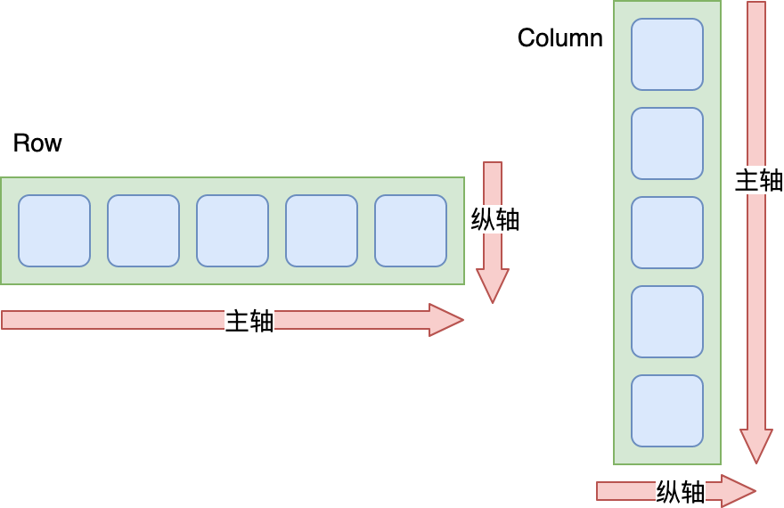

# 布局排版

在 Flutter 中，搭建出一个漂亮的布局，我们需要了解哪些布局规则，以及这些规则与其他平台类似概念的差别在哪里。在 Flutter 中一切皆 Widget，那么布局也不例外。但与基本控件元素不同，**布局类的 Widget 并不会直接呈现视觉内容，而是作为承载其他子 Widget 的容器**。

布局类的 Widget，内部都会包含一个或多个子控件，并且都提供了摆放子控件的不同布局方式，可以实现子控件的对齐、嵌套、层叠和缩放等。而我们要做的就是，通过各种定制化的参数，将其内部的子 Widget 依照自己的布局规则放置在特定的位置上，最终形成一个漂亮的布局。

Flutter 提供了很多布局，具体参考 [widgets/layout](https://flutter.dev/docs/development/ui/widgets/layout)，在开发 Flutter 应用时，最常用也最有代表性的布局 Widget，包括：

- 单子 Widget 布局
- 多子 Widget 布局
- 层叠 Widget 布局

## 1 单子 Widget 布局：Container、Padding 与 Center

单子 Widget 布局类容器比较简单，一般用来对其唯一的子 Widget 进行样式包装，比如`限制大小、添加背景色样式、内间距、旋转变换`等。这一类布局 Widget，包括 Container、Padding 与 Center 三种。

### Container

Container，是一种允许在其内部添加其他控件的控件，也是 UI 框架中的一个常见概念。

- Container 本身可以单独作为控件存在（比如单独设置背景色、宽高）。
- Container 也可以作为其他控件的父级存在：Container 可以定义布局过程中子 Widget 如何摆放，以及如何展示。。

**Flutter 的 Container 仅能包含一个子 Widget**，对于多个子 Widget 的布局场景，可以先用一个根 Widget 去包装这些子 Widget，然后把这个根 Widget 放到 Container 中，再由 Container 设置它的对齐 alignment、边距 padding 等基础属性和样式属性。

示例示例:

```dart
Container(
  child: Text('Container（容器）在 UI 框架中是一个很常见的概念，Flutter 也不例外。'),
  padding: EdgeInsets.all(18.0), // 内边距
  margin: EdgeInsets.all(44.0), // 外边距
  width: 180.0,
  height:240,
  alignment: Alignment.center, // 子 Widget 居中对齐
  decoration: BoxDecoration( //Container 样式
    color: Colors.red, // 背景色
    borderRadius: BorderRadius.circular(10.0), // 圆角边框
  ),
)
```

### Padding

如果我们只需要对子 Widget 设定间距，则可以使用另一个单子容器控件 Padding 进行内容填充：

```dart
Padding(
  padding: EdgeInsets.all(44.0),
  child: Text('Container（容器）在 UI 框架中是一个很常见的概念，Flutter 也不例外。'),
);
```

在需要设置内容间距时，我们可以通过 EdgeInsets 的不同构造函数，分别制定四个方向的不同补白方式，如均使用同样数值留白、只设置左留白或对称方向留白等。

### Center

正如它的名字一样，Center 会将其子 Widget 居中排列。比如，我们可以把一个 Text 包在 Center 里，实现居中展示：

```dart
Scaffold(
  body: Center(child: Text("Hello")) // This trailing comma makes auto-formatting nicer for build methods.
);
```

需要注意的是，为了实现居中布局，Center 所占据的空间一定要比其子 Widget 要大才行，这也是显而易见的：如果 Center 和其子 Widget 一样大，自然就不需要居中，也没空间居中了。因此 Center 通常会结合 Container 一起使用。如下：通过 Center 容器实现了 Container 容器中alignment: Alignment.center的效果。

```dart
Container(
  child: Center(child: Text('Container（容器）在 UI 框架中是一个很常见的概念，Flutter 也不例外。')),
  padding: EdgeInsets.all(18.0), // 内边距
  margin: EdgeInsets.all(44.0), // 外边距
  width: 180.0,
  height:240,
  decoration: BoxDecoration( //Container 样式
    color: Colors.red, // 背景色
    borderRadius: BorderRadius.circular(10.0), // 圆角边框
  ),
);
```

>事实上，Container 容器与 Center 容器底层都依赖了同一个容器 Align，通过它实现子 Widget 的对齐方式。具体参考官方文档 [Align-class](https://api.flutter.dev/flutter/widgets/Align-class.html)

## 2 多子 Widget 布局：Row、Column 与 Expanded

### Row、Column 的使用

对于拥有多个子 Widget 的布局类容器而言，其布局行为无非就是两种规则的抽象：

- 水平方向上应该如何布局
- 垂直方向上应该如何布局

如同 Android 的 LinearLayout、前端的 Flex 布局一样，Flutter 中也有类似的概念，即：将子 Widget 按行水平排列的 Row，按列垂直排列的 Column，以及负责分配这些子 Widget 在布局方向（行 / 列）中剩余空间的 Expanded。

Row 与 Column 的使用方法很简单，我们只需要将各个子 Widget 按序加入到 chiildren 数组即可，示例代码如下：

```dart
//Row 的用法示范
Row(
  children: <Widget>[
    Container(color: Colors.yellow, width: 60, height: 80,),
    Container(color: Colors.red, width: 100, height: 180,),
    Container(color: Colors.black, width: 60, height: 80,),
    Container(color: Colors.green, width: 60, height: 80,),
  ],
);

//Column 的用法示范
Column(
  children: <Widget>[
    Container(color: Colors.yellow, width: 60, height: 80,),
    Container(color: Colors.red, width: 100, height: 180,),
    Container(color: Colors.black, width: 60, height: 80,),
    Container(color: Colors.green, width: 60, height: 80,),
  ],
);
```

### 通过 Expanded 制定分配规则填满容器的剩余空间

单纯使用 Row 和 Column 控件，在子 Widget 的尺寸较小时，无法将容器填满，视觉样式比较难看。对于这样的场景，我们可以通过 Expanded 控件，来制定分配规则填满容器的剩余空间。

通过使用 Expanded 来包装 Widget，就可以使用弹性系数参数 flex 来配置剩余控件的分配，如下绿色容器与黄色容器均分剩下的空间：

```dart
Row(
  children: <Widget>[
    Expanded(flex: 1, child: Container(color: Colors.yellow, height: 60)), // 设置了 flex=1，因此宽度由 Expanded 来分配
    Container(color: Colors.red, width: 100, height: 180,),
    Container(color: Colors.black, width: 60, height: 80,),
    Expanded(flex: 1, child: Container(color: Colors.green,height: 60),)/ 设置了 flex=1，因此宽度由 Expanded 来分配
  ],
);
```

### 对齐与排列配置

于 Row 与 Column 而言，Flutter 提供了依据坐标轴的布局对齐行为，即根据布局方向划分出主轴和纵轴：

- 主轴，表示容器依次摆放子 Widget 的方向；
- 纵轴，则是与主轴垂直的另一个方向。



可以根据主轴与纵轴，设置子 Widget 在这两个方向上的对齐规则 mainAxisAlignment 与 crossAxisAlignment。比如：

- 主轴方向 start 表示靠左对齐、center 表示横向居中对齐、end 表示靠右对齐、spaceEvenly 表示按固定间距对齐；
  - 
- 纵轴方向 start 则表示靠上对齐、center 表示纵向居中对齐、end 表示靠下对齐。
  - 

### 填充配置

- 对于主轴而言，Flutter 默认是让父容器决定其长度，即尽可能大，类似 Android 中的 match_parent。
- 对于副轴而言，则类似于 Android 中的 wrap_content。

如果想让容器与子 Widget 在主轴上完全匹配，我们可以通过设置 Row 的 mainAxisSize 参数为 MainAxisSize.min，由所有子 Widget 来决定主轴方向的容器长度，即主轴方向的长度尽可能小：

```dart
Row(
  mainAxisAlignment: MainAxisAlignment.spaceEvenly, // 由于容器与子 Widget 一样宽，因此这行设置排列间距的代码并未起作用
  mainAxisSize: MainAxisSize.min, // 让容器宽度与所有子 Widget 的宽度一致
  children: <Widget>[
    Container(color: Colors.yellow, width: 60, height: 80,),
    Container(color: Colors.red, width: 100, height: 180,),
    Container(color: Colors.black, width: 60, height: 80,),
    Container(color: Colors.green, width: 60, height: 80,),
  ],
)
```

## 3 层叠 Widget 布局：Stack 与 Positioned

Stack 容器与前端中的绝对定位、Android 中的 Frame 布局非常类似，子 Widget 之间允许叠加，还可以根据父容器上、下、左、右四个角的位置来确定自己的位置。**Stack 提供了层叠布局的容器，而 Positioned 则提供了设置子 Widget 位置的能力**，且 Positioned 控件只能在 Stack 中使用，在其他容器中使用会报错。

示例代码如下：

```dart
Stack(
  children: <Widget>[
    Container(color: Colors.yellow, width: 300, height: 300),// 黄色容器

    Positioned(
      left: 18.0,
      top: 18.0,
      child: Container(color: Colors.green, width: 50, height: 50),// 叠加在黄色容器之上的绿色控件
    ),

    Positioned(
      left: 18.0,
      top:70.0,
      child: Text("Stack 提供了层叠布局的容器 "),// 叠加在黄色容器之上的文本
    )
  ],
)
```

## 4 思考题

Row 与 Column 自身的大小是如何决定的？当它们嵌套时，又会出现怎样的情况呢？

- Row 与 Column 是根据 mainAxisSize 以及父 Widget 共同决定，如果父 Widget 没法确定大小，那么 Row 与 Column 就会出错。
