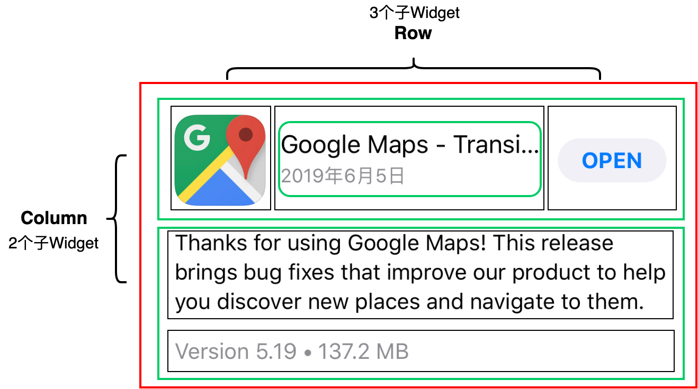
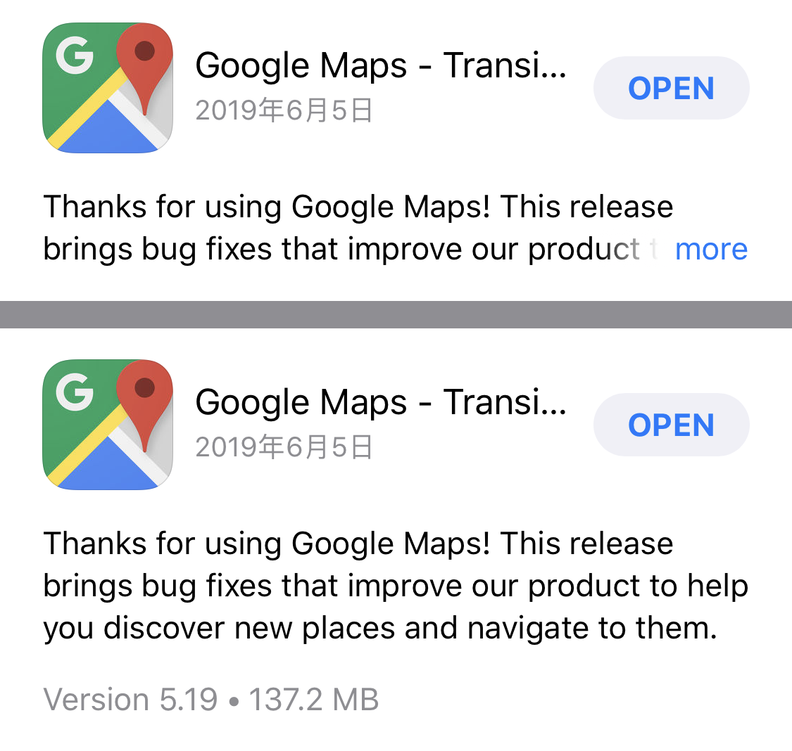

# 自定义Widget：组合与自绘

在实际开发中，我们会经常遇到一些复杂的 UI 需求，往往无法通过使用 Flutter 的基本 Widget，通过设置其属性参数来满足。这个时候，我们就需要针对特定的场景自定义 Widget 了。

自定义 Widget 与其他平台类似：

- 可以使用基本 Widget 组装成一个高级别的 Widget，
- 也可以自己在画板上根据特殊需求来画界面。

## 1 组合

使用组合的方式自定义 Widget，即通过 SDK 提供的布局方式，摆放项目所需要的基础 Widget，并在控件内部设置这些基础 Widget 的样式，从而组合成一个更高级的控件。在 Flutter 中，**组合的思想始终贯穿在框架设计之中**，这也是 Flutter 提供了如此丰富的控件库的原因之一。

通过一个例子——实现 App Store 的升级项 UI 示意图，说明如何通过组装去自定义控件：


### 第一步：定义一个数据结构来描述 UI 上需要的信息

在分析这个升级项 UI 的整体结构之前，我们先定义一个数据结构 UpdateItemModel 来存储升级信息。

```dart
//在这里为了方便讨论，所有的属性都定义为了字符串类型，在实际使用中可以根据需要将属性定义得更规范
class UpdateItemModel {
  String appIcon;//App 图标
  String appName;//App 名称
  String appSize;//App 大小
  String appDate;//App 更新日期
  String appDescription;//App 更新文案
  String appVersion;//App 版本
  // 构造函数语法糖，为属性赋值
  UpdateItemModel({this.appIcon, this.appName, this.appSize, this.appDate, this.appDescription, this.appVersion});
}
```

## 第二步：按照布局方式分析下 UI 的整体结构

分析下这个升级项 UI 的整体结构——按照子 Widget 的摆放方向，**布局方式只有水平和垂直两种，因此我们也按照这两个维度对 UI 结构进行拆解**。

按垂直方向：我们用绿色的框把这个 UI 拆解为上半部分与下半部分，如下图所示。下半部分比较简单，是两个文本控件的组合；上半部分稍微复杂一点，我们先将其包装为一个水平布局的 Row 控件。



水平方向应该如何布局：先把升级项的上半部分拆解成对应的 UI 元素

- 左边的应用图标拆解为 Image；
- 右边的按钮拆解为 FlatButton；
- 中间部分是两个文本在垂直方向上的组合，因此拆解为 Column，Column 内部则是两个 Text。


通过与拆解前的 UI 对比，你就会发现还有 3 个问题待解决：即控件间的边距如何设置、中间部分的伸缩（截断）规则又是怎样、图片圆角怎么实现。接下来，我们分别来看看：

1. Image、FlatButton，以及 Column 这三个控件，与父容器 Row 之间存在一定的间距，因此我们还需要在最左边的 Image 与最右边的 FlatButton 上包装一层 Padding，用以留白填充。
2. 另一方面，考虑到需要适配不同尺寸的屏幕，中间部分的两个文本应该是变长可伸缩的，但也不能无限制地伸缩，太长了还是需要截断的，否则就会挤压到右边按钮的固定空间了。因此，我们需要在 Column 的外层用 Expanded 控件再包装一层，让 Image 与 FlatButton 之间的空间全留给 Column。不过，通常情况下这两个文本并不能完全填满中间的空间，因此我们还需要设置对齐格式，按照垂直方向上居中，水平方向上居左的方式排列。
3. 最后一项需要注意的是，升级项 UI 的 App Icon 是圆角的，但普通的 Image 并不支持圆角。这时，我们可以使用 ClipRRect 控件来解决这个问题。ClipRRect 可以将其子 Widget 按照圆角矩形的规则进行裁剪，所以用 ClipRRect 将 Image 包装起来，就可以实现图片圆角的功能了。

```dart
Widget buildTopRow(BuildContext context) {
  return Row(//Row 控件，用来水平摆放子 Widget
    children: <Widget>[
      Padding(//Paddng 控件，用来设置 Image 控件边距
        padding: EdgeInsets.all(10),// 上下左右边距均为 10
        child: ClipRRect(// 圆角矩形裁剪控件
          borderRadius: BorderRadius.circular(8.0),// 圆角半径为 8
          child: Image.asset(model.appIcon, width: 80,height:80) 图片控件 //
        )
      ),
      Expanded(//Expanded 控件，用来拉伸中间区域
        child: Column(//Column 控件，用来垂直摆放子 Widget
          mainAxisAlignment: MainAxisAlignment.center,// 垂直方向居中对齐
          crossAxisAlignment: CrossAxisAlignment.start,// 水平方向居左对齐
          children: <Widget>[
            Text(model.appName,maxLines: 1),//App 名字
            Text(model.appDate,maxLines: 1),//App 更新日期
          ],
        ),
      ),
      Padding(//Paddng 控件，用来设置 Widget 间边距
        padding: EdgeInsets.fromLTRB(0,0,10,0),// 右边距为 10，其余均为 0
        child: FlatButton(// 按钮控件
          child: Text("OPEN"),
          onPressed: onPressed,// 点击回调
        )
      )
  ]);
}
```

升级项 UI 的下半部分比较简单，是两个文本控件的组合。与上半部分的拆解类似，我们用一个 Column 控件将它俩装起来：


1. 与上半部分类似，这两个文本与父容器之间存在些间距，因此在 Column 的最外层还需要用 Padding 控件给包装起来，设置父容器间距。
2. 另一方面，Column 的两个文本控件间也存在间距，因此我们仍然使用 Padding 控件将下面的文本包装起来，单独设置这两个文本之间的间距。
3. 同样地，通常情况下这两个文本并不能完全填满下部空间，因此我们还需要设置对齐格式，即按照水平方向上居左的方式对齐。

```dart
Widget buildBottomRow(BuildContext context) {
  return Padding(//Padding 控件用来设置整体边距
    padding: EdgeInsets.fromLTRB(15,0,15,0),// 左边距和右边距为 15
    child: Column(//Column 控件用来垂直摆放子 Widget
      crossAxisAlignment: CrossAxisAlignment.start,// 水平方向距左对齐
      children: <Widget>[
        Text(model.appDescription),// 更新文案
        Padding(//Padding 控件用来设置边距
          padding: EdgeInsets.fromLTRB(0,10,0,0),// 上边距为 10
          child: Text("${model.appVersion} • ${model.appSize} MB")
        )
      ]
  ));
}
```

最后，我们将上下两部分控件通过 Column 包装起来，这次升级项 UI 定制就完成了：

```dart
class UpdatedItem extends StatelessWidget {

  final UpdatedItemModel model;// 数据模型

  // 构造函数语法糖，用来给 model 赋值
  UpdatedItem({Key key,this.model, this.onPressed}) : super(key: key);
  final VoidCallback onPressed;

  @override
  Widget build(BuildContext context) {
    return Column(// 用 Column 将上下两部分合体
        children: <Widget>[
          buildTopRow(context),// 上半部分
          buildBottomRow(context)// 下半部分
        ]);
  }

  Widget buildBottomRow(BuildContext context) {...}

  Widget buildTopRow(BuildContext context) {...}
}
```

**按照从上到下、从左到右去拆解 UI 的布局结构，把复杂的 UI 分解成各个小 UI 元素，在以组装的方式去自定义 UI 中非常有用，请一定记住这样的拆解方法**。

## 2 自绘

对于一些不规则的视图，用 SDK 提供的现有 Widget 组合可能无法实现，比如饼图，k 线图等，这个时候我们就需要自己用画笔去绘制了。

在原生 iOS 和 Android 开发中，我们可以继承 UIView/View，在 drawRect/onDraw 方法里进行绘制操作。其实，在 Flutter 中也有类似的方案，那就是 CustomPaint。

CustomPaint 是用以承接自绘控件的容器，并不负责真正的绘制。既然是绘制，那就需要用到画布与画笔。在 Flutter 中：

- **画布是 Canvas**：提供了各种常见的绘制方法，比如画线 drawLine、画矩形 drawRect、画点 DrawPoint、画路径 drawPath、画圆 drawCircle、画圆弧 drawArc 等
- **画笔则是 Paint**：我们可以配置它的各种属性，比如颜色、样式、粗细等
- **CustomPainter 定义了绘制逻辑**：将 CustomPainter 设置给容器 CustomPaint 的 painter 属性，我们就完成了一个自绘控件的封装。

这样，我们就可以在 CustomPainter 的 paint 方法里，通过 Canvas 与 Paint 的配合，实现定制化的绘制逻辑。

下面示例代码中：继承了 CustomPainter，在定义了绘制逻辑的 paint 方法中，通过 Canvas 的 drawArc 方法，用 6 种不同颜色的画笔依次画了 6 个 1/6 圆弧，拼成了一张饼图。最后，我们使用 CustomPaint 容器，将 painter 进行封装，就完成了饼图控件 Cake 的定义。

```dart
class WheelPainter extends CustomPainter {

 //设置画笔颜色
  Paint getColoredPaint(Color color) {// 根据颜色返回不同的画笔
    Paint paint = Paint();// 生成画笔
    paint.color = color;// 设置画笔颜色
    return paint;
  }

  // 绘制逻辑
  @override
  void paint(Canvas canvas, Size size) {
    double wheelSize = min(size.width,size.height)/2;// 饼图的尺寸
    double nbElem = 6;// 分成 6 份
    double radius = (2 * pi) / nbElem;//1/6 圆
    // 包裹饼图这个圆形的矩形框
    Rect boundingRect = Rect.fromCircle(center: Offset(wheelSize, wheelSize), radius: wheelSize);
    // 每次画 1/6 个圆弧
    canvas.drawArc(boundingRect, 0, radius, true, getColoredPaint(Colors.orange));
    canvas.drawArc(boundingRect, radius, radius, true, getColoredPaint(Colors.black38));
    canvas.drawArc(boundingRect, radius * 2, radius, true, getColoredPaint(Colors.green));
    canvas.drawArc(boundingRect, radius * 3, radius, true, getColoredPaint(Colors.red));
    canvas.drawArc(boundingRect, radius * 4, radius, true, getColoredPaint(Colors.blue));
    canvas.drawArc(boundingRect, radius * 5, radius, true, getColoredPaint(Colors.pink));
  }
  // 判断是否需要重绘，这里我们简单的做下比较即可
  @override
  bool shouldRepaint(CustomPainter oldDelegate) => oldDelegate != this;
}

// 将饼图包装成一个新的控件
class Cake extends StatelessWidget {
  @override
  Widget build(BuildContext context) {
    return CustomPaint(
        size: Size(200, 200),
        painter: WheelPainter(),
      );
  }
}
```

## 3 相关项目

- [15_custom_ui_demo](https://github.com/cyndibaby905/15_custom_ui_demo)

## 4 思考题

1 请扩展 UpdatedItem 控件，使其能自动折叠过长的更新文案，并能支持点击后展开的功能。



2 请扩展 Cake 控件，使其能够根据传入的 double 数组（最多 10 个元素）中数值的大小，定义饼图的圆弧大小。
