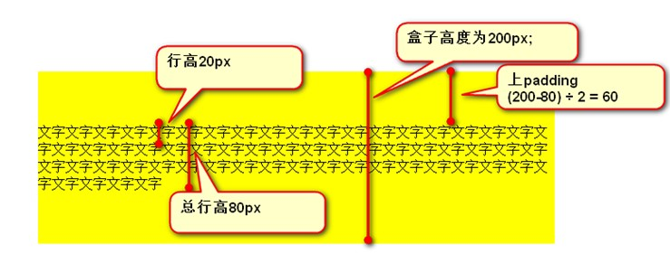
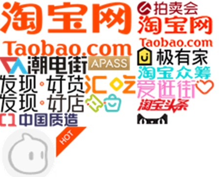

# background、字号

## 1 行高和字号

CSS中，所有的行，都有行高。盒模型的padding，绝对不是直接作用在文字上的，而是作用在“行”上的。

文字，是在自己的行里面居中的。为了严格保证字在行里面居中，我们的工程师有一个约定： **行高、字号，一般都是偶数。这样，它们的差，就是偶数，就能够被2整除。**

### 1.1 文本垂直居中

文本在行里面居中，公式：`行高:盒子高;`只适用于单行文本垂直居中！！不适用于多行。如果想让多行文本垂直居中，需要设置盒子的 `padding`




## 1.2 font属性

使用font属性，能够将 **字号、行高、字体** 一起设置。
```
font: 14px/24px “宋体”;
```
等价于三行语句：
```
font-size:14px;
line-height:24px;
font-family:"宋体";
```
font-family就是“字体”。family是“家庭”、“伐木累”的意思。


**网页中不是所有字体都能用，因为这个字体要看用户的电脑里面装没装，**比如设置：`font-family: "华文彩云";`，如果用户电脑里面没有这个字体，那么就会变成宋体。


页面中，**中文我们只使用： 微软雅黑、宋体、黑体。** 如果页面中，需要其他的字体，那么需要切图。英语：**Arial 、 Times New Roman**

### 1.3 备用字体

为了防止用户电脑里面，没有微软雅黑这个字体。就要用英语的逗号，隔开备选字体，就是说如果用户电脑里面，没有安装微软雅黑字体，那么就是宋体：

    font-family: "微软雅黑","宋体";

备选字体可以有无数个，用逗号隔开。我们要将英语字体，放在最前面，这样所有的中文，就不能匹配英语字体，就自动的变为后面的中文字体

    font-family: "Times New Roman","微软雅黑","宋体";

所有的中文字体，都有英语别名，我们也要知道

    微软雅黑的英语别名：font-family: "Microsoft YaHei"; 
    宋体的英语别名：font-family: "SimSun";

### 1.4 行高百分比

行高可以用百分比，表示字号的百分之多少。一般来说，都是大于 100% 的，因为行高一定要大于字号。

```
font:12px/200% “宋体”
等价于
font:12px/24px “宋体”;
```

---
## 2 超级链接的美化

超级链接就是 `a` 标签。

### 2.1 伪类

同一个标签，根据用户的某种状态不同，有不同的样式。这就叫做“伪类”。类就是工程师加的，比如为 div 定义 `class="box"`，那么 div 就是 box 类，很明确。但是 a 属于什么类？不明确。因为要看用户有没有点击、有没有触碰。所以，就叫做 “伪类”。

伪类用冒号来表示。a标签有 4 种伪类：

```css
a:link{
    color:red;
}
a:visited{
    color:orange;
}
a:hover{
    color:green;
}
a:active{
    color:black;
}
```

- `link`      表示， 用户没有点击过这个链接的样式。 是英语“链接”的意思。
- `visited`    表示， 用户访问过了这个链接的样式。 是英语“访问过的”的意思。
- `hover`    表示， 用户鼠标悬停的时候链接的样式。 是英语“悬停”的意思。
- `active`    表示， 用户用鼠标点击这个链接，但是不松手，此刻的样式。 是英语“激活”的意思。

**这四种状态，在css中，必须按照固定的顺序写**，如果不按照顺序，那么将失效。“爱恨准则”—**l**o**v**e **ha**te。必须先爱后恨。

> 这里只记录了 a 标签的伪类，但是不仅仅是只有a标签才有伪类，其他标签也是有的，具体参考：[MDN：伪类](https://developer.mozilla.org/zh-CN/docs/Web/CSS/Pseudo-classes)

### 2.2 超级链接的美化

a 标签在使用的时候，非常的难。因为不仅仅要控制 a 这个盒子，也要控制它的伪类。我们一定要将 a 标签写在前面，`:link、:visited、:hover、:active` 这些伪类写在后面。

**a标签中，描述盒子； 伪类中描述文字的样式、背景。**

```css
.nav ul li a{
    display: block;
    width: 120px;
    height: 40px;
}
.nav ul li a:link ,.nav ul li a:visited{
    text-decoration: none;
    background-color: yellowgreen;
    color:white;
}
.nav ul li a:hover{
    background-color: purple;
    font-weight: bold;
    color:yellow;
}
```
所有的 a 不继承`text、font`这些东西。因为 a 自己有一个伪类的权重。

最标准的，就是 `link、visited、hover` 都要写。但是前端开发工程师在大量的实践中，发现不写 `link、visited` 浏览器也挺兼容。所以可以简化  a 标签：

`a:link、a:visited` 都是可以省略的，简写在 a  标签里面。也就是说，a 标签涵盖了 `link、visited` 的状态。

```css
.nav ul li a{
    display: block;
    width: 120px;
    height: 50px;
    text-decoration: none;
    background-color: purple;
    color:white;
}
.nav ul li a:hover{
    background-color: orange;
}
```

---
## 3 background 系列属性

### 3.1 background-color 属性

背景颜色属性。**css2.1中**，颜色的表示方法有哪些？一共有三种：

- 单词
- rgb 表示法
- 十六进制表示法

```css
    background-color: red;
    background-color: rgb(255,0,0);
    background-color: #ff0000;
```

十六进制可以简化为3位，所有#aabbcc的形式，能够简化为#abc;


### 3.2 background-image

用于给盒子加上背景图片：

```css
    background-image:url(images/bg.jpg);
```
背景默认是会被平铺满的。padding 的区域有背景图。

#### background-repeat 属性

设置背景图是否重复的，重复方式的。background-repeat 属性，有三种值：

```css
background-repeat:no-repeat;   不重复
background-repeat:repeat-x;    横向重复
background-repeat:repeat-y;    纵向重复
background-repeat:repeat;	   默认值，图片左右上下平铺 
```

####  background-position 属性

背景定位属性，position就是“位置”的意思。background-position 就是背景定位属性。

属性可以用数值描述，定位属性可以是负数：

```css
background-position:向右移动量 向下移动量;
```

也可以用单词描述：`background-position: right bottom;`

```css
描述左右的词儿： left、 center、right
描述上下的词儿： top 、center、bottom
```

#####  css 精灵

>“css精灵”，英语css sprite，所以也叫做“css雪碧”技术。是一种CSS图像合并技术，该方法是将小图标和背景图像合并到一张图片上，然后利用css的背景定位来显示需要显示的图片部分。
css精灵有什么优点，就是减少了http请求。比如4张小图片，原本需要4个http请求。但是用了css精灵，小图片变为了一张图，http请求只有1个了。

淘宝网的精灵图：



### 3.3 background-attachment

背景是否固定。

```css
background-attachment:fixed;  //不随页面滚动
background-attachment:scroll; //随页面滚动 
```

背景就会被固定住，不会被滚动条滚走。

### 3.4 background 综合属性

background属性和border一样，是一个综合属性：

```css
background:red url(1.jpg) no-repeat 100px 100px fixed;
等价于：
background-color:red;
background-image:url(1.jpg);
background-repeat:no-repeat;
background-position:100px 100px;
background-attachment:fixed;
```

可以任意省略部分

```css
background: red;
background: blue url(images/wuyifan.jpg) no-repeat 100px 100px;
background: url(images/taobao.png) no-repeat 0 -133px  //精灵的使用
```

### 3.4 ie6 问题修复

在 IE6 中对图片格式 png24 支持度不高，如果使用的图片格式是 png24，则会导致透明效果无法正常显示，解决方法：

1. 可以使用 png8 来代替 png24，即可解决问题，但是使用 png8 代替 png24 以后，图片的清晰图会有所下降。

2. 使用 JavaScript 来解决该问题，需要向页面中引入一个外部的  JavaScript 文件，然后在写一下简单的 JS 代码，来处理该问题。