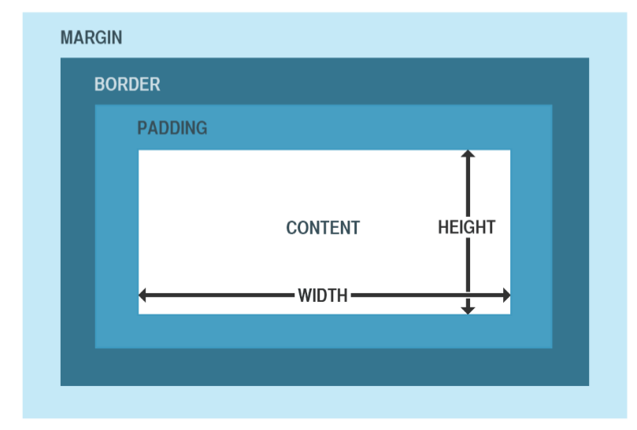

#  盒子模型

所有 HTML 元素可以看作盒子，在 CSS 中，"box model" 这一术语是用来设计和布局时使用。CSS 盒模型本质上是一个盒子，封装周围的 HTML 元素，它包括：`边距，边框，填充，和实际内容`。盒模型允许我们在其它元素和周围元素边框之间的空间放置元素。

> 把所有的元素都想象成盒子，那么我们对网页的布局就相 当于是摆放盒子，我们只需要将相应的盒子摆放到网页中相应的 位置即可完成网页的布局。

---
## 1 盒子模型

---
### 1.1 盒子中的区域

一个盒子中主要的属性就5个：`width、height、padding、border、margin。`

- width是“**宽度**”的意思，CSS中width指的是内容的宽度，而不是盒子的宽度。
- height是“**高度**”的意思，CSS中height指的是内容的高度，而不是盒子的高度
- padding是“**内边距**”的意思
- border是“**边框**”
- margin是“**外边距**”



### 1.2 宽高

盒子的 **真实占有宽度** =  `左border  +  左padding  +  width  +  右padding  +  右border`

### 1.3 内容区

内容区指的是盒子中放置内容的区域，也就是元素中的文本内容，子元素都是存在于内容区中的，如果没有为元素设置内边距和边框，则内容区大小默认和盒子大小是一致的，通过 width 和 height 两个属性可以设置内容区的大 小， width和height属性只适用于块元素。

### 1.3 padding

**padding 就是内边距**。padding 的区域有背景颜色，css2.1 前提下，并且背景颜色一定和内容区域的相同。也就是说，`background-color`将填充所有 boder 以内的区域。

padding 有 4 个方向，所以我们能够分别描述 4 个方向的 padding。方法有两种，第一种写小属性；第二种写综合属性，用空格隔开。

```
//小属性
padding-top: 30px;
padding-right: 20px;
padding-bottom: 40px;
padding-left: 100px;

//综合属性，顺序是上、右、下、左
padding:30px 20px 40px 100px;

//要懂得，用小属性层叠大属性：不能把小属性写在大属性前面。
padding: 20px;
padding-left: 30px;
```

- **前端开发工程师眼中的顺序不一样，上、右、下、左**
- **用小属性层叠大属性：不能把小属性写在大属性前面。**

一些元素，默认带有 padding，比如 ul 标签。所以，我们为了做站的时候便于控制，总是喜欢清除这个默认的padding，`*` 的效率不高，所以我们使用并集选择器，罗列所有的标签：
```css
    body,div,dl,dt,dd,ul,ol,li,h1,h2,h3,h4,h5,h6,pre,code,form,fieldset,legend,input,textarea,p,blockquote,th,td{
        margin:0;
        padding:0;
    }
```

### 1.4  border

边框是元素可见框的最外部，边框有三个要素：`粗细、线型、颜色`。颜色如果不写，**默认是黑色**。另外两个属性不写，显示不出来边框。
```
    border: 1px dashed red;
```
border 是一个大综合属性，border 属性能够被拆开，有两大种拆开的方式：

- 按 3 要素:`border-width、border-style、border-color`
- 按方向：`border-top、border-right、border-bottom、border-left`

**按 3 要素拆开**

一个border是由三个小属性综合而成：`border-width，border-style，border-color。`
```
        border-width:10px;    → 边框宽度
        border-style:solid;     → 线型
        border-color:red;      → 颜色。
```
如果某一个小要素后面是空格隔开的多个值，那么就是上右下左的顺序：
```
        border-width:10px 20px;
        border-style:solid dashed dotted;
        border-color:red green blue yellow;
```
**按方向来拆**
```css
        border-top:10px solid red;
        border-right:10px solid red;
        border-bottom:10px solid red;
        border-left:10px solid red;
        //或者
        border-top-width:10px;
        border-top-style:solid;
        border-top-color:red;
        border-right-width:10px;
        border-right-style:solid;
        border-right-color:red;
        border-bottom-width:10px;
        border-bottom-style:solid;
        border-bottom-color:red;
        border-left-width:10px;
        border-left-style:solid;
        border-left-color:red;
```
**边框的样式**

```
– none（没有边框） 
– dotted（点线） 
– dashed（虚线） 
– solid（实线） 
– double（双线） 
– groove（槽线） 
– ridge（脊线） 
– inset（凹边） 
– outset（凸边）
```

### 1.5 margin

外边距是元素边框与周围元素相距的空间，使用margin属性可以设置外边距，当将左右外边距设置为 auto 时，浏览器会将左右外边距设置为相等，所以 `margin:0 auto` 可以使元素居中。

**标准文档流盒子间的垂直方向 margin 不叠加，而是取最大值，即 margin 坍塌现象**

```css
    <div class="other box1"></div>
    <div class="other box2"></div>
    <div class="other box3"></div>
    
            /*盒子间的margin不叠加*/
            .box1 {
                margin: 20px;
            }
    
            .box2 {
                margin: 30px;
            }
    
            .box3 {
                margin: 20px;
            }
```
这时 box1 和 box2 的距离是 30px，而不是`20+30 = 50px`

---

## 2 重要的属性

### 2.1  display

display 属性定义了元素生成的显示框类型，常见的几个属性值有：`block`、`inline`、`inline-block`、`inherit`、`none`、`flex`。

每个元素都有默认的 display 属性，比如 div 标签的默认 display 属性是 block，我们通常称这类元素为**块级元素**；span 标签的默认 display 属性是 inline，我们通常称这类元素为**行内元素**

默认情况下，对于行内元素，我们不能为它们设置 width、height、 margin-top 和 margin-bottom，但可以通过修改 display 来修改元素的性质。

display 可选值说明： 

- block：设置元素为块元素。
- inline：设置元素为行内元素。
- inline-block：将一个元素转换为行内块元素，可以使一个元素既有行内元素的特点又有块元素的特点，既可以设置宽高，又不会独占一行。

- inherit 表示这个元素从父元素继承 display 属性值。
- none：不显示元素，并且元素不会在页面中继续占有位置。

### 2.2 visibility

visibility 属性主要用于元素是否可见，和 display 不同，使用 visibility 隐藏一个元 素，隐藏后其在文档中所占的位置会依然保持，不会被其他元素覆盖。

### 2.3 overflow

当相关标签里面的内容超出了样式的宽度和高度时，就会发生一些奇怪的事情，浏 览器会让内容溢出盒子，可以通过 overflow 来控制内容溢出的情况：

```
– visible：默认值 
– scroll：添加滚动条 
– auto：根据需要添加滚动条 
– hidden：隐藏超出盒子的内容
```

---

## 3 标准文档流

文档流指的是文档中可现实的对象在排列时所占用的位置，将窗体自上而下分成一行行，并在每行中按从左至右的顺序排放元素，即为文档流。也就是说在文档流中元素默认会紧贴到上一个元素的右边，如果右边不足以放下元素，元素则会另起一行，在新的一行中继 续从左至右摆放。 

### 3.1 标准流有哪些微观现象

- 空白折叠现象
- 高矮不齐，底边对齐
- 自动换行，一行写不满，换行写
- margin 坍塌现象

比如如果我们想让 img 标签之间没有空隙，必须紧密连接：

```html


```


### 3.2 块级元素和行内元素

每个元素都有默认的 display 属性，不同的 display 属性将标签分为两种等级：

**1 块级元素**，其特点为：

 - 独占一行，不能与其他任何元素并列。
 - 可以给块级元素设置宽高、内边距、外边距等盒模型属性。
 - 如果不设置宽度，那么宽度将默认变为父亲的 100%。
 - 块元素在文档流中的高度默认被内容撑开。

**2 行内元素**，其特点为：

- 行内元素在文档流中只占自身的大小，会默认从左向右排列，如果一行中不足以容纳所有的内联元素，则换到下一行，继续自左向右。
 - 行内元素与其他行内元素并排。
 - 给行内元素设置宽高不会起作用，margin 值只对左右起作用，padding 值也只对左右起作用；
 - 不能设置宽、高。默认的宽度，就是文字的宽度，即元素的宽度和高度默认都被内容撑开。

在 HTML 中，我们已经将标签分过类，当时分为了：文本级、容器级。

- 文本级：`<a>、<b>、<label>、<span>、、<em>、<strong>、<i>、<input>、<p>`
- 容器级：`<div>、<h1> ~ <h6>、<ul>、<ol>、<dl>、<table>、<address>、<form>`

CSS 的分类和上面的很像，就 p 不一样：

- 所有的文本级标签，都是行内元素，除了p，p是个文本级，但是是个块级元素。
- 所有的容器级标签都是块级元素。

**可替换元素**：可替换元素（replaced element）的展现效果不是由 CSS 来控制的。这些元素是一种外部对象，它们外观的渲染，是独立于 CSS 的。可替代元素具有内在的尺寸，所以宽高可以设定。HTML 中的 input、button、textarea、select 都是可替代元素，比如给 img 标签设置宽高是可以影响图片大小的，具体参考[可替代元素](https://developer.mozilla.org/zh-CN/docs/Web/CSS/Replaced_element)。

### 3.3 块级元素和行内元素的相互转换

块级元素可以设置为行内元素，行内元素也可以设置为块级元素，**display** 是“显示模式”的意思，用来改变元素的行内、块级性质

- `inline`就是“行内”，一旦给一个标签设置`display: inline;`，那么这个标签将立即变为行内元素。此时它和一个span无异：不能设置宽度高度，因为已和别的原素并排了。

- `“block”`是“块”的意思，让标签变为块级元素。此时这个标签，和一个div无异：能够设置宽度、高度，必须霸占一行了，别人无法和它并排，如果不设置宽度，将撑满父级标签。

标准流里面限制非常多，标签的性质不能满足需求。比如，我们现在就要并排、并且还要设置宽高。所以只能**脱离标准流**！css中一共有三种手段，使一个元素脱离标准文档流：

- 浮动
- 绝对定位
- 固定定位

