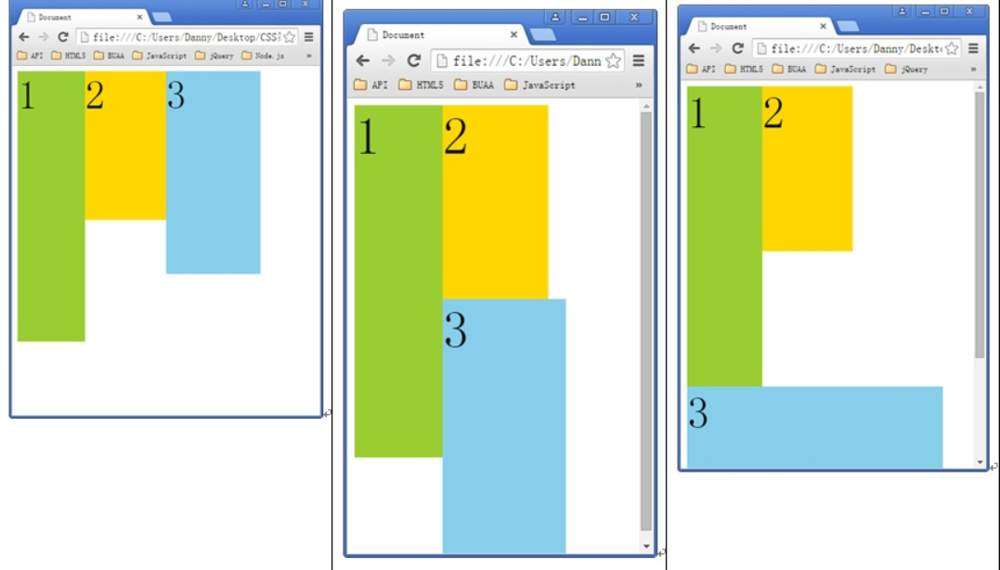
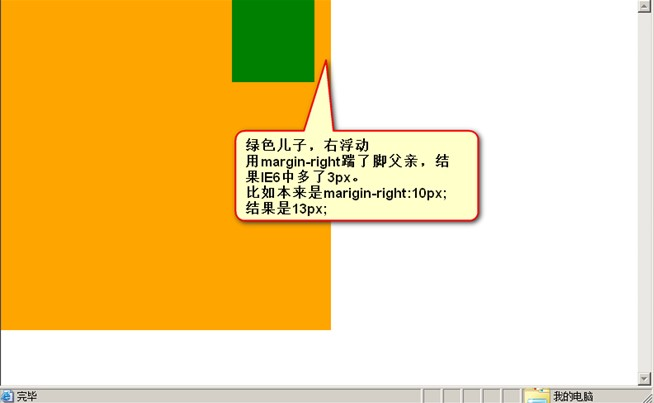

# CSS浮动

---
## 1 浮动概念与特性

 所谓浮动指的是使元素脱离原来的文本流，在父元素中浮动起来，浮动是 css 里面布局用的最多的属性。标准流中不能实现 **两个元素并排，并且两个元素都能够设置宽度、高度**。而浮动之后的元素是可以的。

块级元素和行内元素都可以浮动，**当一个行内元素浮动以后将会自动变为一个块级元素**， 当一个块级元素浮动以后，宽度会变为默认由内容撑开，所以当漂浮一个块级元素时我们都会为其指定一个宽度。

浮动一些现象：

1. **浮动的元素互相贴靠**
    如果有足够空间，那么就会靠着 2。如果没有足够的空间，那么会靠着 1。如果没有足够的空间靠着 1，自己去贴左墙(`float:left`)：
    
2. **浮动的元素有“字围”效果**
    
3. **收缩**：一个浮动的元素，如果没有设置 width，那么将自动收缩为文字的宽度（这点非常像行内元素），高度特性不变，默认为0，可以被子元素撑起高度。

>关于浮动的元素互相贴靠，不仅仅是统一方向的浮动，不同方向的浮动也会影响彼此所占用的空间

浮动性质总结：

- 当一个元素浮动以后，其下方的元素会上移。元素中的内容将会围绕在元素的周围。 
- 浮动会使元素完全脱离文本流，也就是不再在文档中在占用位置。 
- 元素设置浮动以后，会一直向上漂浮直到遇到父元素的边界或者其他浮动元素。 
- 元素浮动以后即完全脱离文档流，这时不会再影响父元素的高度。也就是浮动元素不会撑开父元素。 
-  浮动元素默认会变为块元素，即使设置 `display:inline` 以后其依然是个块元素。

**整个网页，就是通过浮动，来实现并排的。**

---
## 2 浮动的清除

默认情况下没有浮动子元素可以撑起父元素，但是如果是浮动，那么**一个容器如果没有指定高度，就不能给自己的浮动的孩子撑起一个区域。**或者说不能被自己浮动的孩子撑起来。那么就需要进行清除浮动，清除浮动的定义是**让浮动的子元素能撑出父元素的高度**。	

### 清除浮动方法1：给浮动的元素的祖先元素加高度。

- 如果一个元素要浮动，那么它的祖先元素一定要有高度。有高度的盒子，才能关住浮动。
- 只要浮动在一个有高度的盒子中，那么这个浮动就不会影响后面的浮动元素。这就是清除浮动带来的影响。

```html
<!DOCTYPE html>
<html lang="en">
<head>
    <meta charset="UTF-8">
    <title>浮动清除现象</title>
</head>

<style type="text/css">
    * {
        margin: 0;
        padding: 0;
    }

    li {
        float: left;
        width: 120px;
        height: 40px;
        text-align: center;
        background-color: orange;
    }

    /*由于给父级别标签设置了宽度，所以清除了浮动*/
    ul {
        height: 40px;
    }

</style>

<body>

<div class="type_2">

    <div>
        <ul>
            <li>我是列表1</li>
            <li>我是列表1</li>
            <li>我是列表1</li>
            <li>我是列表1</li>
            <li>我是列表1</li>
            <li>我是列表1</li>
        </ul>
    </div>

    <div>
        <ul>
            <li>我是列表2</li>
            <li>我是列表2</li>
            <li>我是列表2</li>
            <li>我是列表2</li>
            <li>我是列表2</li>
            <li>我是列表2</li>
        </ul>
    </div>

</div>

</body>
</html>
```

### 清除浮动方法2：`clear:both;`

网页制作中，高度 height 很少出现。为什么？因为能被内容撑高！那也就是说，刚才我们讲解的方法1，工作中用的很少。那么能不能不写 height，也把浮动清除了呢？也让浮动之间互不影响呢？可以的！那就是`clear:both;`属性，**clear 的作用就是用来清除其他浮动元素对当前元素的影响**。

clear 有 `both/left/right/none/inherit` 几个属性值，分别代表：

- 清除两侧浮动元素对当前元素的影响，清除对他影响最大的那个元素的浮动。
- 在元素左侧不允许出现浮动元素
- 在元素右侧不允许出现浮动元素
- 元素不清除浮动
- 继承父元素的值。

这种方法有一个非常大的致命的问题，就是设置 clear 清除浮动的属性的标签间的 margin 失效了。即 margin 对于设置 clear 清除浮动的属性的标签无效。

### 清除浮动方法3：隔墙法

隔墙法利用的是 `clear` 属性，专门定义标签用来设置 clear 属性，隔墙法又可以分为**内墙法和外墙法**。

#### 外墙法

在两部分浮动元素中间，建一个墙。隔开两部分浮动，让后面的浮动元素，不去追前面的浮动元素。但是这种方式第一个 div box1 还是没有高度。

```html
<!DOCTYPE html>
<html lang="en">
<head>
    <meta charset="UTF-8">
    <title>Title</title>

    <style type="text/css">

        * {
            margin: 0;
            padding: 0;
        }

        /*1 加上clear 属性*/
        .cl {
            clear: both;
        }

        li {
            float: left;
            width: 120px;
            height: 40px;
            list-style: none;
            background-color: red;
            text-align: center;
        }

        /*2 加上高度属性用于margin*/
        .h8 {
            height: 8px;
            _font-size: 0;
        }

        /*box1 的 margin只有left、right和top是有效的*/
        .box1 {
            border: black dashed 3px;
            background-color: gold;
            margin-top: 10px;
            margin-bottom: 10px;
            margin-left: 10%;
        }

        /*box2的margin是有效的*/
        .box2 {
            width: 100px;
            margin-top: 100px;
        }

    </style>

</head>
<body>

<div class="box1">
    <ul>
        <li>HTML</li>
        <li>CSS</li>
        <li>JS</li>
        <li>HTML5</li>
        <li>设计模式</li>
    </ul>
</div>

<div class="cl h8"></div>

<div class="box2">
    <ul>
        <li>学习方法</li>
        <li>英语水平</li>
        <li>面试技巧</li>
    </ul>
</div>

</body>
</html>
```

#### 内墙法

可以直接在高度塌陷的父元素的最后，添加一个空白的 div，由于这个 div 并没有浮动，所以它是可以撑开父元素的高度的，然后在对其进行清除浮动，这样可以通过这个空白的 div 来撑开父元素的高度，基本没有副作用。

```html
<!DOCTYPE html>
<html>
	<head>
		<meta charset="UTF-8">
		<title>清除浮动</title>
		<style type="text/css">
			
			.box1{
				border: 1px solid red;
			}
			
			.box2{
				width: 100px;
				height: 100px;
				background-color: blue;
				float: left;
			}
	
			.clear{
				clear: both;
			}
			
		</style>
	</head>
	<body>
		<div class="box1">
			<div class="box2"></div>
			<div class="clear"></div>
		</div>
	</body>
</html>
```

#### 伪类隔墙法

使用这种方式虽然可以解决问题，但是会在页面中添加多余的结构。有一种最终的解决方案：使用伪类来代替那个用于清除浮动的元素，可以通过 after 伪类向元素的最后添加一个空白的块元素，然后对其清除浮动，样做和添加一个div的原理一样，可以达到一个相同的效果，而且不会在页面中添加多余的div，这是我们最推荐使用的方式，几乎没有副作用。

```html
<!DOCTYPE html>
<html>
	<head>
		<meta charset="UTF-8">
		<title></title>
		<style type="text/css">
			
			.box1{
				border: 1px solid red;
			}
			
			.box2{
				width: 100px;
				height: 100px;
				background-color: blue;
				float: left;
			}
			
			/*通过after伪类，选中box1的后边*/
			.clearfix:after{
				/*添加一个内容*/
				content: "";
				/*转换为一个块元素*/
				display: block;
				/*清除两侧的浮动*/
				clear: both;
			}
			
			/*
			 * 在IE6中不支持after伪类,
			 * 	所以在IE6中还需要使用hasLayout来处理
			 */
			.clearfix{
				zoom:1;
			}
			
		</style>
	</head>
	<body>
		<div class="box1">
			<div class="box2"></div>
		</div>
	</body>
</html>
```

#### 最终版：双伪类法

**子元素和父元素相邻的垂直外边距会发生重叠**，子元素的外边距会传递给父元素，使用空的 table 标签可以隔离父子元素的外边距，阻止外边距的重叠，又由于 table  也是块级元素，所以可以利用这个特性即清除浮动，又可以解决子元素和父元素相邻的垂直外边距会发生重叠的现象：

```html
<!DOCTYPE html>
<html>
	<head>
		<meta charset="UTF-8">
		<title></title>
		<style type="text/css">
			
			.box1{
				width: 300px;
				height: 300px;
				background-color: #bfa;
			}
			.box2{
				width: 200px;
				height: 200px;
				background-color: yellow;
				
				/* 子元素和父元素相邻的垂直外边距会发生重叠，子元素的外边距会传递给父元素，这样会使父元素和子元素一起向下移动 100 px。使用空的 table 标签扩展有内容的 div 标签可以隔离父子元素的外边距，阻止外边距的重叠。 */
				margin-top: 100px;
			}
			
			.box3{
				border: 10px red solid;
			}
			
			.box4{
				width: 100px;
				height: 100px;
				background-color: yellowgreen;
				float: left;
			}
			
			/* 可以解决父子元素的外边距重叠 */
			/*.box1:before{
				content: ""; 
				display:table可以将一个元素设置为表格显示  
			 	display: table;
			}
			*/
			
			/* 可以解决父元素高度塌陷 */
			/*.clearfix:after{
				content: "";
				display: block;
				clear: both;
			}*/
			
			/* 经过修改后的clearfix是一个多功能的，既可以解决高度塌陷，又可以确保父元素和子元素的垂直外边距不会重叠 */
			.clearfix:before,
			.clearfix:after{
				content: "";
				display: table;
				clear: both;
			}
			
			.clearfix{
				zoom: 1;
			}
		</style>
	</head>
	<body>
		
		<div class="box3 clearfix">
			<div class="box4"></div>
		</div>
		
		<div class="box1 clearfix">
			<div class="box2"></div>
		</div>
		
	</body>
</html>
```

### 清除浮动方法4：`overflow:hidden;`

根据 W3C 的标准，在页面中元素都一个隐含的属性叫做 Block Formatting Context，简称 BFC，该属性可以设置打开或者关闭，默认是关闭的。当开启元素的 BFC 以后，元素将会具有如下的特性：

1. 父元素的垂直外边距不会和子元素重叠
2. 开启 BFC 的元素不会被浮动元素所覆盖
3. 开启 BFC 的元素可以包含浮动的子元素

如何开启元素的 BFC

1. 设置元素浮动：使用这种方式开启，虽然可以撑开父元素，但是会导致父元素的宽度丢失，而且使用这种方式也会导致下边的元素上移，不能解决问题。
2. 设置元素绝对定位
3. 设置元素为 inline-block，可以解决问题，但是会导致宽度丢失，不推荐使用这种方式
4. 将元素的 overflow 设置为一个非 visible 的值，将 overflow 设置为 hidden 是副作用最小的开启 BFC 的方式。	

overflow 就是“溢出”的意思， hidden 就是“隐藏”的意思，表示“溢出隐藏”。所有溢出边框的内容都要隐藏掉。

本意就是清除溢出到盒子外面的文字。但是，前端开发工程师又发现了，它能做偏方。**一个父亲不能被自己浮动的儿子，撑出高度。但是，只要给父亲加上`overflow:hidden;` 那么，父亲就能被儿子撑出高了。这是一个偏方。**

I**E6 兼容**：在 IE6 及以下的浏览器中并不支持 BFC，所以使用这种方式不能兼容 IE6。在 IE6 中虽然没有 BFC，但是具有另一个隐含的属性叫做 hasLayout，该属性的作用和 BFC 类似，所在 IE6 浏览器可以通过开 hasLayout 来解决该问题，开启方式很多，我们直接使用一种副作用最小的：直接将元素的 zoom 设置为 1 即可，zoom 表示放大的意思，后边跟着一个数值，写几就将元素放大几倍，`zoom:1` 表示不放大元素，但是通过该样式可以开启hasLayout，zoom 这个样式，只在 IE 中支持，其他浏览器都不支持。

**`overflow:hidden;`** 的一个小问题，当设置了 `overflow:hidden;` 的元素中有子元素的设置了相对定位，而且定位到了父元素的外部，那么这个相对定位的元素将不可见。

###  清除浮动总结

1. 加高法：浮动的元素，只能被有高度的盒子关住。 也就是说，如果盒子内部有浮动，这个盒子有高，那么妥妥的，浮动不会互相影响。但是工作上我们绝对不会给所有的盒子加高度，这是因为麻烦，并且不能适应页面的快速变化。
2. `clear:both;法`：最简单的清除浮动的方法，就是给盒子增加`clear:both；`表示自己的内部元素，不受其他盒子的影响。浮动确实被清除了，不会互相影响了。但是有一个问题，就是 margin 失效。两个 div 之间，没有任何的间隙了。
3. 隔墙法：在两部分浮动元素中间，建一个墙。隔开两部分浮动，让后面的浮动元素，不去追前面的浮动元素。墙用自己的身体当做了间隙。我们发现，隔墙法好用，但是第一个div，还是没有高度。如果我们现在想让第一个 div 自动的根据自己的儿子撑出高度，我们就要想一些“小伎俩”，“奇淫技巧”。那就是内墙法，**内墙法**的优点就是，不仅仅能够让后部分的浮动标签不去追前部分的浮动标签了，并且能把第一个 div 撑出高度。这样，这个 div 的背景、边框就能够根据 p 的高度来撑开了。
4. `overflow:hidden;`这个属性的本意，就是将所有溢出盒子的内容，隐藏掉。但是，我们发现这个东西能够用于浮动的清除。我们知道，一个父亲，不能被自己浮动的儿子撑出高度，但是，如果这个父亲加上了`overflow:hidden；`那么这个父亲就能够被浮动的儿子撑出高度了。这个现象，不能解释，就是浏览器的小偏方。并且 `overflow:hidden;`能够让 margin 生效。

---
## 3 清除浮动时浏览器兼容问题

对于上述知识点遇见的不同浏览器有如下兼容问题

### 3.1 第一，IE6，不支持小于 12px 的盒子，任何小于 12px 的盒子，在 IE6 中看都大

解决办法很简单，就是将盒子的字号，设置小（小于盒子的高），比如0px。

    height: 4px;//如果只设置height，在ie6中是没有用的。会显示为12px
    _font-size: 0px;

**浏览器hack**。hack就是“黑客”，就是使用浏览器提供的后门，针对某一种浏览器做兼容。**IE6**留了一个后门，就是只要给css属性之前，加上下划线，这个属性就是IE6认识的专有属性。比如：`_background-color: green;`，所以解决微型盒子，正确写法：

        height: 10px;
        _font-size:0;

### 3.2 第二，IE6不支持用 `overflow:hidden;` 来清除浮动的

解决办法：

        overflow: hidden;
        _zoom:1;

实际上，`_zoom:1;`能够触发浏览器hasLayout机制。这个机制，就IE6有。

强调一点， `overflow:hidden;`的本意，就是溢出盒子的border的东西隐藏，这个功能是IE6兼容的。不兼容的是overflow:hidden;清除浮动的时候。

上面两个IE6的兼容问题，都是通过多写一条hack来解决的。这个我们称为**伴生属性**。

---
## 4 margin

### 4.1 margin 的塌陷现象

标准文档流中，竖直方向的 margin 不叠加，以较大的为准，如果不在标准流，比如盒子都浮动了，那么两个盒子之间是没有塌陷现象的。

### 4.2 盒子居中 `margin:0 auto;`

margin 的值可以为 auto，表示自动。当 left、right 两个方向，都是 auto 的时候，盒子会居中，注意：

- 使用`margin:0 auto;` 的盒子，必须有 width，有明确的 width
- 只有标准流的盒子，才能使用 `margin:0 auto; ` 居中。也就是说，当一个盒子浮动了、绝对定位了、固定定位了，都不能使用 `margin:0 auto;`
- `margin:0 auto;` 是在居中盒子，不是居中文本。文本的居中，要使用 `text-align:center;`


### 4.3 善于使用父亲的padding，而不是儿子的margin

如果父亲没有border，那么儿子的margin实际上踹的是“流”，踹的是这“行”。所以，父亲整体也掉下来了，**margin这个属性，本质上描述的是兄弟和兄弟之间的距离； 最好不要用这个marign表达父子之间的距离。**，所以，我们一定要善于使用父亲的padding，而不是儿子的margin。

### 4.4 关于 margin 的 IE6 兼容问题

####  IE6 双倍 margin bug

当出现连续浮动的元素，携带和浮动方向相同的margin时，队首的元素，会双倍marign。

解决方案：
1. 使浮动的方向和margin的方向，相反。所以，你就会发现，我们特别喜欢，浮动的方向和margin的方向相反。并且，前端开发工程师，把这个当做习惯了。
```
float: left;
margin-right: 40px;
```
2. 使用hack,单独给队首的元素，写一个一半的margin（没必要，别惯着这个IE6）


#### IE6的3px bug



解决办法：不用管，因为根本就不允许用儿子踹父亲。所以，如果你出现了3px bug，**说明你的代码不标准**。

---
## 5 Fireworks 和精确盒子还原

fireworks 是 Adobe 公司的一个设计软件。功能非常多。前端工程师用它来精确还原盒子

1. css 中，任何文本都有行高。行高就是 `line-height` 属性。顾名思义，就是行的高度。
2. 首行空两个汉字的格 `text-indent:2em;`，em 就是汉字的一个宽度。indent 就是“缩进”的意思。