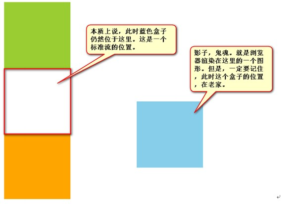
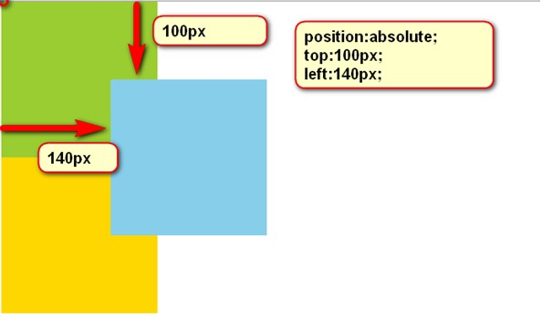
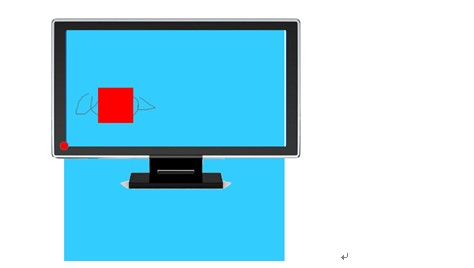
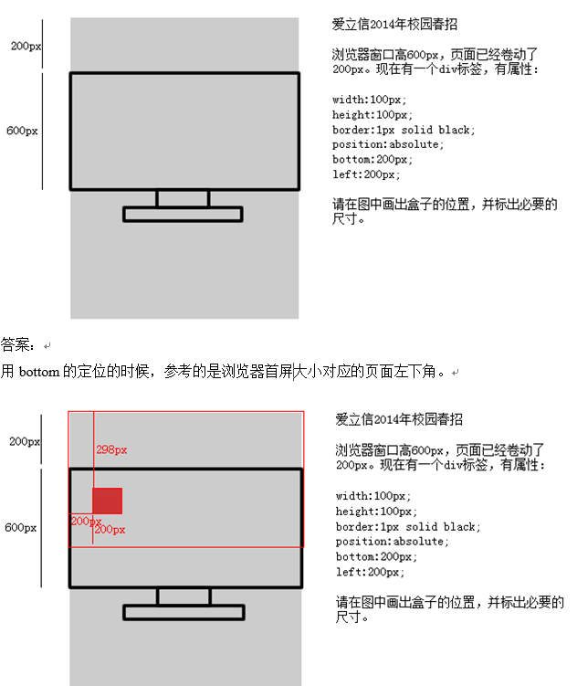
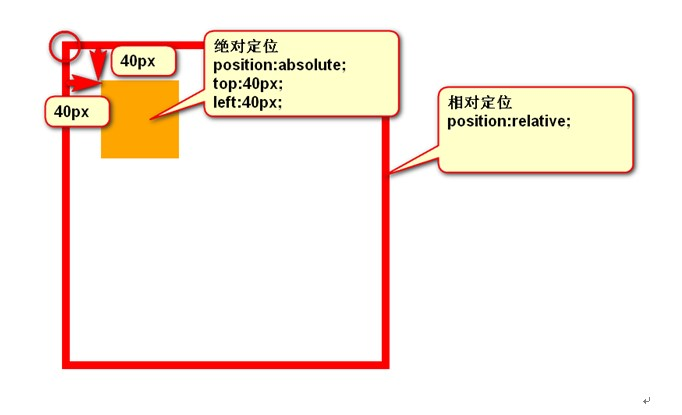
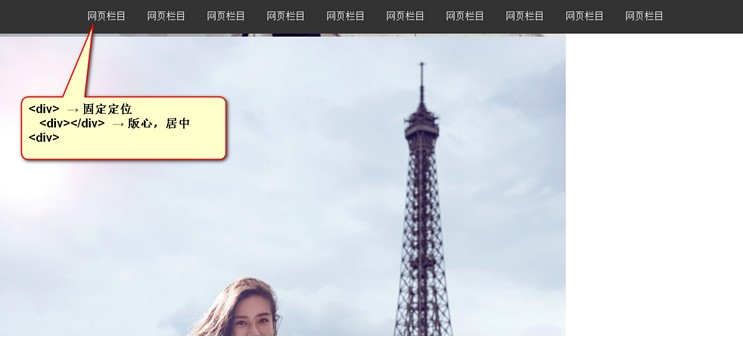

# CSS定位

定位有三种，分别是相对定位、绝对定位、固定定位。

- 标准文档流：`position:static`
- 相对定位：`position:relative;`，相对于元素的正常位置进行定位。
- 绝对定位：`position:absolute;`，相对于除 static 定位以外的元素进行定位。
- 固定定位：`position:fixed;`，相对于浏览器窗口进行定位，网页中的固定的 header 和 footer 使用这种定位。
- 从父元素继承 position 属性的值： `position:inherit`

---
## 1 相对定位

每个元素在页面的文档流中都有一个自然位置。相对于这个位置对元素进行移动就称为相对定位。周围的元素完全不受此影响。相对定位，就是 **微调** 元素位置的。让元素相对自己原来的位置，进行位置调整。也就是说，如果一个盒子想进行位置调整，那么就要使用相对定位。

使用：
```
    position:relative;   → 必须先声明，自己要相对定位了，
    left:100px;       → 然后进行调整。
    top:150px;       → 然后进行调整。
```

### 1.1 不脱标，老家留坑，形影分离

相对定位不脱标，真实位置是在老家，只不过影子出去了，可以到处飘。



### 1.2 相对定位用途

相对定位有坑，所以一般不用于做“压盖”效果。页面中，效果极小。就两个作用：

-  微调元素
-  做绝对定位的参考，子绝父相。

### 1.3 相对定位的定位值

- 可以用 left、right 来描述盒子右、左的移动。
- 可以用 top、bottom 来描述盒子的下、上的移动。

### 1.4 特性总结

- 如果不设置元素的偏移量，元素位置不会发生改变。  
- 相对定位不会使元素脱离文本流。元素在文本流中的位置不会改变。 
- 相对定位不会改变元素原来的特性。 
- 相对定位会使元素的层级提升，使元素可以覆盖文本流中的元素。

---
## 2 绝对定位

绝对定位指使元素相对于 html 元素或离它最近的祖先定位元素进行定位，对定位比相对定位更灵活.



### 2.1  绝对定位脱标

绝对定位的盒子，是脱离标准文档流的。所以，所有的标准文档流的性质，绝对定位之后都不遵守了。绝对定位之后，标签就不区分所谓的行内元素、块级元素了，**不需要`display:block;`就可以设置宽、高了**

### 2.2 参考点

绝对定位的参考点，如果用 top 描述，那么定位参考点就是页面的左上角，而不是浏览器的左上角：


如果用 bottom 描述，那么就是浏览器首屏窗口尺寸，对应的页面的左下角：




**例题**：



### 2.3 以盒子为参考点

一个绝对定位的元素，如果父辈元素中出现了也定位了的元素，那么将以父辈这个元素为参考点。



- 要听最近的已经定位的祖先元素的，不一定是父亲，可能是爷爷。
- 不一定是相对定位，任何定位，都可以作为参考点。
- 绝对定位的儿子，无视参考的那个盒子的 padding。

**子绝父绝、子绝父相、子绝父固**都是可以给儿子定位的。但是工程上如果使用`子绝、父绝`就没有一个盒子在标准流里面了，所以页面就不稳固，没有任何实战用途。**工程上“子绝父相”才有意义**，父亲没有脱标，儿子脱标在父亲的范围里面移动。

### 2.4 绝对定位的盒子居中

```css
    width: 600px;
    height: 60px;
    position: absolute;
    left: 50%;
    top: 0;
    margin-left: -300px;   → 宽度的一半
```

### 2.5 特性总结

- 绝对定位会使元素完全脱离文本流。 
- 绝对定位的块元素的宽度会被其内容撑开。 
- 绝对定位会使行内元素变成块元素。 
- 一般使用绝对定位时会同时为其父元素指定一 个相对定位，以确保元素可以相对于父元素进行定位。

---
## 3 固定定位

固定定位，就是相对浏览器窗口定位。页面如何滚动，这个盒子显示的位置不变。固定定位脱标！**IE6不兼容**

固定定位用于制作顶部通栏：



---
## 4 z-index

- z-index 值表示谁压着谁。数值大的压盖住数值小的。
- 只有定位了的元素，才能有 z-index 值。也就是说，不管相对定位、绝对定位、固定定位，都可以使用 z-index 值。而浮动的东西不能用。
- z-index 值没有单位，就是一个正整数。默认的 z-index 值是 0。
- 如果大家都没有 z-index 值，或者 z-index 值一样，那么谁写在 HTML 后面，谁在上面能压住别人。定位了的元素，永远能够压住没有定位的元素。
- 从父现象：父元素 z-index 值低了，儿子再高也没用。

---
## 5 网页稳定

在够建网页布局时，应该按下面顺序考虑网络盒子占位，以够建更加稳定的网页布局。

- Width 和 height  最稳定
- 其次 padding
- 最后才考虑 margin