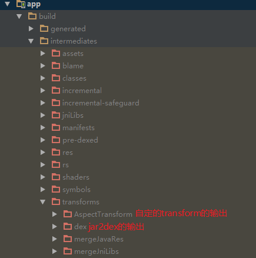

# Android Transform API 研究

---
## 1 Transform API 介绍

Android项目使用gradle进行构建，具体由`Android gradle plugin`实现，Android gradle plugin 于 1.5.0-beta1 添加了 Transform API， 可以用于在 android 打包过程中加入开发者自定义的打包处理逻辑，现在 Android 打包流程中的  `desugar、multi-dex、jar2dex` 等处理都已经使用 Transform API 来实现了，

**自定义的 Transform 一经注册便会自动添加到 Task 执行序列中，并且正好是项目被打包成 dex 之前。**

---
## 2 Transform 过程

### 2.1 流程

Transform 每次都是将一个输入进行处理，然后将处理结果输出，而输出的结果将会作为另一个 Transform 的输入，在整个打包过程中可以有无数个这样的 Transform 流程，然后将最后一个 Transform 的输出结果与其他资源打包生成 APK 文件。


从项目 `build/intermediates/transforms` 文件夹也可以找到这些 Transform 的输出。



### 2.2 API使用

添加自定义的 Transform 有两种方式：

直接在 app/build.gradle 中通过 AndroidPlugin 提供的 dsl 注册 

```groovy
android{
    ...
    registerTransform()
    ...
}
```

通过自定义插件注册 Transform

- 自定义 `gradle plugin`
- 实现 `com.android.build.api.transform.Transform` 类
- 在自定的 `gradle plugin` 中注册我们实现的 Transform
- 在项目中应用这个自定义`gradle plugin`

注入自定的 Transform 很简单，代码如下：

```groovy
    class TransformPlugin implements Plugin<Project> {
        @Override
        void apply(Project project) {
            //得到AppExtension
            def android = project.extensions.findByType(AppExtension)
            android.registerTransform(new PrintTransform(project))
        }
    }
```

重点在于实现 Transform，一般需要实现的方法如下：

```groovy
    class PrintTransform extends Transform {

        @Override
        String getName() {
            //自定义的 Transform 对应的 Task 名称
            return 'PrintTransform'
        }

        @Override
        Set<QualifiedContent.ContentType> getInputTypes() {
            //指定输入的类型，通过这里的设定，可以指定我们要处理的文件类型，确保其他类型的文件不会传入
            return TransformManager.CONTENT_CLASS
        }

        @Override
        Set<? super QualifiedContent.Scope> getScopes() {
            //指定 Transform 的作用范围
            return TransformManager.SCOPE_FULL_PROJECT
        }

        @Override
        boolean isIncremental() {
            //是否为增量 transform
            return false
        }

        @Override
        void transform(Context context, Collection<TransformInput> inputs, Collection<TransformInput> referencedInputs, TransformOutputProvider outputProvider, boolean isIncremental) throws IOException, TransformException, InterruptedException {
            //在这里实现我们的 transform 逻辑
        }
    }
```

方法说明：

- `getName()`：用于返回我们自定义Transform的名称
- `getInputTypes()`：用于指定要处理的输入的类型，通过这里的设定，可以指定我们要处理的文件类型，确保其他类型的文件不会传入
- `getScopes()`：用于指定 Transform 的作用范围
- `transform()`：transform 的逻辑

#### InputType

用于标识输入文件的类型，在 TransformAPI 的实现中定义了两种 InputType：

- CLASSES：被编译的 Java 代码，这些可以在文件夹中也可以在 jar 中，如果是一个文件夹, 则希望其文件路径与类的包名匹配
- RESOURCES：Java 项目的标准资源

大部分情况下，我们只需要处理被编译的代码文件，所有在 `getInputTypes()` 方法中一般我们只需要返回 CLASSES 类型。

#### Scopes

在 TransformAPI 的实现中定义了以下 Scopes：

- PROJECT：当前项目
- SUB_PROJECTS：子项目
- EXTERNAL_LIBRARIES：外部的依赖库
- TESTED_CODE：测试代码
- PROVIDED_ONLY：本地或远程以provided形式引入的依赖库
- PROJECT_LOCAL_DEPS：已废弃
- SUB_PROJECTS_LOCAL_DEPS：已废弃

`getScopes()` 方法的返回值用于指定 Transform 的作用范围，在 TransformManager 中预定义了一些可用的 Scope 集合，比如 `SCOPE_FULL_PROJECT` 作用返回为整个项目。

#### transform 方法

transform方法参数说明:

- `Collection<TransformInput> inputs`：返回 transformation 的输入/输出。
- `Collection<TransformInput> referencedInputs`：返回不被这次 transformation 消费的，referenced-only 的输入。
- `TransformOutputProvider outputProvider`：用于提供输出目录
- `boolean isIncremental`:是否为增量转换

这个方法于实现 transform 的逻辑，默认情况下如果不需要做任何 transform，这个方法也需要把 `对应的输入` 复制到 `目标输出地址`，否则整个打包流程会因为没有出入而终止运行。输出地址不是我们定义的，而是由TransformOutputProvider 对象提供的，通过它的 getContentLocation 方法获取输出的目标地址。

什么是 `对应的输入` 和 `目标输出地址`呢？

- 对应的输入：这个属于上一个 transform 过程的输出，比如上一个 transform 过程为 desugar，那么其对应的输入的路径为`app\build\intermediates\transforms\desugar\...`
- 目标输出地址：即 AndroidPlugin 为我们自定义的 transform 指定的路径，路径为`app\build\intermediates\transforms\transform_name\...`

我们的 transform 要把上一个 transform 产生的中间文件复制到自己的输出地址，以作为下一个 transform 过程的输入。

所以默认情况下也需要做如下逻辑处理（下面使用的到 FileUtils 为 `org.apache.commons.io.FileUtils`）：

```groovy
        @Override
        void transform(Context context, Collection<TransformInput> inputs, Collection<TransformInput> referencedInputs, TransformOutputProvider outputProvider, boolean isIncremental) throws IOException, TransformException, InterruptedException {
            // Transform的inputs有两种类型，一种是目录，一种是jar包，要分开遍历
            inputs.each {
                TransformInput input ->
                    //对类型为“文件夹”的input进行遍历
                    dirProcess(input, outputProvider)
                    //对类型为jar文件的input进行遍历
                    jarProcess(input, outputProvider)
            }
        }

        private static ArrayList<DirectoryInput> dirProcess(TransformInput input, TransformOutputProvider outputProvider) {
            input.directoryInputs.each {
                DirectoryInput directoryInput ->
                    //文件夹里面包含的是我们手写的类以及R.class、BuildConfig.class以及R$XXX.class等
                    def dest = outputProvider.getContentLocation(directoryInput.name, directoryInput.contentTypes, directoryInput.scopes, Format.DIRECTORY)
                    // 将input的目录复制到output指定目录
                    FileUtils.copyDirectory(directoryInput.file, dest)
            }
        }

        private static ArrayList<JarInput> jarProcess(TransformInput input, TransformOutputProvider outputProvider) {
            input.jarInputs.each {
                JarInput jarInput ->
                    //jar文件一般是第三方依赖库jar文件
                    //重命名输出文件，防止同目录copyFile冲突
                    println "-----------------" + jarInput.file
                    def jarName = jarInput.name
                    def md5Name = DigestUtils.md5Hex(jarInput.file.getAbsolutePath())
                    if (jarName.endsWith(".jar")) {
                        jarName = jarName.substring(0, jarName.length() - 4)
                    }
                    //生成输出路径
                    def dest = outputProvider.getContentLocation(jarName + md5Name, jarInput.contentTypes, jarInput.scopes, Format.JAR)
                    //将输入内容复制到输出目录
                    FileUtils.copyFile(jarInput.file, dest)
            }
        }
```

## 3 增量编译

我们知道编译一个复杂的 Android 项目需要消耗很多时间，为了编译构建速度，Gradle 和 AdroidPlugin 都支持增量编译，Transform 也是支持增量编译的，其 `isIncremental()` 方法用于确定该 Transform 是否支持增量编译。

对于一个复杂的 Android 项目，如果我们注册了一个作用范围是 SCOPE_FULL_PROJECT 而又不支持增量编译的 Transform，那么每一次编译都要对项目中所有的被编译文件进行处理，而每一次处理都涉及大量 IO 操作，这必将大大增加项目的编译时间，所以我们很有必要让我们的 Transform 支持增量编译。

Android Plugin 为 Transform 的增量编译提供了完善的支持，既然要支持增量，那么就我们需要关心以下信息：

- 当前这次 transform 是增量还是全量编译（这是由 Gradle 决定的）
- 如果是增量编译，我们又需要知道以下信息：
  - 哪些文件没有改变
  - 哪些文件被修改了
  - 哪些文件被删除了
  - 哪些文件被新增了

第一个问题，当前这次 transform 是增量还是全量编译，从 transform 方法的参数 isIncremental 即可判断，需要注意的是，如果 isIncremental 为 false，我们需要调用 `outputProvider.deleteAll()` 方法来删除之前一次 transform 的输出。

关于第二个问题，如何获取增量信息，JarInput 和 DirectoryInput 都有提供对应的 api。

JarInput 的 status 属性用于获取当前 jar 的状态，DirectoryInput 的 changedFiles 用于获取修改的文件状态。status 是一个枚举类型，定义如下：

```java
public enum Status {
    NOTCHANGED,
    ADDED,
    CHANGED,
    REMOVED;
}
```

在处理增量时，只需要根据每个文件的状态进行相应的处理，不需要每次所有流程都重新来一遍。不同功能的 Transform 目的可能不一样，但大概的步骤可以总结如下：

1. 根据 isIncremental 判断当前是否为增量编译，如果不是则需要调用 `outputProvider.deleteAll()` 方法来删除之前一次 transform 的输出，再进行对全量的 transform。
2. 如果是增量编译，则：
   1. 对于状态为 NOTCHANGED 的文件，可以直接忽略不处理，之前一次 transform 已经将其复制到指定目录了。
   2. 对于状态为 REMOVED 的文件，则需要将其从指定目标目录中删除。
   3. 对于状态为 ADDED 和 CHANGED 的文件，需要重新 transform 后再复制到指定目标目录中。

**需要注意的是：如果先 clean 再编译时， jar 的状态是 NOTCHANGED，而 changedFiles 是空的**。

## 4 注意

- 自定义的 transform 是不能处理 Dex 文件的，因为对应的 DexTransform 和 MultiDexTransform 注册在最后面。
- **避免文件重复**：如果我们在一次变换中，经过操作生成生成另一种形态的相同的内容(比如把Class打包成jar)，务必要原始的形态的内容删除。

---
## 引用

官方介绍：

- [Transform API](http://tools.android.com/tech-docs/new-build-system/transform-api)

博客：

- [如何开发一款高性能的gradle transform](https://www.jianshu.com/p/d84032b46b56)
- [通过自定义 Gradle 插件修改编译后的 class文件](http://blog.csdn.net/huachao1001/article/details/51819972)
- [gradle transform api 初探](http://www.jianshu.com/p/c9ce643e2f22)
- [如何理解 Transform API](https://juejin.im/entry/59776f2bf265da6c4741db2b)

可以参考的 Transform 实现

- [AutoRegister](https://github.com/luckybilly/AutoRegister)
- [gradle_plugin_android_aspectjx](https://github.com/HujiangTechnology/gradle_plugin_android_aspectjx)
- [metis](https://github.com/yangxlei/metis)
- [sa-sdk-android-plugin2](https://github.com/sensorsdata/sa-sdk-android-plugin2)
- [click-debounce](https://github.com/SmartDengg/click-debounce)
