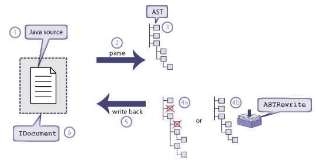

# AST 抽象语法树简介与应用


---
## 1 Java 编译过程简介

将一组源文件编译成相应的一组类文件的过程并不简单，但通常可以分为**三个**阶段。源文件的不同部分根据需要以不同的速率在整个过程中进行处理。


`Java源代码-> 词语法分析-> 生成AST -> 语义分析 -> 编译成字节码`

上面编译的过程由 JavaCompiler 类处理：

1. 读取命令行上指定的所有源文件，并将其解析为**语法树**，然后将所有外部可见的定义输入到编译器的符号表中。
2. 调用所有编译器注解处理器。如果任何注解处理器生成了任何新的源文件或类文件，则重新编译该文件，直到不创建新文件。
3. 最后，解析器创建的**语法树**被分析并翻译成类文件。在分析过程中，可以找到对其他类的引用。编译器将检查这些类的源代码和类路径，如果它们在源码路径中被找到，那么这些文件也将被编译，**尽管它们不会受到编译期注解处理**。这一个步骤主要包括：`类型检查、控制流分析、泛型的类型擦除、去除语法糖、字节码生成`等操作。


---
## 2 AST 介绍

### AST——抽象语法树概念

在计算机科学中，抽象语法树（Abstract Syntax Tree，AST），或简称语法树（Syntax tree），是源代码语法结构的一种抽象表示。它以树状的形式表现编程语言的语法结构，树上的每个节点都表示源代码中的一种结构。之所以说语法是“抽象”的，是因为这里的语法并不会表示出真实语法中出现的每个细节。比如，嵌套括号被隐含在树的结构中，并没有以节点的形式呈现；而类似于 if-condition-then 这样的条件跳转语句，可以使用带有两个分支的节点来表示。——[《维基百科》](https://zh.wikipedia.org/wiki/%E6%8A%BD%E8%B1%A1%E8%AA%9E%E6%B3%95%E6%A8%B9)

抽象语法树并不是针对某一种语言，而是计算机科学中编译相关的基础技术，在编程语言的编译过程中，文本形式的源代码被转转换为语法树。**抽象语法树使用树状结构来表示源代码的抽象语法结构**，树上的每一个节点都对应源代码中的一种结构，它作为程序代码的一种中间表示形式，在代码分析、代码重构、语言翻译等领域得到广泛的应用。现有的一些相关工具中，都会存在自行将源代码转换为抽象语法树的模块。至于将哪些语法节点进行转换，不同的工具会有不同的定义。

#### 使用 Javac 内部 API 修改 AST

AST 修改是通过在将其转换为字节码之前增加附加节点以达到增加代码的目的。

Java 编译过程中的第一步中，源码就被解析为 AST 了，接下来的处理都是基于这个 AST 了，那么修改 AST 的时机如何选择，从编译的三个步骤来看，第一步已经生成了 AST，而第二步是编译期注解处理器，可以让开发者可以参与到一部分的编译工作，在这个步骤中可以对 AST 进行修改。虽然标准 API 中并没有提供修改 AST 的类库，但 javac 的内部工具提供了修改 AST 的 API，除此之外还有一些修改 AST 的开源类库。



Java 源码的编译是由 javac 处理的，除了使用命令行工具编译 Java 代码，`JDK 6` 增加了规范 `JSR-199(Java Compiler API)` 和 `JSR-296(Pluggable Annotations Processing API)`，这些规范请求提供编译相关的 API。Java 编译器的实现代码和 API 的整体结构如下图所示：


- **绿色**标注的包是官方 API（Official API），即 JSR-199 和 JSR-296
- **黄色**标注的包为（Supported API）
- **紫色**标注的包代码全部在 `com.sun.tools.javac.*` 包下，为内部 API（Internal API）和编译器的实现类。**这部分 API 不属于 JSR 269**

具体 API 如下：

- `javax.annotation.processing`：注解处理 (JSR-296)
- `javax.lang.model`：注解处理和编译器 Tree API 使用的语言模型 (JSR-296)
    - `javax.lang.model.element`：语言元素
    - `javax.lang.model.type`：类型
    - `javax.lang.model.util`：语言模型工具
- `javax.tools`：Java 编译器 API (JSR-199)
- `com.sun.source.*`： 编译器 Tree API，提供 javac 工具使用的抽象语法树 AST 的只读访问
- `com.sun.tools.javac.*`：内部 API 和编译器的实现类，这部分 API 提供了**修改 AST** 的功能

因此使用 javac 内部的API `com.sun.tools.javac.*`可以实现在编译期修改或插入代码

#### 使用第三方库修改 AST

- [Rewrite](https://github.com/Netflix-Skunkworks/rewrite)
- [JavaParser](https://github.com/Javaparser/Javaparser)

---
## 3 javac.AST 节点

在 `com.sun.tools.javac.tree.JCTree` 定义的节点中，可以看到所有常用语法都被映射成了相关节点，我们可以直接用这些对象的操作组合成具有一定功能的源码。

- **JCImport**：导入
- **JCClassDecl**：类声明
- **JCMethodDecl**：方法声明
- **JCIf**：if语句
- **JCBreak**：break语句
- **JCReturn**：return语句
- **JCThrow**：异常生命
- **JCDoWhileLoop**：do while循环
- **JCTry**：try语句
- **JCCatch**：catch语句
- **JCAnnotation**：注解
- ...其他

通过 API 操作 AST，我们需要了解节点树的解构与各个节点的映射关系，其次要转变思想，平时我们直观的操作 Java Source，现在我们操作的是一颗表示 Java Source 的树。树上的每一个节点表示 Java Source 中的某一个部分。比如我们要创建一个方法，那么这个方法用树表示的话会有哪些节点，然后怎么拼接这些节点。

---
## 5 AST 修改示例

因为在很多环境下，assert 语句会被直接忽略，我们可以通过修改 AST ，把代码中的 assert 语句替换为 `if throw` 语句。

被编译的类：

```java
public class App {

    public static void main(String... args) {
        System.out.println("app is running......");
        doWork(args);
        System.out.println("app is exit......");
    }

    private static void doWork(String[] args) {
        assert args != null;
        System.out.println("App.doWork");
    }
}
```

注解处理器为：

```java
@SupportedSourceVersion(SourceVersion.RELEASE_7)
//这里我们针对所有的源码做替换，而不是标注了某一个类型注解的元素
@SupportedAnnotationTypes("*")
public class ForceAssertions extends AbstractProcessor {

    private JavacProcessingEnvironment env;
    //Trees – JSR269的一个工具类，用于联系程序元素和树节点。比如，对于一个方法元素，我们可以获得这个元素对应的AST树节点。
    private Trees trees;
    //TreeMaker – 编译器的内部组件，是用于创建树节点的工厂类。工厂类里面方法的命名方式跟Javac源代码里面的方法是统一的。
    private TreeMaker maker;
    //Name – 另一个编译器的内部组件。Name类是编译器内部字符串的一个抽象。为了提高效率，Javac使用了哈希字符串。
    private Names names;
    //记录替换的次数
    private int tally;

    @Override
    public synchronized void init(ProcessingEnvironment processingEnv) {
        this.trees = Trees.instance(processingEnv);
        //把处理环境（ProcessingEnvironment）强制转换成了编译器的内部类型。
        this.env = (JavacProcessingEnvironment) processingEnv;
        this.maker = TreeMaker.instance(env.getContext());
        this.names = Names.instance(env.getContext());
        tally = 0;
        super.init(processingEnv);
    }

    @Override
    public boolean process(Set<? extends TypeElement> annotations, RoundEnvironment roundEnv) {
        //如果这一轮生成的类型不会接受后续的注释中加工则返回true
        if (roundEnv.processingOver()) {
            //用于报告处理过的assertion语句数量。这个语句只有在最后一轮处理才会执行。
            processingEnv.getMessager().printMessage(Diagnostic.Kind.NOTE, tally + " assertions inlined.");
            return true;
        }

        //获取所有的根元素
        Set<? extends Element> elements = roundEnv.getRootElements();

        //遍历所有的程序元素，为每一个类都重写AST。
        for (Element each : elements) {

            if (each.getKind() == ElementKind.CLASS) {

                //把JSR269的树节点转换成编译器内部的树节点。这两种树节点的不同之处在于，
                // JSR269节点是停留在方法层的（即方法method是最基本的元素，不会再细分下去），
                // 而内部的AST节点，是所有元素（包括方法以下的）都可以访问的。我们要访问每一个语句，
                // 所以需要访问到AST的所有节点。
                JCTree tree = (JCTree) trees.getTree(each);

                TreeTranslator visitor = new Inliner();

                tree.accept(visitor);

            }

        }

        return true;
    }


    /*
    树的转换是通过继承TreeTranslator来完成的，TreeTranslator本身是继承自TreeVisitor的。这些类都不是JSR269的一部分。所以，
    从这里开始，我们所写的所有代码都是在编译器内部工作的。

    这个类实现了AST重写。Inliner继承了TreeTranslator，TreeTranslator本身是不会转换任何节点的。为了转换assertion语句，我们需要覆盖默认的TreeTranslator.visitAssert方法，
    正在转换的节点会被当做参数传入到方法中。我们做的转换的结果通过赋值给变量TreeTranslator.result而返回，按照惯例，一个转换方法应该这样生成：
        1. 调用父类的转换方法，以确保转换可以被应用到自己点上面去。
        2. 执行真正的转换
        3. 把转换结果赋值给TreeTranslator.result。结果的类型不一定要和传进来的参数的类型一样。相反，只要java编译器允许，
            我们可以返回任何类型的节点。这里TreeTranslator本身没有限制类型，但是如果返回了错误的类型，
            那么就很有在后续过程中产生灾难性后果。
     */
    private class Inliner extends TreeTranslator {

        @Override
        public void visitAssert(JCTree.JCAssert tree) {
            super.visitAssert(tree);
            //result 是 TreeTranslator 的成员变量，修改result，则原节点将被替换
            result = makeIfThrowException(tree);
            tally++;
        }


        private JCTree.JCStatement makeIfThrowException(JCTree.JCAssert node) {
            // 创建节点来构造 if (!(condition) throw new AssertionError(detail); 语句
            List<JCTree.JCExpression> args = node.getDetail() == null ? List.nil() : List.of(node.detail);

            //这是一个 new AssertionError() 表达式
            JCTree.JCExpression expr = maker.NewClass(
                    null,
                    null,
                    maker.Ident(names.fromString("AssertionError")),
                    args,
                    null);

            //这是一个 if(condition){...} else 语句
            return maker.If(
                    maker.Unary(JCTree.Tag.NOT, node.cond),//if的条件
                    maker.Throw(expr), //条件满足时执行的语句，这里抛出一个异常
                    null);//条件不满足时执行的语句
        }
    }

}
```

接下来使用 `jdk` 提供的编译 API 即可执行编译：

```java
    private static final String APP_SOURCE_DIR = "JavaCompiler/src/main/java/me/ztiany/compiler/App.java";
    private static final String TARGET_OPTION = "-d";
    private static final String TARGET_DIR = "JavaCompiler/build/manual";
    

    private static void doCompile(List<File> source, List<String> args, List<Processor> processors) {
        //编译器
        JavaCompiler javaCompiler = ToolProvider.getSystemJavaCompiler();
        //编译过程中诊断信息收集器
        DiagnosticCollector<JavaFileObject> diagnostics = new DiagnosticCollector<>();
        //标准Java文件管理器
        StandardJavaFileManager standardFileManager = javaCompiler.getStandardFileManager(diagnostics, null, null);

        //构建编译任务
        Iterable<? extends JavaFileObject> compilationUnits = standardFileManager.getJavaFileObjectsFromFiles(source);
        JavaCompiler.CompilationTask task = javaCompiler.getTask(null, standardFileManager, diagnostics, args, null, compilationUnits);

        //设置编译处理器
        if (processors != null) {
            task.setProcessors(processors);
        }

        //执行编译任务
        task.call();

        //打印编译过程中的诊断信息
        System.out.println();
        System.out.println("--------------------------------------------------------------------------------");
        for (Diagnostic<? extends JavaFileObject> diagnostic : diagnostics.getDiagnostics()) {
            System.out.format("Error on line %d in %s\n%s\n", diagnostic.getLineNumber(), diagnostic.getSource(), diagnostic.getMessage(null));
        }

        //关闭资源
        close(standardFileManager);
    }

    private static void assertToIfThrow() {
        doCompile(Collections.singletonList(new File(APP_SOURCE_DIR)), Arrays.asList(TARGET_OPTION, TARGET_DIR), Collections.singletonList(new AssertToIfThrowProcessor()));
    }
```

最终的编译结果为：

```java
package me.ztiany.compiler;

public class App {
    public App() {
    }

    public static void main(String... var0) {
        System.out.println("app is running......");
        doWork(var0);
        System.out.println("app is exit......");
    }

    private static void doWork(String[] var0) {
        if (var0 == null) {
            throw new AssertionError();
        } else {
            System.out.println("App.doWork");
        }
    }
}
```

---
## 4 API 详解

上述示例中，用到了一些 API，一般我们需要对 AST 进行转换，基本都是这个模板，下面是对这些类的说明：

- JavacProcessingEnvironment：注解处理器的 init 方法传入的 ProcessingEnvironment 可以被强制转换成了编译器的内部类型。
- Trees：JSR269的一个工具类，用于联系程序元素和树节点(通过元素获取节点映射)。比如，对于一个方法元素，我们可以获得这个元素对应的AST树节点。
- TreeMaker：编译器的内部组件，是用于创建树节点的工厂类。工厂类里面方法的命名方式跟Javac源代码里面的方法是统一的。
- Names：另一个编译器的内部组件。Name类是编译器内部字符串的一个抽象。为了提高效率，Javac使用了哈希字符串。
- List：编译器用了它自己的数据类型来实现List，而不是使用java集合框架（Java Collection Framework）。List中有许多静态的方法，可以很方便的创建List：`List.nil()、List.of(A)`。

对于 AST 的遍历，类库提提供了 访问者模式的实现，比如 `TreeTranslator` 用来访问 AST中的每一个节点。对于每一个节点元素，都会调用对象的 `visit` 方法，我们需要转换某个节点就去重写对应的方法，正在转换的节点会被当做参数传入到方法中。我们做的转换的结果通过赋值给变量 `TreeTranslator.result` 而返回，按照惯例，一个转换方法应该这样生成：

1. 调用父类的转换方法，以确保转换可以被应用到自己点上面去。
2. 执行真正的转换，比如上述例子的`makeIfThrowException`
3. 把转换结果赋值给 `TreeTranslator.result`。结果的类型不一定要和传进来的参数的类型一样。相反，只要 java 编译器允许，我们可以返回任何类型的节点。这里 TreeTranslator 本身没有限制类型，但是如果返回了错误的类型，那么就很有在后续过程中产生灾难性后果。

---
## 5 JSR-269/AST 应用与扩展

- [Lombok](https://projectlombok.org/)
- [Eclipse JDT](https://www.eclipse.org/jdt/)
- 自定义 Lint，实现 CodeReview 自动化
- AOP 编程，插入切面代码

---
## 引用

原理：

- [OpenJDK：Java编译过程 Compilation Overview](https://openjdk.java.net/groups/compiler/doc/compilation-overview/index.html)
- [Eclipse JDT：AST 介绍](https://www.eclipse.org/articles/Article-JavaCodeManipulation_AST/)

AST 操作：

- [java注解处理器——在编译期修改语法树](https://blog.csdn.net/a_zhenzhen/article/details/86065063)

AST 操作类库：

- [Rewrite](https://github.com/Netflix-Skunkworks/rewrite)
- [JavaParser](https://github.com/Javaparser/Javaparser)

扩展：

- [安卓AOP之AST：抽象语法树](https://www.jianshu.com/p/5514cf705666)
- [Lombok原理分析与功能实现](https://blog.mythsman.com/2017/12/19/1/)
- [利用 Project Lombok 自定义 AST 转换](https://www.ibm.com/developerworks/cn/java/j-lombok/?ca=drs-)

Javac API：

- [Java 编译器 javac 笔记](https://nullwy.me/2017/04/javac-api/)
- [The Hacker’s Guide to Javac](https://scg.unibe.ch/archive/projects/Erni08b.pdf)

书籍：

- [现代编译器的Java实现(第二版).pdf](http://read.pudn.com/downloads218/ebook/1025478/现代编译器的Java实现(第二版).pdf)