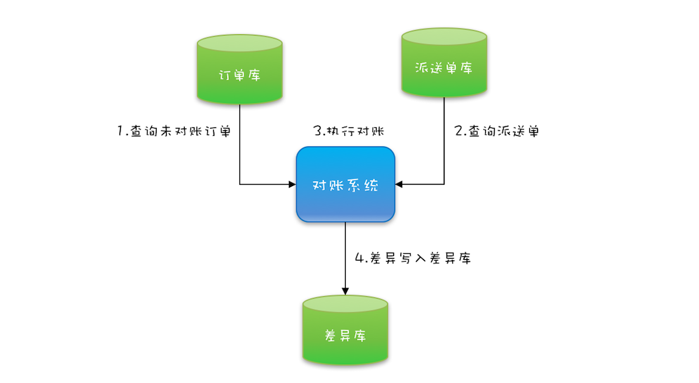
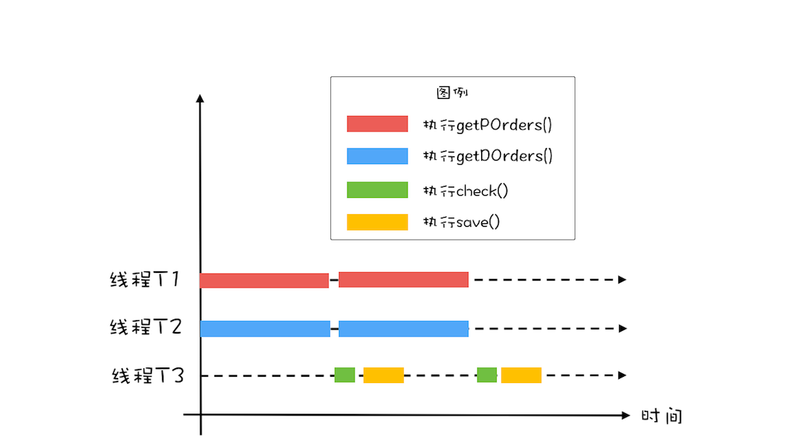

# 并发工具

## 1 Semaphore

### Semaphore 简介

- Semaphore 即 **信号量**。
- 信号量是由大名鼎鼎的计算机科学家迪杰斯特拉（Dijkstra）于 1965 年提出，在这之后的 15 年，信号量一直都是并发编程领域的终结者。直到 1980 年管程被提出来，我们才有了第二选择。
- 目前几乎所有支持并发编程的语言都支持信号量机制。

### Semaphore 模型

Semaphore 模型包括：**一个计数器，一个等待队列，三个方法**

- 计数器和等待队列对外是透明的。
- 只能通过信号量模型提供的三个方法来访问它们。

三个方法分别是：

- `init()`：设置计数器的初始值。
- `down()`：计数器的值减 1；如果此时计数器的值小于 0，则当前线程将被阻塞，否则当前线程可以继续执行。
- `up()`：计数器的值加 1；如果此时计数器的值小于或者等于 0，则唤醒等待队列中的一个线程，并将其从等待队列中移除。

**原子性**：init()、down() 和 up() 三个方法都是原子性的，并且这个原子性是由信号量模型的实现方保证的。JDK 中的信号量模型由 `java.util.concurrent.Semaphore` 实现。

我们可以通过下面代码来理解信号量模型：

```java

class Semaphore{
  // 计数器
  int count;
  // 等待队列
  Queue queue;

  // 初始化操作
  Semaphore(int c){
    this.count=c;
  }
  
  void down(){
    this.count--;
    if(this.count<0){
      //将当前线程插入等待队列
      //阻塞当前线程
    }
  }

  void up(){
    this.count++;
    if(this.count<=0) {
      //移除等待队列中的某个线程T
      //唤醒线程T
    }
  }
}
```

- 信号量模型里面，down()、up() 这两个操作历史上最早称为 P 操作和 V 操作，所以信号量模型也被称为 PV 原语
- 在 Java SDK 并发包里，down() 和 up() 对应的是 acquire() 和 release()。

### Semaphore 实现限流器

Semaphore 相较于 Lock 的特殊之处在于，**Semaphore 可以允许多个线程访问一个临界区**，可以理解为一个限流器。

**限流器的使用场景**：比较常见的需求就是我们工作中遇到的各种池化资源，例如连接池、对象池、线程池等等。对于数据库连接池，在同一时刻，一定是允许多个线程同时使用连接池的，每个连接在被释放前，是不允许其他线程使用的。

**利用信号量，实现对“对象池”进行限流**：所谓对象池，指的是一次性创建出 N 个对象，之后所有的线程重复利用这 N 个对象，对象在被释放前，是不允许其他线程使用的。

```java
/**对象池*/
class ObjPool<T, R> {

  final List<T> pool;
  // 用信号量实现限流器
  final Semaphore sem;

  // 构造函数
  ObjPool(int size, T t){
    pool = new Vector<T>(){};
    for(int i=0; i<size; i++){
      pool.add(t);
    }
    sem = new Semaphore(size);
  }

  // 利用对象池的对象，调用func
  R exec(Function<T,R> func) {
    T t = null;
    sem.acquire();
    try {
      t = pool.remove(0);
      return func.apply(t);
    } finally {
      pool.add(t);
      sem.release();
    }
  }
}

public static void main(String... args){
    // 创建对象池
    ObjPool<Long, String> pool = new ObjPool<Long, String>(10, 2);

    // 通过对象池获取t，之后执行  
    pool.exec(t -> {
        System.out.println(t);
        return t.toString();
    });
}
```

注意，对象保存在了 Vector 中，Vector 是 Java 提供的线程安全的容器，如果我们把 Vector 换成 ArrayList，是否可以呢？答案是不行的，因为信号量支持多个线程进入临界区，执行 list 的 add 和 remove 方法时可能是多线程并发执行。

### Semaphore 总结

1. 信号量在 Java 语言里面名气并不算大，Java 在并发编程领域走的很快，重点支持的还是管程模型。
2. 管程模型理论上解决了信号量模型的一些不足，主要体现在易用性和工程化方面，例如用信号量解决我们曾经提到过的阻塞队列问题，就比管程模型麻烦很多。
3. 信号量可以实现的独特功能就是同时允许多个线程进入临界区，但是信号量不能做的就是同时唤醒多个线程去争抢锁，只能唤醒一个阻塞中的线程，而且信号量模型是没有 Condition 的概念的，即阻塞线程被醒了直接就运行了而不会去检查此时临界条件是否已经不满足了，基于此考虑信号量模型才会设计出只能让一个线程被唤醒，否则就会出现因为缺少 Condition 检查而带来的线程安全问题。正因为缺失了 Condition，所以用信号量来实现阻塞队列就很麻烦，因为要自己实现类似 Condition 的逻辑。

## 2 ReadWriteLock

### 没有最好的，只有最合适的

JDK 中提供了各种各样的并发工具类，既然有了 synchronized 和 Lock，为什么还要提供这么多其他的并发工具呢？因为并发很复杂，所面对的场景也很复杂，对于所有场景，没有一个统一的最优解，所以w我们需要 **分场景优化性能，提升易用性**。针对特定的场景，选择最合适的并发工具。

### ReadWriteLock 简介

ReadWriteLock 适用于**读多写少场景**，实际工作中，为了优化性能，我们经常会使用缓存，例如缓存元数据、缓存基础数据等，这就是一种典型的读多写少应用场景。缓存之所以能提升性能，一个重要的条件就是缓存的数据一定是读多写少的，例如元数据和基础数据基本上不会发生变化（写少），但是使用它们的地方却很多（读多）。

### ReadWriteLock 实现缓存按需加载

- 使用缓存首先要解决缓存数据的初始化问题：缓存数据的初始化，可以采用一次性加载的方式，也可以使用按需加载的方式。
- 如果源头数据的数据量不大，就可以采用一次性加载的方式，这种方式最简单。
- 如果源头数据量非常大，那么就需要按需加载了，按需加载也叫懒加载，指的是只有当应用查询缓存，并且数据不在缓存里的时候，才触发加载源头相关数据进缓存的操作。

```java
class Cache<K,V> {

  final Map<K, V> m =new HashMap<>();
  final ReadWriteLock rwl = new ReentrantReadWriteLock();

  final Lock r = rwl.readLock();
  final Lock w = rwl.writeLock();

  V get(K key) {
    V v = null;
    //读缓存
    r.lock();         //1
    try {
      v = m.get(key); //2
    } finally{
      r.unlock();     //3
    }

    //缓存中存在，返回
    if(v != null) {   //4
      return v;
    }  

    //缓存中不存在，查询数据库
    w.lock();         //5
    try {
      //再次验证
      //其他线程可能已经查询过数据库
      v = m.get(key); //6
      if(v == null){  //7
        //查询数据库
        v=省略代码无数
        m.put(key, v);
      }
    } finally{
      w.unlock();
    }
    return v;
  }
}
```

需要注意的是，在获取写锁之后，我们并没有直接去查询数据库，而是在代码⑥⑦处，重新验证了一次缓存中是否存在，再次验证如果还是不存在，我们才去查询数据库并更新本地缓存。原因是在高并发的场景下，有可能会有多线程竞争写锁。假设缓存是空的，没有缓存任何东西，如果此时有三个线程 T1、T2 和 T3 同时调用 get() 方法，并且参数 key 也是相同的。那么它们会同时执行到代码⑤处，但此时只有一个线程能够获得写锁，假设是线程 T1，线程 T1 获取写锁之后查询数据库并更新缓存，最终释放写锁。此时线程 T2 和 T3 会再有一个线程能够获取写锁，假设是 T2，如果不采用再次验证的方式，此时 T2 会再次查询数据库。T2 释放写锁之后，T3 也会再次查询一次数据库。而实际上线程 T1 已经把缓存的值设置好了，T2、T3 完全没有必要再次查询数据库。所以，再次验证的方式，能够避免高并发场景下重复查询数据的问题。

### ReadWriteLock 的升级与降级

**锁的升级**：对应 ReadWriteLock，先获取读锁，然后再升级为写锁。**ReadWriteLock 并不支持这种升级**，如果读锁还没有释放，此时获取写锁，会导致写锁永久等待，最终导致相关线程都被阻塞，永远也没有机会被唤醒。

**ReentrantReadWriteLock 支持锁的降级**：

```java

class CachedData {

  Object data;
  volatile boolean cacheValid;

  final ReadWriteLock rwl =  new ReentrantReadWriteLock();

  // 读锁  
  final Lock r = rwl.readLock();
  //写锁
  final Lock w = rwl.writeLock();
  
  void processCachedData() {
    // 获取读锁
    r.lock();
    if (!cacheValid) {
      // 释放读锁，因为不允许读锁的升级
      r.unlock();
      // 获取写锁
      w.lock();
      try {
        // 再次检查状态  
        if (!cacheValid) {
          data = ...
          cacheValid = true;
        }
        // 释放写锁前，降级为读锁
        // 降级是可以的
        r.lock(); ①
      } finally {
        // 释放写锁
        w.unlock();
      }
    }
    // 此处仍然持有读锁，在使用data期间，保证 data 不会被修改。
    try {
      use(data);
    }
    finally {
      r.unlock();
    }
  }
}
```

### ReadWriteLock 总结

- 读写锁类似于 ReentrantLock，也支持公平模式和非公平模式。读锁和写锁都实现了 java.util.concurrent.locks.Lock 接口，所以除了支持 lock() 方法外，tryLock()、lockInterruptibly() 等方法也都是支持的。
- 注意：**只有写锁支持条件变量，读锁是不支持条件变量的**，读锁调用 newCondition() 会抛出 UnsupportedOperationException 异常。

**解决缓存数据与源头数据的同步**：上面给出的缓解实现中，虽然解决了缓存的初始化问题，但是没有解决缓存数据与源头数据的同步问题，这里的数据同步指的是保证缓存数据和源头数据的一致性。

- 解决数据同步问题的一个最简单的方案就是超时机制。所谓超时机制指的是加载进缓存的数据不是长久有效的，而是有时效的，当缓存的数据超过时效，也就是超时之后，这条数据在缓存中就失效了。而访问缓存中失效的数据，会触发缓存重新从源头把数据加载进缓存。
- 也可以在源头数据发生变化时，快速反馈给缓存，但这个就要依赖具体的场景了。例如 MySQL 作为数据源头，可以通过近实时地解析 binlog 来识别数据是否发生了变化，如果发生了变化就将最新的数据推送给缓存。另外，还有一些方案采取的是数据库和缓存的双写方案。

### ReadWriteLock 思考题

线上系统停止响应了，CPU 利用率很低，你怀疑有同学一不小心写出了读锁升级写锁的方案，那你该如何验证自己的怀疑呢？

1. 源代码分析。查找ReentrantReadWriteLock在项目中的引用，看下写锁是否在读锁释放前尝试获取
2. 如果线上是Web应用，应用服务器比如说是Tomcat，并且开启了JMX，则可以通过JConsole等工具远程查看下线上死锁的具体情况
3. 使用相关工具分析：
   1. `ps -ef | grep java查看pid`
   2. `top -p查看java中的线程`
   3. `使用jstack将其堆栈信息保存下来，查看是否是锁升级导致的阻塞问题`

## 3 StampedLock

### StampedLock 简介

Java 在 1.8 这个版本里，提供了一种叫 StampedLock 的锁，它的性能就比读写锁还要好。

### StampedLock 支持的三种锁模式

ReadWriteLock 支持两种模式：**一种是读锁，一种是写锁**。而 StampedLock 支持三种模式，分别是：**写锁、悲观读锁和乐观读**。

- 相同之处：写锁、悲观读锁的语义和 ReadWriteLock 的写锁、读锁的语义非常类似，允许多个线程同时获取悲观读锁，但是只允许一个线程获取写锁，写锁和悲观读锁是互斥的。
- 不同之处：StampedLock 里的写锁和悲观读锁加锁成功之后，都会返回一个 stamp；然后解锁的时候，需要传入这个 stamp。

```java
final StampedLock sl =  new StampedLock();
  
// 获取/释放悲观读锁示意代码
long stamp = sl.readLock();

try {
  //省略业务相关代码
} finally {
  sl.unlockRead(stamp);
}

// 获取/释放写锁示意代码
long stamp = sl.writeLock();
try {
  //省略业务相关代码
} finally {
  sl.unlockWrite(stamp);
}
```

### 性能优势的关键：乐观读

StampedLock 的性能之所以比 ReadWriteLock 还要好，其关键是 StampedLock 支持乐观读的方式。ReadWriteLock 支持多个线程同时读，但是当多个线程同时读的时候，所有的写操作会被阻塞；而 StampedLock 提供的乐观读，是允许一个线程获取写锁的，也就是说不是所有的写操作都被阻塞。**乐观读这个操作是无锁的**，所以相比较 ReadWriteLock 的读锁，乐观读的性能更好一些。

官方示例：首先通过调用 tryOptimisticRead() 获取了一个 stamp，这里的 tryOptimisticRead() 就是乐观读（无锁）。之后将共享变量 x 和 y 读入方法的局部变量中，不过需要注意的是，由于 tryOptimisticRead() 是无锁的，所以共享变量 x 和 y 读入方法局部变量时，x 和 y 有可能被其他线程修改了。因此最后读完之后，还需要再次验证一下是否存在写操作，这个验证操作是通过调用 validate(stamp) 来实现的。

```java
class Point {
  private int x, y;

  final StampedLock sl = new StampedLock();

  //计算到原点的距离  
  int distanceFromOrigin() {
    // 乐观读
    long stamp = sl.tryOptimisticRead();

    // 读入局部变量，
    // 读的过程数据可能被修改
    int curX = x, curY = y;
    //判断执行读操作期间，
    //是否存在写操作，如果存在，
    //则sl.validate返回false
    if (!sl.validate(stamp)){
      // 升级为悲观读锁
      stamp = sl.readLock();
      try {
        curX = x;
        curY = y;
      } finally {
        //释放悲观读锁
        sl.unlockRead(stamp);
      }
    }
    return Math.sqrt(curX * curX + curY * curY);
  }
}
```

### 对比数据库乐观锁，进一步理解 StampedLock 的乐观读

StampedLock 的乐观读和数据库的乐观锁有异曲同工之妙，比如这样的一个场景，在 ERP 的生产模块里，会有多个人通过 ERP 系统提供的 UI 同时修改同一条生产订单，那如何保证生产订单数据是并发安全的呢？可以采用数据库乐观锁。

乐观锁的实现很简单：

1. 在生产订单的表 product_doc 里增加了一个数值型版本号字段 version，每次更新 product_doc 这个表的时候，都将 version 字段加 1。
2. 生产订单的 UI 在展示的时候，需要查询数据库，此时将这个 version 字段和其他业务字段一起返回给生产订单 UI。
   1. 假设用户查询的生产订单的 id=777，那么 SQL 语句类似 `select id，... ，versionfrom product_docwhere id=777`
3. 用户在生产订单 UI 执行保存操作的时候，后台利用下面的 SQL 语句更新生产订单，此处我们假设该条生产订单的 version=9。
   1. `update product_doc set version=version+1，...where id=777 and version=9`
   2. 如果这条 SQL 语句执行成功并且返回的条数等于 1，那么说明从生产订单 UI 执行查询操作到执行保存操作期间，没有其他人修改过这条数据。因为如果这期间其他人修改过这条数据，那么版本号字段一定会大于 9。

数据库里的乐观锁，查询的时候需要把 version 字段查出来，更新的时候要利用 version 字段做验证。这个 version 字段就类似于 StampedLock 里面的 stamp。

### StampedLock 使用注意事项

对于读多写少的场景 StampedLock 性能很好，简单的应用场景基本上可以替代 ReadWriteLock，但是 StampedLock 的功能仅仅是 ReadWriteLock 的子集，在使用的时候，还是有几个地方需要注意一下。

1. StampedLock 在命名上并没有增加 Reentrant，事实上，的确是这样的，StampedLock 不支持重入。
2. StampedLock 的悲观读锁、写锁都不支持条件变量。
3. 如果线程阻塞在 StampedLock 的 readLock() 或者 writeLock() 上时，此时调用该阻塞线程的 interrupt() 方法，会导致 CPU 飙升。**使用 StampedLock 一定不要调用中断操作，如果需要支持中断功能，一定使用可中断的悲观读锁 readLockInterruptibly() 和写锁 writeLockInterruptibly()。**

下面的代码中，线程 T1 获取写锁之后将自己阻塞，线程 T2 尝试获取悲观读锁，也会阻塞；如果此时调用线程 T2 的 interrupt() 方法来中断线程 T2 的话，你会发现线程 T2 所在 CPU 会飙升到 100%。

```java

final StampedLock lock = new StampedLock();

Thread T1 = new Thread(()->{
  // 获取写锁
  lock.writeLock();
  // 永远阻塞在此处，不释放写锁
  LockSupport.park();
});
T1.start();

// 保证T1获取写锁
Thread.sleep(100);
Thread T2 = new Thread(()->
  //阻塞在悲观读锁
  lock.readLock()
);
T2.start();

// 保证T2阻塞在读锁
Thread.sleep(100);
//中断线程T2
//会导致线程T2所在CPU飙升
T2.interrupt();
T2.join();
```

### StampedLock 总结

**下面模块示例基本上是一个最佳实践，建议在实际工作中尽量按照这个模板来使用 StampedLock**：

StampedLock 读模板：

```java

final StampedLock sl = new StampedLock();

// 乐观读
long stamp = sl.tryOptimisticRead();

// 读入方法局部变量
......
// 校验stamp
if (!sl.validate(stamp)){
  // 升级为悲观读锁
  stamp = sl.readLock();
  try {
    // 读入方法局部变量
    .....
  } finally {
    //释放悲观读锁
    sl.unlockRead(stamp);
  }
}
//使用方法局部变量执行业务操作
  ......
```

StampedLock 写模板：

```java
long stamp = sl.writeLock();
try {
  // 写共享变量
  ......
} finally {
  sl.unlockWrite(stamp);
}
```

### StampedLock 思考题

StampedLock 支持锁的降级（通过 tryConvertToReadLock() 方法实现）和升级（通过 tryConvertToWriteLock() 方法实现），但是建议慎重使用。下面的代码也源自 Java 的官方示例，仅仅做了一点修改，隐藏了一个 Bug，你来看看 Bug 出在哪里。

```java

private double x, y;
final StampedLock sl = new StampedLock();

// 存在问题的方法
void moveIfAtOrigin(double newX, double newY){
 long stamp = sl.readLock();
 try {
  while(x == 0.0 && y == 0.0){
    long ws = sl.tryConvertToWriteLock(stamp);
    if (ws != 0L) {
      x = newX;
      y = newY;
      break;
    } else {
      sl.unlockRead(stamp);
      stamp = sl.writeLock();
    }
  }
 } finally {
  sl.unlock(stamp);
}
```

解析：在锁升级成功的时候，最后没有释放最新的写锁，可以在 if 块的 break 上加个 stamp=ws 进行释放

## 4 CountDownLatch 与 CyclicBarrier

### 优化最近越来越慢的对账系统

对账系统描述：用户通过在线商城下单，会生成电子订单，保存在订单库；之后物流会生成派送单给用户发货，派送单保存在派送单库。为了防止漏派送或者重复派送，对账系统每天还会校验是否存在异常订单。

目前对账系统的处理逻辑是首先查询订单，然后查询派送单，之后对比订单和派送单，将差异写入差异库。



核心逻辑：在一个单线程里面循环查询订单、派送单，然后执行对账，最后将写入差异库。

```java
while(存在未对账订单){
  // 查询未对账订单
  pos = getPOrders();
  // 查询派送单
  dos = getDOrders();
  // 执行对账操作
  diff = check(pos, dos);
  // 差异写入差异库
  save(diff);
}
```

### Step1：利用并行优化对账系统

**对账系统慢的原因**：目前的对账系统，由于订单量和派送单量巨大，所以查询未对账订单 getPOrders() 和查询派送单 getDOrders() 相对较慢。切对账系统是单线程执行的，

**优化方案**：图形化后是下图这个样子。对于串行化的系统，优化性能首先想到的是能否利用多线程并行处理。


**具体实施**：并行处理查询未对账订单 getPOrders() 和查询派送单 getDOrders()，因为这两个操作并没有先后顺序的依赖。这两个最耗时的操作并行之后，执行过程如下图所示。对比一下单线程的执行示意图，会发现同等时间里，并行执行的吞吐量近乎单线程的 2 倍，优化效果还是相对明显的。


示例代码：

```java
while(存在未对账订单){
  // 查询未对账订单
  Thread T1 = new Thread(()->{
    pos = getPOrders();
  });
  T1.start();

  // 查询派送单
  Thread T2 = new Thread(()->{
    dos = getDOrders();
  });
  T2.start();

  // 等待T1、T2结束
  T1.join();
  T2.join();

  // 执行对账操作
  diff = check(pos, dos);
  // 差异写入差异库
  save(diff);
}
```

### Step2：用 CountDownLatch 实现线程等待

Step1 优化实现中，在 while 循环中每次都会创建新的线程，而创建线程可是个耗时的操作。所以最好是创建出来的线程能够循环利用。所以我们可以创建线程池来处理查询任务，但因为线程池中的线程不会结束，那么 jion 方法就失效了，有什么工具可以实现对账线程等待查询线程查询完毕呢？这时 **CountDownLatch** 就再适合不过了。

```java

// 创建2个线程的线程池
Executor executor = Executors.newFixedThreadPool(2);

while(存在未对账订单){
  // 计数器初始化为2
  CountDownLatch latch = new CountDownLatch(2);

  // 查询未对账订单
  executor.execute(()-> {
    pos = getPOrders();
    latch.countDown();
  });

  // 查询派送单
  executor.execute(()-> {
    dos = getDOrders();
    latch.countDown();
  });
  
  // 等待两个查询操作结束
  latch.await();
  
  // 执行对账操作
  diff = check(pos, dos);
  // 差异写入差异库
  save(diff);
}
```

### step3：进一步优化性能

前面将 getPOrders() 和 getDOrders() 这两个查询操作并行了，但这两个查询操作和对账操作 check()、save() 之间还是串行的。很显然，这两个查询操作和对账操作也是可以并行的，也就是说，在执行对账操作的时候，可以同时去执行下一轮的查询操作，这个过程可以形象化地表述为下面这幅示意图。



两次查询操作能够和对账操作并行，对账操作还依赖查询操作的结果，这明显有点类似`生产者-消费者`，两次查询操作是生产者，对账操作是消费者。既然是生产者-消费者模型，那就需要有个队列，来保存生产者生产的数据，而消费者则从这个队列消费数据。

针对对账这个项目，需要设计两个队列，并且两个队列的元素之间还有对应关系，订单查询操作将订单查询结果插入订单队列，派送单查询操作将派送单插入派送单队列，这两个队列的元素之间是有一一对应的关系的。两个队列的好处是，对账操作可以每次从订单队列出一个元素，从派送单队列出一个元素，然后对这两个元素执行对账操作，这样数据一定不会乱掉。

具体方案：一个线程 T1 执行订单的查询工作，一个线程 T2 执行派送单的查询工作，当线程 T1 和 T2 都各自生产完 1 条数据的时候，通知线程 T3 执行对账操作。这个想法虽看上去简单，但其实还隐藏着一个条件，那就是线程 T1 和线程 T2 的工作要步调一致，不能一个跑得太快，一个跑得太慢，只有这样才能做到各自生产完 1 条数据的时候，通知线程 T3。

方案的难点有两个：

- 一个是线程 T1 和 T2 要做到步调一致。
- 另一个是要能够通知到线程 T3。

这个时候，我们可以使用 **CyclicBarrier**，因为其特性非常符合这种多个线程相互等待的场景，而且 CyclicBarrier 的计数器有自动重置的功能，当减到 0 的时候，会自动重置你设置的初始值。这个功能用起来实在是太方便了。

```java
// 订单队列
Vector<P> pos;
// 派送单队列
Vector<D> dos;

// 执行回调的线程池，线程池大小为 1 是必要的，如果设置为多个，有可能会两个线程 A 和 B 同时查询，A 的订单先返回，B 的派送单先返回，造成队列中的数据不匹配；所以 1 个线程实现生产数据串行执行，保证数据安全
Executor executor = Executors.newFixedThreadPool(1);

final CyclicBarrier barrier =new CyclicBarrier(2, ()->{
          executor.execute(()->check());
      });
  
void check(){
  P p = pos.remove(0);
  D d = dos.remove(0);
  // 执行对账操作
  diff = check(p, d);
  // 差异写入差异库
  save(diff);
}
  
void checkAll(){
  // 循环查询订单库
  Thread T1 = new Thread(()->{
    while(存在未对账订单){
      // 查询订单库
      pos.add(getPOrders());
      // 等待
      barrier.await();
    }
  });
  T1.start();  

  // 循环查询运单库
  Thread T2 = new Thread(()->{
    while(存在未对账订单){
      // 查询运单库
      dos.add(getDOrders());
      // 等待
      barrier.await();
    }
  });
  T2.start();
}
```

### CountDownLatch 与 CyclicBarrier 总结

CountDownLatch 和 CyclicBarrier 是 Java 并发包提供的两个非常易用的线程同步工具类：

- CountDownLatch 主要用来解决**一个线程等待多个线程的场景**，可以类比旅游团团长要等待所有的游客到齐才能去下一个景点。
- CyclicBarrier 是**一组线程之间互相等待**，更像是几个驴友之间不离不弃。
- CountDownLatch 的计数器是不能循环利用的，也就是说一旦计数器减到 0，再有线程调用 await()，该线程会直接通过。
- CyclicBarrier 的计数器是可以循环利用的，而且具备自动重置的功能，一旦计数器减到 0 会自动重置到你设置的初始值。
- CyclicBarrier 还可以设置回调函数，可以说是功能丰富。
