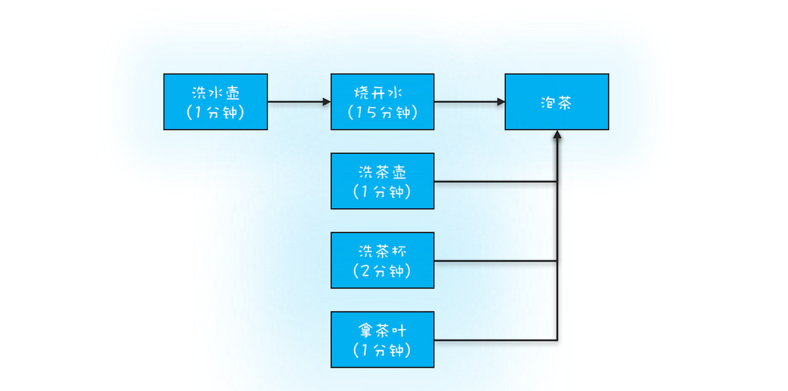

# Feture

## 1 如何获取任务执行结果

Java 通过 ThreadPoolExecutor 提供的 3 个 submit() 方法和 1 个 FutureTask 工具类来支持获得任务执行结果的需求。这 3 个方法的方法签名如下。

```java
// 提交Runnable任务
Future<?> submit(Runnable task);

// 提交Callable任务
<T> Future<T> submit(Callable<T> task);

// 提交Runnable任务及结果引用  
<T> Future<T> submit(Runnable task, T result);
```

### Future 接口

它们的返回值都是 Future 接口，Future 接口有 5 个方法，它们分别是

- 取消任务的方法 cancel()
- 判断任务是否已取消的方法 isCancelled()
- 判断任务是否已结束的方法 isDone()
- 2 个获得任务执行结果的 get() 和 get(timeout, unit)

通过 Future 接口的这 5 个方法可以，我们提交的任务不但能够获取任务执行结果，还可以取消任务。不过需要注意的是：**这两个 get() 方法都是阻塞式的**，如果被调用的时候，任务还没有执行完，那么调用 get() 方法的线程会阻塞，直到任务执行完才会被唤醒。

### submit 方法详解

3 个 submit() 方法之间的区别在于方法参数不同：

- 提交 Runnable 任务 `submit(Runnable task)` ：这个方法的参数是一个 Runnable 接口，Runnable 接口的 run() 方法是没有返回值的，所以 `submit(Runnable task)` 这个方法返回的 Future 仅可以用来断言任务已经结束了，类似于 `Thread.join()`。
- 提交 Callable 任务 `submit(Callable task)`：这个方法的参数是一个 Callable 接口，它只有一个 call() 方法，并且这个方法是有返回值的，所以这个方法返回的 Future 对象可以通过调用其 `get()` 方法来获取任务的执行结果。
- 提交 Runnable 任务及结果引用 `submit(Runnable task, T result)`：这个方法很有意思，假设这个方法返回的 Future 对象是 f，f.get() 的返回值就是传给 submit() 方法的参数 result。这个方法该怎么用呢？下面这段示例代码展示了它的经典用法。

```java
// Runnable 接口的实现类 Task 声明了一个有参构造函数 Task(Result r) ，创建 Task 对象的时候传入了 result 对象，这样就能在类 Task 的 run() 方法中对 result 进行各种操作了。
// result 相当于主线程和子线程之间的桥梁，通过它主子线程可以共享数据。
ExecutorService executor = Executors.newFixedThreadPool(1);

// 创建Result对象r
Result r = new Result();
r.setAAA(a);

// 提交任务
Future<Result> future = executor.submit(new Task(r), r);  
Result fr = future.get();
// 下面等式成立
fr === r;
fr.getAAA() === a;
fr.getXXX() === x

class Task implements Runnable{
  Result r;
  //通过构造函数传入result
  Task(Result r){
    this.r = r;
  }
  void run() {
    //可以操作result
    a = r.getAAA();
    r.setXXX(x);
  }
}
```

### FutureTask 工具类

前面提到的 Future 是一个接口，而 FutureTask 是一个实实在在的工具类，这个工具类有两个构造函数，它们的参数和前面介绍的 submit() 方法类似：

```java
FutureTask(Callable<V> callable);

FutureTask(Runnable runnable, V result);
```

其使用方式很简单，FutureTask 实现了 Runnable 和 Future 接口：

- 由于实现了 Runnable 接口，所以可以将 FutureTask 对象作为任务提交给 ThreadPoolExecutor 去执行，也可以直接被 Thread 执行。
- 又因为实现了 Future 接口，所以也能用来获得任务的执行结果。

下面的示例代码是将 FutureTask 对象提交给 ThreadPoolExecutor 去执行。

```java
// 创建FutureTask
FutureTask<Integer> futureTask = new FutureTask<>(()-> 1+2);
// 创建并启动线程
Thread T1 = new Thread(futureTask);
T1.start();
// 获取计算结果
Integer result = futureTask.get();
```

## 2 实现最优的“烧水泡茶”程序

著名数学家华罗庚先生的文章《统筹方法》里介绍了一个烧水泡茶的例子，文中提到最优的工序应该是下面这样：



下面我们用程序来模拟一下这个最优工序。并发编程可以总结为三个核心问题：分工、同步和互斥。

编写并发程序，首先要做的就是分工：所谓分工指的是如何高效地拆解任务并分配给线程。对于烧水泡茶这个程序，一种最优的分工方案可以是下图所示的这样：


- 用两个线程 T1 和 T2 来完成烧水泡茶程序，T1 负责洗水壶、烧开水、泡茶这三道工序，T2 负责洗茶壶、洗茶杯、拿茶叶三道工序。
- 其中 T1 在执行泡茶这道工序时需要等待 T2 完成拿茶叶的工序。对于 T1 的这个等待动作，有很多种办法，例如 Thread.join()、CountDownLatch，甚至阻塞队列都可以解决，当然也包括 FeatureTask。

下面的示例代码就是用这一章提到的 Future 特性来实现的。首先，我们创建了两个 FutureTask——ft1 和 ft2，ft1 完成洗水壶、烧开水、泡茶的任务，ft2 完成洗茶壶、洗茶杯、拿茶叶的任务；这里需要注意的是 ft1 这个任务在执行泡茶任务前，需要等待 ft2 把茶叶拿来，所以 ft1 内部需要引用 ft2，并在执行泡茶之前，调用 ft2 的 get() 方法实现等待。

```java
// 创建任务T2的FutureTask
FutureTask<String> ft2 = new FutureTask<>(new T2Task());
// 创建任务T1的FutureTask
FutureTask<String> ft1 = new FutureTask<>(new T1Task(ft2));
// 线程T1执行任务ft1
Thread T1 = new Thread(ft1);
T1.start();

// 线程T2执行任务ft2
Thread T2 = new Thread(ft2);
T2.start();

// 等待线程T1执行结果
System.out.println(ft1.get());

// T1Task需要执行的任务：
// 洗水壶、烧开水、泡茶
class T1Task implements Callable<String>{
  FutureTask<String> ft2;
  // T1任务需要T2任务的FutureTask
  T1Task(FutureTask<String> ft2){
    this.ft2 = ft2;
  }
  @Override
  String call() throws Exception {
    System.out.println("T1:洗水壶...");
    TimeUnit.SECONDS.sleep(1);

    System.out.println("T1:烧开水...");
    TimeUnit.SECONDS.sleep(15);
    // 获取T2线程的茶叶  
    String tf = ft2.get();
    System.out.println("T1:拿到茶叶:"+tf);

    System.out.println("T1:泡茶...");
    return "上茶:" + tf;
  }
}

// T2Task需要执行的任务:
// 洗茶壶、洗茶杯、拿茶叶
class T2Task implements Callable<String> {
  @Override
  String call() throws Exception {
    System.out.println("T2:洗茶壶...");
    TimeUnit.SECONDS.sleep(1);

    System.out.println("T2:洗茶杯...");
    TimeUnit.SECONDS.sleep(2);

    System.out.println("T2:拿茶叶...");
    TimeUnit.SECONDS.sleep(1);
    return "龙井";
  }
}

// 一次执行结果：
T1:洗水壶...
T2:洗茶壶...
T1:烧开水...
T2:洗茶杯...
T2:拿茶叶...
T1:拿到茶叶:龙井
T1:泡茶...
上茶:龙井
```

## 3 总结

利用 Java 并发包提供的 Future 可以很容易获得异步任务的执行结果，无论异步任务是通过线程池 ThreadPoolExecutor 执行的，还是通过手工创建子线程来执行的。

利用多线程可以快速将一些串行的任务并行化，从而提高性能；如果任务之间有依赖关系，比如当前任务依赖前一个任务的执行结果，这种问题基本上都可以用 Future 来解决。在分析这种问题的过程中，建议**用有向图描述一下任务之间的依赖关系**，同时将线程的分工也做好，类似于烧水泡茶最优分工方案那幅图。对照图来写代码，好处是更形象，且不易出错。

## 4 思考

不久前听说小明要做一个询价应用，这个应用需要从三个电商询价，然后保存在自己的数据库里。核心示例代码如下所示，由于是串行的，所以性能很慢，你来试着优化一下吧。

```java
// 向电商S1询价，并保存
r1 = getPriceByS1();
save(r1);
// 向电商S2询价，并保存
r2 = getPriceByS2();
save(r2);
// 向电商S3询价，并保存
r3 = getPriceByS3();
save(r3);
```

方案：

```java
ExecutorService threadPoolExecutor = Executors.newFixedThreadPool(3);
Future<R> future1 = threadPoolExecutor.submit(Test::getPriceByS1);
Future<R> future2 = threadPoolExecutor.submit(Test::getPriceByS2);
Future<R> future3 = threadPoolExecutor.submit(Test::getPriceByS3);
R r1 = future1.get();
R r2 = future2.get();
R r3 = future3.get();
```
