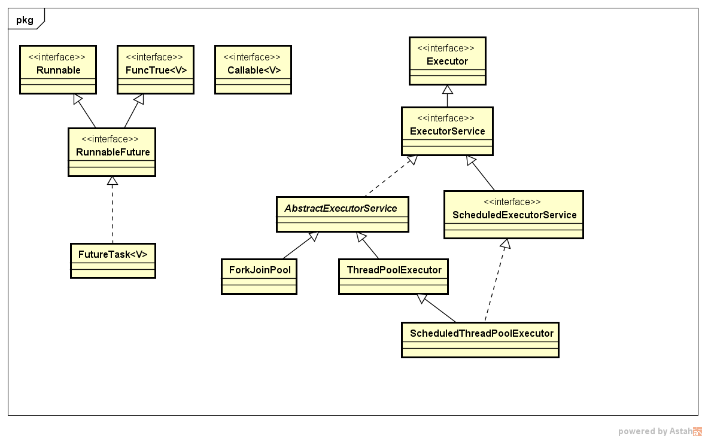

# Executor框架

---
## 1 Executor框架简介

Java中的线程既是工作单元也是执行机制，从JDK 5开始，把工作单元和执行机制分离开来，工作单元包括Runnable和Callable，而执行机制由Executor框架提供。

### Executor框架的两级调度模型

在上层，Java多线程程序通过把应用分解为若干个任务，然后使用用户级的调度器(Executor框架)将执行任务映射为固定数量的线程，在底层，操作系统内核将这些线程映射到硬件处理器上，由此应用程序通过Executor框架控制上层调度，而下层的调度由操作系统内核控制，下层的调度不受应用的控制。

### Executor框架的接口与成员

 Executor框架主要类成员如下：



###  Executor框架的结构

Executor框架主要由3大部分组成：

- 任务：包括被执行任务唔需要实现的接口：Runnable和Callable接口
- 任务的执行：包括任务执行机制的核心接口Executor，以及继承Executor的ExecutorService即可，Executor有两个关键的子类实现：ThreadPoolExecutor和ScheduledThreadPoolExecutor。
- 异步计算的结果：包括Futrue接口和实现Futrue接口的FutureTask类

###  Executor

只有一个`execute(Runnable command) `方法，其核心是提供一种将**任务提交**与**每个任务将如何运行的机制**（包括线程使用的细节、调度等）分离开来的方法。通常使用 Executor 而不是显式地创建线程。

不过，Executor 接口并没有严格地要求执行是异步的。在最简单的情况下，执行程序可以在调用者的线程中立即运行已提交的任务：

```java
     class DirectExecutor implements Executor {
         public void execute(Runnable r) {
             r.run();
         }
     }
```

### ExecutorService

ExecutorService是对线程池异步执行任务机制的抽象，其提供了执行(提交)任务、终止任务、获取任务执行结果的方法。

### ThreadPoolExecutor

ThreadPoolExecutor是线程池核心实现

### Future

Future代表异步计算的结果。

### Runnable和Callable

Runnable和Callable的实现类都可以提交给ThreadPoolExecutor或ScheduledThreadPoolExecutor执行

---
## 2 Executor框架提供的ThreadPoolExecutor实现

在并发库中，java提供了四种默认的线程池实现，并且通过Executors静态工厂类来帮助开发者创建这四种线程池，分别对应如下方法：

### newFixedThreadPool

newFixedThreadPool的代码实现如下：

```java
     public static ExecutorService newFixedThreadPool(int nThreads) {
            return new ThreadPoolExecutor(nThreads, nThreads,
                                          0L, TimeUnit.MILLISECONDS,
                                          new LinkedBlockingQueue<Runnable>());
        }
```

newFixedThreadPool创建的是一种线程数固定的线程池，只会创建固定数量的核心线程，而阻塞队列的实现为LinkedBlockingQueue，**任务队列数量没有限制，可以容纳无限多个任务**，可以很快的响应任务。LinkedBlockingQueue是使用无边界的队列。适用于已知并发压力的情况下，对线程数做限制的场景。

### newSingleThreadExecutor

```java
        public static ExecutorService newSingleThreadExecutor() {
            return new FinalizableDelegatedExecutorService
                (new ThreadPoolExecutor(1, 1,
                                        0L, TimeUnit.MILLISECONDS,
                                        new LinkedBlockingQueue<Runnable>()));
        }
```

newSingleThreadExecutor创建一个只有一个核心线程的线程池，它保证所有的任务都是按顺序执行的，**SingleThreadExecutor的意义在于统一所有外界任务到一个线程中，这使得任务之间不需要考虑同步问题**。对于需要保证顺序执行的场景，并且只有一个线程在执行可以使用此线程池。

### newCachedThreadPool

```java
        public static ExecutorService newCachedThreadPool() {
            return new ThreadPoolExecutor(0, Integer.MAX_VALUE,
                                          60L, TimeUnit.SECONDS,
                                          new SynchronousQueue<Runnable>());
        }
```

newCachedThreadPool创建的是一个没有核心线程而非核心线程数量不定的线程池。线程池最大数量为 Integer.MAX_VALUE，由于Integer.MAX_VALUE是一个很大的数，基本上可以说CachedThreadPool没有线程数量限制，而SynchronousQueue是一个特殊的队列，它无法插入任务，具体细节在阻塞队列中进行学习，然后CachedThreadPool的超时时间为60s,超过这个时间没有任务提交，那么线程会被停止，由这些特性可以看出，CachedThreadPool适合执行**大量的耗时少的任务**

- SynchronousQueue无法插入任务，相当于一个任务中转器
- CachedThreadPool适合执行**大量的耗时少的任务**

### ScheduledExecutorService

```java
        public ScheduledThreadPoolExecutor(int corePoolSize) {
            super(corePoolSize, Integer.MAX_VALUE, 0, TimeUnit.NANOSECONDS,
                  new DelayedWorkQueue());
        }
```

newScheduledThreadPool创建一个ScheduledExecutorService线程池，ScheduledThreadPoolExecutor继承了ThreadPoolExecutor并且实现了ScheduledExecutorService，ScheduledExecutorService接口定义了线程调度的方法，它的核心线程数量是固定的，而非核心线程数量没有限制，并且非核心线程在闲置时会被立即回收。ScheduledExecutorService这类线程池主要用于执行**定时任务**和**具有固定周期的**重复任务。其使用DelayedWorkQueue 可延时的工作队列


