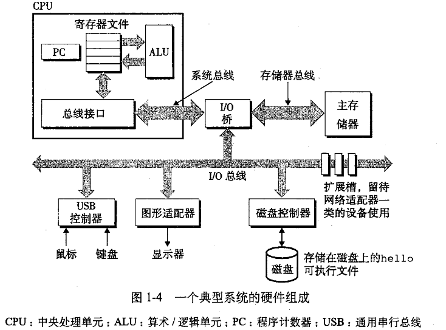

# 1 基本概念

## 系统硬件组成与CPU


>图来自《深入理解计算机系统》

### 总线

贯穿整个系统的是一组电子管道，称作总线，它携带信息字节并负责在各个部件传递。从图中可以看出，Cpu访问主存储器必须经过系统总线。

### CPU

cup就是中央处理器，是负责解释执行存储在主存储中指令的引擎。一个程序的的指令最初都存放在硬盘上，然后程序加载时它们被复制到主存，当处理器运行程序时指令又从主存复制到处理器中。

### 高速缓存

由于CPU直接从主内存读取数据和把数据写入到主内存中都是比较慢的，所以在CPU和主内存之间插入更小更快的存储设备(高速缓存)已经 成为一个普遍的观念。现在的处理器都是如此。高速缓存用来存放处理器近期可能需要的信息。cup的大部分操作都可以快速的在高速缓存中执行。

例如：
```
寄存器-->一级缓存-->二级缓存-->三级缓存 ————>主存
```

从寄存器到主存的层次结构，从左到右，设备的访问速度越来越慢，容量却越来越大。

CPU围绕着主存，寄存器文件，算术/逻辑单元进行的，CPU在指令的要求下可能做以下工作：
- 加载：把一个字节或者一个字从主存复制到寄存器，以覆盖寄存器中原来的内容
- 存储：把一个字节或者一个字从寄存器复制到主存的某个位置，以覆盖主存中原来的内容
- 操作：把两个寄存器的内容复制到ALU(算术逻辑单元)，ALU对这两个字做算术操作，并将结果存放到一个寄存器中，以覆盖寄存器中原来的内容
- 跳转：从指令本身中抽取一个字，并将这个字复制到程序计数器中，以覆盖pc中原来的值

>寄存器文件是一个小的存储设备，由一些一字节长的寄存器组成。
>**算术逻辑单元**（英语：**Arithmetic Logic Unit, ALU**）是[中央处理器](https://zh.wikipedia.org/wiki/%E4%B8%AD%E5%A4%AE%E5%A4%84%E7%90%86%E5%99%A8 "中央处理器")的执行单元，是所有中央处理器的核心组成部分，由[及闸](https://zh.wikipedia.org/wiki/%E4%B8%8E%E9%97%A8 "与门")和[或闸](https://zh.wikipedia.org/wiki/%E6%88%96%E9%97%A8 "或门")构成的算数逻辑单元，主要功能是进行[二进制](https://zh.wikipedia.org/wiki/%E4%BA%8C%E8%BF%9B%E5%88%B6 "二进制")的[算术](https://zh.wikipedia.org/wiki/%E7%AE%97%E8%A1%93 "算术")运算，如加减乘(不包括整数除法)。基本上，在所有现代CPU体系结构中，二进制都以[二补数](https://zh.wikipedia.org/wiki/%E4%BA%8C%E8%A3%9C%E6%95%B8 "二补数")的形式来表示。——WiKi百科

## 程序/进程/线程

- 程序:表示一组指令的有序集合，它本身是静态的，只是一堆代码而已。
- 进程是具有一定独立功能的程序关于某个数据集合上的一次运行活动，是系统进行资源分配和调度的一个独立单位，一个进程至少包含一个线程，可以把进程理解为一个程序的实例，而程序可以拥有多个实例。
- 线程是进程的一个实体,是CPU调度和分派的基本单位,它是比进程更小的能独立运行的基本单位.线程自己基本上不拥有系统资源,只拥有一点在运行中必不可少的资源(如程序计数器,一组寄存器和栈),一个线程可以创建和撤销另一个线程;


java代码在编译后会变成java字节码，字节码被类加载其加载到jmv里，jvm执行字节码，最终需要转化为汇编指令在cpu上执行，java中并发机制依赖于jvm的实现和cpu指令。了解cpu的相关术语有助于后面的学习。

---
# 2 cpu 内存术语


术语|描述
---|---
内存屏障(memory barriers)|一组处理器指令，用于实现对内存操作的顺序限制
缓冲行(cache line)|cpu高速运行可以分配的最小存储单位
原子操作(atomic operations)|不可分割的一个或一系列操作
缓冲行填充(cache line fill)|当cpu识别到从内存中读取操作数是可缓存的，处理器会读取整个高速缓存行到适当的缓存(L1,L2,L3)或都有
缓存命中(cache hit)|如果cpu进行高速缓存行填充操作的缓存位置仍然是下次处理器操访问的地址时，处理器从缓存中读取数据，而不是内存中
写命中(write hit)|当处理器将操作数写回到一个内存缓存的区域时，它首先会检查这个缓存的内存地址是否在缓冲行中，如果存在一个有效的缓存行，则处理器将这个操作数写回到缓存，而不是写回到内存，这个操作被称为写命中
写缺失(write misses the cache)|一个有效的缓存行被写入到不存在的内存区域


