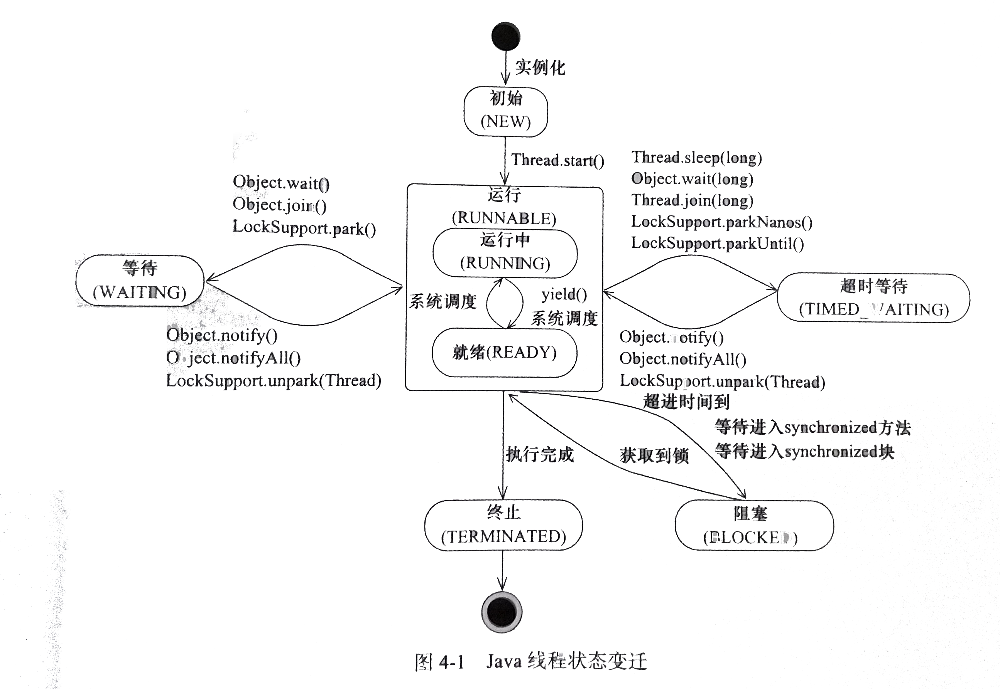
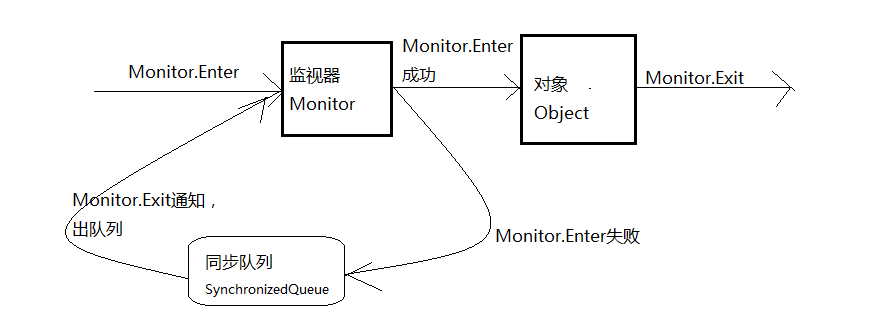

# Java并发编程基础

本篇重要内容：

- 熟悉jps，jstack，javap命令
- 理解线程基本概念
    - 多线程意义
    - 线程的优先级
    - 线程状态
- 线程终止

---
# 1 什么是线程

程序运行时，操作系统都会为其创建一个进程，而现代操作系统的最小调度单位是线程，也叫轻量级进程(light weight process)。而线程不能单独存在，线程只能存在于进程中，一个进程至少有一个线程(主线程)，每个线程都有自己的计数器，堆栈，局部变量等属性，并且能够访问进程内的共享变量，处理器在这些线程间进行快速的切换，让用户感觉到这些线程都是同时执行的。

Java程序的入口是main方法，java天生就是多线程程序，下面通过一段程序来获取mian方法启动时包含的线程信息：

```java
    public class MultiThread {
    
        public static void main(String[] args) {
            ThreadMXBean threadMXBean = ManagementFactory.getThreadMXBean();
            //不或去同步的monitor和synchronizer信息，仅仅获取线程和线程堆栈信息
            ThreadInfo[] threadInfos = threadMXBean.dumpAllThreads(false, false);
            for (ThreadInfo threadInfo : threadInfos) {
                System.out.println("[" + threadInfo.getThreadId() + "]" + threadInfo.getThreadName());
            }
        }
    }
```

打印结果是：

    [10]Monitor Ctrl-Break
    [5]Attach Listener
    [4]Signal Dispatcher    //分发处理发生给JVM信号的线程
    [3]Finalizer            //调用对象finalize方法的线程
    [2]Reference Handler    //清除引用的线程
    [1]main                 //主线程

从运行结果来看，java程序已启动就创建了很多的线程，那么多线程到底有什么意义呢？

## 1.1 为什么使用多线程

- 更多的处理器核心

现在的处理器都是多核心的，而一个线程同一时刻只能运行在一个处理器核心上，如果是一个担心从程序，那个同一时刻只能使用到一个处理器核心，那么无疑是对硬件资源的浪费。而如果使用多线程技术，那么将会大大提升程序的运行效率

- 更快的响应时间

使用多线可以让程序并发的处理多个任务，而不需要让多个没有关联的任务之间发生没有必要的等待。

- 更好的编程模型

使用并发的编程模型解决问题

## 1.2 线程优先级

现在的操作系统基本采用时分的形式调用运行的线程，操作系统会分出一个个时间片，线程会分配到若干个时间片，当线程的时间片用完就会发生线程调度，并等待下一次分配，线程的优先级就是决定着线程需要多或者少分配一些处理器资源的线程属性。

java线程中，通过现场的成员变量priority控件优先级，priority的范围是1-10，默认值是5。**针对频繁阻塞的线程需要设计较高的优先级，而偏重计算的线程(需要较多的cpu时间)应该设置较少的优先级，确保cpu不会被独占**，但是某些操作系统不保证甚至是忽略线程优先级的设置，**所以程序的正确性不应该依赖于线程的优先级高低**。

## 1.3 线程的状态，使用 jps 和 jstack 工具

线程从创建到销毁可能会经历多个状态，下面表格将列出线程可能的六种状态：

|  状态名称 | 说明  |
| ------------ | ------------ |
|  New|  初始状态，线程被创建，但是还没有调用start方法 |
| Runnable  | 运行状态，java线程将操作系统中“就绪”和“运行”两种状态笼统的称为“运行中”  |
| Blocked  |  阻塞状态，表示线程阻塞于锁 |
| Waiting  |  等待状态，表示线程进入等待状态，进入该状态表示当前线程需要等待其他线程做出一些特定动作(通知或者中断) |
| Time_Waiting  | 超时等待状态，不同于Waiting状态的是，当前线程可以在指定的时间自动从阻塞状态返回  |
| Terminated  |  终止状态，线程已经执行完毕 |


下面通过代码来查看线程状态：

```java
    public class ThreadState {
    
        public static void main(String[] args) {
            new Thread(new Sleep_1(), "sleep-1").start();//线程将始终在sleep状态
            new Thread(new Waiting(), "Waiting-1").start();//线程始终在等待状态
            //下面有一个线程会处理阻塞状态
            new Thread(new Block(), "Block-1").start();
            new Thread(new Block(), "Block-2").start();
        }
    
    
        static class Sleep_1 implements Runnable{
            @Override
            public void run() {
                while (true) {
                    try {
                        Thread.sleep(200);
                    } catch (InterruptedException e) {
                        e.printStackTrace();
                    }
                }
            }
        }
    
        static class Waiting implements Runnable{
            @Override
            public void run() {
                while (true) {
                    synchronized (Waiting.class) {
                        try {
                            Waiting.class.wait();
                        } catch (InterruptedException e) {
                            e.printStackTrace();
                        }
                    }
                }
            }
        }
    
        static class Block implements Runnable{
            @Override
            public void run() {
                synchronized (Block.class) {
                    while (true) {
                        try {
                            Thread.sleep(200);
                        } catch (InterruptedException e) {
                            e.printStackTrace();
                        }
                    }
                }
            }
        }
    
    }
```

运行程序后，在终端输入命令：`jps`

    5216 Launcher
    3828 AppMain
    9908
    6904 Jps
    4156 RemoteMavenServer

AppMain为我们开启的测试程序，后面3828表示其进程ID。

然后在终端输入：`jstack 3828`

得到如下信息：

```

     //Block-2处于超时等待状态，它获取到了Block.class锁
    "Block-2" #14 prio=5 os_prio=0 tid=0x000000001926f000 nid=0x3b8 waiting on condition [0x0000000019f3f000]
       java.lang.Thread.State: TIMED_WAITING (sleeping)
            at java.lang.Thread.sleep(Native Method)
            at basic.ThreadState$Block.run(ThreadState.java:52)
            - locked <0x00000000d5fa0218> (a java.lang.Class for basic.ThreadState$Block)
            at java.lang.Thread.run(Thread.java:745)
    
    //Block-1处于阻塞状态,阻塞在Block.class的锁上
    "Block-1" #13 prio=5 os_prio=0 tid=0x000000001926e000 nid=0x1028 waiting for monitor entry [0x0000000019e3f000]
       java.lang.Thread.State: BLOCKED (on object monitor)
            at basic.ThreadState$Block.run(ThreadState.java:52)
            - waiting to lock <0x00000000d5fa0218> (a java.lang.Class for basic.ThreadState$Block)
            at java.lang.Thread.run(Thread.java:745)
    
     //Waiting-1处于等待状态，在Waiting.class的锁定区域内等待
    "Waiting-1" #12 prio=5 os_prio=0 tid=0x000000001926b800 nid=0xe84 in Object.wait() [0x0000000019d3f000]
       java.lang.Thread.State: WAITING (on object monitor)
            at java.lang.Object.wait(Native Method)
            - waiting on <0x00000000d5f9dff0> (a java.lang.Class for basic.ThreadState$Waiting)
            at java.lang.Object.wait(Object.java:502)
            at basic.ThreadState$Waiting.run(ThreadState.java:37)
            - locked <0x00000000d5f9dff0> (a java.lang.Class for basic.ThreadState$Waiting)
            at java.lang.Thread.run(Thread.java:745)
    
    //sleep-1处于超时等待状态
    "sleep-1" #11 prio=5 os_prio=0 tid=0x000000001926a800 nid=0x2394 waiting on condition [0x0000000019c3e000]
       java.lang.Thread.State: TIMED_WAITING (sleeping)
            at java.lang.Thread.sleep(Native Method)
            at basic.ThreadState$Sleep_1.run(ThreadState.java:23)
            at java.lang.Thread.run(Thread.java:745)
```

通过实例了解到了线程的状态的具体含义，下面是线程在不同状态间的切换图示：



Java将操作系统中的运行状态和就绪状态统称为运行状态，阻塞状态是在进入syncnronized关键字修饰的方法或者代码(获取锁)时的状态，但是阻塞在java.concurrent包中Lock接口的线程状态却是等待状态，因为java.concurrent包中Lock接口对于阻塞的实现均使用了LockSupport类中的相关方法。

## 1.4 Daemon线程
 Daemon线程是一种支持型线程，当Java虚拟机不存在非Daemon线程时Java虚拟机将会退出。可以在调用线程的start方法之前调用setDaemon(true)方法设置线程为Daemon线程。

---
# 2 线程的终止

当调用线程的start方法后线程就会被启动，当run方法执行完毕线程线程就会终止，如果根据各种特定的情况控制线程的终止非常重要，下面学习有关线程的启动和终止

## 2.1 线程的构建

要开启一个线程，首先需要创建一个线程对象，线程对象在构建时需要提供线程所需要的一些属性，下面来看一下Thread的构造方法。Thread的工作方法中调用了init方法：

```java
    private void init(ThreadGroup g, Runnable target, String name,
                          long stackSize, AccessControlContext acc) {
            if (name == null) {
                throw new NullPointerException("name cannot be null");
            }
            this.name = name.toCharArray();
            //当前线程就是线程的父线程
            Thread parent = currentThread();
            SecurityManager security = System.getSecurityManager();
            if (g == null) {
                if (security != null) {
                    g = security.getThreadGroup();
                }
                if (g == null) {
                    g = parent.getThreadGroup();
                }
            }
    
            g.checkAccess();
            if (security != null) {
                if (isCCLOverridden(getClass())) {
                    security.checkPermission(SUBCLASS_IMPLEMENTATION_PERMISSION);
                }
            }
            g.addUnstarted();
            //赋值父线程的priority，daemon信息
            this.group = g;
            this.daemon = parent.isDaemon();
            this.priority = parent.getPriority();
            if (security == null || isCCLOverridden(parent.getClass()))
                this.contextClassLoader = parent.getContextClassLoader();
            else
                this.contextClassLoader = parent.contextClassLoader;
            this.inheritedAccessControlContext =
                    acc != null ? acc : AccessController.getContext();
            this.target = target;
            setPriority(priority);
            //赋值父线程的可继承的ThreadLocal。
            if (parent.inheritableThreadLocals != null)
                this.inheritableThreadLocals =
                    ThreadLocal.createInheritedMap(parent.inheritableThreadLocals);
            this.stackSize = stackSize;
            //分配线程Id
            tid = nextThreadID();
        }
```

## 2.2 启动线程

当调用线程的start方法时线程就已经启动了，start方法的含义是，当前线程同步告诉JVM，只要线程规划器空闲，就应该立即启动调用start方法的线程，启动一个线程时，最好为这个线程设置好名称，可以方便使用jstack分析线程是排查问题。

## 2.3 理解线程的中断

中断可以理解为的一个标识位，表示一个线程是否被其他线程进行了中断操作，其他线程通过调用线程的interrupt()方法来为其进行中断操作，线程通过检查自身是否被中断来响应，线程通过调用isInterrupted方法来判断自身是否被中断，也可以调用静态方法Thread.interrupted()方法来都当前线程的中断标识位进行复位，**如果线程已经处于终结状态，即使线程被中断过，调用isInterrupted方法也会返回false**。Thread的许多方法中都声明了InterruptedException异常，当这些方法抛出异常之前，对应线程的中断标识位将会被清除，此时调用isInterrupted方法也会返回false。

例如下面代码：

```java
    public class InterceptThread  {
        public static void main(String[] args) {
            Thread sleepThread = new Thread(new SleepRunnable(),"sleepThread");
            Thread busyThread = new Thread(new BusyRunnable(),"busyThread");
            sleepThread.setDaemon(true);
            busyThread.setDaemon(true);
            sleepThread.start();
            busyThread.start();
            try {
                Thread.sleep(5000);
            } catch (InterruptedException e) {
                e.printStackTrace();
            }
    
            sleepThread.interrupt();
            busyThread.interrupt();
    
            System.out.println("sleepThread isInterrupted "+sleepThread.isInterrupted());
            System.out.println("busyThread isInterrupted "+busyThread.isInterrupted());
    
    
        }
    
    
        static class SleepRunnable implements Runnable{
            @Override
            public void run() {
                while (true) {
                    try {
                        Thread.sleep(1000);
                    } catch (InterruptedException e) {
                        e.printStackTrace();
                        System.out.println(Thread.currentThread() + "--e:" + e);
                    }
                }
            }
        }
    
        static class BusyRunnable implements Runnable{
            @Override
            public void run() {
                while (true) {
    
                }
            }
        }
    }
```

打印结果为：

    sleepThread isInterrupted false
    busyThread isInterrupted true
    Thread[sleepThread,5,main]--e:java.lang.InterruptedException: sleep interrupted

可以看到抛出InterruptedException异常的sleepThread的isInterrupted方法返回了false。


**需要注意Thread的静态方法**`static boolean interrupted())`，该方法表示：测试当前线程是否已经中断。线程的**中断状态**由该方法清除。


### 过期的suspend，resume，stop方法

Thread的suspend，resume，stop方法已经被标记为过期方法，不建议使用。
原因是：以suspend方法为例，当调用后，线程不会释放已经占有的资源(比如锁)，而是占有着资源进入睡眠状态，这样容器产生死锁问题，同样stop方法不保证在终结线程是正确的释放资源。

### 安全的终止线程

线程一旦被启动，就像一批脱缰的野马，因为不能使用suspend，resume，stop等方法对线程进行操作，所以唯一的切入点就是run方法执行完毕！。

- 对于执行死循环的线程可以采用Interrupted或一个boolean变量来控制线程的中断
- 对于线性执行的线程只能在关键点加入判断线程的中断标识的逻辑，若线程已经中断则立即返回。

---
# 3 线程间的通信

线程开始运行，拥有自己的栈空间，但是每一个运行中的线程如果仅仅是独立的运行，那么不存在什么价值，只有多个线程相互配合的完成工作才能带来巨大的价值。

## 3.1 volatile和synchronized

- 被volatile修饰的变量具有线程可见性
- synchronized可以修饰方法和代码块，其具有排他性和可见性。

这些在前面内存已经学习过

synchronized本质是对一个对象的监视器(monitor)进行获取，而这个获取的过程是排他的，同一时刻只能有一个线程获取到synchronized所保护的监视器。任何对象都有自己的监视器，执行同步方法或者同步代码块的线程，必须先获取到synchronized指定对象锁才能进入同步方法或者同步代码库，没有锁的对象将会进入Blocking状态,如下图：



### volatile 和 synchronized比较

1. 当线程对volatile变量写时，java会把值刷新到共享内存中；而对于synchronized，指的是当线程释放锁的时候，会将共享变量的值刷新到主内存中。
2. 线程读取volatile变量时，会将本地内存中的共享变量置为无效；对于synchronized来说，当线程获取锁时，会将当前线程本地内存中的共享变量置为无效。
3. synchronized扩大了可见影响的范围，扩大到了synchronized作用的代码块。
4. volatile只提供可见性，而synchronized提供了可见性也提供了原子性

## 3.2 等待/通知机制

等待通知机制的相关方法：

| 方法名称  |  描述 |
| ------------ | ------------ |
| notify()  |  通知一个在对象上等待的线程，使之从wait方法中返回，返回的条件是该线程获取到了对象的锁 |
| notifyAll()  | 对于上面方法，通知的是所有等待的线程  |
| wait()  |  调用此方法，线程进入Waiting状态，只有等待另一个线程通知才能从wait方法返回，调用wait方法将会释放锁 |
| wait(long)  | 超时等待，规定时间段内，没有收到通知就自动返回  |
| wait(loing,int)  | 对于超时时间进行更细粒度的控制，可以达到纳秒级  |


等待通知机制是指线程A调用对象O的wait方法进入等待状态，另一个线程调用对象的notify/notifyAll方法，线程A收到通知后从对象O的wait方法返回，进而执行后续操作，上述两个先通过对象O来完成交互，而对象O上的wait，notify，notifyAll方法相当于开关信号用于，用来完成等待方和通知方的交互工作。

如下面程序：

```java
    public class WaitWithNotify {
    
    
        public static void main(String[] args) {
            new Thread(new WaitRunnable(),"WaitRunnable").start();
            new Thread(new NotifyRunnable(),"NotifyRunnable").start();
        }
    
        private static boolean flag = true;
        private static Object sObject = new Object();
    
        public static class WaitRunnable implements Runnable {
            @Override
            public void run() {
                synchronized (sObject) {
                    while (flag) {
                        try {
                            System.out.println("flag is true   " + Thread.currentThread() + "   wait @" + new Date());
                            sObject.wait();
                        } catch (InterruptedException e) {
                            e.printStackTrace();
                        }
                    }
                    System.out.println("flag is false   " + Thread.currentThread() + "   running @" + new Date());
                }
            }
        }
    
        public static class NotifyRunnable implements Runnable {
            @Override
            public void run() {
                synchronized (sObject) {
                    System.out.println(Thread.currentThread() + "   hold lock , notify@" + new Date());
                    sObject.notifyAll();
                    flag = false;
                    try {
                        Thread.sleep(4000);
                    } catch (InterruptedException e) {
                        e.printStackTrace();
                    }
                }
                synchronized (sObject) {
                    System.out.println(Thread.currentThread() + "   hold lock again , sleep@" + new Date());
                    try {
                        Thread.sleep(4000);
                    } catch (InterruptedException e) {
                        e.printStackTrace();
                    }
                }
            }
        }
    
    }
```

打印结果为：


        flag is true   Thread[WaitRunnable,5,main]   wait @Fri Jun 10 17:59:39 CST 2016    //1
        Thread[NotifyRunnable,5,main]   hold lock , notify@Fri Jun 10 17:59:39 CST 2016    //2
        Thread[NotifyRunnable,5,main]   hold lock again , sleep@Fri Jun 10 17:59:43 CST 2016   //3
        flag is false   Thread[WaitRunnable,5,main]   running @Fri Jun 10 17:59:47 CST 2016   //4
    
    
其中步骤3和4有可能会互换。上述例子主要说明调用wait，notify，notifyAll时需要注意的细节


- 调用wait，notify，notifyAll时需要先对调用对象加锁
- 调用wait方法，线程状态由Running转变为Waiting。并将当前线程放置到对象的等待队列
- notify，notifyAll调用后，等待队列依然不会从wait方法返回，需要调用notify，notifyAll方法的线程释放锁后，等待线程才有机会从wait返回
- notify方法将等待列队中的一个线程转移到同步队列中，而notifyAll则是将所有等待队列中的线程转移到同步队列中去，被转移的线程状态有Waiting变为Blocked。
- 从wait方法返回的前提是获得了调用对象的锁。

由此可见，线程的等待/通知机制依托于线程的同步机制。其目的就是确保等待线程从wait方法返回是能够感知到通知线程对线程做出的修改。

## 3.3 等待/通知的经典范式

等待方遵循如下原则：
1. 获取对象的锁
2. 如果条件不满足，那么调用对象的wait方法，被通知仍然要检查条件
3. 条件满足则执行对于的逻辑

伪代码如下：

```java
    synchronized(对象){
       while(条件){
          对象.wait();
       }
       对于的处理逻辑
    }
```

通知发遵循如下逻辑：

1. 获取对象的锁
2. 改变条件
3. 通知所有等待在对象上的线程

代码：

```java
    synchronized{
       //改变条件
       对象.notifyAll();
    }
```

## 3.4 管道输入输出流

Piped流用于线程之间的的数据传输，传输的介质为内存，Piped流包含PipedReader,PipedWriter,PipedInputStream,PipedOutputStream，使用Pided必须先调用connect方法进行绑定。如下实例代码：

```java
    public class Piped {
    
        public static void main(String[] args) throws IOException {
            PipedWriter pipedWriter = new PipedWriter();
            PipedReader pipedReader = new PipedReader();
    
            pipedWriter.connect(pipedReader);//绑定
            new Thread(new Print(pipedReader)).start();
    
            int receive;
            try {
                while ((receive = System.in.read()) != -1) {
                    pipedWriter.write(receive);
                }
            } finally {
                pipedWriter.close();
            }
        }
    
    
        public static class Print implements Runnable {
    
            private final PipedReader mPipedReader;
    
            public Print(PipedReader pipedReader) {
                mPipedReader = pipedReader;
            }
    
            @Override
    
            public void run() {
                int receive = 0;
                try {
                    while ((receive = mPipedReader.read()) != -1) {
                        System.out.println((char) receive);
                    }
                } catch (IOException e) {
                }
            }
        }
    }
```

## 3.5 Thread.join的使用
如果线程A调用thread.join()，其的含义是线程A等待thread线程终止之后才能从thread.join方法返回。处理join方法外还有join(long mills)和join(long mills，int nanos)方法，用于只等等待超时的时间。

其部分源码如下：

```java
       if (millis == 0) {
                while (isAlive()) {
                    wait(0);
                }
            } 
```

可以看出其内部也是采用等待/通知机制。


## 3.6 ThreadLocal的使用

 ThreadLocal即线程变量，是一个以ThreadLocal对象为键，任意对象为值的存储结构，这个结构被依附在线程上。

与ThreadLocal对应的还有InheritableThreadLocal允许子线程访问父线程的线程变量。

---
# 4 线程应用实例

## 4.1 等待超时模式

前面学习的等待通知机制无法实现超时等待机制，即在指定的时间段内等待，如果在规定时间被获取到结果则立即返回，否则超时后返回默认结果，等待超时模式只需要在等待/通知机制上加上了时间控制，如下面代码：

```java
    public synchronized Object get(long time) throws InterruptedException {
            long future = System.currentTimeMillis() + time;
            long remaining = time;
            while (mObject == null && remaining > 0) {//这里的循环判断时间是必须的，因为线程有可能被唤醒，而此时还没有获取到结果。
                wait(remaining);
                remaining = future - System.currentTimeMillis();
            }
            return mObject;
        }
```

## 4.2 数据库连接实例

下面通过模拟获取有限的数据库连接资源来演示超时等待机制:

```java
    public class DataBaseConnectionDemo {
    
        private static ConnectionPool mConnectionPool = new ConnectionPool();
        private static CountDownLatch mStart = new CountDownLatch(1);
        private static CountDownLatch mEnd;
    
        public static void main(String[] args) throws InterruptedException {
    
            int threadSize = 50;
            mConnectionPool.init(10);
    
            mEnd = new CountDownLatch(threadSize);
    
            AtomicInteger get = new AtomicInteger();
            AtomicInteger noGet = new AtomicInteger();
            int count = 20;
            for (int i = 0; i < threadSize; i++) {
                new Thread(new ConnectionRunner(count,get,noGet),"ConnectionRunner").start();
            }
    
            mStart.countDown();
            mEnd.await();
    
            System.out.println("total invoke =" + threadSize * count);
            System.out.println("get connection =" +  get.get());
            System.out.println("noGet connection =" +  noGet.get());
        }
    
    
        static class ConnectionRunner implements Runnable {
    
            int mCount;
            AtomicInteger mGet;
            AtomicInteger mNoGet;
    
            public ConnectionRunner(int count, AtomicInteger get, AtomicInteger noGet) {
                this.mCount = count;
                this.mGet = get;
                this.mNoGet = noGet;
            }
    
    
            @Override
            public void run() {
    
                try {
                    mStart.await();
                } catch (InterruptedException e) {
                    e.printStackTrace();
                }
                while (mCount > 0) {
                    try {
                        Connection connection = mConnectionPool.fetchConnection(1000);
                        System.out.println(connection);
                        if (connection != null) {
                            System.out.println("get connection");
                            try {
                                connection.createStatement();
                                connection.commit();
                            } finally {
                                mConnectionPool.releaseConnection(connection);
                                mGet.incrementAndGet();
                            }
                        } else {
                            System.out.println(" no get connection");
    
                            mNoGet.incrementAndGet();
                        }
                    } catch (InterruptedException e) {
                        e.printStackTrace();
                    } finally {
                        mCount--;
                    }
                }
    
                mEnd.countDown();
    
            }
        }
    
    
        public static class ConnectionPool {
            private LinkedList<Connection> mConnections = new LinkedList<Connection>();
    
    
            public void init(int connectionSize) {
                for (int i = 0; i < connectionSize; i++) {
                    mConnections.add(ConnectionDriver.createConnection());
                }
            }
    
            public void releaseConnection(Connection connection) {
                if (connection != null) {
                    synchronized (mConnections) {
                        mConnections.addLast(connection);
                        mConnections.notifyAll();
                    }
                }
            }
    
            public Connection fetchConnection(long mills) throws InterruptedException {
                synchronized (mConnections) {
                    if (mills == 0) {
                        while (mConnections.isEmpty()) {
                            mConnections.wait();
                        }
                        return mConnections.removeFirst();
                    } else {
                        long future = mills + System.currentTimeMillis();
                        long remaining = mills;
                        while (mConnections.isEmpty() && remaining > 0) {
                            mConnections.wait(remaining);
                            remaining = future - System.currentTimeMillis();
                        }
                        Connection result = null;
                        if (!mConnections.isEmpty()) {
                            result = mConnections.removeFirst();
                        }
                        return result;
                    }
                }
            }
        }
    
    
        public static class ConnectionDriver {
            public static Connection createConnection() {
                return new Connection();
            }
        }
    
    
        public static class Connection {
    
            public void createStatement() {
    
            }
    
            public void commit() {
                try {
                    Thread.sleep(200);
                } catch (InterruptedException e) {
                    e.printStackTrace();
                }
            }
        }
    }
```

结果：

    //thradSize = 50
    total invoke =1000
    get connection =660
    noGet connection =340
    
    //thradSize = 20
    total invoke =400
    get connection =362
    noGet connection =38
    
    //thradSize = 10
    total invoke =200
    get connection =200
    noGet connection =0


可以看到随着获取数据库连接的线程越多，客户端无法获取到链接的比例也随之上升，虽然在这种超时等待机制下面客户端有可能会出现无法获取连接的情况，但是它能够保证客户端不会一直挂在获取连接的操作上。而按时返回，并告知客户端连接出现问题，是系统的一种自我保护机制。数据库连接池的机制也可以服用到其他资源获取的情况，针对昂贵的资源的获取都应该加上超时等待机制。


## 4.3 线程池技术

对于服务器程序，面对客户端数以万计的请求，如果针对每一个请求都创建线程来完成，这不是一个好的选择，这会使操作系统频繁的进入上下文切换，无辜增加系统的负载，而线程的创建和销毁都需要销毁系统资源，也无疑浪费了系统的资源，而使用线程池技术可以很好的解决这个问题，预先创建固定数量的线程，针对客户端的请求，重复使用固定数量或较为固定数量的线程来完成任务，这样做的好处是：1 减少了频繁创建销毁线程带来的开销，2 面对过量任务的提交平缓的劣化。

下面是一个线程池的实现示例：


线程池接口：

```java
    public interface ThreadPool <Job extends Runnable> {
    
        /**
         * 执行一个job
         * @param job
         */
        void execute(Job job);
    
        /**
         * 关闭线程池
         */
        void shutdown();
    
        /**
         * 增加工作线程
         * @param num
         */
        void addWorkers(int num);
    
        /**
         * 减少工作现场
         * @param num
         *
         */

        void removeWorker(int num);

       /**
         * 得到正在等待执行任务的数量
         */
        int getJobSize();
    }

    //默认实现
    public class DefaultThreadPool<Job extends Runnable> implements ThreadPool<Job> {
    
        private static final int MIN_WORKER_SIZE = 1;
        private static final int NORMAL_WORKER_SIZE = 5;
        private static final int MAX_WORKER_SIZE = 10;
        private int mCurrentWorkerSize = NORMAL_WORKER_SIZE;
        private AtomicLong mAtomicLong = new AtomicLong();
    
        private LinkedList<Job> mJobs = new LinkedList<Job>();
        private LinkedList<Worker> mWorkers = new LinkedList<Worker>();
    
    
        public DefaultThreadPool() {
            initWorker(mCurrentWorkerSize);
        }
    
        public DefaultThreadPool(int currentWorkerSize) {
            mCurrentWorkerSize = currentWorkerSize > MAX_WORKER_SIZE ? MAX_WORKER_SIZE
                    : mCurrentWorkerSize < MIN_WORKER_SIZE ? MIN_WORKER_SIZE : currentWorkerSize;
            initWorker(mCurrentWorkerSize);
        }
    
    
        @Override
        public void execute(Job job) {
            if (job == null) {
                return;
            }
            synchronized (mJobs) {
                mJobs.addLast(job);
                mJobs.notifyAll();
            }
        }
    
        @Override
        public void shutdown() {
            for (Worker worker : mWorkers) {
                worker.shutDown();
            }
        }
    
        @Override
        public void addWorkers(int num) {
            synchronized (mWorkers) {
                if (num + mCurrentWorkerSize > MAX_WORKER_SIZE) {
                    num = MAX_WORKER_SIZE - mCurrentWorkerSize;
                }
                initWorker(num);
                mCurrentWorkerSize += num;
            }
        }
    
        private void initWorker(int num) {
            for (int i = 0; i < num; i++) {
                Worker worker = new Worker();
                Thread thread = new Thread(worker, "worker Thread" + mAtomicLong.incrementAndGet());
                mWorkers.addLast(worker);
                thread.start();
            }
        }
    
        @Override
        public void removeWorker(int num) {
            if (num > mCurrentWorkerSize) {
                throw new IllegalArgumentException("num > mCurrentWorkerSize");
            }
            synchronized (mWorkers) {
                int index = 0;
                while (index < num) {
                    // index num size
                    // 0         4       5
                    // 1         4        4
                    // 2        4        3
                    // 3        4        2
                    Worker worker = mWorkers.get(0);
                    if (mWorkers.remove(worker)) {
                        worker.shutDown();
                        index++;
                    }
                }
                mCurrentWorkerSize -= num;
            }
        }
    
        @Override
        public int getJobSize() {
            return mJobs.size();
        }
    
    
        /**
         * 工作者
         */
        private class Worker implements Runnable {
            private volatile boolean mIsRunning = true;
    
    
            @Override
            public void run() {
                while (mIsRunning) {
                    Job job = null;
                    synchronized (mJobs) {
                        while (mJobs.isEmpty()) {
                            try {
                                mJobs.wait();
                            } catch (InterruptedException e) {
                                Thread.currentThread().interrupt();
                                //感知到其他线程的终止操作，立即返回
                                e.printStackTrace();
                                return;
                            }
                        }
                        job = mJobs.removeFirst();
                        if (job != null) {
                            try {
                                job.run();
                            } catch (Exception e) {
    
                            }
                        }
                    }
    
                }
            }
    
            private void shutDown() {
                mIsRunning = false;
            }
        }
    }
```

线程池中的数量并不是越多越好，具体的线程数量应该需要评估每个任务的处理时间，已经当前计算机的处理器能力和数量，使用的线程过少无法发挥处理器的性能，过多则会增加系统无故的开销，起到反作用。
